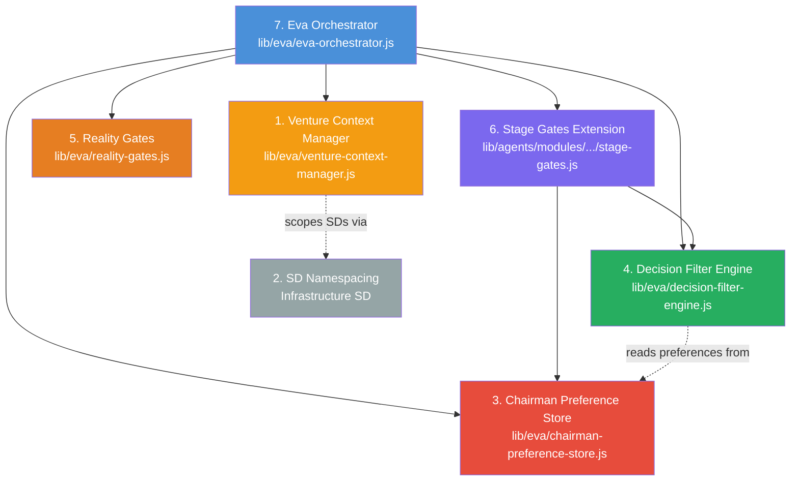

## Table of Contents

- [Component Overview](#component-overview)
- [Dependency Chain](#dependency-chain)
- [Component 1: Venture Context Manager](#component-1-venture-context-manager)
  - [Responsibilities](#responsibilities)
  - [Public API](#public-api)
  - [Factory](#factory)
  - [Storage Model](#storage-model)
  - [Caching Strategy](#caching-strategy)
  - [Integration Points](#integration-points)
- [Component 2: SD Namespacing](#component-2-sd-namespacing)
  - [Concept](#concept)
  - [Mechanism](#mechanism)
  - [Why Metadata Instead of Key Prefixes](#why-metadata-instead-of-key-prefixes)
  - [Relationship to Venture Context Manager](#relationship-to-venture-context-manager)
- [Component 3: Chairman Preference Store](#component-3-chairman-preference-store)
  - [Responsibilities](#responsibilities)
  - [Resolution Order](#resolution-order)
  - [Public API](#public-api)
  - [Validation](#validation)
  - [Batch Query Optimization](#batch-query-optimization)
  - [Audit Trail](#audit-trail)
  - [Database Table](#database-table)
- [Component 4: Decision Filter Engine](#component-4-decision-filter-engine)
  - [Summary](#summary)
  - [Role in the Foundation](#role-in-the-foundation)
- [Component 5: Reality Gates](#component-5-reality-gates)
  - [Summary](#summary)
  - [Role in the Foundation](#role-in-the-foundation)
- [Component 6: Stage Gates Extension](#component-6-stage-gates-extension)
  - [Gate Types](#gate-types)
  - [Kill Gate Behavior](#kill-gate-behavior)
  - [Promotion Gate Behavior](#promotion-gate-behavior)
  - [Existing Gates (Preserved)](#existing-gates-preserved)
  - [Integration with Decision Filter Engine](#integration-with-decision-filter-engine)
  - [Chairman-Friendly Summaries](#chairman-friendly-summaries)
- [Component 7: Eva Orchestrator](#component-7-eva-orchestrator)
  - [Summary](#summary)
  - [Design Principles](#design-principles)
- [Database Tables](#database-tables)
- [Integration Patterns](#integration-patterns)
  - [Pattern 1: Dependency Injection Throughout](#pattern-1-dependency-injection-throughout)
  - [Pattern 2: Conservative Defaults](#pattern-2-conservative-defaults)
  - [Pattern 3: Structured Result Contracts](#pattern-3-structured-result-contracts)
  - [Pattern 4: Factory Functions](#pattern-4-factory-functions)

---
Category: Architecture
Status: Approved
Version: 1.0.0
Author: DOCMON Sub-Agent
Last Updated: 2026-02-08
Tags: [cli-venture-lifecycle, eva, orchestrator, foundation, infrastructure]
Related SDs: [SD-LEO-ORCH-CLI-VENTURE-LIFECYCLE-001]
---

# 01 - Foundation Infrastructure

This document describes the seven foundation components that the Eva Orchestrator
is built upon. Each component is independently testable and follows a strict
dependency chain -- higher-numbered components depend on lower-numbered ones,
never the reverse.

---

## Table of Contents

1. [Component Overview](#component-overview)
2. [Dependency Chain](#dependency-chain)
3. [Component 1: Venture Context Manager](#component-1-venture-context-manager)
4. [Component 2: SD Namespacing](#component-2-sd-namespacing)
5. [Component 3: Chairman Preference Store](#component-3-chairman-preference-store)
6. [Component 4: Decision Filter Engine](#component-4-decision-filter-engine)
7. [Component 5: Reality Gates](#component-5-reality-gates)
8. [Component 6: Stage Gates Extension](#component-6-stage-gates-extension)
9. [Component 7: Eva Orchestrator](#component-7-eva-orchestrator)
10. [Database Tables](#database-tables)
11. [Integration Patterns](#integration-patterns)

---

## Component Overview

```
+-----------------------------------------------------------------------+
|                        Eva Orchestrator (7)                            |
|                  lib/eva/eva-orchestrator.js                           |
|                                                                       |
|  Depends on ALL six components below. Orchestrates the full           |
|  venture lifecycle stage-processing loop.                             |
+-----------------------------------------------------------------------+
        |           |              |             |            |
        v           v              v             v            v
+-------------+ +-----------+ +----------+ +---------+ +----------+
| Stage Gates | | Reality   | | Decision | |Chairman | | Venture  |
| Extension   | | Gates     | | Filter   | | Pref    | | Context  |
| (6)         | | (5)       | | Engine   | | Store   | | Manager  |
|             | |           | | (4)      | | (3)     | | (1)      |
+-------------+ +-----------+ +----------+ +---------+ +----------+
        |                          |             |
        +--------------------------+             |
                   |                             |
                   v                             |
            +-----------+                        |
            | SD        |                        |
            | Namespace |<-----------------------+
            | (2)       |
            +-----------+
```

| # | Component | Module | Lines | SD Reference |
|---|-----------|--------|-------|--------------|
| 1 | Venture Context Manager | `lib/eva/venture-context-manager.js` | 261 | SD-LEO-INFRA-VENTURE-CONTEXT-001 |
| 2 | SD Namespacing | (infrastructure SD) | -- | SD-LEO-INFRA-SD-NAMESPACING-001 |
| 3 | Chairman Preference Store | `lib/eva/chairman-preference-store.js` | 295 | SD-LEO-INFRA-CHAIRMAN-PREFS-001 |
| 4 | Decision Filter Engine | `lib/eva/decision-filter-engine.js` | 261 | SD-LEO-INFRA-FILTER-ENGINE-001 |
| 5 | Reality Gates | `lib/eva/reality-gates.js` | 320 | SD-LEO-INFRA-REALITY-GATES-001 |
| 6 | Stage Gates Extension | `lib/agents/modules/venture-state-machine/stage-gates.js` | 683 | SD-LEO-INFRA-STAGE-GATES-EXT-001 |
| 7 | Eva Orchestrator | `lib/eva/eva-orchestrator.js` | 502 | SD-LEO-FEAT-EVA-ORCHESTRATOR-001 |

---

## Dependency Chain

The following Mermaid diagram shows the strict dependency ordering. Each
component only depends on components below it in the chain.



**Key principle**: Every component below the Eva Orchestrator can be used
independently. The Venture Context Manager, Chairman Preference Store, and
Decision Filter Engine are frequently called outside of the orchestrator
(for example, from CLI commands or dashboard APIs).

---

## Component 1: Venture Context Manager

**Module**: `lib/eva/venture-context-manager.js` (261 lines)
**SD**: SD-LEO-INFRA-VENTURE-CONTEXT-001
**Purpose**: Tracks and manages which venture is currently active in a Claude
Code session. All venture-scoped operations read context from this manager.

### Responsibilities

- Track the `active_venture_id` in `claude_sessions.metadata`
- Provide venture-scoped operations: set, get, clear, switch
- Filter SDs to show only those belonging to the active venture
- Validate venture existence before setting context
- Cache venture data in memory with explicit invalidation

### Public API

| Method | Description |
|--------|-------------|
| `getActiveVentureId()` | Returns the active venture UUID from session metadata, with in-memory caching |
| `getActiveVenture()` | Returns full venture record (id, name, status, current_lifecycle_stage, archetype) |
| `setActiveVenture(ventureId)` | Validates the venture exists, then writes the ID into session metadata |
| `switchVenture(ventureId)` | Atomically switches context: captures previous ID, sets new one |
| `clearActiveVenture()` | Removes venture context from session metadata |
| `listVentures(options)` | Lists all ventures, optionally filtered by status |
| `getVentureScopedSDs()` | Queries `strategic_directives_v2` for SDs referencing this venture |
| `hasActiveVenture()` | Boolean check for whether a venture context is active |
| `getStatusDisplay()` | Returns a human-readable status string |
| `invalidateCache()` | Clears the in-memory cache (call after external changes) |

### Factory

`createVentureContextManager(options)` -- Creates an instance with default
configuration. Accepts optional `supabaseClient` and `sessionId` overrides.

### Storage Model

The venture context is stored as a JSON field inside `claude_sessions.metadata`:

```
claude_sessions.metadata = {
  ...existing_metadata,
  active_venture_id: "<venture-uuid>",
  active_venture_name: "<venture-name>",
  venture_set_at: "<ISO-8601 timestamp>"
}
```

This design means:
- No additional database tables are required
- Context survives session heartbeat updates
- Multiple metadata fields coexist without interference
- Context is automatically cleaned up when the session ends

### Caching Strategy

The manager uses a two-layer cache:
1. **`_cachedVentureId`** -- Avoids repeated session metadata queries
2. **`_cachedVenture`** -- Avoids repeated venture table lookups

Cache invalidation occurs:
- Explicitly via `invalidateCache()`
- Implicitly when `setActiveVenture()` or `clearActiveVenture()` is called
- On `switchVenture()` (which calls `setActiveVenture` internally)

The cache is NOT time-based. It persists for the lifetime of the manager
instance. This is appropriate because venture context changes are infrequent
(typically once per session).

### Integration Points

- **Eva Orchestrator** (`lib/eva/eva-orchestrator.js`): Creates a manager
  instance to load venture context at the start of stage processing
- **CLI commands**: Use the manager to scope SD queries and display venture info
- **Dashboard**: Reads active venture for navigation and filtering

---

## Component 2: SD Namespacing

**SD**: SD-LEO-INFRA-SD-NAMESPACING-001
**Purpose**: Ensures that Strategic Directives created within a venture context
are namespaced to prevent cross-venture conflicts.

### Concept

When a venture is active, new SDs are created with venture-scoped metadata.
This prevents the situation where two ventures might create SDs with
overlapping identifiers or conflicting priorities.

### Mechanism

SD namespacing works through metadata tagging rather than key-prefix
conventions. When an SD is created while a venture is active:

1. The `venture_id` is written to `strategic_directives_v2.metadata`
2. The `venture_name` is also captured for human readability
3. Queries through `getVentureScopedSDs()` filter by this metadata

### Why Metadata Instead of Key Prefixes

- SD keys follow their own naming convention (`SD-<CATEGORY>-<TYPE>-<NAME>-NNN`)
- Adding a venture prefix would break existing tooling and conventions
- Metadata-based filtering is more flexible (an SD can be re-assigned)
- The `strategic_directives_v2` table already supports JSONB metadata

### Relationship to Venture Context Manager

The Venture Context Manager provides the `getVentureScopedSDs()` method that
queries SDs using the namespacing metadata. The namespacing infrastructure
SD defines the conventions; the context manager implements the queries.

---

## Component 3: Chairman Preference Store

**Module**: `lib/eva/chairman-preference-store.js` (295 lines)
**SD**: SD-LEO-INFRA-CHAIRMAN-PREFS-001
**Purpose**: CRUD operations for chairman-defined preferences with scoped
resolution (venture-specific overrides with global fallbacks).

### Responsibilities

- Store and retrieve chairman preferences keyed by `(chairman_id, venture_id, key)`
- Resolve preferences with fallback: venture-specific first, then global
- Validate values against declared types and known-key validators
- Provide audit linkage between preferences and decisions

### Resolution Order

When a preference is requested for a specific venture, the store follows
a two-step resolution:

```
Step 1: Query (chairman_id, venture_id, key) -- venture-specific
        |
        +-- Found? Return with scope = "venture"
        |
        +-- Not found? Continue to step 2
        |
Step 2: Query (chairman_id, NULL, key) -- global fallback
        |
        +-- Found? Return with scope = "global"
        |
        +-- Not found? Return null
```

This allows a chairman to set global defaults (e.g., "max cost = $10,000")
that apply to all ventures, while overriding specific thresholds for
individual ventures (e.g., "max cost for ProvenFlow = $50,000").

### Public API

| Method | Description |
|--------|-------------|
| `setPreference({chairmanId, ventureId, key, value, valueType, source})` | Upserts a preference with type validation |
| `getPreference({chairmanId, ventureId, key})` | Single-key resolution with venture/global fallback |
| `getPreferences({chairmanId, ventureId, keys})` | Batch resolution -- at most 2 SQL queries regardless of key count |
| `deletePreference({chairmanId, ventureId, key})` | Remove a specific preference |
| `linkDecisionToPreferences({decisionId, resolvedPreferences})` | Attach resolved preference snapshot to a `chairman_decisions` row |

### Validation

The store performs two layers of validation:

1. **Type validation**: Checks that the value matches the declared `valueType`
   (number, string, boolean, object, array)
2. **Known-key validation**: For recognized preference keys, applies
   domain-specific rules:
   - `risk.max_drawdown_pct` -- must be a number between 0 and 100
   - `budget.max_monthly_usd` -- must be a non-negative number
   - `tech.stack_directive` -- must be a non-empty string

### Batch Query Optimization

The `getPreferences()` method resolves multiple keys in at most 2 SQL queries:

1. **Query 1**: Fetch all venture-specific matches for the requested keys
2. **Query 2**: Fetch global fallbacks only for keys NOT resolved in query 1

This is constant-time with respect to the number of keys requested (O(2)
queries, not O(n) queries).

### Audit Trail

The `linkDecisionToPreferences()` method creates a snapshot of which preference
values were used when a decision was made. This is written to the
`chairman_decisions` table as:

- `preference_key` -- The primary preference key used
- `preference_ref_id` -- Foreign key to the preference record
- `preference_snapshot` -- Full JSON snapshot of all resolved values

This enables retrospective analysis: "What thresholds were in effect when
this decision was made?"

### Database Table

**Table**: `chairman_preferences`
**Unique constraint**: `(chairman_id, venture_id, preference_key)`

This constraint enables the upsert behavior -- calling `setPreference()` twice
with the same key updates the existing value rather than creating a duplicate.

---

## Component 4: Decision Filter Engine

**Module**: `lib/eva/decision-filter-engine.js` (261 lines)
**SD**: SD-LEO-INFRA-FILTER-ENGINE-001
**Purpose**: Deterministic risk-threshold evaluation of venture stage outputs
against chairman-configured thresholds.

For full architectural details, see [03-decision-filter-engine.md](./03-decision-filter-engine.md).

### Summary

The Decision Filter Engine is a pure, deterministic function that evaluates
stage outputs and returns a decision: either AUTO_PROCEED (the venture can
advance automatically) or PRESENT_TO_CHAIRMAN (human review required).

Key characteristics:
- **Pure function**: Same inputs always produce same outputs
- **No side effects**: Does not read from databases or call APIs
- **Dependency-injected**: Preferences passed as a flat key-value map
- **Conservative defaults**: Missing preferences trigger the most cautious behavior
- **Fixed evaluation order**: 6 trigger types evaluated in a deterministic sequence

### Role in the Foundation

The Decision Filter Engine sits at the center of the gate evaluation
architecture. It is used by:

- **Eva Orchestrator**: Step 6 of `processStage()` -- determines whether the
  venture auto-advances or requires chairman review
- **Stage Gates Extension**: Both kill gates and promotion gates delegate
  threshold evaluation to this engine
- **Standalone**: Can be called directly for "what if" analysis without
  persisting results

---

## Component 5: Reality Gates

**Module**: `lib/eva/reality-gates.js` (320 lines)
**SD**: SD-LEO-INFRA-REALITY-GATES-001
**Purpose**: Always-on quality gates that enforce artifact requirements at
phase transition boundaries.

For full architectural details, see [04-reality-gates.md](./04-reality-gates.md).

### Summary

Reality Gates are non-negotiable quality checkpoints at 5 specific stage
transitions. Unlike the Decision Filter Engine (which evaluates risk
thresholds), Reality Gates verify that required artifacts exist, meet minimum
quality scores, and (where configured) have reachable URLs.

Key characteristics:
- **Always-on**: Cannot be disabled by preferences or configuration
- **Fail-closed**: Database errors cause the gate to fail (conservative default)
- **5 enforced boundaries**: 5-to-6, 9-to-10, 12-to-13, 16-to-17, 20-to-21
- **3 check types**: Artifact existence, quality score threshold, URL reachability
- **6 reason codes**: Structured failure reasons for programmatic handling

### Role in the Foundation

Reality Gates run as step 5 of the Eva Orchestrator's `processStage()` flow,
immediately after stage analysis and before the Decision Filter Engine.
If a Reality Gate fails, the stage is marked BLOCKED and the filter engine
is not invoked.

---

## Component 6: Stage Gates Extension

**Module**: `lib/agents/modules/venture-state-machine/stage-gates.js` (683 lines)
**SD**: SD-LEO-INFRA-STAGE-GATES-EXT-001
**Purpose**: Extends the venture state machine with kill gates (venture
termination checkpoints) and promotion gates (advancement approval checkpoints).

### Gate Types

```
+------------------------------------------------------------------+
|                      Stage Gate Types                             |
+------------------------------------------------------------------+
|                                                                   |
|  EXISTING (pre-extension, preserved with zero regressions)        |
|    5->6   Financial Viability Gate                                |
|    21->22  UAT Signoff Gate                                       |
|    22->23  Deployment Health Gate                                  |
|                                                                   |
|  KILL (venture termination checkpoints)                           |
|    Stage 3   Early ideation kill                                  |
|    Stage 5   Pre-validation kill                                  |
|    Stage 13  Pre-build kill                                       |
|    Stage 23  Pre-scale kill                                       |
|                                                                   |
|  PROMOTION (advancement approval gates)                           |
|    Stage 16  Pre-build advancement                                |
|    Stage 17  Build commencement                                   |
|    Stage 22  Launch readiness                                     |
+------------------------------------------------------------------+
```

### Kill Gate Behavior

Kill gates evaluate all Decision Filter Engine thresholds and produce one of:

| Outcome | Condition | What Happens |
|---------|-----------|--------------|
| **PASS** | All thresholds pass | Venture continues normally |
| **REQUIRES_CHAIRMAN_DECISION** | Any threshold fails | Chairman must decide: continue or terminate |
| **ERROR** | System failure | Fail-closed; investigation required |

Kill gates give the chairman the power to terminate a venture that is not
meeting its thresholds. The gate does not automatically kill the venture --
it presents the decision to the chairman with full threshold evaluation data.

### Promotion Gate Behavior

Promotion gates evaluate thresholds and produce one of:

| Outcome | Condition | What Happens |
|---------|-----------|--------------|
| **FAIL** | Any HIGH-severity trigger | Venture cannot advance until issues resolved |
| **REQUIRES_CHAIRMAN_APPROVAL** | Thresholds pass (or only MEDIUM/INFO) | Chairman must explicitly approve advancement |
| **ERROR** | System failure | Fail-closed; investigation required |

Promotion gates never auto-pass. Even when all thresholds are met, the chairman
must explicitly approve advancement. This ensures human oversight at critical
phase transitions.

### Existing Gates (Preserved)

The extension preserves three pre-existing artifact-based gates:

1. **Financial Viability (5-to-6)**: Validates pricing_model and
   business_model_canvas artifacts exist with required fields
2. **UAT Signoff (21-to-22)**: Requires 100% UAT scenario pass rate and 95%
   automated test pass rate
3. **Deployment Health (22-to-23)**: Validates deployment_runbook with all
   infrastructure configured and checklist items completed

These gates use direct artifact queries rather than the Decision Filter Engine.
They were built before the extension and are preserved with zero regression
risk (FR-4 requirement).

### Integration with Decision Filter Engine

Kill gates and promotion gates both delegate to the Decision Filter Engine
for threshold evaluation:

```
validateStageGate(supabase, ventureId, fromStage, toStage, options)
    |
    +-- Is this an existing gate (5->6, 21->22, 22->23)?
    |       Yes -> Call dedicated validation function
    |
    +-- Is toStage a kill gate stage (3, 5, 13, 23)?
    |       Yes -> evaluateKillGate()
    |                -> resolveGateContext() -> loads chairman preferences
    |                -> evaluateDecision()   -> runs filter engine
    |                -> maps result to kill gate statuses
    |
    +-- Is toStage a promotion gate stage (16, 17, 22)?
    |       Yes -> evaluatePromotionGate()
    |                -> resolveGateContext() -> loads chairman preferences
    |                -> evaluateDecision()   -> runs filter engine
    |                -> maps result to promotion gate statuses
    |
    +-- No gate required -> return { passed: true }
```

### Chairman-Friendly Summaries

All gate results include a summary string limited to 240 characters (FR-5),
designed for chairman consumption. Examples:

- "Kill gate at stage 5: PASSED. All thresholds met. Venture may proceed."
- "Promotion gate at stage 16: 2 minor issue(s) noted. Chairman approval required to advance."
- "Kill gate at stage 13: 3 threshold(s) failed. Chairman decision required: continue or terminate venture."

---

## Component 7: Eva Orchestrator

**Module**: `lib/eva/eva-orchestrator.js` (502 lines)
**SD**: SD-LEO-FEAT-EVA-ORCHESTRATOR-001
**Purpose**: Core orchestration engine that ties all foundation components
together into a coherent stage-processing pipeline.

For full architectural details, see [02-eva-orchestrator.md](./02-eva-orchestrator.md).

### Summary

The Eva Orchestrator provides two entry points:

1. **`processStage()`** -- Execute a single venture stage (atomic unit)
2. **`run()`** -- Execute a loop of stages until a stop condition

It depends on ALL six components below it:
- **VentureContextManager** for loading venture data
- **ChairmanPreferenceStore** for loading preference thresholds
- **Decision Filter Engine** for auto-proceed/review decisions
- **Reality Gates** for artifact quality enforcement
- **Stage Gates** for kill/promotion checkpoint evaluation
- **VentureStateMachine** for stage resolution and transitions

### Design Principles

- **Dependency injection**: All dependencies (database client, logger,
  HTTP client) are injected at call time, not at module level
- **Idempotency**: Optional idempotency keys prevent duplicate stage execution
- **Composable**: Single-stage processing is the atomic unit; the loop
  is built on top of it
- **Fail-forward**: Non-fatal errors (preference loading, stage advancement)
  are logged but do not prevent stage completion
- **Status contract**: Every result is COMPLETED, BLOCKED, or FAILED

---

## Database Tables

The foundation components interact with these database tables:

| Table | Used By | Purpose |
|-------|---------|---------|
| `ventures` | VentureContextManager, Eva Orchestrator | Venture records (id, name, status, current_lifecycle_stage) |
| `claude_sessions` | VentureContextManager | Session metadata containing active_venture_id |
| `strategic_directives_v2` | VentureContextManager (via SD Namespacing) | SD records with venture metadata |
| `chairman_preferences` | ChairmanPreferenceStore | Chairman preference key-value store |
| `chairman_decisions` | ChairmanPreferenceStore | Decision audit trail with preference snapshots |
| `venture_artifacts` | Reality Gates, Eva Orchestrator | Stage artifacts with quality scores and URLs |
| `venture_stage_templates` | Eva Orchestrator | Stage template definitions for analysis steps |
| `eva_events` | Eva Orchestrator | Event log for stage processing |

---

## Integration Patterns

### Pattern 1: Dependency Injection Throughout

Every component accepts its dependencies through constructor options or
function parameters. No component creates its own database client at module
load time.

This enables:
- Unit testing with mock dependencies
- Sharing a single Supabase client across components
- Swapping implementations (e.g., different HTTP clients for URL verification)

### Pattern 2: Conservative Defaults

When configuration is missing, every component defaults to the most
conservative behavior:

- **Decision Filter Engine**: Missing preference thresholds use hardcoded
  conservative values ($10,000 max cost, 7/10 min score)
- **Reality Gates**: Database errors cause gate failure (fail-closed)
- **Stage Gates Extension**: System errors produce ERROR status (fail-closed)
- **Chairman Preference Store**: Missing venture-specific preferences fall
  back to global defaults

### Pattern 3: Structured Result Contracts

All components return structured result objects with predictable shapes.
This enables:
- Composability (results flow from one component to the next)
- Audit logging (results can be persisted as-is)
- UI rendering (dashboards can display results without transformation)

### Pattern 4: Factory Functions

Each component exports both a class and a factory function:
- `VentureContextManager` / `createVentureContextManager()`
- `ChairmanPreferenceStore` / `createChairmanPreferenceStore()`
- `evaluateDecision()` (standalone function, no class needed)
- `evaluateRealityGate()` (standalone function, no class needed)

Factory functions provide sensible defaults and are the recommended entry
point for production use. Direct class instantiation is primarily for testing.
