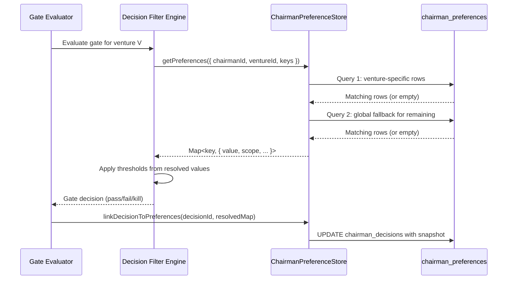

# 05 - Chairman Preference System

## Purpose

The Chairman Preference System provides persistent, scoped configuration that
drives how the Eva Orchestrator evaluates ventures. Preferences set by the
Chairman (human operator) control filter thresholds, budget caps, technology
directives, and risk tolerances. The system supports venture-specific overrides
on top of global defaults, ensuring that each venture can be tuned
independently while inheriting sensible baselines.

**Module**: `lib/eva/chairman-preference-store.js` (295 lines)
**Related SD**: SD-LEO-INFRA-CHAIRMAN-PREFS-001

---

## Architectural Position

```
                 +-------------------+
                 |   Chairman (UI)   |
                 +--------+----------+
                          |
                   set / get / delete
                          |
                          v
              +--------------------------+
              | ChairmanPreferenceStore  |
              |   (Scoped Resolution)    |
              +-----------+--------------+
                          |
            +-------------+-------------+
            |                           |
            v                           v
  +-------------------+     +--------------------+
  | chairman_         |     | chairman_          |
  | preferences       |     | decisions          |
  | (9 columns)       |     | (13 columns)       |
  +-------------------+     +--------------------+
            |                           ^
            |    linkDecisionTo         |
            |    Preferences()          |
            +---------------------------+
                          |
                          v
              +--------------------------+
              | Decision Filter Engine   |
              | (reads preferences for   |
              |  threshold evaluation)   |
              +--------------------------+
```

The Preference Store sits between the Chairman interface and the Decision
Filter Engine. When the filter engine evaluates a venture at a gate, it
queries preferences to determine the thresholds that apply.

---

## Scoped Resolution Model

The central design principle is **venture-scoped resolution with global
fallback**. Every preference lookup follows a two-step resolution order:

```
Resolution Order
================

Step 1: Venture-Specific Lookup
   Query: (chairman_id, venture_id, preference_key)
   Match? --> Return venture-scoped value

Step 2: Global Fallback
   Query: (chairman_id, NULL, preference_key)
   Match? --> Return global-scoped value

Step 3: No Match
   Return null (caller applies its own default)
```

### Resolution Diagram

```
         getPreference(chairman, venture, key)
                       |
                       v
            +---------------------+
            | venture_id != null? |
            +----+----------+----+
                 |          |
                YES         NO
                 |          |
                 v          |
         +---------------+  |
         | Query WHERE   |  |
         | chairman_id   |  |
         | venture_id    |  |
         | pref_key      |  |
         +-------+-------+  |
                 |          |
            Found?          |
           /      \         |
         YES       NO       |
          |         \       |
          v          +------+
     Return          |
     (scope:         v
      venture)  +-----------+
                | Query     |
                | WHERE     |
                | chairman  |
                | NULL vent |
                | pref_key  |
                +-----+-----+
                      |
                 Found?
                /      \
              YES       NO
               |         |
               v         v
          Return      Return
          (scope:      null
           global)
```

This pattern means a Chairman can set a global `risk.max_drawdown_pct` of 30%,
then override it to 15% for a specific high-risk venture. Any venture without
an explicit override inherits the global 30%.

### Scope Tag on Results

Every resolved preference includes a `scope` field indicating which level
matched:

| Scope Value | Meaning |
|-------------|---------|
| `venture` | Matched a venture-specific row |
| `global` | Fell through to the global (venture_id = NULL) row |

This allows downstream consumers (e.g., Decision Filter Engine) to
distinguish between explicitly-set venture preferences and inherited globals.

---

## Database Schema

### chairman_preferences Table (9 Columns)

| Column | Type | Purpose |
|--------|------|---------|
| `id` | UUID (PK) | Row identifier |
| `chairman_id` | UUID (FK) | References the Chairman user |
| `venture_id` | UUID (FK, nullable) | NULL = global, non-NULL = venture-specific |
| `preference_key` | TEXT | Dotted key name (e.g., `risk.max_drawdown_pct`) |
| `preference_value` | JSONB | The preference value (any JSON type) |
| `value_type` | TEXT | Declared type: number, string, boolean, object, array |
| `source` | TEXT | Origin: `chairman_directive`, `system`, `inferred` |
| `created_at` | TIMESTAMPTZ | Row creation timestamp |
| `updated_at` | TIMESTAMPTZ | Last update timestamp |

**Unique Constraint**: `(chairman_id, venture_id, preference_key)` --
enforced at the database level via upsert conflict target.

### chairman_decisions Table (13 Columns)

The decisions table records every gate decision the Chairman makes (or the
system makes on their behalf). Three columns link decisions back to the
preferences that influenced them:

| Column | Purpose |
|--------|---------|
| `preference_key` | Primary preference key that influenced this decision |
| `preference_ref_id` | UUID FK to the specific chairman_preferences row |
| `preference_snapshot` | JSONB snapshot of all resolved preferences at decision time |

The snapshot captures the exact values that were active when the decision was
made, providing a complete audit trail even if preferences change later.

---

## CRUD Operations

### setPreference()

Upserts a preference row. If a row already exists for the same
`(chairman_id, venture_id, preference_key)` tuple, it updates the value in
place.

**Validation pipeline** (executed in order):

1. **Value type check** -- Is `valueType` one of the 5 allowed types?
2. **Runtime type match** -- Does the actual JavaScript value match the
   declared `valueType`?
3. **Known-key validator** -- If the key has a registered validator, run it.

If any step fails, the operation returns `{ success: false, error: "..." }`
without touching the database.

### getPreference()

Resolves a single preference using the two-step scoped resolution described
above. Returns the formatted result object or `null` if no match at any scope.

### getPreferences() (Batch)

Resolves multiple preference keys in a single call. Uses an optimized
**2-query pattern** regardless of how many keys are requested:

```
Batch Resolution (2-Query Pattern)
===================================

Query 1 (if ventureId provided):
   SELECT * FROM chairman_preferences
   WHERE chairman_id = ?
     AND venture_id = ?
     AND preference_key IN (key1, key2, ..., keyN)

   --> Populate resolved Map with venture-scoped matches

Query 2 (for remaining unresolved keys):
   SELECT * FROM chairman_preferences
   WHERE chairman_id = ?
     AND venture_id IS NULL
     AND preference_key IN (remaining_key1, remaining_key2, ...)

   --> Fill gaps with global-scoped matches
```

This means resolving 20 preferences costs exactly 2 database queries, not 20.
The result is a `Map<string, object>` keyed by preference_key.

### deletePreference()

Removes a single preference row. Requires exact scope specification -- passing
`ventureId = null` deletes the global preference, while passing a specific
`ventureId` deletes only the venture-scoped override.

---

## Built-in Validators

The module includes validators for known preference keys. These run during
`setPreference()` after the generic type check passes.

| Preference Key | Type | Validation Rule |
|----------------|------|-----------------|
| `risk.max_drawdown_pct` | number | Must be between 0 and 100 inclusive |
| `budget.max_monthly_usd` | number | Must be >= 0 |
| `tech.stack_directive` | string | Must be non-empty after trim |

Validators are defined in the `KNOWN_KEY_VALIDATORS` map at the module level.
New validators can be added by extending this map -- each validator is a
function that receives the value and returns either `null` (valid) or a string
error message.

### Value Types

Five value types are supported, stored in the `value_type` column and
validated at write time:

| Type | JavaScript Check | JSONB Storage |
|------|-----------------|---------------|
| `number` | `typeof v === 'number'` | JSON number |
| `string` | `typeof v === 'string'` | JSON string |
| `boolean` | `typeof v === 'boolean'` | JSON boolean |
| `object` | `typeof v === 'object' && !Array.isArray(v)` | JSON object |
| `array` | `Array.isArray(v)` | JSON array |

The runtime type validation ensures the value stored in JSONB matches the
declared type, preventing mismatches where `value_type` says "number" but
the actual JSONB value is a string.

---

## Source Tracking

Every preference records its origin in the `source` column:

| Source | Meaning |
|--------|---------|
| `chairman_directive` | Explicitly set by the Chairman (default) |
| `system` | Set programmatically by the system |
| `inferred` | Derived from venture analysis or historical patterns |

Source tracking enables the UI to distinguish between preferences the Chairman
explicitly chose versus those the system inferred. Inferred preferences can
be presented with lower confidence or with a prompt asking the Chairman to
confirm.

---

## Audit Trail: Decision-to-Preference Linkage

### linkDecisionToPreferences()

After a gate decision is made, this function creates the audit trail linking
the decision to the preferences that influenced it.

```
Decision Audit Flow
====================

1. Decision Filter Engine evaluates gate
       |
       v
2. getPreferences() resolves relevant keys
       |
       v
3. Engine makes decision based on resolved values
       |
       v
4. Decision stored in chairman_decisions
       |
       v
5. linkDecisionToPreferences() called with:
   - decisionId: UUID of the new chairman_decisions row
   - resolvedPreferences: Map from getPreferences()
       |
       v
6. UPDATE chairman_decisions SET
     preference_key = first resolved key,
     preference_ref_id = first resolved preference UUID,
     preference_snapshot = {
       key1: { value, scope, valueType },
       key2: { value, scope, valueType },
       ...
     }
```

The **preference_snapshot** is a JSONB column that captures the complete state
of all resolved preferences at decision time. This means even if preferences
are later changed, the audit trail records exactly what values were active
when each decision was made.

### Snapshot Structure

```
{
  "risk.max_drawdown_pct": {
    "value": 15,
    "scope": "venture",
    "valueType": "number"
  },
  "budget.max_monthly_usd": {
    "value": 5000,
    "scope": "global",
    "valueType": "number"
  }
}
```

---

## Integration with Decision Filter Engine

The Decision Filter Engine is the primary consumer of Chairman preferences.
The integration flow:



The filter engine uses resolved preferences to determine:

- **Kill gate thresholds**: At what drawdown percentage should a venture be
  flagged for kill review?
- **Budget constraints**: What monthly spend cap applies?
- **Technology constraints**: Are there stack directives that limit technology
  choices?
- **Custom thresholds**: Any preference key the engine is configured to read.

---

## Constructor and Factory

The `ChairmanPreferenceStore` class accepts an options object:

| Option | Default | Purpose |
|--------|---------|---------|
| `supabaseClient` | Auto-created from env vars | Supabase client for DB access |
| `logger` | `console` | Logger for debug output |

A factory function `createChairmanPreferenceStore()` provides a convenience
wrapper for creating instances with default configuration.

---

## Error Handling Patterns

All CRUD methods return structured result objects rather than throwing
exceptions:

| Operation | Success Response | Failure Response |
|-----------|-----------------|------------------|
| setPreference | `{ success: true, record: {...} }` | `{ success: false, error: "..." }` |
| getPreference | Formatted object or `null` | `null` (no match) |
| getPreferences | `Map<string, object>` | Empty Map |
| deletePreference | `{ success: true }` | `{ success: false, error: "..." }` |
| linkDecisionToPreferences | `{ success: true }` | `{ success: false, error: "..." }` |

This pattern keeps error handling consistent and avoids unhandled promise
rejections in the calling code.

---

## Key Design Decisions

### Why Scoped Resolution Instead of Flat Key-Value?

Flat key-value stores require callers to manage scope themselves (e.g.,
`venture_123_risk_max_drawdown_pct` as a key name). Scoped resolution
separates the scope dimension from the key dimension, enabling:

1. **Inheritance** -- Ventures automatically inherit global preferences
2. **Override** -- Specific ventures can override without affecting others
3. **Batch efficiency** -- The 2-query pattern works at the scope level,
   not per-key

### Why JSONB for preference_value?

JSONB allows storing any JSON-compatible type in a single column. Combined
with the `value_type` discriminator, this avoids the need for separate
columns for different data types or multiple preference tables.

### Why Snapshot in Decisions?

Preferences can change over time. The snapshot captures point-in-time state
so that auditing a past decision shows exactly which values were active,
not the current values. This is essential for regulatory compliance and
post-mortem analysis of venture decisions.

---

## Testing Considerations

The module exports a class that accepts dependency injection via its
constructor (`supabaseClient`, `logger`). This allows tests to:

- Inject a mock Supabase client to avoid real database calls
- Inject a mock logger to capture and assert on debug output
- Test resolution order without network dependencies

---

## Related Components

| Component | Relationship |
|-----------|-------------|
| Decision Filter Engine | Primary consumer; reads preferences for threshold evaluation |
| Eva Orchestrator | Triggers gate evaluations that read preferences |
| Chairman UI | Frontend for setting/viewing preferences |
| `chairman_preferences` table | Persistence layer |
| `chairman_decisions` table | Audit trail; receives preference snapshots |
