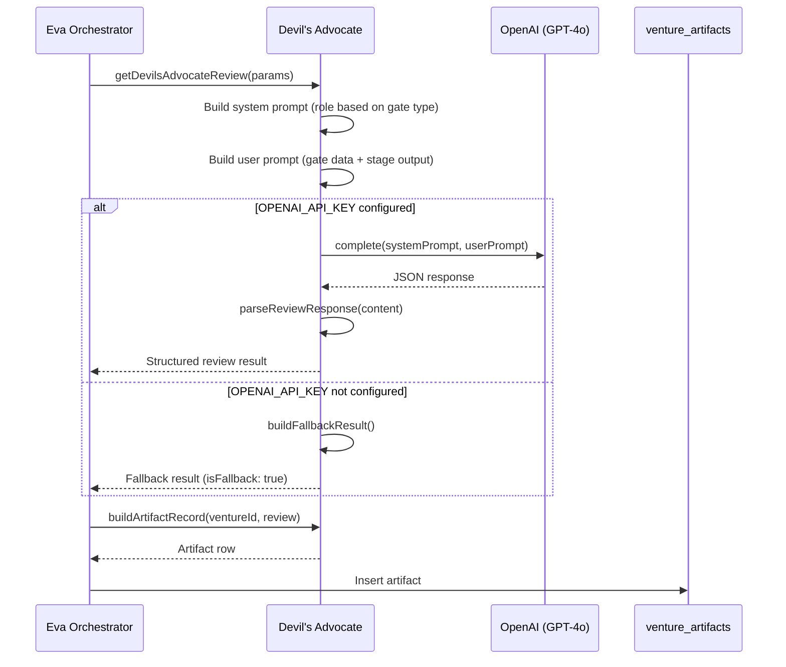

# 07 - Devil's Advocate System

## Purpose

The Devil's Advocate system provides **model-isolated adversarial review** at
critical venture lifecycle gates. It intentionally uses GPT-4o (a different AI
model from Claude, which performs the venture analysis) to generate genuinely
adversarial counter-arguments, preventing confirmation bias that would occur
if the same model both analyzed and reviewed its own work.

The system is advisory and non-blocking -- a Devil's Advocate failure never
prevents stage progression. Its value lies in surfacing risks and alternative
perspectives that the primary analysis may have overlooked.

**Module**: `lib/eva/devils-advocate.js` (260 lines)
**Related SD**: SD-LEO-FEAT-DEVILS-ADVOCATE-001
**Chairman Decision**: D04 (Model isolation for adversarial review)

---

## Architectural Position

```
Eva Orchestrator
     |
     | Stage progression reaches a gate
     |
     v
+------------------+      +-------------------+
| Gate Evaluator   |----->| Devil's Advocate  |
| (Claude-based    |      | (GPT-4o-based     |
|  analysis)       |      |  adversarial      |
|                  |      |  review)          |
+--------+---------+      +--------+----------+
         |                         |
         |  Gate decision          |  Counter-arguments
         |  (pass/fail/kill)       |  risks, alternatives
         |                         |
         v                         v
   +------------------------------------+
   |       venture_artifacts             |
   | (stores both gate result AND        |
   |  devil's advocate review)           |
   +------------------------------------+
```

The Devil's Advocate operates alongside -- not within -- the gate evaluation
pipeline. The gate evaluator makes its decision independently; the Devil's
Advocate provides a separate, adversarial perspective stored as an artifact.

---

## Why GPT-4o? The Model Isolation Principle

The most important architectural decision in this system is the deliberate
use of a **different AI model** from the one performing venture analysis.

```
+---------------------+          +---------------------+
|   Claude (Primary)  |          |   GPT-4o (Devil's   |
|                     |          |   Advocate)          |
|   - Venture analysis|          |   - Adversarial     |
|   - Stage execution |          |     review           |
|   - Gate evaluation |          |   - Counter-args     |
|   - Artifact gen    |          |   - Risk surfacing   |
|                     |          |                      |
|   SAME model =      |          |   DIFFERENT model =  |
|   systematic biases |          |   independent biases |
+---------------------+          +---------------------+
         |                                |
         | If same model reviews          | Different training data,
         | its own work, it tends         | different reasoning patterns,
         | to confirm its own             | different blind spots
         | conclusions                    |
         v                                v
   Confirmation Bias                Independent Challenge
```

This is Chairman Decision D04: Model isolation ensures that adversarial
review comes from a fundamentally different perspective, not from the same
system rephrasing its own conclusions.

### Adapter Integration

The Devil's Advocate uses the `OpenAIAdapter` from
`lib/sub-agents/vetting/provider-adapters.js`. This adapter handles:

- API key management (`OPENAI_API_KEY` environment variable)
- Request formatting for the OpenAI API
- Response parsing and token usage tracking

---

## Gate Types

The Devil's Advocate is invoked at two categories of gates:

### Kill Gates

Kill gates are decision points where a venture may be terminated. The Devil's
Advocate at kill gates looks for reasons why the venture **should** be killed
-- fatal flaws, unrealistic assumptions, and overlooked market risks.

| Stage | Gate Name | Purpose |
|-------|-----------|---------|
| 3 | Problem Validation Kill | Is the problem real and worth solving? |
| 5 | Solution Viability Kill | Can this solution actually work? |
| 13 | Market Fit Kill | Is there evidence of product-market fit? |
| 23 | Scale Readiness Kill | Can this venture scale successfully? |

### Promotion Gates

Promotion gates are decision points where a venture advances to the next
phase. The Devil's Advocate at promotion gates challenges whether the venture
**truly deserves** to advance.

| Stage | Gate Name | Purpose |
|-------|-----------|---------|
| 16 | Build Readiness Promotion | Is the venture ready for development? |
| 17 | Architecture Promotion | Is the technical architecture sound? |
| 22 | Growth Readiness Promotion | Is the venture ready to scale? |

### Gate Detection

The `isDevilsAdvocateGate()` function provides a simple boolean check:

```
isDevilsAdvocateGate(stageId)
  --> { isGate: true, gateType: 'kill' }     (stages 3, 5, 13, 23)
  --> { isGate: true, gateType: 'promotion' } (stages 16, 17, 22)
  --> { isGate: false, gateType: null }       (all other stages)
```

---

## Review Process



### Step-by-Step Flow

1. **Gate type detection** -- Determine if this is a kill or promotion gate
2. **Adapter initialization** -- Create OpenAIAdapter, check API key
3. **System prompt construction** -- Role-specific prompt based on gate type:
   - Kill gates: "Find reasons this venture should be KILLED"
   - Promotion gates: "Challenge whether this venture deserves to advance"
4. **User prompt construction** -- Includes venture name, stage, gate
   decision, gate rationale, blockers, and truncated stage analysis data
5. **GPT-4o call** -- Send prompts, receive structured JSON response
6. **Response parsing** -- Extract JSON from response, handle markdown code
   blocks
7. **Result assembly** -- Combine parsed review with metadata

---

## Output Structure

The Devil's Advocate produces a review with these fields:

| Field | Type | Description |
|-------|------|-------------|
| `overallAssessment` | string | `challenge`, `concern`, or `support` |
| `counterArguments` | string[] | Specific counter-arguments (minimum 2 required) |
| `risks` | object[] | Identified risks with severity and likelihood |
| `alternatives` | string[] | Alternative approaches suggested |
| `summary` | string | One-paragraph adversarial position summary |

### Assessment Levels

| Assessment | Meaning |
|-----------|---------|
| `challenge` | Serious issues found that warrant reconsideration |
| `concern` | Noteworthy risks exist but may be manageable |
| `support` | Tried to find flaws but evidence is genuinely strong |
| `unavailable` | Fallback result -- review could not be performed |

### Risk Structure

Each risk in the `risks` array includes:

| Field | Values |
|-------|--------|
| `risk` | Description of the risk |
| `severity` | `high`, `medium`, or `low` |
| `likelihood` | `likely`, `possible`, or `unlikely` |

---

## Prompt Engineering

### System Prompt Design

The system prompt varies by gate type to focus the adversarial review:

**Kill Gate Prompt** instructs GPT-4o to:
- Act as a rigorous venture evaluator
- Find reasons the venture should be KILLED
- Look for fatal flaws, unrealistic assumptions, market risks
- Always find at least 2 counter-arguments
- Be specific, reference actual data from the analysis

**Promotion Gate Prompt** instructs GPT-4o to:
- Act as a critical venture reviewer
- Challenge whether advancement is deserved
- Look for weaknesses in evidence, gaps in preparation
- Always find at least 2 counter-arguments
- Be specific, reference actual data from the analysis

Both prompts require structured JSON output with a specified schema.

### User Prompt Construction

The user prompt is built from gate evaluation data:

```
VENTURE: {name} (Stage {stageId})
GATE TYPE: {kill|promotion} gate
Gate decision: {decision/pass/fail}
Reasons: [...]
Rationale: ...
Blockers: [...]

STAGE ANALYSIS DATA:
{truncated JSON of stage output, max 8000 chars}
```

The `MAX_ANALYSIS_CHARS` constant (8000) prevents sending excessive data to
GPT-4o, controlling token costs while providing enough context for meaningful
adversarial review.

---

## Fallback Behavior

The Devil's Advocate is designed to **never block** stage progression. When
GPT-4o is unavailable, it returns a fallback result:

```
Fallback Trigger Conditions
============================

1. OPENAI_API_KEY not set in environment
2. OpenAIAdapter initialization failure
3. GPT-4o API call fails (network, rate limit, etc.)
```

### Fallback Result Structure

| Field | Value |
|-------|-------|
| `proceeded` | `true` (gate continues regardless) |
| `isFallback` | `true` |
| `fallbackReason` | Error description |
| `model` | `null` |
| `overallAssessment` | `unavailable` |
| `counterArguments` | `[]` (empty) |
| `risks` | `[]` (empty) |
| `alternatives` | `[]` (empty) |
| `summary` | "Devil's Advocate unavailable: {reason}. Gate proceeded without adversarial review." |

### Quality Score Impact

When stored as an artifact, fallback results receive a `quality_score` of 0
and `validation_status` of `pending`, signaling to downstream consumers that
no real adversarial review occurred.

---

## Artifact Storage

Review results are stored in `venture_artifacts` via `buildArtifactRecord()`:

```
Artifact Record Structure
==========================

venture_id:        Venture UUID
lifecycle_stage:   Stage number (3, 5, 13, 16, 17, 22, or 23)
artifact_type:     'devils_advocate_review'
title:             'Devil's Advocate - Stage {N} {kill|promotion} gate'
content:           JSON with full review details
metadata:          { model, durationMs, usage, isFallback }
quality_score:     Estimated from review completeness (see below)
validation_status: 'validated' or 'pending' (pending for fallbacks)
validated_by:      'devils_advocate'
source:            'devils-advocate'
```

### Quality Score Estimation

For non-fallback reviews, quality is estimated based on review completeness:

```
Base score:                          50
+ counterArguments >= 2:            +20
+ risks >= 1:                       +15
+ alternatives >= 1:                +10
+ summary >= 50 characters:          +5
                                   ----
Maximum possible:                   100
```

This scoring incentivizes GPT-4o responses that include all expected sections.
A review with 2+ counter-arguments, at least one risk, one alternative, and
a substantive summary scores the maximum 100.

---

## Response Parsing

The `parseReviewResponse()` function handles GPT-4o responses that may
include markdown formatting:

```
Response Parsing Flow
======================

1. Attempt to extract JSON via regex: /\{[\s\S]*\}/
2. If JSON found:
   a. Parse with JSON.parse()
   b. Extract expected fields with defaults
   c. Return structured review object
3. If JSON NOT found (or parse fails):
   a. Treat raw text as a single counter-argument
   b. Return review with assessment = 'concern'
   c. Include truncated raw text in summary
```

This graceful degradation ensures that even malformed GPT-4o responses
produce a usable review rather than crashing the gate evaluation.

---

## Non-Blocking Design

```
Gate Evaluation Timeline
=========================

  Gate Evaluator              Devil's Advocate
       |                            |
       |--- Evaluate gate ------    |
       |                       |    |
       |  Gate decision made   |    |
       |  (pass/fail/kill)     |    |
       |                       |    |
       |--- Request review ----|    |
       |                       |    |
       |                       +--->| GPT-4o call
       |                            |
       |                            | (may succeed or fail)
       |                            |
       |<-- Review result ------    |
       |                            |
       | Store as artifact          |
       |                            |
       | Continue stage             |
       | progression               |
       |                            |
       v                            v
```

The key design constraint: **The gate decision is already made before the
Devil's Advocate is consulted.** The adversarial review provides additional
perspective for human review and future reference, but it does not change the
gate outcome. This ensures that GPT-4o availability or response quality never
blocks venture progress.

---

## Integration with Eva Orchestrator

The Eva Orchestrator's stage execution logic calls the Devil's Advocate at
gate stages:

```
Orchestrator Stage Execution
=============================

1. Execute stage analysis (Claude)
2. Evaluate gate (if gate stage)
3. Is this a Devil's Advocate gate?
   |
   +-- YES: Call getDevilsAdvocateReview()
   |        Store result as venture_artifact
   |
   +-- NO: Skip DA review
   |
4. Apply gate decision (proceed/block)
5. Advance to next stage (if proceeding)
```

The orchestrator checks `isDevilsAdvocateGate(stageId)` to determine whether
to invoke the review. The 7 gate stages (3, 5, 13, 16, 17, 22, 23) are the
only stages where the Devil's Advocate runs.

---

## Key Design Decisions

### Why Non-Blocking?

If the Devil's Advocate could block progression, a GPT-4o outage would halt
all venture processing. The advisory model ensures resilience while still
providing the adversarial perspective when available.

### Why Minimum 2 Counter-Arguments?

The system prompt requires at least 2 counter-arguments even for strong
ventures. This prevents lazy "looks good" responses and ensures every gate
review surfaces at least some considerations for human reviewers.

### Why 8000 Character Limit on Analysis Data?

The `MAX_ANALYSIS_CHARS` constant balances context quality with API costs.
Stage outputs can be large (10,000+ characters), but the adversarial
review needs key data points, not exhaustive detail. 8000 characters provides
sufficient context for meaningful counter-arguments.

### Why Structured JSON Output?

Requiring JSON output from GPT-4o enables programmatic processing of reviews
(quality scoring, artifact storage, dashboard display) without manual parsing.
The fallback to raw text handling ensures degraded-but-functional operation
when GPT-4o doesn't follow the JSON format instruction.

---

## Testing Considerations

The module supports dependency injection for testing:

| Dependency | Default | Override Purpose |
|-----------|---------|------------------|
| `adapter` | `new OpenAIAdapter()` | Mock GPT-4o calls in tests |
| `logger` | `console` | Capture log output |

Internal functions are exported via `_internal` for unit testing:
- `buildSystemPrompt` -- Test prompt construction
- `buildUserPrompt` -- Test user prompt assembly
- `parseReviewResponse` -- Test JSON extraction
- `buildFallbackResult` -- Test fallback behavior
- `estimateQualityScore` -- Test scoring logic

---

## Related Components

| Component | Relationship |
|-----------|-------------|
| Eva Orchestrator | Invokes DA at gate stages |
| OpenAIAdapter | Handles GPT-4o API communication |
| Gate Evaluator | Provides gate results that DA reviews |
| `venture_artifacts` | Stores DA review results |
| Decision Filter Engine | May read DA results for additional context |
| Chairman Dashboard | Displays DA reviews for human review |
