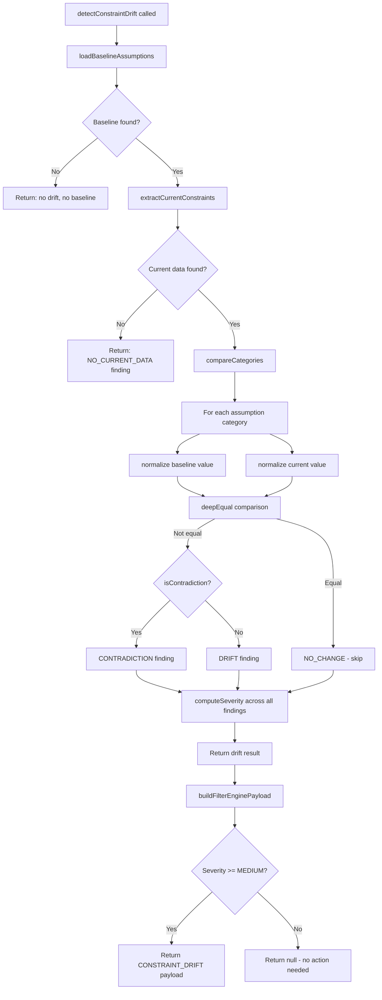
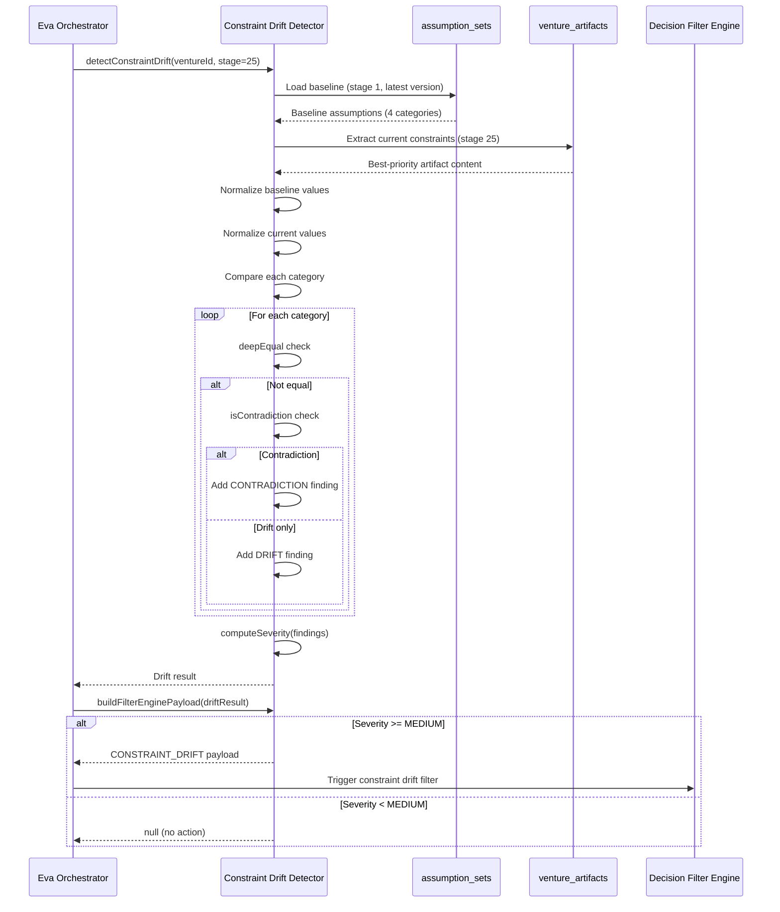

## Table of Contents

- [Purpose](#purpose)
- [Architectural Position](#architectural-position)
- [Comparison Flow](#comparison-flow)
- [Assumption Categories](#assumption-categories)
- [Drift Types](#drift-types)
  - [Contradiction vs. Drift](#contradiction-vs-drift)
- [Severity Levels](#severity-levels)
- [Data Loading](#data-loading)
  - [Baseline Assumptions](#baseline-assumptions)
  - [Current Constraints](#current-constraints)
  - [Content Extraction](#content-extraction)
- [Comparison Process](#comparison-process)
  - [Normalization](#normalization)
  - [Deep Equality](#deep-equality)
  - [Drift Computation](#drift-computation)
- [Stage 25 Special Handling](#stage-25-special-handling)
- [Decision Filter Engine Integration](#decision-filter-engine-integration)
  - [buildFilterEnginePayload()](#buildfilterenginepayload)
  - [Filter Threshold](#filter-threshold)
- [Error Handling](#error-handling)
- [Rationale Generation](#rationale-generation)
- [Complete Process Flow](#complete-process-flow)
- [Key Design Decisions](#key-design-decisions)
  - [Why Stage 1 as Default Baseline?](#why-stage-1-as-default-baseline)
  - [Why Flexible Content Extraction?](#why-flexible-content-extraction)
  - [Why Not Block on Drift?](#why-not-block-on-drift)
  - [Why Confidence Scores?](#why-confidence-scores)
  - [Why 4 Categories?](#why-4-categories)
- [Testing Considerations](#testing-considerations)
- [Related Components](#related-components)

---
Category: Architecture
Status: Approved
Version: 1.0.0
Author: DOCMON Sub-Agent
Last Updated: 2026-02-08
Tags: [cli-venture-lifecycle, eva, orchestrator]
Related SDs: [SD-LEO-ORCH-CLI-VENTURE-LIFECYCLE-001]
---

# 08 - Constraint Drift Detection

## Purpose

The Constraint Drift Detector identifies when a venture's current state has
diverged from its original baseline assumptions. Ventures begin with a set of
assumptions (market size, competitor landscape, product positioning, timing)
established during early stages (Stage 1-5). As the venture progresses through
later stages, real-world data may reveal that these assumptions were wrong,
have shifted, or directly contradict the original thesis.

This system performs a structured comparison between baseline assumptions and
current-stage data, categorizing findings by drift type and severity. Results
feed into the Decision Filter Engine to trigger re-evaluation when drift is
significant.

**Module**: `lib/eva/constraint-drift-detector.js` (468 lines)
**Related SD**: SD-LEO-FEAT-CONSTRAINT-DRIFT-001

---

## Architectural Position

```
Venture Lifecycle Stages
========================

Stage 1-5 (Early Validation)
    |
    | Baseline assumptions established
    | Stored in assumption_sets table
    |
    v
  [ ... stages 6-24 ... ]
    |
    | Venture evolves, reality changes
    | Current data in venture_artifacts
    |
    v
Stage 25 (Constraint Review)
    |
    v
+----------------------------------+
| Constraint Drift Detector        |
| detectConstraintDrift()          |
+--+------------------+------------+
   |                  |
   | Load baseline    | Extract current
   |                  |
   v                  v
+--------------+  +------------------+
| assumption_  |  | venture_         |
| sets         |  | artifacts        |
| (Stage 1-5)  |  | (Current stage)  |
+--------------+  +------------------+
         |                |
         v                v
   +--------------------------+
   | compareCategories()      |
   | computeDrift()           |
   | computeSeverity()        |
   +--------------------------+
              |
              v
   +---------------------------+
   | buildFilterEnginePayload()|
   +------------+--------------+
                |
                v
   +---------------------------+
   | Decision Filter Engine    |
   | (CONSTRAINT_DRIFT trigger)|
   +---------------------------+
```

The detector sits at Stage 25, where the venture's accumulated evidence is
compared against its founding assumptions. If significant drift is detected,
the Decision Filter Engine is triggered to re-evaluate the venture's
trajectory.

---

## Comparison Flow



---

## Assumption Categories

The detector compares four categories of assumptions between baseline and
current state:

| Category | What It Covers | Example Drift |
|----------|----------------|---------------|
| `market_assumptions` | Market size, growth rate, TAM/SAM/SOM, customer segments | Market shrunk 40% since baseline |
| `competitor_assumptions` | Competitive landscape, key players, differentiation | New dominant competitor entered |
| `product_assumptions` | Product positioning, pricing model, feature priorities | Pivoted from B2B to B2C |
| `timing_assumptions` | Launch timeline, market windows, regulatory deadlines | Regulatory change delayed launch |

These categories map directly to columns in the `assumption_sets` table
(baseline) and to keys extracted from `venture_artifacts` content (current).

---

## Drift Types

Each category comparison produces one of six drift type classifications:

| Drift Type | Meaning | Triggers Filter? |
|-----------|---------|-------------------|
| `NO_CHANGE` | Values match after normalization | No |
| `DRIFT` | Values differ but are not contradictory | Yes (if severity >= MEDIUM) |
| `CONTRADICTION` | Values directly oppose each other | Yes (always HIGH severity) |
| `NO_BASELINE` | No baseline value exists for this category | No |
| `NO_CURRENT_DATA` | No current-stage data available | No |
| `ERROR` | Comparison failed due to an exception | No |

### Contradiction vs. Drift

The distinction between DRIFT and CONTRADICTION is critical:

```
DRIFT Example:
  Baseline: "Market size: $10B"
  Current:  "Market size: $7B"
  --> Values differ but don't oppose each other

CONTRADICTION Example:
  Baseline: "Pricing model: subscription"
  Current:  "Pricing model: one-time purchase"
  --> Values directly oppose each other
```

The `isContradiction()` function checks for known opposite pairs:

| Pair A | Pair B |
|--------|--------|
| subscription | one_time |
| subscription | perpetual |
| b2b | b2c |
| enterprise | consumer |
| premium | freemium |
| high | low |
| domestic | international |
| global | local |

If baseline and current values each contain one side of an opposite pair,
the finding is classified as CONTRADICTION rather than DRIFT.

---

## Severity Levels

Overall severity is computed from all findings combined:

| Severity | Condition |
|----------|-----------|
| `HIGH` | Any CONTRADICTION found, or 3+ categories show drift |
| `MEDIUM` | 2 categories show drift (no contradictions) |
| `LOW` | 1 category shows drift |
| `NONE` | No drift or contradiction detected |

```
Severity Computation
=====================

findings = [f1, f2, f3, ...]

hasContradiction = any finding with driftType == CONTRADICTION?
driftCount = count of findings where driftType in (DRIFT, CONTRADICTION)

if hasContradiction     --> HIGH
if driftCount >= 3      --> HIGH
if driftCount >= 2      --> MEDIUM
if driftCount >= 1      --> LOW
else                    --> NONE
```

---

## Data Loading

### Baseline Assumptions

Baseline assumptions are loaded from the `assumption_sets` table:

```
Query: assumption_sets
WHERE:
  venture_id = {ventureId}
  created_at_stage = {baselineStage}  (default: 1)
  status IN ('active', 'validated')
ORDER BY: version DESC
LIMIT: 1
```

The query selects the highest-version assumption set for the baseline stage,
ensuring that if assumptions were revised during early stages, the most
recent revision is used.

**Columns read**: `id`, `market_assumptions`, `competitor_assumptions`,
`product_assumptions`, `timing_assumptions`, `confidence_scores`

### Current Constraints

Current-stage data is extracted from `venture_artifacts`:

```
Query: venture_artifacts
WHERE:
  venture_id = {ventureId}
  stage = {currentStage}
ORDER BY: created_at DESC
```

The extraction uses an **artifact type priority** to select the most relevant
artifact:

| Priority | Artifact Type | Rationale |
|----------|--------------|-----------|
| 1 (highest) | `stage_output` | Direct output from stage execution |
| 2 | `constraints` | Explicit constraint documentation |
| 3 | `plan` | Planning artifacts with assumption data |
| 4 (lowest) | `decision` | Decision records with context |

If none of the priority types match, the most recent artifact (by
`created_at`) is used as a fallback.

### Content Extraction

Once the best artifact is selected, assumption-relevant data is extracted
from its `content` JSONB column using flexible key matching:

```
Content Key Mapping
====================

market_assumptions   <-- content.market_assumptions OR content.market
competitor_assumptions <-- content.competitor_assumptions OR content.competitors
                          OR content.competitive
product_assumptions  <-- content.product_assumptions OR content.product
timing_assumptions   <-- content.timing_assumptions OR content.timing
                          OR content.timeline

Also checks content.constraints.{category} for explicit constraint blocks
```

This flexible extraction handles the fact that different stage modules may
use slightly different key names for the same conceptual data.

---

## Comparison Process

### Normalization

Before comparison, both baseline and current values are normalized:

```
Normalization Rules
====================

String:  trim() + toLowerCase()
Array:   map(normalize) + sort()
Object:  sort keys + normalize values recursively
null:    remains null
Other:   returned as-is (numbers, booleans)
```

Normalization ensures that superficial differences (capitalization, whitespace,
array ordering) do not produce false drift findings.

### Deep Equality

After normalization, `deepEqual()` performs recursive structural comparison:

- Primitives: strict equality (`===`)
- Arrays: same length + element-wise deepEqual
- Objects: same key count + value-wise deepEqual
- null: only equal to null

### Drift Computation

If values are not deeply equal after normalization, `computeDrift()` runs:

```
computeDrift(baseline, current)
================================

1. Normalize both values
2. deepEqual?
   YES --> { driftType: NO_CHANGE, confidence: 1.0 }
   NO  --> continue

3. isContradiction?
   YES --> { driftType: CONTRADICTION, confidence: 0.85,
             rationale: 'Current "{X}" contradicts baseline "{Y}"' }
   NO  --> { driftType: DRIFT, confidence: 0.7,
             rationale: 'Current "{X}" differs from baseline "{Y}"' }
```

Confidence scores reflect the detector's certainty:
- **1.0** for NO_CHANGE (exact match)
- **0.85** for CONTRADICTION (known opposite pair detected)
- **0.7** for DRIFT (values differ but opposition not confirmed)

---

## Stage 25 Special Handling

At Stage 25 (Constraint Review), there is special handling for the `vision`
category. If a vision category exists in the baseline, it is always checked
regardless of whether it appears in the current artifacts. This ensures that
fundamental vision drift is never missed at the final review stage.

```
Stage 25 Vision Check
======================

if currentStage == 25 AND category == 'vision':
  if no baseline vision --> NO_BASELINE finding
  else                  --> computeDrift(baseline.vision, current.vision)
```

---

## Decision Filter Engine Integration

### buildFilterEnginePayload()

When drift is significant (severity >= MEDIUM), the detector produces a
payload compatible with the Decision Filter Engine's `CONSTRAINT_DRIFT`
trigger:

```
Filter Engine Payload
======================

Trigger conditions:
  - driftDetected == true
  - severity is MEDIUM or HIGH

Payload structure:
  type:       'CONSTRAINT_DRIFT'
  ventureId:  Venture UUID
  stage:      Current stage number
  severity:   MEDIUM or HIGH
  summary:    'Constraint drift detected in N categories: ...'
  findings:   [{ category, driftType, rationale }]
```

The summary is truncated to 240 characters maximum to fit the filter engine's
display constraints.

### Filter Threshold

The function returns `null` (no payload) for:
- No drift detected
- Severity = NONE
- Severity = LOW

This means LOW severity drift is logged but does not trigger the Decision
Filter Engine. Only MEDIUM and HIGH severity drift produces an actionable
filter trigger.

```
Severity-to-Action Mapping
============================

NONE   --> No action, no payload
LOW    --> Logged in drift result, no filter trigger
MEDIUM --> Filter trigger: "Review recommended"
HIGH   --> Filter trigger: "Immediate re-evaluation required"
```

---

## Error Handling

The detector wraps the entire process in a try/catch that produces a
structured error finding:

```
Error Handling
==============

try {
  loadBaseline --> extractCurrent --> compare --> compute
} catch (error) {
  return {
    driftDetected: false,
    severity: NONE,
    findings: [{
      category: 'error',
      driftType: ERROR,
      rationale: '{ErrorType}: {message}',
      confidence: 0
    }]
  }
}
```

Errors in the detector never propagate as exceptions to the caller. The
structured error finding allows callers to detect and log the failure
without special error handling.

---

## Rationale Generation

For drift and contradiction findings, the detector generates human-readable
rationale strings:

```
buildDiffRationale(baseline, current, verb)
=============================================

Input:
  baseline = "subscription"
  current  = "one-time purchase"
  verb     = "contradicts"

Output:
  'Current value "one-time purchase" contradicts baseline "subscription"'

Truncation: Values longer than 60 characters are truncated to 57 + "..."
```

This rationale appears in:
- The drift findings array
- The filter engine payload
- The venture artifacts content
- Dashboard displays for human review

---

## Complete Process Flow



---

## Key Design Decisions

### Why Stage 1 as Default Baseline?

Stage 1 captures the venture's founding assumptions before any validation
work begins. Comparing against Stage 1 reveals how much reality has diverged
from the original thesis. The `baselineStage` parameter allows overriding
this default if a venture's assumptions were formally revised at a later
stage.

### Why Flexible Content Extraction?

Different stage modules produce artifacts with slightly different key names
(`market` vs. `market_assumptions`, `timing` vs. `timeline`). Rather than
requiring all modules to use identical keys, the detector handles common
variations. This reduces coupling between the detector and individual stage
implementations.

### Why Not Block on Drift?

Like the Devil's Advocate, drift detection is informational. Blocking
progression on drift would prevent ventures from pivoting, which is often
the correct response to changed assumptions. The Decision Filter Engine
can escalate drift findings to the Chairman for review, but the venture
continues progressing.

### Why Confidence Scores?

Confidence scores (0.7 for drift, 0.85 for contradiction) reflect the
detector's limitations. String-based comparison with a fixed set of
opposite pairs is inherently imprecise. Confidence scores signal to
downstream consumers (Decision Filter Engine, Chairman Dashboard) how much
weight to place on each finding.

### Why 4 Categories?

The four categories (market, competitor, product, timing) cover the
fundamental assumptions that define a venture thesis. Additional categories
can be added to `ASSUMPTION_CATEGORIES` if new assumption types are
stored in the `assumption_sets` table.

---

## Testing Considerations

The module exports internal functions via `_internal` for comprehensive
unit testing:

| Function | Test Focus |
|----------|-----------|
| `normalize` | Normalization rules for different types |
| `deepEqual` | Recursive equality across types |
| `isContradiction` | Opposite pair detection |
| `computeDrift` | Drift vs contradiction classification |
| `computeSeverity` | Severity level from findings |
| `compareCategories` | Full category comparison |
| `loadBaselineAssumptions` | Database query construction |
| `extractCurrentConstraints` | Artifact extraction and priority |
| `buildDiffRationale` | Rationale string formatting |

Constants are also exported for test assertions: `SEVERITY`, `DRIFT_TYPE`,
`ASSUMPTION_CATEGORIES`, `ARTIFACT_TYPE_PRIORITY`.

---

## Related Components

| Component | Relationship |
|-----------|-------------|
| Eva Orchestrator | Invokes detector at Stage 25 |
| `assumption_sets` table | Source of baseline assumptions |
| `venture_artifacts` table | Source of current-stage data |
| Decision Filter Engine | Receives CONSTRAINT_DRIFT trigger payloads |
| Chairman Dashboard | Displays drift findings for human review |
| Devil's Advocate | Complementary system (adversarial at gates, drift at Stage 25) |
