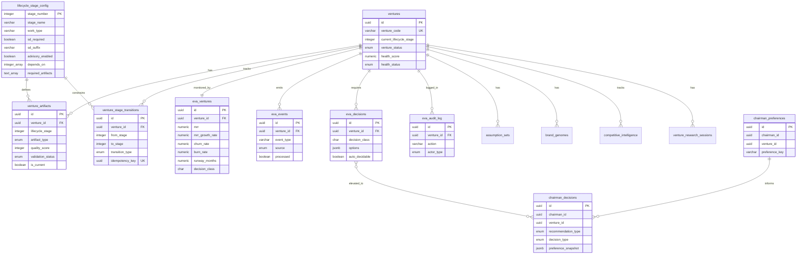

## Table of Contents

- [Table Overview](#table-overview)
- [Entity Relationship Diagram](#entity-relationship-diagram)
- [Core Tables](#core-tables)
  - [1. ventures (68 columns)](#1-ventures-68-columns)
  - [2. venture_artifacts (19 columns)](#2-venture_artifacts-19-columns)
  - [3. venture_stage_transitions (10 columns)](#3-venture_stage_transitions-10-columns)
  - [4. lifecycle_stage_config (14 columns)](#4-lifecycle_stage_config-14-columns)
  - [5. eva_ventures (15 columns)](#5-eva_ventures-15-columns)
  - [6. eva_events (8 columns)](#6-eva_events-8-columns)
  - [7. eva_decisions (17 columns)](#7-eva_decisions-17-columns)
  - [8. eva_audit_log (8 columns)](#8-eva_audit_log-8-columns)
  - [9. chairman_preferences (9 columns)](#9-chairman_preferences-9-columns)
  - [10. chairman_decisions (13 columns)](#10-chairman_decisions-13-columns)
- [Related Tables](#related-tables)
  - [assumption_sets](#assumption_sets)
  - [brand_genomes](#brand_genomes)
  - [competitive_intelligence](#competitive_intelligence)
  - [venture_research_sessions](#venture_research_sessions)
- [Indexes](#indexes)
  - [Performance Indexes](#performance-indexes)
  - [Index Design Rationale](#index-design-rationale)
- [RLS (Row-Level Security) Policies](#rls-row-level-security-policies)
  - [Policy Summary](#policy-summary)
  - [Policy Design Notes](#policy-design-notes)
- [Data Flow](#data-flow)
- [Migration Reference](#migration-reference)

---
Category: Implementation
Status: Approved
Version: 1.0.0
Author: DOCMON Sub-Agent
Last Updated: 2026-02-08
Tags: [cli-venture-lifecycle, eva, implementation]
Related SDs: [SD-LEO-ORCH-CLI-VENTURE-LIFECYCLE-001]
---

# Database Schema Reference

This document describes the complete database schema for the Eva Orchestrator CLI Venture Lifecycle system. All tables are defined in `database/migrations/20260207_cli_venture_lifecycle_sd_hierarchy.sql`.

## Table Overview

The schema consists of 10 core tables organized into three domains:

| Domain | Tables | Purpose |
|--------|--------|---------|
| Venture Core | ventures, venture_artifacts, venture_stage_transitions, lifecycle_stage_config | Venture lifecycle state management |
| Eva Intelligence | eva_ventures, eva_events, eva_decisions, eva_audit_log | Health monitoring, event processing, decision tracking |
| Chairman Governance | chairman_preferences, chairman_decisions | Preference resolution, decision audit |

## Entity Relationship Diagram



## Core Tables

### 1. ventures (68 columns)

The central table for all venture data. Stores lifecycle state, health metrics, financial data, and metadata.

**Primary Key:** `id` (UUID, gen_random_uuid)

**Key Columns:**

| Column | Type | Constraints | Description |
|--------|------|-------------|-------------|
| id | UUID | PK, DEFAULT gen_random_uuid() | Unique venture identifier |
| venture_code | VARCHAR | UNIQUE, NOT NULL, INDEXED | Human-readable venture code (e.g., "ACME-001") |
| current_lifecycle_stage | INTEGER | CHECK >= 1 AND <= 25, INDEXED | Current position in the 25-stage lifecycle |
| venture_status | venture_status_enum | NOT NULL, DEFAULT 'active' | One of: active, paused, killed, graduated |
| health_score | NUMERIC | CHECK >= 0 AND <= 1 | Computed health metric (0.0 to 1.0) |
| health_status | VARCHAR | CHECK IN ('healthy', 'warning', 'critical') | Derived from health_score thresholds |
| created_by | UUID | FK to auth.users | Owner for RLS policies |
| company_id | UUID | INDEXED | Multi-tenant isolation key |

**Status Enum Values:**

```
active   - Venture is actively progressing through stages
paused   - Temporarily halted (retains state)
killed   - Permanently terminated (archived)
graduated - Successfully completed all lifecycle stages
```

**CHECK Constraint:** `current_lifecycle_stage >= 1 AND current_lifecycle_stage <= 25` ensures stage values stay within the defined lifecycle range.

### 2. venture_artifacts (19 columns)

Stores output artifacts produced at each lifecycle stage. Artifacts are versioned and quality-scored.

**Primary Key:** `id` (UUID, gen_random_uuid)

**Key Columns:**

| Column | Type | Constraints | Description |
|--------|------|-------------|-------------|
| id | UUID | PK | Unique artifact identifier |
| venture_id | UUID | FK to ventures(id), NOT NULL | Parent venture |
| lifecycle_stage | INTEGER | NOT NULL | Stage that produced this artifact |
| artifact_type | VARCHAR | CHECK IN (26 values) | Type classification |
| content | JSONB | | Artifact payload |
| quality_score | INTEGER | CHECK >= 0 AND <= 100 | Quality assessment (0-100 scale) |
| validation_status | VARCHAR | CHECK IN ('pending', 'validated', 'rejected', 'needs_revision') | Review state |
| is_current | BOOLEAN | DEFAULT true | Whether this is the active version |
| version | INTEGER | DEFAULT 1 | Version counter |

**Artifact Types (26):**

```
idea_brief, problem_validation, solution_hypothesis,
market_analysis, competitive_landscape, customer_persona,
value_proposition, business_model_canvas, mvp_definition,
technical_architecture, sprint_plan, prototype,
user_feedback, metrics_dashboard, pivot_analysis,
growth_strategy, unit_economics, funding_strategy,
team_plan, operations_plan, legal_compliance,
launch_plan, scale_strategy, exit_strategy,
retrospective, optimization_plan
```

**Idempotency Note:** This table does NOT have a dedicated `idempotency_key` column. The system uses a composite key workaround based on `(venture_id, lifecycle_stage, artifact_type, version)` for upsert operations.

### 3. venture_stage_transitions (10 columns)

Audit trail for all stage transitions. Every state change is recorded with its type and rationale.

**Primary Key:** `id` (UUID, gen_random_uuid)

**Key Columns:**

| Column | Type | Constraints | Description |
|--------|------|-------------|-------------|
| id | UUID | PK | Transition record ID |
| venture_id | UUID | FK to ventures(id), NOT NULL | Parent venture |
| from_stage | INTEGER | NOT NULL | Origin stage number |
| to_stage | INTEGER | NOT NULL | Destination stage number |
| transition_type | VARCHAR | CHECK IN ('normal', 'skip', 'rollback', 'pivot') | How the transition occurred |
| idempotency_key | UUID | UNIQUE per (venture_id, idempotency_key) | Prevents duplicate transitions |
| reason | TEXT | | Human-readable transition rationale |
| triggered_by | VARCHAR | | Actor or system that initiated |
| created_at | TIMESTAMPTZ | DEFAULT now() | When the transition occurred |

**Transition Types:**

```
normal   - Sequential progression (stage N to N+1)
skip     - Jumping stages (e.g., fast-tracking mature ventures)
rollback - Returning to a previous stage for rework
pivot    - Lateral move indicating strategic change
```

**Idempotency:** The unique index on `(venture_id, idempotency_key)` prevents replay attacks and duplicate transitions from retried operations.

### 4. lifecycle_stage_config (14 columns)

Defines the 25 lifecycle stages. This is reference/configuration data, typically seeded once.

**Primary Key:** `stage_number` (INTEGER)

**Key Columns:**

| Column | Type | Constraints | Description |
|--------|------|-------------|-------------|
| stage_number | INTEGER | PK | Stage position (1-25) |
| stage_name | VARCHAR | NOT NULL | Human-readable stage name |
| stage_description | TEXT | | Detailed stage purpose |
| work_type | VARCHAR | NOT NULL | Category of work (research, design, build, etc.) |
| sd_required | BOOLEAN | DEFAULT false | Whether an SD must be created for this stage |
| sd_suffix | VARCHAR | | Suffix for auto-generated SD keys |
| advisory_enabled | BOOLEAN | DEFAULT false | Whether Devil's Advocate review fires |
| depends_on | INTEGER[] | | Array of prerequisite stage numbers |
| required_artifacts | TEXT[] | | Artifact types that must exist before completion |
| estimated_duration_days | INTEGER | | Planning estimate |
| phase | VARCHAR | | High-level phase grouping |

**Advisory Stages:** Stages 3, 5, and 16 have `advisory_enabled = true`, triggering Devil's Advocate review via `lib/eva/devils-advocate.js`.

**Dependency Array:** `depends_on` stores stage numbers that must be completed before this stage can begin. The state machine in the orchestrator validates this at transition time.

### 5. eva_ventures (15 columns)

Eva-specific health and financial tracking. One-to-one relationship with ventures.

**Primary Key:** `id` (UUID, gen_random_uuid)

**Key Columns:**

| Column | Type | Constraints | Description |
|--------|------|-------------|-------------|
| id | UUID | PK | Record ID |
| venture_id | UUID | FK to ventures(id), UNIQUE | One Eva record per venture |
| mrr | NUMERIC | | Monthly Recurring Revenue |
| mrr_growth_rate | NUMERIC | | MRR growth percentage |
| churn_rate | NUMERIC | | Customer churn rate |
| burn_rate | NUMERIC | | Monthly cash burn |
| runway_months | NUMERIC | | Months of runway remaining |
| decision_class | CHAR(1) | CHECK IN ('A', 'B', 'C') | Decision delegation level |
| last_decision_at | TIMESTAMPTZ | | When last decision was made |
| pending_decisions | INTEGER | DEFAULT 0 | Count of unresolved decisions |
| health_summary | JSONB | | Computed health breakdown |

**Decision Classes:**

```
A - Auto-decidable by Eva (routine operational decisions)
B - Requires Chairman advisory (strategic decisions)
C - Requires Chairman approval (kill/pivot/major investment)
```

### 6. eva_events (8 columns)

Event bus for Eva system events. Events are produced by various components and consumed by the orchestrator.

**Primary Key:** `id` (UUID, gen_random_uuid)

**Key Columns:**

| Column | Type | Constraints | Description |
|--------|------|-------------|-------------|
| id | UUID | PK | Event ID |
| venture_id | UUID | FK to ventures(id) | Associated venture |
| event_type | VARCHAR | NOT NULL | Event classification |
| source | VARCHAR | CHECK IN ('system', 'user', 'automation') | Event origin |
| payload | JSONB | | Event data |
| processed | BOOLEAN | DEFAULT false | Whether event has been consumed |
| processed_at | TIMESTAMPTZ | | When event was consumed |
| created_at | TIMESTAMPTZ | DEFAULT now() | Event timestamp |

**Event Types:**

```
metric_update      - Financial or health metric changed
health_change      - Health status threshold crossed
decision_required  - New decision needs attention
alert_triggered    - Alert condition met
stage_completed    - Lifecycle stage finished
artifact_created   - New artifact produced
```

### 7. eva_decisions (17 columns)

Tracks decisions requiring evaluation, classification, and resolution.

**Primary Key:** `id` (UUID, gen_random_uuid)

**Key Columns:**

| Column | Type | Constraints | Description |
|--------|------|-------------|-------------|
| id | UUID | PK | Decision ID |
| venture_id | UUID | FK to ventures(id) | Associated venture |
| decision_class | CHAR(1) | CHECK IN ('A', 'B', 'C') | Classification level |
| title | VARCHAR | NOT NULL | Decision summary |
| description | TEXT | | Full decision context |
| options | JSONB | | Array of possible choices |
| recommended_option | VARCHAR | | Eva's recommended choice |
| auto_decidable | BOOLEAN | DEFAULT false | Whether auto-resolution is allowed |
| auto_decision_rule | TEXT | | Rule for automatic resolution |
| status | VARCHAR | DEFAULT 'pending' | Current decision state |
| decided_at | TIMESTAMPTZ | | When resolved |
| decided_by | VARCHAR | | Who/what resolved it |
| rationale | TEXT | | Why this option was chosen |

### 8. eva_audit_log (8 columns)

Complete audit trail for all Eva operations.

**Primary Key:** `id` (UUID, gen_random_uuid)

**Key Columns:**

| Column | Type | Constraints | Description |
|--------|------|-------------|-------------|
| id | UUID | PK | Log entry ID |
| venture_id | UUID | FK to ventures(id) | Associated venture |
| action | VARCHAR | NOT NULL | Action performed |
| actor_type | VARCHAR | CHECK IN ('system', 'user', 'automation', 'chairman') | Who performed it |
| actor_id | VARCHAR | | Specific actor identifier |
| details | JSONB | | Action details |
| created_at | TIMESTAMPTZ | DEFAULT now() | When the action occurred |
| session_id | UUID | | Originating session |

### 9. chairman_preferences (9 columns)

Scoped preference storage for Chairman configuration. Supports global and per-venture preferences.

**Primary Key:** `id` (UUID, gen_random_uuid)

**Key Columns:**

| Column | Type | Constraints | Description |
|--------|------|-------------|-------------|
| id | UUID | PK | Preference record ID |
| chairman_id | UUID | NOT NULL | Chairman user identifier |
| venture_id | UUID | NULLABLE | NULL = global, non-NULL = venture-specific |
| preference_key | VARCHAR | NOT NULL | Setting name |
| preference_value | JSONB | NOT NULL | Setting value |
| value_type | VARCHAR | CHECK IN ('number', 'string', 'boolean', 'object', 'array') | Type tag for deserialization |
| created_at | TIMESTAMPTZ | DEFAULT now() | Creation time |
| updated_at | TIMESTAMPTZ | DEFAULT now() | Last modification |

**Unique Constraint:** `(chairman_id, venture_id, preference_key)` ensures no duplicate preferences within a scope.

**Scope Resolution Order:**

```
1. Venture-specific preference (venture_id = target venture)
2. Global preference (venture_id = NULL)
3. System default (hardcoded in DEFAULTS constant)
```

### 10. chairman_decisions (13 columns)

Audit trail for Chairman decisions with immutable preference snapshots.

**Primary Key:** `id` (UUID, gen_random_uuid)

**Key Columns:**

| Column | Type | Constraints | Description |
|--------|------|-------------|-------------|
| id | UUID | PK | Decision record ID |
| chairman_id | UUID | NOT NULL | Chairman who decided |
| venture_id | UUID | FK to ventures(id) | Associated venture |
| stage_number | INTEGER | | Stage context for the decision |
| recommendation_type | VARCHAR | CHECK IN ('proceed', 'pivot', 'fix', 'kill', 'pause') | System recommendation |
| decision_type | VARCHAR | CHECK IN ('proceed', 'pivot', 'fix', 'kill', 'pause', 'override') | Actual chairman decision |
| preference_snapshot | JSONB | NOT NULL | Immutable copy of preferences at decision time |
| rationale | TEXT | | Chairman's reasoning |
| context | JSONB | | Additional decision context |
| eva_decision_id | UUID | FK to eva_decisions(id) | Link to originating Eva decision |
| created_at | TIMESTAMPTZ | DEFAULT now() | Decision timestamp |

**Preference Snapshot:** The `preference_snapshot` column stores an immutable copy of all relevant preferences at decision time, ensuring audit traceability even if preferences are later modified.

## Related Tables

### assumption_sets

Stores baseline and current assumptions per venture, enabling drift detection.

- Links to ventures via `venture_id` FK
- Tracks `assumption_type` (baseline vs current)
- Used by `lib/eva/constraint-drift-detector.js` for drift analysis

### brand_genomes

Brand identity data with completeness scoring.

- Links to ventures via `venture_id` FK
- Managed by `lib/eva/services/brand-genome.js`
- Completeness score drives stage readiness for brand-dependent stages

### competitive_intelligence

Competitor tracking and analysis storage.

- Links to ventures via `venture_id` FK
- Managed by `lib/eva/services/competitive-intelligence.js`
- Feeds into market analysis artifacts

### venture_research_sessions

Research session management for structured venture exploration.

- Links to ventures via `venture_id` FK
- Managed by `lib/eva/services/venture-research.js`
- Tracks research methodology, findings, and duration

## Indexes

### Performance Indexes

```
-- ventures
idx_ventures_current_lifecycle_stage   ON ventures(current_lifecycle_stage)
idx_ventures_stage_status              ON ventures(current_lifecycle_stage, venture_status)
idx_ventures_code                      ON ventures(venture_code)

-- venture_artifacts
idx_venture_artifacts_venture          ON venture_artifacts(venture_id)
idx_venture_artifacts_stage            ON venture_artifacts(venture_id, lifecycle_stage)
idx_venture_artifacts_current          ON venture_artifacts(venture_id, is_current) WHERE is_current = true
idx_venture_artifacts_quality_score    ON venture_artifacts(quality_score)

-- venture_stage_transitions
idx_venture_stage_transitions_venture      ON venture_stage_transitions(venture_id)
idx_venture_stage_transitions_idempotency  ON venture_stage_transitions(venture_id, idempotency_key) UNIQUE

-- eva_events
idx_eva_events_unprocessed             ON eva_events(venture_id) WHERE processed = false
idx_eva_events_venture                 ON eva_events(venture_id)
idx_eva_events_type                    ON eva_events(event_type)
```

### Index Design Rationale

```
+-----------------------------------------+----------------------------------------+
| Index                                   | Query Pattern Served                   |
+-----------------------------------------+----------------------------------------+
| idx_ventures_stage_status               | Filter ventures by stage + status      |
|                                         | (dashboard views, batch operations)    |
+-----------------------------------------+----------------------------------------+
| idx_venture_artifacts_current           | Partial index on is_current=true       |
|                                         | (load active artifacts only)           |
+-----------------------------------------+----------------------------------------+
| idx_eva_events_unprocessed              | Partial index on processed=false       |
|                                         | (event queue consumer hot path)        |
+-----------------------------------------+----------------------------------------+
| idx_venture_stage_transitions_idempotency| Unique constraint + lookup for         |
|                                         | duplicate transition prevention        |
+-----------------------------------------+----------------------------------------+
```

## RLS (Row-Level Security) Policies

### Policy Summary

| Table | SELECT | INSERT | UPDATE | DELETE | Policy Basis |
|-------|--------|--------|--------|--------|--------------|
| ventures | Auth user (created_by) + service_role + company | Auth user | Auth user (own) + service_role | Service role only | created_by, company_id |
| venture_artifacts | Public ALL | Public ALL | Public ALL | Public ALL | System-level (no user restriction) |
| venture_stage_transitions | Service role ONLY | Service role ONLY | Service role ONLY | Service role ONLY | System-managed audit trail |
| lifecycle_stage_config | Public SELECT | Authenticated write | Authenticated write | Authenticated write | Reference data |
| eva_ventures | Public ALL | Public ALL | Public ALL | Public ALL | Admin-level access |
| eva_events | Public ALL | Public ALL | Public ALL | Public ALL | Admin-level access |
| eva_decisions | Public ALL | Public ALL | Public ALL | Public ALL | Admin-level access |
| eva_audit_log | Public ALL | Public ALL | Public ALL | Public ALL | Admin-level access |
| chairman_preferences | Public ALL | Public ALL | Public ALL | Public ALL | Open preference management |
| chairman_decisions | fn_is_chairman | fn_is_chairman | fn_is_chairman | fn_is_chairman | Chairman identity verification |

### Policy Design Notes

- **venture_artifacts** uses Public ALL because artifacts are system-generated content, not user-owned data. Access control happens at the venture level.
- **venture_stage_transitions** is locked to service_role to prevent manual manipulation of the audit trail.
- **chairman_decisions** uses a custom function `fn_is_chairman()` to verify the requesting user has chairman privileges.
- **eva_* tables** use Public ALL as they are admin-domain tables accessed by the Eva orchestrator running with service_role credentials.

## Data Flow

```
+-------------------+     +------------------------+     +------------------+
|  CLI / API        | --> | Eva Orchestrator       | --> | ventures         |
|  (user action)    |     | (lib/eva/              |     | (state update)   |
+-------------------+     | eva-orchestrator.js)   |     +------------------+
                          +------------------------+             |
                                   |                             |
                          +--------+--------+                    v
                          |                 |          +------------------+
                    +-----v------+   +------v------+  | venture_stage_   |
                    | venture_   |   | eva_events  |  | transitions      |
                    | artifacts  |   | (event bus) |  | (audit trail)    |
                    | (outputs)  |   +------+------+  +------------------+
                    +------------+          |
                                           v
                                   +-------+--------+
                                   | eva_decisions   |
                                   | (if Class B/C)  |
                                   +-------+--------+
                                           |
                                           v
                                   +-------+--------+
                                   | chairman_      |
                                   | decisions      |
                                   | (if elevated)  |
                                   +----------------+
```

## Migration Reference

- **Migration file:** `database/migrations/20260207_cli_venture_lifecycle_sd_hierarchy.sql`
- **Summary file:** `database/migrations/20260207_cli_venture_lifecycle_sd_hierarchy_SUMMARY.md`
- **Execution:** Use the DATABASE sub-agent for migration execution
