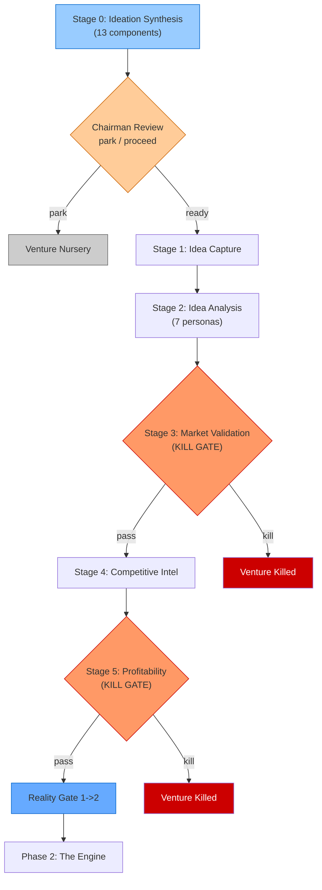

## Table of Contents

- [Phase Purpose](#phase-purpose)
- [Phase Flow](#phase-flow)
- [Mermaid Diagram](#mermaid-diagram)
- [Stage 0: Ideation Synthesis (Pre-Lifecycle)](#stage-0-ideation-synthesis-pre-lifecycle)
  - [Purpose](#purpose)
  - [Entry Paths](#entry-paths)
  - [13 Synthesis Components](#13-synthesis-components)
  - [Outputs](#outputs)
  - [Chairman Review](#chairman-review)
  - [Data Flow to Stage 1](#data-flow-to-stage-1)
  - [File References](#file-references)
- [Stage 1: Idea Capture](#stage-1-idea-capture)
  - [Purpose](#purpose)
  - [Required Inputs (from Stage 0)](#required-inputs-from-stage-0)
  - [Output Schema](#output-schema)
  - [Generated Artifacts](#generated-artifacts)
  - [Derived Fields](#derived-fields)
  - [Template Hooks](#template-hooks)
  - [Validation Rules](#validation-rules)
  - [Chairman Interaction](#chairman-interaction)
  - [Integration Points](#integration-points)
  - [For AI Agents](#for-ai-agents)
- [Stage 2: Idea Analysis (MoA Multi-Persona)](#stage-2-idea-analysis-moa-multi-persona)
  - [Purpose](#purpose)
  - [Seven Personas](#seven-personas)
  - [Required Inputs (from Stage 1)](#required-inputs-from-stage-1)
  - [Output Schema](#output-schema)
  - [Generated Artifacts](#generated-artifacts)
  - [Derived Fields](#derived-fields)
  - [Cross-Stage Contract Validation](#cross-stage-contract-validation)
  - [Chairman Interaction](#chairman-interaction)
  - [Integration Points](#integration-points)
  - [For AI Agents](#for-ai-agents)
- [Stage 3: Market Validation](#stage-3-market-validation)
  - [Purpose](#purpose)
  - [Required Inputs](#required-inputs)
  - [Kill Gate Rules](#kill-gate-rules)
  - [Generated Artifacts](#generated-artifacts)
  - [Derived Fields](#derived-fields)
  - [Validation Rules](#validation-rules)
  - [Chairman Interaction](#chairman-interaction)
  - [Integration Points](#integration-points)
  - [For AI Agents](#for-ai-agents)
- [Stage 4: Competitive Intel](#stage-4-competitive-intel)
  - [Purpose](#purpose)
  - [Required Inputs](#required-inputs)
  - [Generated Artifacts](#generated-artifacts)
  - [Derived Fields](#derived-fields)
  - [Validation Rules](#validation-rules)
  - [Chairman Interaction](#chairman-interaction)
  - [Integration Points](#integration-points)
  - [For AI Agents](#for-ai-agents)
- [Stage 5: Profitability](#stage-5-profitability)
  - [Purpose](#purpose)
  - [Required Inputs](#required-inputs)
  - [Kill Gate Rules](#kill-gate-rules)
  - [Generated Artifacts](#generated-artifacts)
  - [Derived Fields](#derived-fields)
  - [Formulas](#formulas)
  - [Token Budget Profile Selection](#token-budget-profile-selection)
  - [Reality Gate (Phase 1 to 2 Boundary)](#reality-gate-phase-1-to-2-boundary)
  - [Chairman Interaction](#chairman-interaction)
  - [Integration Points](#integration-points)
  - [For AI Agents](#for-ai-agents)
- [Phase Exit Criteria](#phase-exit-criteria)
- [Key Thresholds Summary](#key-thresholds-summary)
- [File References](#file-references)

---
Category: Guide
Status: Approved
Version: 2.0.0
Author: DOCMON Sub-Agent
Last Updated: 2026-02-25
Tags: [cli-venture-lifecycle, eva, stages, phase-1, the-truth, stage-zero]
Related SDs: [SD-LEO-ORCH-CLI-VENTURE-LIFECYCLE-001]
---

# Phase 1: The Truth -- Stage 0 (Pre-Lifecycle) + Stages 1-5

## Phase Purpose

Validate the idea before investing significant resources. This phase answers the question: **"Is this idea worth pursuing? Does the market want it? Can we make money?"**

Every venture begins at Stage 0 (ideation synthesis), which feeds into the formal 25-stage lifecycle starting at Stage 1. If a venture cannot survive The Truth, it should not consume resources in later phases. Two kill gates (Stages 3 and 5) provide deterministic termination points. A Reality Gate at the 5-to-6 boundary validates that all five Truth-phase artifacts exist before the venture advances.

## Phase Flow

```
 STAGE 0 (Pre-Lifecycle)
 ========================
 +-------------------+     +-------------------+     +-------------------+
 |   ENTRY PATH      |---->|   SYNTHESIS        |---->|   CHAIRMAN REVIEW |
 |   discovery /     |     |   13 components    |     |   park / proceed  |
 |   competitor /    |     |   (LLM-driven)     |     |   maturity assess |
 |   chairman-direct |     +-------------------+     +--------+----------+
 +-------------------+                                  PARK   |  READY
                                                        (nursery) |
                                                               v
                          PHASE 1: THE TRUTH
 ================================================================

 +-------------------+     +-------------------+
 |   STAGE 1         |     |   STAGE 2         |
 |   Idea Capture    |---->|   Idea Analysis   |
 |   (artifact_only) |     |   (automated_chk) |
 +-------------------+     +-------------------+
                                    |
                                    v
                          +-------------------+
                          |   STAGE 3         |
                          |   Market Valid.   |
                          |   (decision_gate) |
                          +--------+----------+
                            KILL   |   PASS
                            GATE   |
                                   v
 +-------------------+     +-------------------+
 |   STAGE 5         |<----|   STAGE 4         |
 |   Profitability   |     |   Competitive     |
 |   (decision_gate) |     |   Intel           |
 +--------+----------+     |   (artifact_only) |
   KILL   |   PASS         +-------------------+
   GATE   |
          v
  REALITY GATE (Phase 1 -> 2)
  ============================
  Validates: Stages 1-5 artifacts
```

## Mermaid Diagram



---

## Stage 0: Ideation Synthesis (Pre-Lifecycle)

| Property | Value |
|----------|-------|
| Implementation | `lib/eva/stage-zero/` (15+ files) |
| CLI Entry | `node scripts/eva-venture-new.js` |
| Stage Type | pre-lifecycle |
| Gate Type | Chairman Review (park/proceed) |

### Purpose

Stage 0 is the ideation engine that feeds into the formal 25-stage lifecycle. It transforms raw inputs (chairman ideas, market signals, competitor data) into a structured venture brief through 13 synthesis components.

### Entry Paths

| Path | CLI Flag | Purpose |
|------|----------|---------|
| Discovery | `--path discovery --strategy trend_scanner` | AI-driven opportunity detection |
| Competitor Teardown | `--path competitor --url <URL>` | Deconstruct a competitor to find gaps |
| Chairman Direct | `--path chairman --idea "..."` | Chairman provides the idea directly |

### 13 Synthesis Components

Each component enriches the venture brief via LLM analysis:

1. **Cross-Reference** -- Checks venture against intellectual capital + outcome history + domain knowledge
2. **Problem Reframing** -- Reframes the problem from multiple angles
3. **Archetype Classification** -- Maps to venture archetype (marketplace, SaaS, etc.)
4. **Portfolio Evaluation** -- Evaluates fit within EHG portfolio
5. **Moat Architecture** -- Identifies defensibility strategy
6. **Time Horizon** -- Classifies build timeline
7. **Build Cost Estimation** -- Estimates implementation cost
8. **Narrative Risk** -- Identifies storytelling/positioning risks
9. **Attention Capital** -- Evaluates attention acquisition strategy
10. **Tech Trajectory** -- Assesses technology trend alignment
11. **Design Evaluation** -- Evaluates UX/design differentiation potential
12. **Virality Assessment** -- Scores organic growth potential
13. **Chairman Constraints** -- Validates against chairman preferences

### Outputs

- **ventures table** -- New venture record with `current_lifecycle_stage: 1`, `company_id` (defaults to EHG)
- **venture_artifacts** -- Stage 0 artifact (`lifecycle_stage: 0`, `artifact_type: 'stage_0_analysis'`)
- **venture_briefs** -- Detailed brief record with all synthesis fields
- **ventures.metadata.stage_zero** -- Synthesis data embedded in venture metadata (fallback for Stage 1)

### Chairman Review

The chairman review assesses venture maturity:

| Maturity | Decision | Action |
|----------|----------|--------|
| `ready` | Proceed | Create venture at Stage 1 |
| `seed` / `sprout` | Proceed (early) | Create venture with maturity flag |
| `nursery` | Park | Route to Venture Nursery with review schedule (90d) |
| `blocked` | Park | Route to Venture Nursery with review schedule (30d) |

### Data Flow to Stage 1

Stage 1 consumes Stage 0 output through three resolution paths (in order):
1. `venture_artifacts` where `lifecycle_stage = 0` (primary)
2. `ventures.metadata.stage_zero` (fallback)
3. Direct brief data passed through execution context

### File References

| Component | Path |
|-----------|------|
| Entry paths | `lib/eva/stage-zero/paths/discovery-mode.js`, `competitor-teardown.js` |
| Synthesis pipeline | `lib/eva/stage-zero/synthesis/index.js` (orchestrator) |
| Chairman review | `lib/eva/stage-zero/chairman-review.js` |
| Venture nursery | `lib/eva/stage-zero/venture-nursery.js` |
| Interfaces/contracts | `lib/eva/stage-zero/interfaces.js` |

---

## Stage 1: Idea Capture

| Property | Value |
|----------|-------|
| Template | `lib/eva/stage-templates/stage-01.js` |
| Analysis Step | `lib/eva/stage-templates/analysis-steps/stage-01-hydration.js` |
| Slug | `idea-capture` |
| Stage Type | artifact_only |
| Gate Type | None |
| Version | 2.0.0 |

### Purpose

Hydrates a structured venture idea from Stage 0 synthesis data via LLM. Transforms raw synthesis into validated fields with provenance tracking. This is the venture's origin document within the formal lifecycle.

### Required Inputs (from Stage 0)

| Field | Type | Constraint |
|-------|------|------------|
| `synthesis` | object | Stage 0 synthesis data (aliased from `stage0Data`) |
| `ventureName` | string | Venture identifier |

### Output Schema

| Field | Type | Constraint | Required |
|-------|------|------------|----------|
| `description` | string | minLength: 50 | Yes |
| `problemStatement` | string | minLength: 20 | Yes |
| `valueProp` | string | minLength: 20 | Yes |
| `targetMarket` | string | minLength: 10 | Yes |
| `archetype` | enum | marketplace, saas, content, services, hardware, hybrid, other | Yes |
| `keyAssumptions` | array of strings | minItems: 1 | Yes |
| `moatStrategy` | string | minLength: 10 | No |
| `successCriteria` | array of strings | | No |

### Generated Artifacts

- **stage_1_analysis** -- Hydrated idea record stored in `venture_artifacts`

### Derived Fields

| Field | Formula |
|-------|---------|
| `sourceProvenance` | Object tracking which fields came from Stage 0 synthesis vs LLM generation |

### Template Hooks

- **`onBeforeAnalysis`** -- Recommends templates from similar ventures before hydration runs

### Validation Rules

- `description` must be a string with at least 50 characters
- `problemStatement` must be a string with at least 20 characters
- `valueProp` must be a string with at least 20 characters
- `targetMarket` must be a string with at least 10 characters
- `archetype` must be one of the defined enum values
- `keyAssumptions` must be a non-empty array of strings

### Chairman Interaction

Advisory only -- no automated gate. The Chairman reviews the hydrated idea before Stage 2 begins.

### Integration Points

- Consumes Stage 0 synthesis via `venture_artifacts` (lifecycle_stage=0) or `ventures.metadata.stage_zero`
- Stage 1 data flows forward to Stages 2, 3, 4, 5 and Stage 25 (drift detection)
- `description`, `targetMarket`, `problemStatement` provide context for Stage 2's multi-persona analysis
- `keyAssumptions` baseline feeds Assumptions vs Reality tracking

### For AI Agents

**When to invoke**: After Stage 0 creates a venture. Stage 1 is the first formal lifecycle stage.

**What to check**: Stage 0 artifact must exist with synthesis data. All 6 required fields must meet constraints.

**What to produce**: A JSON object with all required fields. The analysis step calls the LLM to hydrate from synthesis.

**How to validate**: Call `TEMPLATE.validate(data)`. If `valid === false`, the `errors` array describes failures.

---

## Stage 2: Idea Analysis (MoA Multi-Persona)

| Property | Value |
|----------|-------|
| Template | `lib/eva/stage-templates/stage-02.js` |
| Analysis Step | `lib/eva/stage-templates/analysis-steps/stage-02-multi-persona.js` |
| Slug | `idea-validation` |
| Stage Type | automated_check |
| Gate Type | None |
| Version | 2.0.0 |

### Purpose

Runs a Mixture-of-Agents (MoA) multi-persona analysis on the Stage 1 idea. Seven personas evaluate the venture from different perspectives, each producing a 0-100 score aligned 1:1 with Stage 3's kill gate metrics. Includes Four Buckets epistemic classification.

### Seven Personas

| Persona | Stage 3 Metric | Focus Area |
|---------|---------------|------------|
| Market Strategist | `marketFit` | Market size, timing, product-market fit signals |
| Customer Advocate | `customerNeed` | Pain severity, willingness to pay, frequency of need |
| Growth Hacker | `momentum` | Virality potential, distribution channels, traction signals |
| Revenue Analyst | `revenuePotential` | Monetization model, pricing power, revenue ceiling |
| Moat Architect | `competitiveBarrier` | Defensibility, network effects, switching costs, IP |
| Operations Realist | `executionFeasibility` | Technical complexity, resource requirements, time to market |
| Product Designer | `designQuality` | UX clarity, interaction simplicity, design differentiation |

### Required Inputs (from Stage 1)

| Field | Type | Constraint |
|-------|------|------------|
| `stage1Data.description` | string | Required |
| `stage1Data.valueProp` | string | Used in persona prompts |
| `stage1Data.targetMarket` | string | Used in persona prompts |
| `stage1Data.problemStatement` | string | Used in persona prompts |

### Output Schema

| Field | Type | Description |
|-------|------|-------------|
| `analysis.strategic` | string (min 20) | Market Strategist + Revenue Analyst perspective synthesis |
| `analysis.technical` | string (min 20) | Operations Realist + Moat Architect perspective synthesis |
| `analysis.tactical` | string (min 20) | Growth Hacker + Customer Advocate + Product Designer synthesis |
| `metrics.marketFit` | integer 0-100 | From Market Strategist |
| `metrics.customerNeed` | integer 0-100 | From Customer Advocate |
| `metrics.momentum` | integer 0-100 | From Growth Hacker |
| `metrics.revenuePotential` | integer 0-100 | From Revenue Analyst |
| `metrics.competitiveBarrier` | integer 0-100 | From Moat Architect |
| `metrics.executionFeasibility` | integer 0-100 | From Operations Realist |
| `metrics.designQuality` | integer 0-100 | From Product Designer |
| `evidence.market` | string | Market Strategist evidence summary |
| `evidence.customer` | string | Customer Advocate evidence summary |
| `evidence.competitive` | string | Moat Architect evidence summary |
| `evidence.execution` | string | Operations Realist evidence summary |
| `evidence.design` | string | Product Designer evidence summary |
| `suggestions` | array | Optional improvement suggestions (type: immediate/strategic) |
| `critiques` | array | Raw persona outputs preserved for downstream use |
| `fourBuckets` | object | Epistemic classifications (fact/assumption/simulation/unknown) |

### Generated Artifacts

- **stage_2_analysis** -- Multi-persona analysis with 7 metric scores, evidence, and epistemic classification

### Derived Fields

| Field | Formula |
|-------|---------|
| `compositeScore` | `Math.round(sum_of_7_metrics / 7)` |

### Cross-Stage Contract Validation

Stage 2's `validate()` checks Stage 1 upstream data:
- `stage01.description` (min 50 chars)
- `stage01.problemStatement` (min 20 chars)
- `stage01.valueProp` (min 20 chars)
- `stage01.targetMarket` (min 10 chars)
- `stage01.archetype` (string)

### Chairman Interaction

The composite score and per-metric breakdown inform the Chairman's decision but do not gate progression. A low composite score is a signal, not a blocker.

### Integration Points

- Consumes Stage 1 data (description, valueProp, targetMarket, problemStatement)
- 7 metric scores flow directly to Stage 3 (Market Validation Kill Gate) as input
- Evidence domains feed into Stage 6 (Risk Matrix)
- Four Buckets classifications feed epistemic tracking

### For AI Agents

**When to invoke**: After Stage 1 artifact is persisted.

**What to check**: Stage 1 data must have `description` field. All 7 metrics must be integers 0-100.

**What to produce**: The analysis step runs 7 sequential LLM calls (one per persona) and transforms outputs into the template schema.

**How to validate**: Call `TEMPLATE.validate(data)` to check the structured output, then `TEMPLATE.computeDerived(data)` to get the composite score.

**Performance note**: 7 sequential Gemini calls take ~5-6 minutes total. Each call uses `max_tokens: 4000` and `timeout: 120000ms`.

---

## Stage 3: Market Validation

| Property | Value |
|----------|-------|
| Template | `lib/eva/stage-templates/stage-03.js` (133 lines) |
| Slug | `validation` |
| Stage Type | decision_gate |
| Gate Type | **KILL GATE** |
| Version | 1.0.0 |

### Purpose

Six-metric validation rubric with deterministic kill gate enforcement. This is the first point where a venture can be terminated.

### Required Inputs

| Field | Type | Constraint |
|-------|------|------------|
| `marketFit` | integer | 0-100 |
| `customerNeed` | integer | 0-100 |
| `momentum` | integer | 0-100 |
| `revenuePotential` | integer | 0-100 |
| `competitiveBarrier` | integer | 0-100 |
| `executionFeasibility` | integer | 0-100 |

### Kill Gate Rules

The kill gate is evaluated by the exported `evaluateKillGate()` function. Kill triggers:

| Condition | Threshold | Effect |
|-----------|-----------|--------|
| `overallScore < 70` | OVERALL_THRESHOLD = 70 | Kill: overall score too low |
| Any single metric < 40 | METRIC_THRESHOLD = 40 | Kill: critical weakness detected |

The `overallScore` is the rounded average of all six metrics.

### Generated Artifacts

- **validation_report** -- Six-metric scores with kill gate decision

### Derived Fields

| Field | Formula |
|-------|---------|
| `overallScore` | `Math.round(sum_of_6_metrics / 6)` |
| `decision` | `'pass'` or `'kill'` |
| `blockProgression` | `true` if decision is kill |
| `reasons` | Array of objects describing each failed threshold |

### Validation Rules

All six metrics must be integers between 0 and 100. No exceptions.

### Chairman Interaction

**Advisory Checkpoint.** When the kill gate fires, the Chairman must decide:
1. **Kill** -- Terminate the venture
2. **Revise** -- Send back for rework (modify metrics after additional research)
3. **Proceed** -- Override the kill gate with justification

The Devil's Advocate review runs at this gate.

### Integration Points

- Receives context from Stages 1 and 2
- Kill gate decision flows to the Eva Orchestrator for venture state management
- The six metrics provide baseline data for Stage 25 (Venture Review) drift analysis

### For AI Agents

**When to invoke**: After Stage 2 AI Review produces sufficient analysis.

**What to check**: All six metrics must be provided as integers 0-100. Missing or out-of-range values fail validation.

**What to produce**: Six metric scores. The template computes everything else via `computeDerived()`.

**How to validate**: Call `validate(data)` first, then `computeDerived(data)`. Check `decision` field for `'pass'` or `'kill'`.

---

## Stage 4: Competitive Intel

| Property | Value |
|----------|-------|
| Template | `lib/eva/stage-templates/stage-04.js` (115 lines) |
| Slug | `competitive-intel` |
| Stage Type | artifact_only |
| Gate Type | None |
| Version | 1.0.0 |

### Purpose

Captures competitor cards with positioning, threat level, strengths/weaknesses, and SWOT analysis per competitor. This stage uses the `CompetitiveIntelligenceService` from `lib/eva/services/competitive-intelligence.js`.

### Required Inputs

| Field | Type | Constraint |
|-------|------|------------|
| `competitors` | array | minItems: 1 |
| `competitors[].name` | string | required, unique (case-insensitive) |
| `competitors[].position` | string | required |
| `competitors[].threat` | enum | `'H'`, `'M'`, `'L'` |
| `competitors[].strengths` | array of strings | minItems: 1 |
| `competitors[].weaknesses` | array of strings | minItems: 1 |
| `competitors[].swot.strengths` | array of strings | minItems: 1 |
| `competitors[].swot.weaknesses` | array of strings | minItems: 1 |
| `competitors[].swot.opportunities` | array of strings | minItems: 1 |
| `competitors[].swot.threats` | array of strings | minItems: 1 |

### Generated Artifacts

- **competitive_analysis** -- Structured competitor landscape with SWOT per competitor

### Derived Fields

None. Stage 4 is a pure input stage.

### Validation Rules

- At least one competitor required
- Duplicate competitor names (case-insensitive) are rejected with an error indicating both indices
- Each competitor must have a full SWOT breakdown (4 sections, each with at least one item)
- Threat levels must be exactly `'H'`, `'M'`, or `'L'`

### Chairman Interaction

No automated checkpoint. The competitive analysis informs Chairman decisions in subsequent stages.

### Integration Points

- `CompetitiveIntelligenceService` at `lib/eva/services/competitive-intelligence.js` provides automated data gathering
- Competitive barriers feed into Stage 3 metrics and Stage 6 risk identification
- SWOT data supports Stage 9 (Exit Strategy) acquirer identification

### For AI Agents

**When to invoke**: After Stage 3 passes (or Chairman overrides kill gate). Can run in parallel with other post-validation work.

**What to check**: No duplicate competitor names. Every competitor needs a full SWOT object.

**What to produce**: Array of competitor cards with all required fields including nested SWOT.

**How to validate**: Call `validate(data)`. Pay attention to duplicate name errors -- the validator catches case-insensitive duplicates.

---

## Stage 5: Profitability

| Property | Value |
|----------|-------|
| Template | `lib/eva/stage-templates/stage-05.js` (193 lines) |
| Slug | `profitability` |
| Stage Type | decision_gate |
| Gate Type | **KILL GATE** + **REALITY GATE** (Phase 1 to 2 boundary) |
| Version | 1.0.0 |

### Purpose

Three-year financial model with break-even calculation, ROI threshold, and deterministic kill gate enforcement. This is the final checkpoint before the venture advances out of The Truth phase.

### Required Inputs

| Field | Type | Constraint |
|-------|------|------------|
| `initialInvestment` | number | min: 0.01 |
| `year1.revenue` | number | min: 0 |
| `year1.cogs` | number | min: 0 |
| `year1.opex` | number | min: 0 |
| `year2.revenue` | number | min: 0 |
| `year2.cogs` | number | min: 0 |
| `year2.opex` | number | min: 0 |
| `year3.revenue` | number | min: 0 |
| `year3.cogs` | number | min: 0 |
| `year3.opex` | number | min: 0 |

### Kill Gate Rules

The kill gate is evaluated by the exported `evaluateKillGate()` function. Kill triggers:

| Condition | Threshold | Effect |
|-----------|-----------|--------|
| `roi3y < 0.5` | ROI_THRESHOLD = 0.5 (50%) | Kill: insufficient 3-year ROI |
| `breakEvenMonth === null` | -- | Kill: Year 1 net profit is non-positive |
| `breakEvenMonth > 24` | MAX_BREAKEVEN_MONTHS = 24 | Kill: break-even too late |

### Generated Artifacts

- **financial_model** -- Three-year P&L with break-even and ROI

### Derived Fields

| Field | Formula |
|-------|---------|
| `grossProfitY{1,2,3}` | `revenue - cogs` |
| `netProfitY{1,2,3}` | `grossProfit - opex` |
| `breakEvenMonth` | `ceil(initialInvestment / (netProfitY1 / 12))` or null |
| `roi3y` | `(totalNetProfit - initialInvestment) / initialInvestment` |
| `decision` | `'pass'` or `'kill'` |
| `blockProgression` | `true` if decision is kill |
| `reasons` | Array of objects describing each failed threshold |

### Formulas

```
grossProfit = revenue - cogs
netProfit = grossProfit - opex
monthlyNetProfit = netProfitY1 / 12
breakEvenMonth = ceil(initialInvestment / monthlyNetProfit)  [null if monthlyNetProfit <= 0]
roi3y = (netProfitY1 + netProfitY2 + netProfitY3 - initialInvestment) / initialInvestment
```

### Token Budget Profile Selection

At the Stage 5 boundary, the system selects a Token Budget Profile for subsequent phases:

| Profile | Budget | Condition |
|---------|--------|-----------|
| Exploratory | 75K tokens | Early-stage, high uncertainty |
| Standard | 375K tokens | Normal ventures |
| Deep | 1.5M tokens | Complex, high-value ventures |

### Reality Gate (Phase 1 to 2 Boundary)

At the Stage 5 to Stage 6 boundary, the Reality Gate validates that all five Truth-phase artifacts exist. This is a phase-level check separate from the Stage 5 kill gate.

### Chairman Interaction

**Advisory Checkpoint.** The Chairman reviews financial projections and kill gate results. Devil's Advocate review runs here.

### Integration Points

- Three-year financials feed into Stage 7 (Pricing) and Stage 9 (Exit Strategy)
- ROI and break-even data inform Stage 16 (Financial Projections) in the Blueprint phase
- Kill gate exported as named function for direct invocation by the Eva Orchestrator

### For AI Agents

**When to invoke**: After Stage 4 is complete.

**What to check**: `initialInvestment` must be > 0.01. All year revenue/cogs/opex must be >= 0. Each year must be an object, not null.

**What to produce**: Initial investment amount plus three year objects with revenue, cogs, and opex.

**How to validate**: Call `validate(data)`, then `computeDerived(data)`. Check `decision` for `'pass'` or `'kill'`. If kill, inspect `reasons` for the specific threshold violations.

---

## Phase Exit Criteria

Before advancing to Phase 2 (The Engine), the following must be true:

1. Stage 1 data validated (idea captured with description, value prop, target market)
2. Stage 2 composite score computed (at least one AI critique)
3. Stage 3 kill gate passed or Chairman override with justification
4. Stage 4 competitive analysis completed (at least one competitor with SWOT)
5. Stage 5 kill gate passed or Chairman override with justification
6. Reality Gate validates all five stage artifacts exist

## Key Thresholds Summary

| Stage | Threshold | Value |
|-------|-----------|-------|
| 3 | Overall validation score | >= 70 |
| 3 | Per-metric minimum | >= 40 |
| 5 | 3-year ROI | >= 50% |
| 5 | Break-even month | <= 24 |
| 5 | Year 1 net profit | > 0 (required for break-even) |

## File References

| Component | Path |
|-----------|------|
| Stage 01 Template | `lib/eva/stage-templates/stage-01.js` |
| Stage 02 Template | `lib/eva/stage-templates/stage-02.js` |
| Stage 03 Template | `lib/eva/stage-templates/stage-03.js` |
| Stage 04 Template | `lib/eva/stage-templates/stage-04.js` |
| Stage 05 Template | `lib/eva/stage-templates/stage-05.js` |
| Validation Utilities | `lib/eva/stage-templates/validation.js` |
| Competitive Intelligence Service | `lib/eva/services/competitive-intelligence.js` |
| Template Index | `lib/eva/stage-templates/index.js` |
