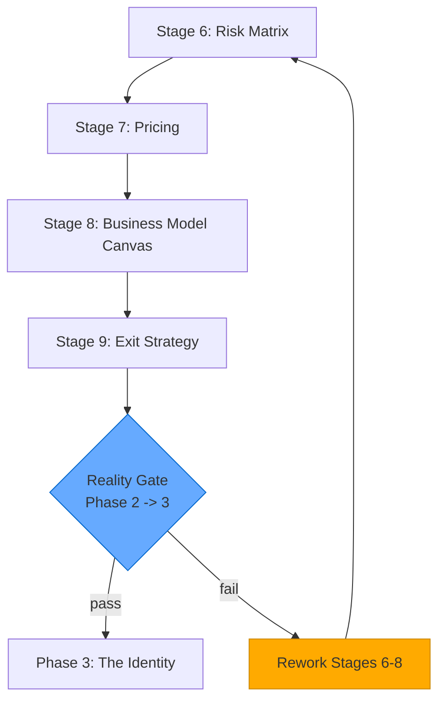

## Table of Contents

- [Phase Purpose](#phase-purpose)
- [Phase Flow](#phase-flow)
- [Mermaid Diagram](#mermaid-diagram)
- [Stage 6: Risk Matrix](#stage-6-risk-matrix)
  - [Purpose](#purpose)
  - [Required Inputs](#required-inputs)
  - [Risk Categories](#risk-categories)
  - [Generated Artifacts](#generated-artifacts)
  - [Derived Fields](#derived-fields)
  - [Validation Rules](#validation-rules)
  - [Chairman Interaction](#chairman-interaction)
  - [Integration Points](#integration-points)
  - [For AI Agents](#for-ai-agents)
- [Stage 7: Pricing](#stage-7-pricing)
  - [Purpose](#purpose)
  - [Required Inputs](#required-inputs)
  - [Generated Artifacts](#generated-artifacts)
  - [Derived Fields](#derived-fields)
  - [Unit Economics Formulas](#unit-economics-formulas)
  - [Edge Cases and Warnings](#edge-cases-and-warnings)
  - [Validation Rules](#validation-rules)
  - [Chairman Interaction](#chairman-interaction)
  - [Integration Points](#integration-points)
  - [For AI Agents](#for-ai-agents)
- [Stage 8: Business Model Canvas](#stage-8-business-model-canvas)
  - [Purpose](#purpose)
  - [Required Inputs -- The 9 BMC Blocks](#required-inputs----the-9-bmc-blocks)
  - [BMC Layout](#bmc-layout)
  - [Generated Artifacts](#generated-artifacts)
  - [Derived Fields](#derived-fields)
  - [Validation Rules](#validation-rules)
  - [Chairman Interaction](#chairman-interaction)
  - [Integration Points](#integration-points)
  - [For AI Agents](#for-ai-agents)
- [Stage 9: Exit Strategy](#stage-9-exit-strategy)
  - [Purpose](#purpose)
  - [Required Inputs](#required-inputs)
  - [Reality Gate Rules](#reality-gate-rules)
  - [Generated Artifacts](#generated-artifacts)
  - [Derived Fields](#derived-fields)
  - [Validation Rules](#validation-rules)
  - [Chairman Interaction](#chairman-interaction)
  - [Integration Points](#integration-points)
  - [For AI Agents](#for-ai-agents)
- [Phase Exit Criteria](#phase-exit-criteria)
- [Key Thresholds Summary](#key-thresholds-summary)
- [File References](#file-references)

---
Category: Guide
Status: Approved
Version: 1.0.0
Author: DOCMON Sub-Agent
Last Updated: 2026-02-08
Tags: [cli-venture-lifecycle, eva, stages, phase-2, the-engine]
Related SDs: [SD-LEO-ORCH-CLI-VENTURE-LIFECYCLE-001]
---

# Phase 2: The Engine -- Stages 6-9

## Phase Purpose

Build the business model foundation. This phase answers the question: **"How will this venture make money and sustain itself?"**

Phase 2 assumes the idea survived The Truth. Now the venture needs a risk profile, a pricing model, a complete business model canvas, and an exit strategy. No kill gates exist in this phase -- the artifacts are required but progression depends on the Reality Gate at the Stage 9 boundary.

## Phase Flow

```
                         PHASE 2: THE ENGINE
 ================================================================

 +-------------------+     +-------------------+
 |   STAGE 6         |     |   STAGE 7         |
 |   Risk Matrix     |---->|   Pricing         |
 |   (artifact_only) |     |   (artifact_only) |
 +-------------------+     +-------------------+
                                    |
                                    v
 +-------------------+     +-------------------+
 |   STAGE 9         |<----|   STAGE 8         |
 |   Exit Strategy   |     |   Business Model  |
 |   (artifact_only) |     |   Canvas          |
 +--------+----------+     |   (artifact_only) |
          |                 +-------------------+
          v
  REALITY GATE (Phase 2 -> 3)
  ============================
  Validates:
    Stage 06: >= 10 risks
    Stage 07: >= 1 tier, non-null LTV & payback
    Stage 08: all 9 BMC blocks populated
```

## Mermaid Diagram



---

## Stage 6: Risk Matrix

| Property | Value |
|----------|-------|
| Template | `lib/eva/stage-templates/stage-06.js` (126 lines) |
| Slug | `risk-matrix` |
| Stage Type | artifact_only |
| Gate Type | None |
| Version | 1.0.0 |

### Purpose

Structured risk register with category, severity, probability, impact, computed score, mitigations, and residual risk scoring. The Reality Gate at Stage 9 requires at least 10 risks to be captured.

### Required Inputs

| Field | Type | Constraint |
|-------|------|------------|
| `risks` | array | minItems: 1 |
| `risks[].id` | string | required |
| `risks[].category` | enum | `Market`, `Product`, `Technical`, `Legal/Compliance`, `Financial`, `Operational` |
| `risks[].description` | string | minLength: 10 |
| `risks[].severity` | integer | 1-5 |
| `risks[].probability` | integer | 1-5 |
| `risks[].impact` | integer | 1-5 |
| `risks[].mitigation` | string | minLength: 10 |
| `risks[].owner` | string | required |
| `risks[].status` | enum | `open`, `mitigated`, `accepted`, `closed` |
| `risks[].review_date` | string | required |
| `risks[].residual_severity` | integer | 1-5 (optional) |
| `risks[].residual_probability` | integer | 1-5 (optional) |
| `risks[].residual_impact` | integer | 1-5 (optional) |

### Risk Categories

```
Market | Product | Technical | Legal/Compliance | Financial | Operational
```

### Generated Artifacts

- **risk_matrix** -- Scored risk register with mitigation plans

### Derived Fields

| Field | Formula |
|-------|---------|
| `risks[].score` | `severity * probability * impact` |
| `risks[].residual_score` | `residual_severity * residual_probability * residual_impact` (if all three residual fields present) |

### Validation Rules

- At least one risk is required for validation to pass
- The Reality Gate at Stage 9 requires **at least 10 risks** for phase promotion
- Residual fields are optional, but if any one of `residual_severity`, `residual_probability`, or `residual_impact` is provided, all three are validated independently

### Chairman Interaction

No automated checkpoint. The risk matrix informs Chairman decisions throughout the lifecycle.

### Integration Points

- Risk categories cross-reference to Stage 8 (BMC) Cost Structure
- High-severity risks feed into Stage 13 (Product Roadmap) as constraints
- Risk scores provide input for the Devil's Advocate reviews in later gates

### For AI Agents

**When to invoke**: First stage in Phase 2, after the Phase 1 Reality Gate passes.

**What to check**: At least 1 risk for validation, but target 10+ risks to pass the Phase 2 Reality Gate. Each risk needs all required fields including a mitigation plan.

**What to produce**: Array of risk objects covering all six categories. Aim for comprehensive coverage.

**How to validate**: Call `validate(data)`, then `computeDerived(data)` to get computed scores. Note that the Reality Gate at Stage 9 enforces the 10-risk minimum, not this template's own validation.

---

## Stage 7: Pricing

| Property | Value |
|----------|-------|
| Template | `lib/eva/stage-templates/stage-07.js` (163 lines) |
| Slug | `pricing` |
| Stage Type | artifact_only |
| Gate Type | None |
| Version | 1.0.0 |

### Purpose

Pricing tier structure with unit economics (CAC, LTV, payback). Handles the zero-churn edge case by returning null derived metrics with warnings.

### Required Inputs

| Field | Type | Constraint |
|-------|------|------------|
| `currency` | string | required |
| `tiers` | array | minItems: 1 |
| `tiers[].name` | string | required |
| `tiers[].price` | number | min: 0 |
| `tiers[].billing_period` | enum | `monthly`, `quarterly`, `annual` |
| `tiers[].target_segment` | string | required |
| `tiers[].included_units` | string | optional |
| `gross_margin_pct` | number | 0-100 |
| `churn_rate_monthly` | number | 0-100 |
| `cac` | number | min: 0 |
| `arpa` | number | min: 0 |

### Generated Artifacts

- **pricing_model** -- Tiered pricing with unit economics

### Derived Fields

| Field | Formula |
|-------|---------|
| `ltv` | `(arpa * gross_margin_pct/100) / (churn_rate_monthly/100)` |
| `cac_ltv_ratio` | `cac / ltv` |
| `payback_months` | `cac / (arpa * gross_margin_pct/100)` |
| `warnings` | Array of warning objects for edge cases |

### Unit Economics Formulas

```
monthlyGrossProfit = arpa * (gross_margin_pct / 100)
churnDecimal = churn_rate_monthly / 100

LTV = monthlyGrossProfit / churnDecimal
CAC:LTV = cac / ltv
Payback Months = cac / monthlyGrossProfit
```

### Edge Cases and Warnings

| Condition | Effect |
|-----------|--------|
| `churn_rate_monthly === 0` | LTV = null, warning `churn_zero` |
| `monthlyGrossProfit === 0` | Payback = null, warning `zero_gross_profit` |
| `churn_rate_monthly > 30` | Warning `high_churn` (unusual for monthly churn) |

### Validation Rules

- At least one pricing tier required
- `gross_margin_pct` and `churn_rate_monthly` must be 0-100
- The Reality Gate at Stage 9 requires at least 1 tier with non-null LTV and payback

### Chairman Interaction

No automated checkpoint. Pricing model reviewed during Phase 3 (Identity) brand/GTM work.

### Integration Points

- LTV and CAC metrics link to Stage 8 (BMC) Revenue Streams
- Pricing tiers cross-reference Stage 11 (GTM) channel economics
- Payback months inform Stage 16 (Financial Projections) runway analysis

### For AI Agents

**When to invoke**: After Stage 6 (Risk Matrix). Pricing data depends on market understanding from Phase 1.

**What to check**: Set a non-zero churn rate to avoid null LTV. The Reality Gate requires computed LTV and payback values.

**What to produce**: Currency, tiers with billing periods, and unit economics inputs (gross margin, churn, CAC, ARPA).

**How to validate**: Call `validate(data)`, then `computeDerived(data)`. Inspect the `warnings` array for edge case signals. Ensure `ltv` and `payback_months` are not null before proceeding.

---

## Stage 8: Business Model Canvas

| Property | Value |
|----------|-------|
| Template | `lib/eva/stage-templates/stage-08.js` (112 lines) |
| Slug | `bmc` |
| Stage Type | artifact_only |
| Gate Type | None |
| Version | 1.0.0 |

### Purpose

All 9 BMC blocks with required completeness checks. Each block contains items with text, priority (1-3), and optional evidence.

### Required Inputs -- The 9 BMC Blocks

| Block | Minimum Items |
|-------|---------------|
| `customerSegments` | 2 |
| `valuePropositions` | 2 |
| `channels` | 2 |
| `customerRelationships` | 2 |
| `revenueStreams` | 2 |
| `keyResources` | 2 |
| `keyActivities` | 2 |
| `keyPartnerships` | **1** (exception) |
| `costStructure` | 2 |

Each block is an object containing an `items` array. Each item has:

| Field | Type | Constraint |
|-------|------|------------|
| `text` | string | minLength: 1 |
| `priority` | integer | 1-3 |
| `evidence` | string | optional |

### BMC Layout

```
 +------------------+------------------+------------------+
 |  Key             |  Key             |  Value           |
 |  Partnerships    |  Activities      |  Propositions    |
 |  (min: 1 item)   |  (min: 2 items)  |  (min: 2 items)  |
 +------------------+------------------+------------------+
 |  Key             |  Customer        |  Channels        |
 |  Resources       |  Relationships   |                  |
 |  (min: 2 items)  |  (min: 2 items)  |  (min: 2 items)  |
 +------------------+------------------+------------------+
 |  Cost Structure                     |  Revenue Streams |
 |  (min: 2 items)                     |  (min: 2 items)  |
 +-------------------------------------+------------------+
```

### Generated Artifacts

- **business_model_canvas** -- Complete BMC with cross-references

### Derived Fields

| Field | Value |
|-------|-------|
| `cross_links` | `[{ stage_id: 'stage-06', relationship: 'Cost Structure <-> Risk mitigations' }, { stage_id: 'stage-07', relationship: 'Revenue Streams <-> Pricing tiers' }]` |

### Validation Rules

- All 9 blocks must be present as objects
- Each block must have an `items` array meeting its minimum count
- `keyPartnerships` requires only 1 item; all others require 2
- Each item must have a text string and a priority integer (1-3)

### Chairman Interaction

No automated checkpoint. The BMC is a key input for the Chairman's exit strategy review in Stage 9.

### Integration Points

- Cost Structure cross-links to Stage 6 (Risk Matrix) mitigations
- Revenue Streams cross-links to Stage 7 (Pricing) tiers
- Customer Segments feed into Stage 11 (GTM) target market tiers
- The Reality Gate at Stage 9 checks that all 9 blocks are populated

### For AI Agents

**When to invoke**: After Stage 7 (Pricing). The BMC synthesizes insights from risks and pricing.

**What to check**: All 9 blocks present. `keyPartnerships` needs only 1 item, all others need 2. Priority values must be 1, 2, or 3.

**What to produce**: Object with 9 block keys, each containing an `items` array.

**How to validate**: Call `validate(data)`. Common failure: missing a BMC block entirely. The derived `cross_links` are added automatically by `computeDerived()`.

---

## Stage 9: Exit Strategy

| Property | Value |
|----------|-------|
| Template | `lib/eva/stage-templates/stage-09.js` (222 lines) |
| Slug | `exit-strategy` |
| Stage Type | artifact_only |
| Gate Type | **REALITY GATE** (Phase 2 to 3 boundary) |
| Version | 1.0.0 |

### Purpose

Exit thesis, time horizon, target acquirers, milestones, and Phase 2 to 3 Reality Gate evaluation. This stage computes the reality gate by evaluating prerequisites from Stages 6-8.

### Required Inputs

| Field | Type | Constraint |
|-------|------|------------|
| `exit_thesis` | string | minLength: 20 |
| `exit_horizon_months` | integer | 1-120 |
| `exit_paths` | array | minItems: 1 |
| `exit_paths[].type` | string | required |
| `exit_paths[].description` | string | required |
| `exit_paths[].probability_pct` | number | 0-100 (optional) |
| `target_acquirers` | array | minItems: 3 |
| `target_acquirers[].name` | string | required |
| `target_acquirers[].rationale` | string | required |
| `target_acquirers[].fit_score` | integer | 1-5 |
| `milestones` | array | minItems: 1 |
| `milestones[].date` | string | required |
| `milestones[].success_criteria` | string | required |

### Reality Gate Rules

The Reality Gate is evaluated by the exported `evaluateRealityGate()` function. It checks Stages 6-8 prerequisites:

| Prerequisite | Requirement | Source |
|--------------|-------------|--------|
| Stage 06 risks | >= 10 risks captured | `MIN_RISKS = 10` |
| Stage 07 tiers | >= 1 tier defined | `tiers.length >= 1` |
| Stage 07 LTV | Non-null | `ltv !== null` |
| Stage 07 payback | Non-null | `payback_months !== null` |
| Stage 08 BMC | All 9 blocks populated | Each block has items |

### Generated Artifacts

- **exit_strategy** -- Exit thesis with acquirer analysis and milestones

### Derived Fields

| Field | Source |
|-------|--------|
| `reality_gate.pass` | Boolean: all prerequisites met |
| `reality_gate.rationale` | Human-readable explanation |
| `reality_gate.blockers` | Array of strings describing failures |
| `reality_gate.required_next_actions` | Array of remediation steps |

### Validation Rules

- Exit thesis must be at least 20 characters
- Exit horizon must be 1-120 months
- At least 1 exit path with type and description
- At least 3 target acquirers (MIN_ACQUIRERS = 3), each with fit score 1-5
- At least 1 milestone with date and success criteria

### Chairman Interaction

The Chairman reviews the exit strategy and Reality Gate results. If the Reality Gate fails, the Chairman directs which stages need rework before the venture can advance to Phase 3.

### Integration Points

- `computeDerived()` accepts a `prerequisites` parameter with `{ stage06, stage07, stage08 }` data
- The Eva Orchestrator passes prerequisite data from earlier stages
- Exit strategy milestones connect to Stage 13 (Product Roadmap)
- Acquirer analysis informs Stage 16 (Financial Projections)

### For AI Agents

**When to invoke**: After Stage 8 (BMC). The exit strategy is the final Engine artifact.

**What to check**: 3+ target acquirers. 1+ exit paths. The Reality Gate check is computed automatically when prerequisites are passed to `computeDerived()`.

**What to produce**: Exit thesis, exit paths, target acquirers with rationale and fit scores, and milestones.

**How to validate**: Call `validate(data)`, then `computeDerived(data, { stage06, stage07, stage08 })`. The returned `reality_gate.pass` boolean determines whether Phase 3 is unlocked. If `pass === false`, inspect `blockers` and `required_next_actions`.

---

## Phase Exit Criteria

Before advancing to Phase 3 (The Identity), the Reality Gate at Stage 9 requires:

1. **Stage 6**: At least 10 risks captured in the risk matrix
2. **Stage 7**: At least 1 pricing tier with non-null LTV and payback months
3. **Stage 8**: All 9 BMC blocks populated with items
4. **Stage 9**: Own data validated (exit thesis, acquirers, milestones)

## Key Thresholds Summary

| Stage | Threshold | Value |
|-------|-----------|-------|
| 6 | Minimum risks for Reality Gate | 10 |
| 7 | Minimum pricing tiers | 1 |
| 7 | LTV required | non-null |
| 7 | Payback months required | non-null |
| 8 | BMC blocks required | all 9 |
| 9 | Minimum target acquirers | 3 |
| 9 | Exit horizon range | 1-120 months |

## File References

| Component | Path |
|-----------|------|
| Stage 06 Template | `lib/eva/stage-templates/stage-06.js` |
| Stage 07 Template | `lib/eva/stage-templates/stage-07.js` |
| Stage 08 Template | `lib/eva/stage-templates/stage-08.js` |
| Stage 09 Template | `lib/eva/stage-templates/stage-09.js` |
| Validation Utilities | `lib/eva/stage-templates/validation.js` |
| Template Index | `lib/eva/stage-templates/index.js` |
