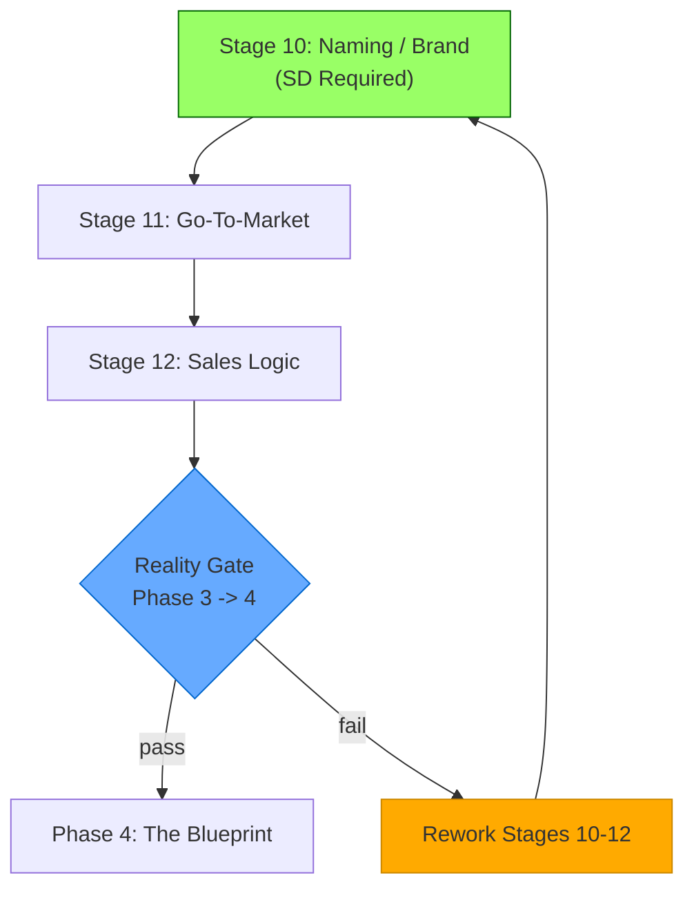

## Table of Contents

- [Phase Purpose](#phase-purpose)
- [Phase Flow](#phase-flow)
- [Mermaid Diagram](#mermaid-diagram)
- [Stage 10: Naming / Brand](#stage-10-naming-brand)
  - [Purpose](#purpose)
  - [Required Inputs](#required-inputs)
  - [Cultural Design Styles](#cultural-design-styles)
  - [Generated Artifacts](#generated-artifacts)
  - [Derived Fields](#derived-fields)
  - [Validation Rules](#validation-rules)
  - [Chairman Interaction](#chairman-interaction)
  - [Integration Points](#integration-points)
  - [For AI Agents](#for-ai-agents)
- [Stage 11: Go-To-Market](#stage-11-go-to-market)
  - [Purpose](#purpose)
  - [Required Inputs](#required-inputs)
  - [Generated Artifacts](#generated-artifacts)
  - [Derived Fields](#derived-fields)
  - [Validation Rules](#validation-rules)
  - [Crew Tournament Integration](#crew-tournament-integration)
  - [Chairman Interaction](#chairman-interaction)
  - [Integration Points](#integration-points)
  - [For AI Agents](#for-ai-agents)
- [Stage 12: Sales Logic](#stage-12-sales-logic)
  - [Purpose](#purpose)
  - [Required Inputs](#required-inputs)
  - [Sales Models](#sales-models)
  - [Reality Gate Rules](#reality-gate-rules)
  - [Generated Artifacts](#generated-artifacts)
  - [Derived Fields](#derived-fields)
  - [Validation Rules](#validation-rules)
  - [Customer Journey Mapping](#customer-journey-mapping)
  - [Chairman Interaction](#chairman-interaction)
  - [Integration Points](#integration-points)
  - [For AI Agents](#for-ai-agents)
- [Phase Exit Criteria](#phase-exit-criteria)
- [Key Thresholds Summary](#key-thresholds-summary)
- [File References](#file-references)

---
Category: Guide
Status: Approved
Version: 1.0.0
Author: DOCMON Sub-Agent
Last Updated: 2026-02-08
Tags: [cli-venture-lifecycle, eva, stages, phase-3, the-identity]
Related SDs: [SD-LEO-ORCH-CLI-VENTURE-LIFECYCLE-001]
---

# Phase 3: The Identity -- Stages 10-12

## Phase Purpose

Establish brand, positioning, and go-to-market strategy. This phase answers the question: **"Who are we? How do we reach customers?"**

Phase 3 takes the validated business model from The Engine and gives it a face. The venture gets a name, a brand genome, a go-to-market strategy with specific channel economics, and a sales logic framework. The Reality Gate at Stage 12 validates all three stages before advancing to The Blueprint.

## Phase Flow

```
                       PHASE 3: THE IDENTITY
 ================================================================

 +-------------------+     +-------------------+
 |   STAGE 10        |     |   STAGE 11        |
 |   Naming / Brand  |---->|   Go-To-Market    |
 |   (sd_required)   |     |   (artifact_only) |
 +-------------------+     +-------------------+
                                    |
                                    v
                          +-------------------+
                          |   STAGE 12        |
                          |   Sales Logic     |
                          |   (artifact_only) |
                          +--------+----------+
                                   |
                                   v
                          REALITY GATE (Phase 3 -> 4)
                          ============================
                          Validates:
                            Stage 10: >= 5 scored candidates
                            Stage 11: exactly 3 tiers, 8 channels
                            Stage 12: >= 4 funnel stages, >= 5 journey steps
```

## Mermaid Diagram



---

## Stage 10: Naming / Brand

| Property | Value |
|----------|-------|
| Template | `lib/eva/stage-templates/stage-10.js` (172 lines) |
| Slug | `naming-brand` |
| Stage Type | sd_required |
| Gate Type | None |
| Version | 1.0.0 |

### Purpose

Brand genome inputs and naming candidates with weighted scoring. This is the first stage in the lifecycle that requires a Strategic Directive to be created in the LEO system. The BrandGenomeService at `lib/eva/services/brand-genome.js` (320 lines) supports automated brand analysis.

### Required Inputs

**Brand Genome:**

| Field | Type | Constraint |
|-------|------|------------|
| `brandGenome.archetype` | string | required |
| `brandGenome.values` | array | minItems: 1 |
| `brandGenome.tone` | string | required |
| `brandGenome.audience` | string | required |
| `brandGenome.differentiators` | array | minItems: 1 |

**Scoring Criteria:**

| Field | Type | Constraint |
|-------|------|------------|
| `scoringCriteria` | array | minItems: 1 |
| `scoringCriteria[].name` | string | required |
| `scoringCriteria[].weight` | number | 0-100 |

**Constraint**: Scoring criteria weights must sum to exactly 100.

**Candidates:**

| Field | Type | Constraint |
|-------|------|------------|
| `candidates` | array | minItems: 5 |
| `candidates[].name` | string | required |
| `candidates[].rationale` | string | required |
| `candidates[].scores` | object | required (key per scoring criterion) |

### Cultural Design Styles

The BrandGenomeService supports these cultural design styles:

| Style | Origin |
|-------|--------|
| `wabi-sabi` | Japanese aesthetic of imperfection |
| `swiss-minimal` | Swiss design school minimalism |
| `bauhaus` | German form-follows-function |
| `california-modern` | West Coast tech aesthetic |

### Generated Artifacts

- **brand_guidelines** -- Brand genome definition with naming analysis
- **cultural_design_config** -- Cultural design style selection

### Derived Fields

| Field | Formula |
|-------|---------|
| `candidates[].weighted_score` | `sum(score * weight / 100)` for each criterion, rounded to 2 decimals |
| `ranked_candidates` | Candidates sorted by `weighted_score` descending |

### Validation Rules

- Brand genome must have all 5 keys (archetype, values, tone, audience, differentiators)
- At least 5 naming candidates required (MIN_CANDIDATES = 5)
- Scoring criteria weights must sum to exactly 100 (tolerance: 0.001)
- Each candidate must have scores for every defined criterion (validated as integers 0-100)

### Chairman Interaction

The Chairman selects the winning name from the ranked candidates. While the system ranks candidates by weighted score, the final choice is a human decision.

### Integration Points

- `BrandGenomeService` at `lib/eva/services/brand-genome.js` provides automated brand analysis
- Brand identity feeds into Stage 11 (GTM) messaging and channel strategy
- Cultural design config influences Stage 14 (Technical Architecture) frontend layer decisions
- Crew Tournament integration enables multi-agent competition for brand messaging

### For AI Agents

**When to invoke**: First stage in Phase 3. This stage requires creating a Strategic Directive via `leo-create-sd.js`.

**What to check**: Weight sum must equal 100. At least 5 candidates. Every candidate must have scores for all criteria.

**What to produce**: Brand genome object, scoring criteria with weights summing to 100, and 5+ naming candidates with scores.

**How to validate**: Call `validate(data)`, then `computeDerived(data)`. Inspect `ranked_candidates` for the sorted output. The top-ranked candidate has the highest `weighted_score`.

---

## Stage 11: Go-To-Market

| Property | Value |
|----------|-------|
| Template | `lib/eva/stage-templates/stage-11.js` (162 lines) |
| Slug | `gtm` |
| Stage Type | artifact_only |
| Gate Type | None |
| Version | 1.0.0 |

### Purpose

Exactly 3 target-market tiers and exactly 8 acquisition channels. Each channel requires budget and CAC fields. Includes a launch timeline with milestones.

### Required Inputs

**Market Tiers (exactly 3):**

| Field | Type | Constraint |
|-------|------|------------|
| `tiers` | array | exactItems: 3 |
| `tiers[].name` | string | required |
| `tiers[].description` | string | required |
| `tiers[].tam` | number | min: 0 (optional) |
| `tiers[].sam` | number | min: 0 (optional) |
| `tiers[].som` | number | min: 0 (optional) |

**Acquisition Channels (exactly 8):**

| Field | Type | Constraint |
|-------|------|------------|
| `channels` | array | exactItems: 8 |
| `channels[].name` | string | required |
| `channels[].monthly_budget` | number | min: 0 |
| `channels[].expected_cac` | number | min: 0 |
| `channels[].primary_kpi` | string | required |

**Available Channel Names** (from the template's constant list):

```
Organic Search | Paid Search | Social Media | Content Marketing
Email Marketing | Partnerships | Events | Direct Sales
Referrals | PR/Media | Influencer Marketing | Community
```

**Launch Timeline:**

| Field | Type | Constraint |
|-------|------|------------|
| `launch_timeline` | array | minItems: 1 |
| `launch_timeline[].milestone` | string | required |
| `launch_timeline[].date` | string | required |
| `launch_timeline[].owner` | string | optional |

### Generated Artifacts

- **gtm_plan** -- Three-tier market strategy with 8-channel economics
- **marketing_manifest** -- Channel budget allocation and KPI framework

### Derived Fields

| Field | Formula |
|-------|---------|
| `total_monthly_budget` | Sum of all channel `monthly_budget` values |
| `avg_cac` | Average of channels with `expected_cac > 0` |

### Validation Rules

- **Exactly 3 tiers** -- Not 2, not 4. The template rejects any other count.
- **Exactly 8 channels** -- Each with name, budget, CAC, and primary KPI.
- At least 1 launch timeline milestone

### Crew Tournament Integration

Stage 11 can use the Crew Tournament system for multi-agent competition to generate brand messaging. Multiple AI agents compete to produce the best marketing copy, and the Chairman selects the winner.

### Chairman Interaction

No automated checkpoint. The GTM strategy is reviewed as part of the Phase 3 Reality Gate.

### Integration Points

- Market tiers connect to Stage 7 (Pricing) target segments
- Channel CAC values validate against Stage 7 unit economics
- Launch timeline feeds into Stage 13 (Product Roadmap)
- TAM/SAM/SOM figures inform Stage 16 (Financial Projections)

### For AI Agents

**When to invoke**: After Stage 10 (Naming/Brand). GTM depends on brand identity.

**What to check**: Exactly 3 tiers and exactly 8 channels. Not "at least" -- exactly. This is a strict count requirement.

**What to produce**: Three market tiers, eight acquisition channels with budget and CAC, and a launch timeline.

**How to validate**: Call `validate(data)`. The most common failure is providing the wrong number of tiers or channels. The template gives a clear error message with expected vs. actual counts.

---

## Stage 12: Sales Logic

| Property | Value |
|----------|-------|
| Template | `lib/eva/stage-templates/stage-12.js` (232 lines) |
| Slug | `sales-logic` |
| Stage Type | artifact_only |
| Gate Type | **REALITY GATE** (Phase 3 to 4 boundary) |
| Version | 1.0.0 |

### Purpose

Sales process definition with funnel stages, metrics, customer journey mapping, and Phase 3 to 4 Reality Gate evaluation.

### Required Inputs

| Field | Type | Constraint |
|-------|------|------------|
| `sales_model` | enum | `self-serve`, `inside-sales`, `enterprise`, `hybrid`, `marketplace`, `channel` |
| `sales_cycle_days` | number | min: 1 |
| `deal_stages` | array | minItems: 3 |
| `deal_stages[].name` | string | required |
| `deal_stages[].description` | string | required |
| `deal_stages[].avg_duration_days` | number | optional, min: 0 |
| `funnel_stages` | array | minItems: 4 |
| `funnel_stages[].name` | string | required |
| `funnel_stages[].metric` | string | required |
| `funnel_stages[].target_value` | number | min: 0 |
| `customer_journey` | array | minItems: 5 |
| `customer_journey[].step` | string | required |
| `customer_journey[].funnel_stage` | string | required |
| `customer_journey[].touchpoint` | string | required |

### Sales Models

```
self-serve | inside-sales | enterprise | hybrid | marketplace | channel
```

### Reality Gate Rules

The Reality Gate is evaluated by the exported `evaluateRealityGate()` function. It checks Stages 10-12 prerequisites:

| Prerequisite | Requirement | Source |
|--------------|-------------|--------|
| Stage 10 candidates | >= 5 naming candidates | `MIN_CANDIDATES = 5` |
| Stage 10 scores | All candidates must have weighted scores | `weighted_score !== null` |
| Stage 11 tiers | Exactly 3 | `REQUIRED_TIERS = 3` |
| Stage 11 channels | Exactly 8 | `REQUIRED_CHANNELS = 8` |
| Stage 12 funnel stages | >= 4 with metrics | `MIN_FUNNEL_STAGES = 4` |
| Stage 12 funnel metrics | All stages must have metric and target_value | Completeness check |
| Stage 12 journey steps | >= 5 mapped to funnel stages | `MIN_JOURNEY_STEPS = 5` |

### Generated Artifacts

- **sales_playbook** -- Sales model, funnel, and customer journey definition

### Derived Fields

| Field | Source |
|-------|--------|
| `reality_gate.pass` | Boolean: all prerequisites met |
| `reality_gate.rationale` | Human-readable explanation |
| `reality_gate.blockers` | Array of strings describing failures |
| `reality_gate.required_next_actions` | Array of remediation steps |

### Validation Rules

- Sales model must be one of the six enum values
- Sales cycle must be at least 1 day
- At least 3 deal stages (MIN_DEAL_STAGES = 3)
- At least 4 funnel stages (MIN_FUNNEL_STAGES = 4)
- At least 5 customer journey steps (MIN_JOURNEY_STEPS = 5)
- Each journey step must map to a funnel stage

### Customer Journey Mapping

```
 Step 1 -----> Funnel Stage -----> Touchpoint
   |
 Step 2 -----> Funnel Stage -----> Touchpoint
   |
 Step 3 -----> Funnel Stage -----> Touchpoint
   |
 Step 4 -----> Funnel Stage -----> Touchpoint
   |
 Step 5 -----> Funnel Stage -----> Touchpoint
```

Each journey step connects a customer action to a funnel stage and a specific touchpoint, creating a complete customer experience map.

### Chairman Interaction

The Chairman reviews sales logic and Reality Gate results. If the Reality Gate fails, the Chairman directs which stages need rework.

### Integration Points

- `computeDerived()` accepts a `prerequisites` parameter with `{ stage10, stage11 }` data
- Sales model selection influences Stage 15 (Resource Planning) team structure
- Funnel metrics connect to Stage 24 (Metrics & Learning) AARRR framework
- Customer journey maps to Stage 21 (Integration Testing) user flow validation

### For AI Agents

**When to invoke**: After Stage 11 (GTM). Sales logic is the final Identity artifact.

**What to check**: 3+ deal stages, 4+ funnel stages with metrics, 5+ journey steps. Sales model must be one of the six enum values.

**What to produce**: Sales model selection, deal stages, funnel stages with metrics, and customer journey steps mapped to funnel stages.

**How to validate**: Call `validate(data)`, then `computeDerived(data, { stage10, stage11 })`. The returned `reality_gate.pass` boolean determines whether Phase 4 is unlocked. If `pass === false`, inspect `blockers` for specific failures.

---

## Phase Exit Criteria

Before advancing to Phase 4 (The Blueprint), the Reality Gate at Stage 12 requires:

1. **Stage 10**: At least 5 naming candidates with computed weighted scores
2. **Stage 11**: Exactly 3 market tiers and exactly 8 acquisition channels
3. **Stage 12**: At least 4 funnel stages with metrics, at least 5 customer journey steps

## Key Thresholds Summary

| Stage | Threshold | Value |
|-------|-----------|-------|
| 10 | Minimum naming candidates | 5 |
| 10 | Scoring criteria weight sum | exactly 100 |
| 11 | Market tiers | exactly 3 |
| 11 | Acquisition channels | exactly 8 |
| 12 | Deal stages | >= 3 |
| 12 | Funnel stages | >= 4 |
| 12 | Customer journey steps | >= 5 |
| 12 | Sales model options | 6 enum values |

## File References

| Component | Path |
|-----------|------|
| Stage 10 Template | `lib/eva/stage-templates/stage-10.js` |
| Stage 11 Template | `lib/eva/stage-templates/stage-11.js` |
| Stage 12 Template | `lib/eva/stage-templates/stage-12.js` |
| BrandGenomeService | `lib/eva/services/brand-genome.js` |
| Validation Utilities | `lib/eva/stage-templates/validation.js` |
| Template Index | `lib/eva/stage-templates/index.js` |
