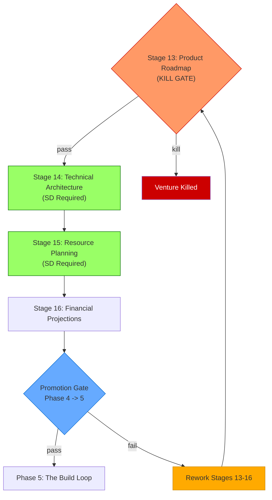

## Table of Contents

- [Phase Purpose](#phase-purpose)
- [Phase Flow](#phase-flow)
- [Mermaid Diagram](#mermaid-diagram)
- [Stage 13: Product Roadmap](#stage-13-product-roadmap)
  - [Purpose](#purpose)
  - [Required Inputs](#required-inputs)
  - [Kill Gate Rules](#kill-gate-rules)
  - [Generated Artifacts](#generated-artifacts)
  - [Derived Fields](#derived-fields)
  - [Timeline Computation](#timeline-computation)
  - [Chairman Interaction](#chairman-interaction)
  - [Integration Points](#integration-points)
  - [For AI Agents](#for-ai-agents)
- [Stage 14: Technical Architecture](#stage-14-technical-architecture)
  - [Purpose](#purpose)
  - [Required Inputs](#required-inputs)
  - [Required Architecture Layers](#required-architecture-layers)
  - [Generated Artifacts](#generated-artifacts)
  - [Derived Fields](#derived-fields)
  - [Validation Rules](#validation-rules)
  - [Chairman Interaction](#chairman-interaction)
  - [Integration Points](#integration-points)
  - [For AI Agents](#for-ai-agents)
- [Stage 15: Resource Planning](#stage-15-resource-planning)
  - [Purpose](#purpose)
  - [Required Inputs](#required-inputs)
  - [Generated Artifacts](#generated-artifacts)
  - [Derived Fields](#derived-fields)
  - [Validation Rules](#validation-rules)
  - [Chairman Interaction](#chairman-interaction)
  - [Integration Points](#integration-points)
  - [For AI Agents](#for-ai-agents)
- [Stage 16: Financial Projections](#stage-16-financial-projections)
  - [Purpose](#purpose)
  - [Required Inputs](#required-inputs)
  - [Promotion Gate Rules](#promotion-gate-rules)
  - [Generated Artifacts](#generated-artifacts)
  - [Derived Fields](#derived-fields)
  - [Break-Even Computation](#break-even-computation)
  - [Validation Rules](#validation-rules)
  - [Chairman Interaction](#chairman-interaction)
  - [Integration Points](#integration-points)
  - [For AI Agents](#for-ai-agents)
- [Phase Exit Criteria](#phase-exit-criteria)
- [Key Thresholds Summary](#key-thresholds-summary)
- [SD Requirements](#sd-requirements)
- [File References](#file-references)

---
Category: Guide
Status: Approved
Version: 1.0.0
Author: DOCMON Sub-Agent
Last Updated: 2026-02-08
Tags: [cli-venture-lifecycle, eva, stages, phase-4, the-blueprint]
Related SDs: [SD-LEO-ORCH-CLI-VENTURE-LIFECYCLE-001]
---

# Phase 4: The Blueprint -- Stages 13-16

## Phase Purpose

Technical architecture and specification before implementation. This phase answers the question: **"What exactly are we building? What's the schema?"**

Phase 4 transforms the business model and identity into a concrete technical plan. It covers the product roadmap, architecture decisions, resource allocation, and financial projections. A kill gate at Stage 13 can terminate the venture if technical feasibility is insufficient. A Promotion Gate at Stage 16 validates all Blueprint artifacts before allowing the venture to enter the Build Loop.

## Phase Flow

```
                      PHASE 4: THE BLUEPRINT
 ================================================================

 +-------------------+     +-------------------+
 |   STAGE 13        |     |   STAGE 14        |
 |   Product Roadmap |---->|   Technical Arch. |
 |   (decision_gate) |     |   (sd_required)   |
 +--------+----------+     +-------------------+
   KILL   |   PASS                  |
   GATE   |                         v
          |            +-------------------+
          |            |   STAGE 15        |
          |            |   Resource Plan   |
          |            |   (sd_required)   |
          |            +-------------------+
          |                         |
          |                         v
          |            +-------------------+
          +----------->|   STAGE 16        |
                       |   Financial Proj. |
                       |   (decision_gate) |
                       +--------+----------+
                                |
                                v
                       PROMOTION GATE (Phase 4 -> 5)
                       =============================
                       Validates:
                         Stage 13: >= 3 milestones, kill gate passed
                         Stage 14: all 4 layers defined
                         Stage 15: >= 2 members, >= 2 roles
                         Stage 16: positive capital, >= 6 month projections
```

## Mermaid Diagram



---

## Stage 13: Product Roadmap

| Property | Value |
|----------|-------|
| Template | `lib/eva/stage-templates/stage-13.js` (204 lines) |
| Slug | `product-roadmap` |
| Stage Type | decision_gate |
| Gate Type | **KILL GATE** |
| Version | 1.0.0 |

### Purpose

Product roadmap with milestones, dependencies, and timeline. The kill gate enforces roadmap completeness -- a venture without a concrete plan should not proceed to architecture.

### Required Inputs

| Field | Type | Constraint |
|-------|------|------------|
| `vision_statement` | string | minLength: 20 |
| `milestones` | array | minItems: 3 |
| `milestones[].name` | string | required |
| `milestones[].date` | string | required |
| `milestones[].deliverables` | array | minItems: 1 |
| `milestones[].dependencies` | array | optional |
| `phases` | array | minItems: 1 |
| `phases[].name` | string | required |
| `phases[].start_date` | string | required |
| `phases[].end_date` | string | required |

### Kill Gate Rules

The kill gate is evaluated by the exported `evaluateKillGate()` function. Kill triggers:

| Condition | Threshold | Effect |
|-----------|-----------|--------|
| `milestone_count < 3` | MIN_MILESTONES = 3 | Kill: insufficient milestones |
| Any milestone missing deliverables | MIN_DELIVERABLES_PER_MILESTONE = 1 | Kill: milestone has no deliverables |
| `timeline_months < 3` | MIN_TIMELINE_MONTHS = 3 | Kill: timeline too short |

### Generated Artifacts

- **tech_stack_decision** -- Product roadmap with milestone timeline

### Derived Fields

| Field | Formula |
|-------|---------|
| `timeline_months` | Computed from earliest to latest milestone date (in months, using 30.44 days/month) |
| `milestone_count` | `milestones.length` |
| `decision` | `'pass'` or `'kill'` |
| `blockProgression` | `true` if decision is kill |
| `reasons` | Array of objects describing each failed threshold |

### Timeline Computation

```
dates = milestones.map(m => new Date(m.date)).filter(valid)
timeline_months = round((max(dates) - min(dates)) / (1000 * 60 * 60 * 24 * 30.44))
```

Requires at least 2 valid dates to compute a nonzero timeline. Single-milestone roadmaps result in `timeline_months = 0`, which triggers the kill gate.

### Chairman Interaction

**Advisory Checkpoint.** The Chairman reviews the roadmap and kill gate results. Devil's Advocate review runs at this gate.

### Integration Points

- Vision statement connects to Stage 1 (Draft Idea) for drift detection at Stage 25
- Milestone deliverables map to Stage 18 (Sprint Planning) items
- Dependencies inform SD creation order in the Build Loop
- Timeline feeds into Stage 16 (Financial Projections)

### For AI Agents

**When to invoke**: First stage in Phase 4. Requires Phase 3 Reality Gate to have passed.

**What to check**: 3+ milestones, each with at least 1 deliverable. Timeline must span 3+ months. Ensure milestone dates are valid parseable dates.

**What to produce**: Vision statement, milestones with dates and deliverables, and at least one phase with start/end dates.

**How to validate**: Call `validate(data)`, then `computeDerived(data)`. Check `decision` for `'pass'` or `'kill'`. If kill, inspect `reasons` for specific failures.

---

## Stage 14: Technical Architecture

| Property | Value |
|----------|-------|
| Template | `lib/eva/stage-templates/stage-14.js` (157 lines) |
| Slug | `technical-architecture` |
| Stage Type | sd_required |
| Gate Type | None |
| Version | 1.0.0 |

### Purpose

Technical architecture definition with required stack layers (frontend, backend, data, infra) and integration points. This stage requires a Strategic Directive.

### Required Inputs

| Field | Type | Constraint |
|-------|------|------------|
| `architecture_summary` | string | minLength: 20 |
| `layers.frontend.technology` | string | required |
| `layers.frontend.components` | array | minItems: 1 |
| `layers.frontend.rationale` | string | required |
| `layers.backend.technology` | string | required |
| `layers.backend.components` | array | minItems: 1 |
| `layers.backend.rationale` | string | required |
| `layers.data.technology` | string | required |
| `layers.data.components` | array | minItems: 1 |
| `layers.data.rationale` | string | required |
| `layers.infra.technology` | string | required |
| `layers.infra.components` | array | minItems: 1 |
| `layers.infra.rationale` | string | required |
| `integration_points` | array | minItems: 1 |
| `integration_points[].name` | string | required |
| `integration_points[].source_layer` | string | required |
| `integration_points[].target_layer` | string | required |
| `integration_points[].protocol` | string | required |
| `constraints` | array | optional |

### Required Architecture Layers

```
 +------------------+    +------------------+
 |    frontend      |    |     backend      |
 |  (technology,    |    |  (technology,    |
 |   components,    |--->|   components,    |
 |   rationale)     |    |   rationale)     |
 +------------------+    +--------+---------+
                                  |
                                  v
 +------------------+    +------------------+
 |      infra       |    |      data        |
 |  (technology,    |    |  (technology,    |
 |   components,    |<---|   components,    |
 |   rationale)     |    |   rationale)     |
 +------------------+    +------------------+
```

### Generated Artifacts

- **data_model** -- Architecture layers with integration map
- **erd_diagram** -- Entity relationship diagram (via architecture analysis)

### Derived Fields

| Field | Formula |
|-------|---------|
| `layer_count` | Number of defined layers |
| `total_components` | Sum of components across all layers |
| `all_layers_defined` | `true` if all 4 required layers are present |

### Validation Rules

- All four layers (frontend, backend, data, infra) must be defined
- Each layer needs technology, at least 1 component, and a rationale
- At least 1 integration point connecting layers
- The Promotion Gate at Stage 16 checks `all_layers_defined === true`

### Chairman Interaction

No automated checkpoint. Architecture decisions are reviewed during the Promotion Gate at Stage 16.

### Integration Points

- Layer technologies drive Stage 17 (Pre-Build Checklist) tooling requirements
- Integration points map to Stage 21 (Integration Testing) test targets
- Architecture constraints feed into Stage 18 (Sprint Planning) scope decisions

### For AI Agents

**When to invoke**: After Stage 13 passes the kill gate. Architecture work requires a Strategic Directive.

**What to check**: All 4 layers defined. Each layer has technology, components, and rationale. At least 1 integration point.

**What to produce**: Architecture summary, four layer definitions, integration points, and optional constraints.

**How to validate**: Call `validate(data)`, then `computeDerived(data)`. Ensure `all_layers_defined === true` before moving forward.

---

## Stage 15: Resource Planning

| Property | Value |
|----------|-------|
| Template | `lib/eva/stage-templates/stage-15.js` (160 lines) |
| Slug | `resource-planning` |
| Stage Type | sd_required |
| Gate Type | None |
| Version | 1.0.0 |

### Purpose

Team structure, resource allocation, and skill gap analysis. This stage requires a Strategic Directive.

### Required Inputs

| Field | Type | Constraint |
|-------|------|------------|
| `team_members` | array | minItems: 2 |
| `team_members[].role` | string | required |
| `team_members[].skills` | array | minItems: 1 |
| `team_members[].allocation_pct` | number | 1-100 |
| `team_members[].cost_monthly` | number | optional, min: 0 |
| `skill_gaps` | array | optional |
| `skill_gaps[].skill` | string | required |
| `skill_gaps[].severity` | string | required |
| `skill_gaps[].mitigation` | string | required |
| `hiring_plan` | array | optional |
| `hiring_plan[].role` | string | required |
| `hiring_plan[].timeline` | string | required |
| `hiring_plan[].priority` | string | required |

### Generated Artifacts

- **user_story_pack** -- Resource allocation plan with team structure

### Derived Fields

| Field | Formula |
|-------|---------|
| `total_headcount` | `team_members.length` |
| `total_monthly_cost` | Sum of all `cost_monthly` values |
| `unique_roles` | Count of distinct role strings |
| `avg_allocation` | Average `allocation_pct` across team members |

### Validation Rules

- At least 2 team members (MIN_TEAM_MEMBERS = 2)
- At least 2 unique roles (MIN_ROLES = 2)
- Allocation percentage must be 1-100 per team member
- Each team member needs at least 1 skill listed

### Chairman Interaction

No automated checkpoint. Resource plan is reviewed during the Promotion Gate at Stage 16.

### Integration Points

- Team structure informs Stage 18 (Sprint Planning) assignee fields
- Cost data feeds into Stage 16 (Financial Projections) burn rate
- Skill gaps connect to Stage 17 (Pre-Build Checklist) team readiness category
- Hiring plan timelines align with Stage 13 (Product Roadmap) milestones

### For AI Agents

**When to invoke**: After Stage 14 (Technical Architecture). Resource needs depend on architecture decisions.

**What to check**: 2+ team members with 2+ unique roles. Allocation in valid range (1-100).

**What to produce**: Team member list with roles, skills, and allocation. Optionally: skill gaps and hiring plan.

**How to validate**: Call `validate(data)`, then `computeDerived(data)`. Common failure: all team members sharing the same role (violates 2-role minimum).

---

## Stage 16: Financial Projections

| Property | Value |
|----------|-------|
| Template | `lib/eva/stage-templates/stage-16.js` (231 lines) |
| Slug | `financial-projections` |
| Stage Type | decision_gate |
| Gate Type | **PROMOTION GATE** (Phase 4 to 5 boundary) |
| Version | 1.0.0 |

### Purpose

Financial projections with revenue/cost data, runway calculation, burn rate, break-even analysis, and Phase 4 to 5 Promotion Gate evaluation.

### Required Inputs

| Field | Type | Constraint |
|-------|------|------------|
| `initial_capital` | number | min: 0 |
| `monthly_burn_rate` | number | min: 0 |
| `revenue_projections` | array | minItems: 6 |
| `revenue_projections[].month` | number | min: 1 |
| `revenue_projections[].revenue` | number | min: 0 |
| `revenue_projections[].costs` | number | min: 0 |
| `funding_rounds` | array | optional |
| `funding_rounds[].round_name` | string | required |
| `funding_rounds[].target_amount` | number | min: 0 |
| `funding_rounds[].target_date` | string | required |

### Promotion Gate Rules

The Promotion Gate is evaluated by the exported `evaluatePromotionGate()` function. It checks Stages 13-16 prerequisites:

| Prerequisite | Requirement | Source |
|--------------|-------------|--------|
| Stage 13 milestones | >= 3 milestones | `MIN_MILESTONES = 3` |
| Stage 13 kill gate | Must have passed (decision !== 'kill') | Kill gate check |
| Stage 14 layers | All 4 layers defined (frontend, backend, data, infra) | `REQUIRED_LAYERS` array |
| Stage 15 team | >= 2 team members | `MIN_TEAM_MEMBERS = 2` |
| Stage 15 roles | >= 2 unique roles | `MIN_ROLES = 2` |
| Stage 16 capital | `initial_capital > 0` | Positive capital check |
| Stage 16 projections | >= 6 months of projections | `MIN_PROJECTION_MONTHS = 6` |

### Generated Artifacts

- **api_contract** -- Financial projections with runway analysis
- **schema_spec** -- Financial schema specification

### Derived Fields

| Field | Formula |
|-------|---------|
| `runway_months` | `initial_capital / monthly_burn_rate` (Infinity if burn=0 and capital>0) |
| `burn_rate` | Same as `monthly_burn_rate` input |
| `break_even_month` | First month where cumulative profit >= 0 |
| `total_projected_revenue` | Sum of all monthly revenue values |
| `total_projected_costs` | Sum of all monthly cost values |
| `promotion_gate` | Reality gate evaluation object |

### Break-Even Computation

```
cumulative = -initial_capital
for each month in revenue_projections:
    cumulative += (revenue - costs)
    if cumulative >= 0 and break_even_month is null:
        break_even_month = month
```

### Validation Rules

- `initial_capital` must be >= 0
- `monthly_burn_rate` must be >= 0
- At least 6 months of revenue projections (MIN_PROJECTION_MONTHS = 6)
- Each projection needs month (>= 1), revenue (>= 0), and costs (>= 0)

### Chairman Interaction

The Chairman reviews financial projections and Promotion Gate results. Devil's Advocate review runs at this gate. If the Promotion Gate fails, the Chairman directs remediation.

### Integration Points

- `computeDerived()` accepts a `prerequisites` parameter with `{ stage13, stage14, stage15 }` data
- Runway and burn rate inform token budget allocation in the Build Loop
- Financial projections provide baseline for Stage 25 (Venture Review) drift analysis
- Break-even month connects to Stage 5 (Profitability) for financial consistency

### For AI Agents

**When to invoke**: After Stage 15 (Resource Planning). Financial projections are the final Blueprint artifact.

**What to check**: Positive initial capital. 6+ months of projections. The Promotion Gate check is computed when prerequisites are passed.

**What to produce**: Initial capital, monthly burn rate, 6+ months of revenue projections, and optional funding rounds.

**How to validate**: Call `validate(data)`, then `computeDerived(data, { stage13, stage14, stage15 })`. The returned `promotion_gate.pass` boolean determines whether Phase 5 is unlocked. If `pass === false`, inspect `blockers` and `required_next_actions`.

---

## Phase Exit Criteria

Before advancing to Phase 5 (The Build Loop), the Promotion Gate at Stage 16 requires:

1. **Stage 13**: At least 3 milestones with deliverables, kill gate passed
2. **Stage 14**: All 4 architecture layers defined (frontend, backend, data, infra)
3. **Stage 15**: At least 2 team members with at least 2 unique roles
4. **Stage 16**: Positive initial capital and at least 6 months of revenue projections

## Key Thresholds Summary

| Stage | Threshold | Value |
|-------|-----------|-------|
| 13 | Minimum milestones | 3 |
| 13 | Minimum deliverables per milestone | 1 |
| 13 | Minimum timeline | 3 months |
| 14 | Required layers | frontend, backend, data, infra |
| 14 | Minimum integration points | 1 |
| 15 | Minimum team members | 2 |
| 15 | Minimum unique roles | 2 |
| 16 | Minimum projection months | 6 |
| 16 | Initial capital | > 0 |

## SD Requirements

Stages 14 and 15 require Strategic Directives. When the Eva Orchestrator reaches these stages, it creates SDs via `leo-create-sd.js` and routes implementation through the LEO Protocol (LEAD -> PLAN -> EXEC workflow).

## File References

| Component | Path |
|-----------|------|
| Stage 13 Template | `lib/eva/stage-templates/stage-13.js` |
| Stage 14 Template | `lib/eva/stage-templates/stage-14.js` |
| Stage 15 Template | `lib/eva/stage-templates/stage-15.js` |
| Stage 16 Template | `lib/eva/stage-templates/stage-16.js` |
| Validation Utilities | `lib/eva/stage-templates/validation.js` |
| Template Index | `lib/eva/stage-templates/index.js` |
