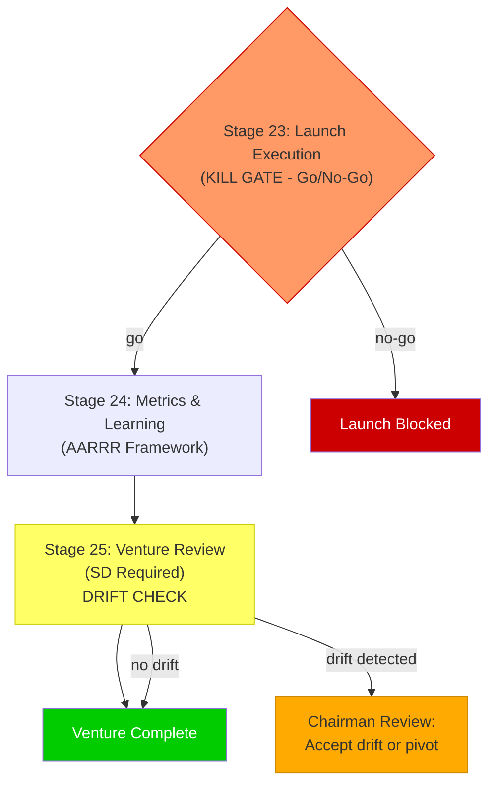

## Table of Contents

- [Phase Purpose](#phase-purpose)
- [Phase Flow](#phase-flow)
- [Mermaid Diagram](#mermaid-diagram)
- [Stage 23: Launch Execution](#stage-23-launch-execution)
  - [Purpose](#purpose)
  - [Required Inputs](#required-inputs)
  - [Kill Gate Rules](#kill-gate-rules)
  - [Go/No-Go Decision Flow](#gono-go-decision-flow)
  - [Generated Artifacts](#generated-artifacts)
  - [Derived Fields](#derived-fields)
  - [Validation Rules](#validation-rules)
  - [Chairman Interaction](#chairman-interaction)
  - [Integration Points](#integration-points)
  - [For AI Agents](#for-ai-agents)
- [Stage 24: Metrics & Learning](#stage-24-metrics-learning)
  - [Purpose](#purpose)
  - [The AARRR Framework](#the-aarrr-framework)
  - [Required Inputs](#required-inputs)
  - [Generated Artifacts](#generated-artifacts)
  - [Derived Fields](#derived-fields)
  - [Validation Rules](#validation-rules)
  - [Chairman Interaction](#chairman-interaction)
  - [Integration Points](#integration-points)
  - [For AI Agents](#for-ai-agents)
- [Stage 25: Venture Review](#stage-25-venture-review)
  - [Purpose](#purpose)
  - [Required Inputs](#required-inputs)
  - [Review Categories](#review-categories)
  - [Constraint Drift Detection](#constraint-drift-detection)
  - [Constraint Drift Integration](#constraint-drift-integration)
  - [Generated Artifacts](#generated-artifacts)
  - [Derived Fields](#derived-fields)
  - [Validation Rules](#validation-rules)
  - [Chairman Interaction](#chairman-interaction)
  - [Integration Points](#integration-points)
  - [For AI Agents](#for-ai-agents)
- [Phase Exit Criteria](#phase-exit-criteria)
- [Key Thresholds Summary](#key-thresholds-summary)
- [Drift Detection Deep Dive](#drift-detection-deep-dive)
- [File References](#file-references)

---
Category: Guide
Status: Approved
Version: 1.0.0
Author: DOCMON Sub-Agent
Last Updated: 2026-02-08
Tags: [cli-venture-lifecycle, eva, stages, phase-6, launch-and-learn]
Related SDs: [SD-LEO-ORCH-CLI-VENTURE-LIFECYCLE-001]
---

# Phase 6: Launch & Learn -- Stages 23-25

## Phase Purpose

Deploy, measure, and optimize. This phase answers the question: **"Ship it, learn from users, and improve."**

Phase 6 is the final phase of the venture lifecycle. The product is built, tested, and approved for release. Now it must survive contact with reality. Stage 23 has a Go/No-Go kill gate for launch viability. Stage 24 measures actual performance against targets using the AARRR framework. Stage 25 performs a full venture review with constraint drift detection, comparing the final state against the original Stage 1 vision.

## Phase Flow

```
                    PHASE 6: LAUNCH & LEARN
 ================================================================

 +-------------------+
 |   STAGE 23        |
 |   Launch          |
 |   Execution       |
 |   (decision_gate) |
 +--------+----------+
   KILL   |   PASS
   GATE   |
   (Go/   |
   No-Go) |
          v
 +-------------------+     +-------------------+
 |   STAGE 24        |     |   STAGE 25        |
 |   Metrics &       |---->|   Venture Review  |
 |   Learning        |     |   (sd_required)   |
 |   (artifact_only) |     |                   |
 +-------------------+     |   DRIFT CHECK     |
                            |   vs Stage 1      |
                            +-------------------+
                                     |
                                     v
                            VENTURE COMPLETE
                            or ITERATE (new cycle)
```

## Mermaid Diagram



---

## Stage 23: Launch Execution

| Property | Value |
|----------|-------|
| Template | `lib/eva/stage-templates/stage-23.js` (151 lines) |
| Slug | `launch-execution` |
| Stage Type | decision_gate |
| Gate Type | **KILL GATE** (Go/No-Go) |
| Version | 1.0.0 |

### Purpose

Launch execution with Go/No-Go kill gate. This is the final kill gate in the lifecycle. A "go" decision requires operational readiness: incident response plan, monitoring setup, and rollback plan.

### Required Inputs

| Field | Type | Constraint |
|-------|------|------------|
| `go_decision` | enum | `go`, `no-go` |
| `incident_response_plan` | string | minLength: 10 |
| `monitoring_setup` | string | minLength: 10 |
| `rollback_plan` | string | minLength: 10 |
| `launch_tasks` | array | minItems: 1 |
| `launch_tasks[].name` | string | required |
| `launch_tasks[].status` | string | required |
| `launch_tasks[].owner` | string | optional |
| `launch_date` | string | required |

### Kill Gate Rules

The kill gate is evaluated by the exported `evaluateKillGate()` function.

**When `go_decision === 'no-go'`:**
- Kill gate fires immediately with reason `no_go_decision`
- No further checks needed

**When `go_decision === 'go'`:**
- All three operational plans must be present (10+ characters each)
- Missing any plan triggers the kill gate despite the "go" decision

| Condition | Effect |
|-----------|--------|
| `go_decision !== 'go'` | Kill: decision is no-go or not set |
| `go_decision === 'go'` AND missing incident response plan | Kill: operational readiness incomplete |
| `go_decision === 'go'` AND missing monitoring setup | Kill: operational readiness incomplete |
| `go_decision === 'go'` AND missing rollback plan | Kill: operational readiness incomplete |

### Go/No-Go Decision Flow

```
 go_decision?
    |
    +-- 'no-go' --> KILL (reason: no_go_decision)
    |
    +-- 'go' --> Check operational readiness:
                   |
                   +-- incident_response_plan present?
                   +-- monitoring_setup present?
                   +-- rollback_plan present?
                   |
                   +-- All present --> PASS
                   +-- Any missing --> KILL (reason: missing_*)
```

### Generated Artifacts

- **launch_checklist** -- Go/No-Go decision with operational readiness assessment

### Derived Fields

| Field | Formula |
|-------|---------|
| `decision` | `'pass'` or `'kill'` |
| `blockProgression` | `true` if decision is kill |
| `reasons` | Array of objects describing each failure reason |

### Validation Rules

- `go_decision` must be `'go'` or `'no-go'`
- Incident response plan, monitoring setup, and rollback plan must each be at least 10 characters
- At least 1 launch task
- Launch date required

### Chairman Interaction

**Advisory Checkpoint.** The Chairman makes the Go/No-Go decision. Devil's Advocate review runs at this gate to challenge the launch readiness.

### Integration Points

- Operational plans connect to Stage 6 (Risk Matrix) mitigations
- Monitoring setup feeds into Stage 24 (Metrics & Learning)
- Rollback plan provides safety net for Stage 25 if post-launch issues arise

### For AI Agents

**When to invoke**: After Phase 5 Promotion Gate passes.

**What to check**: `go_decision` must be set. If "go", all three operational plans must be substantive (10+ chars).

**What to produce**: Go/No-Go decision, three operational plans (incident response, monitoring, rollback), launch tasks, and launch date.

**How to validate**: Call `validate(data)`, then `computeDerived(data)`. Check `decision` for `'pass'` or `'kill'`. A "go" with missing operational plans still kills.

---

## Stage 24: Metrics & Learning

| Property | Value |
|----------|-------|
| Template | `lib/eva/stage-templates/stage-24.js` (160 lines) |
| Slug | `metrics-learning` |
| Stage Type | artifact_only |
| Gate Type | None |
| Version | 1.0.0 |

### Purpose

AARRR framework metrics (Acquisition, Activation, Retention, Revenue, Referral) with trend windows, funnel definitions, and captured learnings.

### The AARRR Framework

```
 +----------------+
 | ACQUISITION    |  How do users find us?
 +-------+--------+
         |
         v
 +----------------+
 | ACTIVATION     |  Do they have a great first experience?
 +-------+--------+
         |
         v
 +----------------+
 | RETENTION      |  Do they come back?
 +-------+--------+
         |
         v
 +----------------+
 | REVENUE        |  Do they pay us?
 +-------+--------+
         |
         v
 +----------------+
 | REFERRAL       |  Do they tell others?
 +----------------+
```

### Required Inputs

**AARRR Metrics (all 5 categories required, each with at least 1 metric):**

| Field | Type | Constraint |
|-------|------|------------|
| `aarrr.acquisition` | array | minItems: 1 |
| `aarrr.activation` | array | minItems: 1 |
| `aarrr.retention` | array | minItems: 1 |
| `aarrr.revenue` | array | minItems: 1 |
| `aarrr.referral` | array | minItems: 1 |

Each metric:

| Field | Type | Constraint |
|-------|------|------------|
| `name` | string | required |
| `value` | number | min: 0 |
| `target` | number | min: 0 |
| `trend_window_days` | number | optional, min: 1 |

**Funnels:**

| Field | Type | Constraint |
|-------|------|------------|
| `funnels` | array | minItems: 1 |
| `funnels[].name` | string | required |
| `funnels[].steps` | array | minItems: 2 |

**Learnings:**

| Field | Type | Constraint |
|-------|------|------------|
| `learnings` | array | optional |
| `learnings[].insight` | string | required |
| `learnings[].action` | string | required |
| `learnings[].category` | string | optional |

### Generated Artifacts

- **analytics_dashboard** -- AARRR metrics with funnel analysis and learnings

### Derived Fields

| Field | Formula |
|-------|---------|
| `total_metrics` | Count of all metrics across all 5 categories |
| `categories_complete` | `true` if all 5 AARRR categories have metrics |
| `funnel_count` | `funnels.length` |
| `metrics_on_target` | Count of metrics where `value >= target` |
| `metrics_below_target` | Count of metrics where `value < target` |

### Validation Rules

- All 5 AARRR categories must have at least 1 metric
- Each metric needs name, value, and target
- At least 1 funnel with at least 2 steps
- Learnings are optional but if present, each needs insight and action

### Chairman Interaction

No automated checkpoint. Metrics dashboard is reviewed by the Chairman alongside the Stage 25 Venture Review.

### Integration Points

- Metrics map to Stage 12 (Sales Logic) funnel stages
- AARRR data provides input for Stage 25 (Venture Review) assumptions-vs-reality analysis
- Learnings feed into Cross-Venture Learning system at `lib/eva/cross-venture-learning.js`
- Trend windows inform optimization priorities

### For AI Agents

**When to invoke**: After Stage 23 launch passes. Metrics are collected post-launch.

**What to check**: All 5 AARRR categories must have metrics. At least 1 funnel with 2+ steps.

**What to produce**: AARRR metrics with actual values and targets, funnels, and learnings.

**How to validate**: Call `validate(data)`, then `computeDerived(data)`. Check `categories_complete === true` and review `metrics_below_target` for areas needing attention.

---

## Stage 25: Venture Review

| Property | Value |
|----------|-------|
| Template | `lib/eva/stage-templates/stage-25.js` (196 lines) |
| Slug | `venture-review` |
| Stage Type | sd_required |
| Gate Type | **DRIFT CHECK** |
| Version | 1.0.0 |

### Purpose

Final venture review with 5-category initiatives, drift detection against Stage 1 vision/constraints, and drift justification requirement. This stage closes the lifecycle loop by comparing the final state against the original idea.

### Required Inputs

| Field | Type | Constraint |
|-------|------|------------|
| `review_summary` | string | minLength: 20 |
| `initiatives` | object | all 5 categories required |
| `initiatives.product` | array | minItems: 1 |
| `initiatives.market` | array | minItems: 1 |
| `initiatives.technical` | array | minItems: 1 |
| `initiatives.financial` | array | minItems: 1 |
| `initiatives.team` | array | minItems: 1 |
| `current_vision` | string | minLength: 10 |
| `drift_justification` | string | optional |
| `next_steps` | array | minItems: 1 |
| `next_steps[].action` | string | required |
| `next_steps[].owner` | string | required |
| `next_steps[].timeline` | string | required |

Each initiative item:

| Field | Type | Constraint |
|-------|------|------------|
| `title` | string | required |
| `status` | string | required |
| `outcome` | string | required |

### Review Categories

```
 product | market | technical | financial | team
```

All five categories must have at least one initiative with title, status, and outcome.

### Constraint Drift Detection

Stage 25 includes automated drift detection by comparing the current vision to the original Stage 1 vision. The `detectDrift()` function is exported for direct use.

**How drift detection works:**

```
1. Extract words (length > 3) from original vision (Stage 1)
2. Extract words (length > 3) from current vision (Stage 25)
3. Compute word overlap ratio = matching_words / original_word_count
4. If overlap ratio < 0.3 (30%) --> drift_detected = true
```

| Overlap | Result |
|---------|--------|
| >= 30% | No drift detected ("Vision aligned") |
| < 30% | Drift detected ("Significant drift") |

**No Stage 1 data available:**
If the `prerequisites.stage01` data is not provided, drift check is skipped with `drift_detected = false`.

### Constraint Drift Integration

The constraint drift detection system at `lib/eva/constraint-drift-detector.js` provides broader drift analysis beyond simple word overlap. It compares:
- Stage 1 baseline assumptions against actual outcomes
- Financial projections (Stage 5/16) against real metrics (Stage 24)
- Market validation scores (Stage 3) against actual market performance

The Cross-Venture Learning module at `lib/eva/cross-venture-learning.js` captures patterns from completed ventures and applies them to future ventures.

### Generated Artifacts

- **optimization_roadmap** -- Next steps and improvement plan
- **assumptions_vs_reality_report** -- Drift analysis comparing original vs. actual

### Derived Fields

| Field | Formula |
|-------|---------|
| `total_initiatives` | Count across all 5 categories |
| `all_categories_reviewed` | `true` if all 5 categories have initiatives |
| `drift_detected` | Boolean from drift check |
| `drift_check` | Object with `drift_detected`, `rationale`, `original_vision`, `current_vision` |

### Validation Rules

- Review summary must be at least 20 characters
- All 5 initiative categories must have at least 1 item
- Current vision must be at least 10 characters
- At least 1 next step with action, owner, and timeline
- Drift justification is optional (but recommended when drift is detected)

### Chairman Interaction

**Final Review.** The Chairman reviews the complete venture lifecycle results:
- If drift is detected, the Chairman must decide whether to accept the drift (justified pivot) or flag it as scope creep
- If `drift_justification` is provided, it supports the Chairman's decision
- The Chairman approves next steps or initiates a new lifecycle iteration

### Integration Points

- `computeDerived()` accepts a `prerequisites` parameter with `{ stage01 }` for drift detection
- Cross-Venture Learning at `lib/eva/cross-venture-learning.js` captures lifecycle patterns
- Constraint drift detector at `lib/eva/constraint-drift-detector.js` provides detailed comparison
- Next steps may generate new SDs for optimization work
- Assumptions-vs-reality report feeds into future Stage 3 (Market Validation) improvements

### For AI Agents

**When to invoke**: After Stage 24 (Metrics & Learning) data is collected. This is the final lifecycle stage.

**What to check**: All 5 initiative categories populated. Current vision stated. Next steps defined with owners.

**What to produce**: Review summary, initiatives across all 5 categories, current vision statement, optional drift justification, and next steps.

**How to validate**: Call `validate(data)`, then `computeDerived(data, { stage01 })`. Check `drift_detected` and `drift_check.rationale`. If drift is detected and the change was intentional, provide `drift_justification`.

---

## Phase Exit Criteria

Phase 6 is the terminal phase. There is no promotion gate to a Phase 7. Instead, the venture exits the lifecycle via:

1. **Stage 23**: Go/No-Go kill gate passed (launched successfully)
2. **Stage 24**: AARRR metrics captured across all 5 categories
3. **Stage 25**: Venture review completed with all 5 initiative categories, drift check executed

Post-lifecycle options:
- **Venture Complete** -- Archive and capture learnings via Cross-Venture Learning
- **Iterate** -- Start a new lifecycle iteration (re-enter at Stage 1 or a later stage)
- **Scale** -- Expand scope, create new SDs for growth features

## Key Thresholds Summary

| Stage | Threshold | Value |
|-------|-----------|-------|
| 23 | Go decision | must be `'go'` |
| 23 | Incident response plan | >= 10 characters |
| 23 | Monitoring setup | >= 10 characters |
| 23 | Rollback plan | >= 10 characters |
| 24 | AARRR categories | all 5 required |
| 24 | Metrics per category | >= 1 |
| 24 | Funnels | >= 1 with >= 2 steps |
| 25 | Initiative categories | all 5 required |
| 25 | Drift detection threshold | < 30% word overlap = drift |
| 25 | Next steps | >= 1 |

## Drift Detection Deep Dive

```
 Stage 1 (THE TRUTH)                 Stage 25 (LAUNCH & LEARN)
 +-------------------+               +-------------------+
 | Original Vision   |               | Current Vision    |
 | "SaaS platform    |               | "Mobile-first     |
 |  for HR analytics |    COMPARE    |  employee app for |
 |  in mid-market"   |<------------>|  wellness tracking"|
 +-------------------+               +-------------------+
                                              |
                                              v
                                      Overlap < 30%?
                                       YES --> DRIFT DETECTED
                                       NO  --> Vision Aligned

 If DRIFT DETECTED:
   - drift_justification should explain why the pivot occurred
   - Chairman reviews justification
   - Cross-Venture Learning captures the pivot pattern
```

## File References

| Component | Path |
|-----------|------|
| Stage 23 Template | `lib/eva/stage-templates/stage-23.js` |
| Stage 24 Template | `lib/eva/stage-templates/stage-24.js` |
| Stage 25 Template | `lib/eva/stage-templates/stage-25.js` |
| Constraint Drift Detector | `lib/eva/constraint-drift-detector.js` |
| Cross-Venture Learning | `lib/eva/cross-venture-learning.js` |
| Validation Utilities | `lib/eva/stage-templates/validation.js` |
| Template Index | `lib/eva/stage-templates/index.js` |
