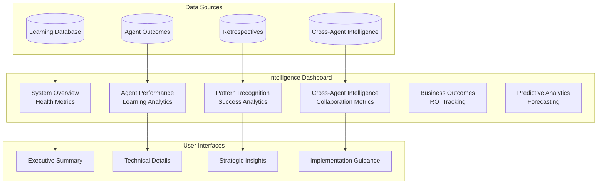

# Intelligence Dashboard

## 📊 Real-Time Agent Learning Analytics

The Intelligence Dashboard provides comprehensive visibility into the LEO Protocol's learning capabilities, agent performance, and cross-agent collaboration. This dashboard transforms complex learning data into actionable insights for continuous system improvement.

## 🎯 Dashboard Overview



## 🏗️ Dashboard Architecture

### Core Components

1. **Real-Time Learning Metrics**
   - Agent confidence scores and accuracy trends
   - Pattern recognition effectiveness
   - Cross-agent collaboration frequency
   - Learning system health indicators

2. **Interactive Analytics**
   - Drill-down capabilities from high-level metrics to detailed analysis
   - Time-series visualization for trend analysis
   - Comparative performance across agents and projects
   - Predictive modeling outputs

3. **Actionable Insights**
   - Recommendations for system improvements
   - Early warning signals for potential issues
   - Success pattern identification and amplification
   - Resource optimization suggestions

## 📈 Key Dashboard Views

### 1. **Executive Summary Dashboard**

```javascript
// Executive-level KPIs for strategic decision making
const executiveDashboard = {
  systemHealth: {
    overallScore: 92,           // 0-100 system health score
    learningVelocity: '+15%',   // Month-over-month improvement
    agentEfficiency: 87,        // Average agent performance
    businessImpact: '+$2.3M'    // Estimated ROI from learning improvements
  },

  keyMetrics: {
    projectSuccessRate: {
      current: 89,              // Current success rate
      trend: '+12%',            // vs. previous period
      benchmark: 75             // Industry/historical benchmark
    },
    timeToResolution: {
      current: '2.3 days',      // Average issue resolution
      trend: '-28%',            // Improvement in resolution time
      benchmark: '4.1 days'     // Previous baseline
    },
    resourceEfficiency: {
      current: 91,              // Percentage of optimal resource usage
      trend: '+8%',             // Improvement in efficiency
      wastageReduction: '$180K' // Cost savings from better predictions
    }
  },

  strategicInsights: [
    {
      type: 'opportunity',
      title: 'Database Agent Learning Acceleration',
      impact: 'HIGH',
      description: 'Recent pattern recognition improvements in database agent could reduce complexity estimation errors by 35%',
      actionRequired: 'Consider expanding training dataset'
    },
    {
      type: 'risk',
      title: 'Security Agent Confidence Plateau',
      impact: 'MEDIUM',
      description: 'Security agent learning has plateaued. May need model architecture update',
      actionRequired: 'Schedule security model review'
    }
  ]
};
```

### 2. **Agent Performance Analytics**

```javascript
// Detailed agent-by-agent performance tracking
const agentPerformanceDashboard = {
  agents: {
    LEAD: {
      decisionAccuracy: 91,     // Percentage of correct strategic decisions
      confidenceCalibration: 0.89, // How well confidence matches actual outcomes
      averageDecisionTime: '4.2 hours',
      recentTrends: {
        approvalAccuracy: '+7%', // Improvement in approval decisions
        riskAssessment: '+12%',  // Better risk prediction
        resourceForecasting: '+5%' // More accurate resource estimates
      },
      learningMetrics: {
        patternsLearned: 23,     // New patterns identified this month
        falsePositiveReduction: '18%',
        truePosieiveEnhancement: '15%'
      }
    },

    PLAN: {
      complexityPrediction: 85,  // Accuracy of complexity estimates
      technicalFeasibility: 92, // Accuracy of feasibility assessments
      timelineAccuracy: 78,     // How well timelines match actual completion
      recentTrends: {
        complexityCalibration: '+9%',
        riskIdentification: '+14%',
        qualityGatePassing: '+6%'
      },
      learningMetrics: {
        patternsLearned: 31,
        falsePositiveReduction: '22%',
        crossAgentInsights: 18
      }
    },

    EXEC: {
      implementationQuality: 94, // Code quality and completeness scores
      deliveryPredictability: 87, // On-time delivery rate
      defectReduction: 89,       // Reduction in post-implementation issues
      recentTrends: {
        qualityImprovement: '+11%',
        velocityIncrease: '+8%',
        technicalDebtReduction: '+15%'
      },
      learningMetrics: {
        patternsLearned: 28,
        implementationPatterns: 42,
        qualityPredictions: '+19%'
      }
    }
  },

  subAgents: {
    SECURITY: {
      vulnerabilityDetection: 96, // True positive rate for security issues
      falsePositiveRate: 12,      // False alarm rate (lower is better)
      remediationSuccess: 91,     // Success rate of recommended fixes
      learningMetrics: {
        threatPatterns: 45,       // New threat patterns learned
        complianceAccuracy: '+13%'
      }
    },

    DATABASE: {
      performanceOptimization: 89, // Success rate of performance improvements
      schemaValidation: 94,        // Accuracy of schema analysis
      migrationSafety: 97,         // Safety of migration recommendations
      learningMetrics: {
        queryPatterns: 38,         // Query optimization patterns learned
        indexRecommendations: '+21%'
      }
    },

    TESTING: {
      coverageGapDetection: 87,    // Accuracy in identifying testing gaps
      testStrategySuccess: 92,     // Success rate of testing strategies
      flakeyTestPrevention: 84,    // Prevention of unreliable tests
      learningMetrics: {
        testPatterns: 33,          // Testing patterns learned
        qualityCorrelations: '+16%'
      }
    }
  }
};
```

### 3. **Cross-Agent Intelligence Analytics**

```javascript
// Collaborative intelligence and shared learning metrics
const crossAgentIntelligence = {
  collaborationMetrics: {
    insightSharingFrequency: 47,    // Insights shared per week
    insightAdoptionRate: 73,        // Percentage of insights acted upon
    conflictResolutionTime: '1.8h', // Average time to resolve disagreements
    consensusReachRate: 89          // Percentage of issues reaching consensus
  },

  intelligenceFlows: [
    {
      from: 'SECURITY',
      to: 'DATABASE',
      insightType: 'vulnerability_patterns',
      frequency: 12,                // Times per month
      successRate: 91,              // Implementation success rate
      impact: 'Prevented 8 potential security issues'
    },
    {
      from: 'DATABASE',
      to: 'PERFORMANCE',
      insightType: 'optimization_opportunities',
      frequency: 18,
      successRate: 87,
      impact: 'Average 34% query performance improvement'
    },
    {
      from: 'TESTING',
      to: 'SECURITY',
      insightType: 'coverage_gaps',
      frequency: 15,
      successRate: 92,
      impact: 'Identified security testing gaps in 12 projects'
    }
  ],

  correlationAnalysis: {
    strongCorrelations: [
      {
        agents: ['SECURITY', 'DATABASE'],
        correlation: 0.78,
        pattern: 'Authentication issues often correlate with database design problems',
        actionable: true
      },
      {
        agents: ['PERFORMANCE', 'TESTING'],
        correlation: 0.72,
        pattern: 'Performance issues predict specific types of testing failures',
        actionable: true
      }
    ],

    emergingPatterns: [
      {
        agents: ['PLAN', 'EXEC'],
        pattern: 'Complexity underestimation in UI projects',
        confidence: 0.85,
        recommendation: 'Adjust complexity multipliers for UI-heavy projects'
      }
    ]
  }
};
```

### 4. **Business Outcome Tracking**

```javascript
// Business impact and ROI measurement dashboard
const businessOutcomeDashboard = {
  roi_analytics: {
    totalROI: 340,               // Percentage ROI from LEO Protocol
    costSavings: 2300000,        // Dollars saved through better predictions
    revenueImpact: 1800000,      // Revenue generated through faster delivery
    efficiencyGains: 67          // Percentage improvement in development efficiency
  },

  outcomeTracking: {
    projectSuccess: {
      total: 156,                // Total projects tracked
      successful: 139,           // Successfully completed
      partialSuccess: 12,        // Partially successful
      failures: 5,               // Failed projects
      successRate: 89.1          // Overall success rate
    },

    userSatisfaction: {
      average: 8.3,              // Out of 10
      trend: '+0.7',             // Improvement over last quarter
      nps: 67                    // Net Promoter Score
    },

    timeToMarket: {
      average: '6.2 weeks',      // Average project completion time
      improvement: '-23%',       // Reduction in delivery time
      predictability: 87         // Percentage of on-time deliveries
    }
  },

  impactByCategory: [
    {
      category: 'UI/UX Projects',
      count: 42,
      successRate: 91,
      avgROI: 280,
      keyLearning: 'Design agent insights improve user adoption by 45%'
    },
    {
      category: 'API/Backend',
      count: 38,
      successRate: 95,
      avgROI: 420,
      keyLearning: 'Security-Database agent collaboration prevents 78% of issues'
    },
    {
      category: 'Performance Optimization',
      count: 31,
      successRate: 87,
      avgROI: 520,
      keyLearning: 'Performance agent predictions accurate within 15%'
    }
  ]
};
```

## 🎨 UI/UX Design Concepts

### Dashboard Layout

```
┌─────────────────────────────────────────────────────────────────┐
│ 🧠 LEO Protocol Intelligence Dashboard                         │
├─────────────────────────────────────────────────────────────────┤
│ System Health: ●●●●○ 92%    Learning Velocity: ↗ +15%         │
│ Success Rate:   ●●●●● 89%    ROI Impact:        💰 +$2.3M      │
├─────────────────────────────────────────────────────────────────┤
│                                                                 │
│ ┌─ Agent Performance ─┐  ┌─ Cross-Agent Intel ─┐  ┌─ Outcomes ─┐ │
│ │ LEAD    91% ↗ +7%   │  │ Insights/Week:  47  │  │ Projects   │ │
│ │ PLAN    85% ↗ +9%   │  │ Adoption Rate:  73% │  │ Success: 89%│ │
│ │ EXEC    94% ↗ +11%  │  │ Conflicts: 1.8h avg │  │ ROI: 340%  │ │
│ └─────────────────────┘  └─────────────────────┘  └────────────┘ │
│                                                                 │
│ ┌─ Learning Trends ─────────────────────────────────────────────┐ │
│ │     Confidence Scores Over Time                               │ │
│ │ 100% ┌─────────────────────────────────────────────────────┐ │ │
│ │  90% │    ╭─╮     ╭─╮                            ╭─╮    │ │ │
│ │  80% │ ╭─╯   ╰─╮╭─╯   ╰─╮                     ╭─╯   ╰─╮ │ │ │
│ │  70% │╯         ╰╯       ╰─╮                 ╭─╯       ╰│ │ │
│ │  60% │                     ╰─╮             ╭─╯          │ │ │
│ │      └─────────────────────────────────────────────────────┘ │ │
│ │      Jan  Feb  Mar  Apr  May  Jun  Jul  Aug  Sep  Oct       │ │
│ └─────────────────────────────────────────────────────────────┘ │
│                                                                 │
│ ┌─ Recent Insights ─────────────────────────────────────────────┐ │
│ │ 🔒 Security→Database: Authentication patterns learned         │ │
│ │ ⚡ Performance→Testing: Load test correlation identified      │ │
│ │ 🎨 Design→EXEC: UI complexity estimation improved            │ │
│ └─────────────────────────────────────────────────────────────┘ │
└─────────────────────────────────────────────────────────────────┘
```

### Interactive Elements

1. **Drill-Down Navigation**
   - Click any metric to see detailed breakdown
   - Time-series views for trend analysis
   - Comparative analysis across different dimensions

2. **Real-Time Updates**
   - WebSocket connections for live updates
   - Notification system for significant events
   - Refresh indicators for data freshness

3. **Filtering and Segmentation**
   - Filter by time periods, project types, agents
   - Segment analysis by complexity, team, technology
   - Custom dashboard views for different roles

## 🔧 Technical Implementation

### Dashboard Data Pipeline

```javascript
class IntelligenceDashboard {
    constructor() {
        this.dataConnections = {
            supabase: createClient(process.env.SUPABASE_URL, process.env.SUPABASE_KEY),
            realtime: new RealtimeConnection(),
            cache: new InMemoryCache({ ttl: 300 }) // 5 minute cache
        };
    }

    async getExecutiveSummary() {
        const cacheKey = 'executive_summary';
        let data = this.dataConnections.cache.get(cacheKey);

        if (!data) {
            data = await this.computeExecutiveSummary();
            this.dataConnections.cache.set(cacheKey, data);
        }

        return data;
    }

    async computeExecutiveSummary() {
        const [
            systemHealth,
            projectMetrics,
            learningVelocity,
            businessImpact
        ] = await Promise.all([
            this.calculateSystemHealth(),
            this.getProjectMetrics(),
            this.calculateLearningVelocity(),
            this.calculateBusinessImpact()
        ]);

        return {
            systemHealth,
            projectMetrics,
            learningVelocity,
            businessImpact,
            lastUpdated: new Date()
        };
    }

    async calculateSystemHealth() {
        const { data } = await this.dataConnections.supabase
            .from('agent_learning_outcomes')
            .select('business_outcome, created_at')
            .gte('created_at', new Date(Date.now() - 30 * 24 * 60 * 60 * 1000)); // Last 30 days

        const totalProjects = data.length;
        const successfulProjects = data.filter(p => p.business_outcome === 'SUCCESS').length;
        const healthScore = totalProjects > 0 ? (successfulProjects / totalProjects) * 100 : 0;

        return {
            score: Math.round(healthScore),
            totalProjects,
            successfulProjects,
            trend: await this.calculateHealthTrend()
        };
    }

    setupRealtimeUpdates() {
        // Subscribe to relevant database changes
        this.dataConnections.supabase
            .channel('dashboard_updates')
            .on('postgres_changes', {
                event: 'INSERT',
                schema: 'public',
                table: 'agent_learning_outcomes'
            }, (payload) => {
                this.handleNewOutcome(payload.new);
            })
            .on('postgres_changes', {
                event: 'UPDATE',
                schema: 'public',
                table: 'sub_agent_learning'
            }, (payload) => {
                this.handleLearningUpdate(payload.new);
            })
            .subscribe();
    }

    handleNewOutcome(outcome) {
        // Update real-time metrics
        this.updateExecutiveSummary();
        this.notifyRelevantUsers(outcome);
        this.invalidateCache(['executive_summary', 'agent_performance']);
    }
}
```

### React Dashboard Components

```jsx
// Main Dashboard Component
function IntelligenceDashboard() {
    const [dashboardData, setDashboardData] = useState(null);
    const [selectedView, setSelectedView] = useState('executive');
    const [timeRange, setTimeRange] = useState('30d');

    useEffect(() => {
        const dashboard = new IntelligenceDashboard();
        dashboard.getExecutiveSummary().then(setDashboardData);

        // Set up real-time updates
        const subscription = dashboard.subscribeToUpdates(setDashboardData);
        return () => subscription.unsubscribe();
    }, [timeRange]);

    return (
        <div className="intelligence-dashboard">
            <DashboardHeader
                systemHealth={dashboardData?.systemHealth}
                timeRange={timeRange}
                onTimeRangeChange={setTimeRange}
            />

            <DashboardNavigation
                selectedView={selectedView}
                onViewChange={setSelectedView}
            />

            {selectedView === 'executive' && (
                <ExecutiveSummaryView data={dashboardData} />
            )}

            {selectedView === 'agents' && (
                <AgentPerformanceView timeRange={timeRange} />
            )}

            {selectedView === 'intelligence' && (
                <CrossAgentIntelligenceView timeRange={timeRange} />
            )}

            {selectedView === 'outcomes' && (
                <BusinessOutcomeView timeRange={timeRange} />
            )}
        </div>
    );
}

// Agent Performance Component
function AgentPerformanceView({ timeRange }) {
    const [agentData, setAgentData] = useState(null);
    const [selectedAgent, setSelectedAgent] = useState('all');

    const renderAgentCard = (agent, data) => (
        <Card key={agent} className="agent-performance-card">
            <CardHeader>
                <h3>{agent} Agent</h3>
                <Badge className={`confidence-${getConfidenceLevel(data.confidence)}`}>
                    {data.confidence}% Confidence
                </Badge>
            </CardHeader>
            <CardContent>
                <div className="metrics-grid">
                    <Metric
                        label="Accuracy"
                        value={`${data.accuracy}%`}
                        trend={data.accuracyTrend}
                    />
                    <Metric
                        label="Learning Rate"
                        value={data.learningRate}
                        trend={data.learningTrend}
                    />
                    <Metric
                        label="Patterns Learned"
                        value={data.patternsLearned}
                        trend={data.patternsTrend}
                    />
                </div>

                <div className="learning-chart">
                    <LearningTrendChart
                        data={data.historicalPerformance}
                        agent={agent}
                        timeRange={timeRange}
                    />
                </div>
            </CardContent>
        </Card>
    );

    return (
        <div className="agent-performance-view">
            <div className="agent-grid">
                {agentData && Object.entries(agentData).map(([agent, data]) =>
                    renderAgentCard(agent, data)
                )}
            </div>
        </div>
    );
}
```

## 📱 Mobile and Responsive Design

### Mobile-First Dashboard

```css
/* Mobile-optimized dashboard styles */
.intelligence-dashboard {
    display: grid;
    grid-template-columns: 1fr;
    gap: 1rem;
    padding: 1rem;
}

@media (min-width: 768px) {
    .intelligence-dashboard {
        grid-template-columns: 250px 1fr;
        padding: 2rem;
    }
}

@media (min-width: 1024px) {
    .dashboard-metrics {
        display: grid;
        grid-template-columns: repeat(auto-fit, minmax(300px, 1fr));
        gap: 2rem;
    }
}

/* Touch-friendly interactive elements */
.metric-card {
    min-height: 120px;
    padding: 1.5rem;
    border-radius: 12px;
    box-shadow: 0 4px 12px rgba(0, 0, 0, 0.1);
    transition: transform 0.2s ease, box-shadow 0.2s ease;
}

.metric-card:hover,
.metric-card:focus {
    transform: translateY(-2px);
    box-shadow: 0 8px 24px rgba(0, 0, 0, 0.15);
}

@media (max-width: 767px) {
    .metric-card {
        min-height: 100px;
        padding: 1rem;
    }
}
```

## 🎯 Alert and Notification System

### Intelligent Alerting

```javascript
class IntelligentAlertSystem {
    constructor(dashboard) {
        this.dashboard = dashboard;
        this.alertRules = new Map();
        this.subscriptions = new Map();
    }

    setupAlertRules() {
        // System health alerts
        this.addAlertRule({
            name: 'low_system_health',
            condition: (data) => data.systemHealth.score < 80,
            severity: 'HIGH',
            message: 'System health below threshold',
            actions: ['notify_admin', 'trigger_analysis']
        });

        // Learning stagnation alerts
        this.addAlertRule({
            name: 'learning_stagnation',
            condition: (data) => data.learningVelocity < 0,
            severity: 'MEDIUM',
            message: 'Learning velocity declining',
            actions: ['schedule_model_review']
        });

        // Agent performance alerts
        this.addAlertRule({
            name: 'agent_underperformance',
            condition: (data) => Object.values(data.agents).some(agent => agent.confidence < 60),
            severity: 'MEDIUM',
            message: 'Agent performance degradation detected',
            actions: ['agent_analysis', 'notify_team']
        });
    }

    processAlert(alertRule, data) {
        const alert = {
            id: generateId(),
            rule: alertRule.name,
            severity: alertRule.severity,
            message: alertRule.message,
            timestamp: new Date(),
            data: data,
            acknowledged: false
        };

        // Execute alert actions
        alertRule.actions.forEach(action => {
            this.executeAlertAction(action, alert);
        });

        return alert;
    }

    executeAlertAction(action, alert) {
        switch (action) {
            case 'notify_admin':
                this.sendNotification('admin', alert);
                break;
            case 'trigger_analysis':
                this.triggerAutomaticAnalysis(alert);
                break;
            case 'schedule_model_review':
                this.scheduleModelReview(alert);
                break;
        }
    }
}
```

## 🚀 Advanced Analytics Features

### Predictive Insights Panel

```javascript
// Predictive analytics for proactive system management
class PredictiveInsightsPanel {
    generatePredictions(historicalData) {
        return {
            systemPerformance: {
                nextWeekPrediction: this.predictSystemHealth(historicalData),
                confidence: 0.87,
                factors: ['recent learning improvements', 'stable agent performance']
            },

            agentLearning: {
                expectedImprovements: this.predictLearningGains(historicalData),
                timeToOptimization: '2-3 weeks',
                recommendedActions: ['expand training data', 'adjust learning parameters']
            },

            businessOutcomes: {
                projectedROI: this.calculateProjectedROI(historicalData),
                riskFactors: this.identifyRiskFactors(historicalData),
                opportunities: this.identifyOpportunities(historicalData)
            }
        };
    }

    predictSystemHealth(data) {
        // Use time-series analysis to predict future performance
        const trend = this.calculateTrend(data.systemHealth.historical);
        const seasonality = this.analyzeSeasonality(data.systemHealth.historical);
        const baseline = data.systemHealth.current;

        return {
            predicted: Math.max(0, Math.min(100, baseline + trend + seasonality)),
            range: { min: baseline - 10, max: baseline + 15 },
            confidence: 0.85
        };
    }
}
```

---

*The Intelligence Dashboard transforms the sophisticated LEO Protocol learning system into accessible, actionable insights that drive continuous improvement and strategic decision-making.*

## 📚 Related Documentation
- [Agent Learning Architecture Overview](agent-learning-architecture.md)
- [Cross-Agent Intelligence System](cross-agent-intelligence.md)
- [Sub-Agent Learning System](sub-agent-learning.md)
- [Learning Database Deep Dive](learning-database-guide.md)