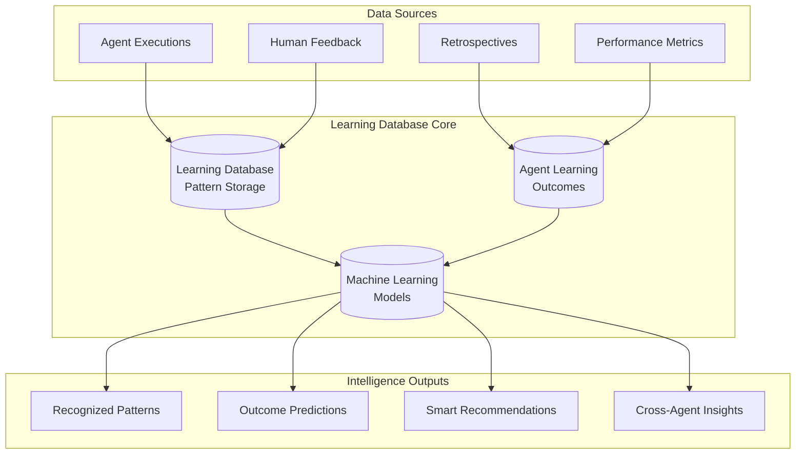

# Learning Database Deep Dive

## 🗄️ Technical Architecture for Agent Intelligence

The Learning Database serves as the foundational layer for all agent intelligence, pattern recognition, and collaborative learning within the LEO Protocol. This document provides a comprehensive technical deep dive into the database schemas, algorithms, and implementation details that power the multi-agent learning system.

## 🏗️ Database Architecture Overview

### Core Learning Infrastructure



## 📊 Core Database Schemas

### 1. **Agent Learning Outcomes** (`agent_learning_outcomes`)

The central table tracking complete workflow chains from strategic decisions through business outcomes:

```sql
CREATE TABLE agent_learning_outcomes (
    id SERIAL PRIMARY KEY,

    -- Strategic Directive Context
    sd_id VARCHAR(20) NOT NULL,
    sd_title TEXT,
    project_tags TEXT[] DEFAULT '{}',
    complexity_factors TEXT[] DEFAULT '{}',
    success_factors TEXT[] DEFAULT '{}',

    -- LEAD Decision Chain
    lead_decision TEXT,                    -- APPROVE, CONDITIONAL, REJECT, etc.
    lead_confidence INTEGER,               -- 0-100 confidence score
    lead_reasoning TEXT,                   -- Decision rationale
    lead_decision_date TIMESTAMPTZ,
    lead_strategic_assessment JSONB,       -- Structured assessment data

    -- PLAN Technical Analysis
    plan_decision TEXT,                    -- APPROVE, CONDITIONAL, REDESIGN, etc.
    plan_complexity_score INTEGER,         -- 1-10 complexity assessment
    plan_technical_feasibility TEXT,       -- HIGH, MEDIUM, LOW
    plan_implementation_risk TEXT,         -- Risk level assessment
    plan_decision_date TIMESTAMPTZ,
    plan_technical_analysis JSONB,         -- Detailed analysis results

    -- EXEC Implementation Tracking
    exec_final_quality_score INTEGER,      -- 0-100 quality score
    exec_implementation_type TEXT,         -- UI_COMPONENT, API_ENDPOINT, etc.
    exec_actual_complexity INTEGER,        -- What complexity actually was (1-10)
    exec_completion_date TIMESTAMPTZ,
    exec_implementation_metrics JSONB,     -- Performance, test coverage, etc.

    -- Business Outcome Measurement
    business_outcome TEXT,                 -- SUCCESS, PARTIAL_SUCCESS, FAILURE, etc.
    business_outcome_date TIMESTAMPTZ,
    user_satisfaction_score INTEGER,       -- 1-10 user satisfaction
    usage_adoption_rate DECIMAL(5,2),      -- % of intended users actually using feature
    business_kpi_impact DECIMAL(8,2),      -- Impact on relevant business KPIs
    roi_achieved DECIMAL(8,2),             -- ROI vs. projected ROI

    -- Learning Metadata
    created_at TIMESTAMPTZ DEFAULT NOW(),
    updated_at TIMESTAMPTZ DEFAULT NOW(),
    learning_cycle_version INTEGER DEFAULT 1,

    -- Indexes for efficient queries
    INDEX idx_agent_outcomes_sd_id (sd_id),
    INDEX idx_agent_outcomes_tags (project_tags),
    INDEX idx_agent_outcomes_outcome (business_outcome),
    INDEX idx_agent_outcomes_complexity (plan_complexity_score, exec_actual_complexity)
);
```

### 2. **Sub-Agent Learning Database** (`sub_agent_learning`)

Stores individual sub-agent pattern recognition and learning data:

```sql
CREATE TABLE sub_agent_learning (
    id SERIAL PRIMARY KEY,
    agent_type VARCHAR(50) NOT NULL,        -- SECURITY, DATABASE, TESTING, etc.

    -- Pattern Recognition
    pattern_id VARCHAR(100) NOT NULL,       -- Unique pattern identifier
    pattern_signature TEXT NOT NULL,        -- Regex or text pattern
    pattern_category VARCHAR(50),           -- FALSE_POSITIVE, TRUE_POSITIVE, etc.

    -- Learning Metrics
    confidence_score DECIMAL(4,3),          -- 0.000 to 1.000
    accuracy_rate DECIMAL(4,3),             -- Historical accuracy
    false_positive_rate DECIMAL(4,3),       -- False alarm rate
    true_positive_rate DECIMAL(4,3),        -- Correct identification rate

    -- Context and Conditions
    activation_contexts TEXT[],             -- When this pattern applies
    exclusion_contexts TEXT[],              -- When this pattern doesn't apply
    environmental_factors JSONB,            -- Additional context factors

    -- Learning Data
    total_activations INTEGER DEFAULT 0,
    successful_predictions INTEGER DEFAULT 0,
    failed_predictions INTEGER DEFAULT 0,
    last_trained TIMESTAMPTZ DEFAULT NOW(),

    -- Fix Pattern Memory
    successful_fixes JSONB DEFAULT '[]',    -- Array of successful resolution patterns
    failed_fixes JSONB DEFAULT '[]',        -- Array of failed attempts

    -- Timestamps
    created_at TIMESTAMPTZ DEFAULT NOW(),
    updated_at TIMESTAMPTZ DEFAULT NOW(),

    UNIQUE(agent_type, pattern_id),
    INDEX idx_sub_agent_learning_type (agent_type),
    INDEX idx_sub_agent_learning_pattern (pattern_signature),
    INDEX idx_sub_agent_learning_confidence (confidence_score DESC)
);
```

### 3. **Cross-Agent Intelligence** (`cross_agent_intelligence`)

Manages insights shared between agents and collective intelligence:

```sql
CREATE TABLE cross_agent_intelligence (
    id SERIAL PRIMARY KEY,

    -- Agent Communication
    from_agent VARCHAR(50) NOT NULL,
    to_agent VARCHAR(50),                   -- NULL for broadcast insights
    insight_type VARCHAR(100) NOT NULL,

    -- Insight Data
    insight_title TEXT NOT NULL,
    insight_description TEXT,
    insight_data JSONB NOT NULL,
    confidence_level DECIMAL(4,3),

    -- Correlation Data
    correlation_strength DECIMAL(4,3),      -- How strongly this correlates with outcomes
    supporting_evidence JSONB DEFAULT '[]', -- Array of supporting data points
    contradicting_evidence JSONB DEFAULT '[]',

    -- Usage Tracking
    times_applied INTEGER DEFAULT 0,
    success_rate DECIMAL(4,3),
    last_applied TIMESTAMPTZ,

    -- Metadata
    created_at TIMESTAMPTZ DEFAULT NOW(),
    expires_at TIMESTAMPTZ,                 -- Some insights may be time-sensitive
    priority_level INTEGER DEFAULT 5,       -- 1-10 priority for application

    INDEX idx_cross_agent_intel_agents (from_agent, to_agent),
    INDEX idx_cross_agent_intel_type (insight_type),
    INDEX idx_cross_agent_intel_confidence (confidence_level DESC)
);
```

### 4. **Pattern Recognition Models** (`pattern_recognition_models`)

Stores machine learning models and their performance metrics:

```sql
CREATE TABLE pattern_recognition_models (
    id SERIAL PRIMARY KEY,
    model_name VARCHAR(100) NOT NULL,
    model_version VARCHAR(20) NOT NULL,
    agent_type VARCHAR(50),

    -- Model Configuration
    model_type VARCHAR(50),                 -- BAYESIAN, NEURAL_NET, DECISION_TREE
    model_parameters JSONB NOT NULL,
    training_data_size INTEGER,

    -- Performance Metrics
    accuracy DECIMAL(6,5),
    precision_score DECIMAL(6,5),
    recall SCORE DECIMAL(6,5),
    f1_score DECIMAL(6,5),

    -- Model Lifecycle
    training_date TIMESTAMPTZ NOT NULL,
    deployment_date TIMESTAMPTZ,
    retirement_date TIMESTAMPTZ,
    status VARCHAR(20) DEFAULT 'TRAINING', -- TRAINING, DEPLOYED, RETIRED

    -- Model Files (stored as base64 or file paths)
    model_data BYTEA,                      -- Serialized model
    model_metadata JSONB,

    UNIQUE(model_name, model_version),
    INDEX idx_pattern_models_agent (agent_type),
    INDEX idx_pattern_models_status (status),
    INDEX idx_pattern_models_performance (accuracy DESC)
);
```

## 🧠 Machine Learning Algorithms

### 1. **Bayesian Confidence Updates**

Core algorithm for updating agent confidence based on new evidence:

```javascript
class BayesianConfidenceModel {
    constructor(priorConfidence = 0.5, priorStrength = 10) {
        this.alpha = priorConfidence * priorStrength;     // Prior successes
        this.beta = (1 - priorConfidence) * priorStrength; // Prior failures
        this.totalObservations = priorStrength;
    }

    updateFromOutcome(wasSuccessful) {
        if (wasSuccessful) {
            this.alpha += 1;
        } else {
            this.beta += 1;
        }
        this.totalObservations += 1;
    }

    getConfidence() {
        // Beta distribution expected value
        return this.alpha / (this.alpha + this.beta);
    }

    getConfidenceInterval(confidence = 0.95) {
        // Calculate Bayesian credible interval
        const alpha = this.alpha;
        const beta = this.beta;

        // Using beta distribution quantiles
        const lowerBound = betaQuantile(alpha, beta, (1 - confidence) / 2);
        const upperBound = betaQuantile(alpha, beta, 1 - (1 - confidence) / 2);

        return { lowerBound, upperBound, confidence: this.getConfidence() };
    }

    getUncertainty() {
        // Higher uncertainty with fewer observations or balanced alpha/beta
        const confidence = this.getConfidence();
        const observationFactor = Math.max(0, 1 - (this.totalObservations / 100));
        const balanceFactor = 4 * confidence * (1 - confidence); // Max at 0.5 confidence

        return observationFactor * balanceFactor;
    }
}
```

### 2. **Pattern Recognition Engine**

Advanced pattern matching with contextual awareness:

```javascript
class AdvancedPatternRecognition {
    constructor() {
        this.patterns = new Map();
        this.contextWeights = new Map();
        this.featureExtractors = new Map();
    }

    learnPattern(patternId, examples, contexts, outcomes) {
        // Extract features from examples
        const features = examples.map(ex => this.extractFeatures(ex));

        // Build pattern model
        const pattern = {
            id: patternId,
            features: this.buildFeatureModel(features, outcomes),
            contexts: this.buildContextModel(contexts, outcomes),
            confidence: new BayesianConfidenceModel(),
            historicalAccuracy: []
        };

        // Train initial confidence from examples
        outcomes.forEach(outcome => {
            pattern.confidence.updateFromOutcome(outcome.success);
        });

        this.patterns.set(patternId, pattern);
        return pattern;
    }

    recognizePattern(input, currentContext) {
        const inputFeatures = this.extractFeatures(input);
        const results = [];

        for (const [patternId, pattern] of this.patterns) {
            const featureMatch = this.calculateFeatureMatch(inputFeatures, pattern.features);
            const contextMatch = this.calculateContextMatch(currentContext, pattern.contexts);

            // Combined matching score
            const matchScore = (featureMatch * 0.7) + (contextMatch * 0.3);

            if (matchScore > 0.6) { // Threshold for pattern recognition
                results.push({
                    patternId,
                    matchScore,
                    confidence: pattern.confidence.getConfidence(),
                    uncertainty: pattern.confidence.getUncertainty(),
                    recommendedActions: pattern.successfulActions || []
                });
            }
        }

        // Sort by combined score (match * confidence)
        return results.sort((a, b) =>
            (b.matchScore * b.confidence) - (a.matchScore * a.confidence)
        );
    }

    updatePatternFromFeedback(patternId, input, actualOutcome) {
        const pattern = this.patterns.get(patternId);
        if (!pattern) return false;

        // Update confidence based on actual outcome
        pattern.confidence.updateFromOutcome(actualOutcome.success);

        // Record historical accuracy
        pattern.historicalAccuracy.push({
            timestamp: new Date(),
            predicted: actualOutcome.predicted,
            actual: actualOutcome.actual,
            accuracy: actualOutcome.predicted === actualOutcome.actual
        });

        // Adaptive learning: adjust pattern weights based on recent performance
        this.adaptPatternWeights(pattern);

        return true;
    }

    adaptPatternWeights(pattern) {
        // Look at recent performance (last 20 observations)
        const recentAccuracy = pattern.historicalAccuracy
            .slice(-20)
            .reduce((sum, obs) => sum + (obs.accuracy ? 1 : 0), 0) /
            Math.min(20, pattern.historicalAccuracy.length);

        // Adjust pattern sensitivity based on performance
        if (recentAccuracy < 0.6) {
            // Reduce sensitivity for poor-performing patterns
            pattern.threshold = Math.min(0.9, pattern.threshold * 1.1);
        } else if (recentAccuracy > 0.85) {
            // Increase sensitivity for high-performing patterns
            pattern.threshold = Math.max(0.4, pattern.threshold * 0.95);
        }
    }
}
```

### 3. **Cross-Agent Correlation Analysis**

Identifies relationships between different agents' findings:

```javascript
class CrossAgentCorrelationAnalyzer {
    constructor() {
        this.correlationMatrix = new Map();
        this.temporalCorrelations = new Map();
        this.causalityGraph = new Map();
    }

    analyzeCorrelations(agentResults, timeWindow = '7 days') {
        const correlations = new Map();

        // Analyze pairwise correlations between all agent types
        const agentTypes = [...new Set(agentResults.map(r => r.agentType))];

        for (let i = 0; i < agentTypes.length; i++) {
            for (let j = i + 1; j < agentTypes.length; j++) {
                const agentA = agentTypes[i];
                const agentB = agentTypes[j];

                const correlation = this.calculateAgentCorrelation(
                    agentResults.filter(r => r.agentType === agentA),
                    agentResults.filter(r => r.agentType === agentB),
                    timeWindow
                );

                if (Math.abs(correlation.strength) > 0.3) {
                    correlations.set(`${agentA}-${agentB}`, correlation);
                }
            }
        }

        return correlations;
    }

    calculateAgentCorrelation(resultsA, resultsB, timeWindow) {
        // Group results by project/time period
        const groupedA = this.groupByProject(resultsA);
        const groupedB = this.groupByProject(resultsB);

        let correlationSum = 0;
        let validComparisons = 0;

        for (const [projectId, dataA] of groupedA) {
            const dataB = groupedB.get(projectId);
            if (!dataB) continue;

            // Calculate correlation for this project
            const correlation = this.pearsonCorrelation(
                dataA.map(d => d.confidenceScore),
                dataB.map(d => d.confidenceScore)
            );

            if (!isNaN(correlation)) {
                correlationSum += correlation;
                validComparisons++;
            }
        }

        const avgCorrelation = validComparisons > 0 ?
            correlationSum / validComparisons : 0;

        return {
            strength: avgCorrelation,
            significance: this.calculateSignificance(validComparisons, avgCorrelation),
            sampleSize: validComparisons,
            temporalLag: this.findOptimalLag(resultsA, resultsB)
        };
    }

    identifyLeadingIndicators(agentResults) {
        const leadingIndicators = new Map();

        // For each agent type, see if its findings predict other agents' findings
        const agentTypes = [...new Set(agentResults.map(r => r.agentType))];

        for (const leadAgent of agentTypes) {
            for (const lagAgent of agentTypes) {
                if (leadAgent === lagAgent) continue;

                const predictivePower = this.calculatePredictivePower(
                    agentResults.filter(r => r.agentType === leadAgent),
                    agentResults.filter(r => r.agentType === lagAgent)
                );

                if (predictivePower.accuracy > 0.7) {
                    leadingIndicators.set(`${leadAgent}->${lagAgent}`, predictivePower);
                }
            }
        }

        return leadingIndicators;
    }
}
```

## 🔄 Learning Feedback Loops

### 1. **Continuous Learning Pipeline**

```javascript
class ContinuousLearningPipeline {
    constructor(learningDatabase) {
        this.db = learningDatabase;
        this.learningSchedule = new Map();
        this.modelVersions = new Map();
    }

    async startContinuousLearning() {
        // Schedule regular model updates
        this.scheduleModelUpdates();

        // Monitor for new learning opportunities
        this.monitorForLearningTriggers();

        // Set up feedback integration
        this.setupFeedbackIntegration();
    }

    async processNewLearningData(agentType, executionResults, feedback) {
        try {
            // Extract learning patterns from execution
            const patterns = await this.extractPatternsFromExecution(
                agentType,
                executionResults
            );

            // Update pattern recognition models
            for (const pattern of patterns) {
                await this.updatePatternModel(agentType, pattern, feedback);
            }

            // Update cross-agent correlations
            await this.updateCrossAgentCorrelations(agentType, executionResults);

            // Trigger model retraining if enough new data
            const modelStats = await this.getModelStats(agentType);
            if (modelStats.newDataPoints > 100) {
                await this.scheduleModelRetraining(agentType);
            }

        } catch (error) {
            console.error('Learning pipeline error:', error);
            await this.logLearningError(error, agentType, executionResults);
        }
    }

    async retrainModels(agentType) {
        const currentModel = await this.getCurrentModel(agentType);
        const trainingData = await this.getTrainingData(agentType, 1000); // Last 1000 examples

        // Create new model version
        const newModel = await this.trainModel(trainingData, currentModel.parameters);

        // Evaluate model performance
        const performance = await this.evaluateModel(newModel, trainingData);

        if (performance.accuracy > currentModel.accuracy) {
            // Deploy new model
            await this.deployModel(agentType, newModel);
            await this.retireModel(currentModel);

            console.log(`Model upgraded for ${agentType}: ${performance.accuracy}`);
        } else {
            console.log(`Model performance did not improve for ${agentType}`);
        }
    }
}
```

### 2. **Retrospective Learning Integration**

```javascript
class RetrospectiveLearningIntegration {
    constructor(learningDatabase, retrospectiveSystem) {
        this.learningDB = learningDatabase;
        this.retrospectiveSystem = retrospectiveSystem;
    }

    async processRetrospectiveInsights(retrospectiveData) {
        const insights = retrospectiveData.insights || [];

        for (const insight of insights) {
            // Determine which agents this insight affects
            const relevantAgents = this.identifyRelevantAgents(insight);

            for (const agentType of relevantAgents) {
                await this.integrateInsightIntoLearning(agentType, insight);
            }
        }

        // Update cross-agent intelligence with retrospective findings
        await this.updateCrossAgentIntelligence(retrospectiveData);
    }

    async integrateInsightIntoLearning(agentType, insight) {
        // Convert retrospective insight into learning data
        const learningUpdate = {
            insight_type: insight.type,
            insight_data: insight.data,
            confidence: insight.confidence || 0.7,
            source: 'retrospective',
            timestamp: new Date()
        };

        // Update agent's pattern recognition
        if (insight.type === 'false_positive_pattern') {
            await this.updateFalsePositivePattern(agentType, insight);
        } else if (insight.type === 'improvement_opportunity') {
            await this.updateImprovementPattern(agentType, insight);
        } else if (insight.type === 'success_pattern') {
            await this.reinforceSuccessPattern(agentType, insight);
        }

        // Store in cross-agent intelligence for sharing
        await this.storeCrossAgentInsight(agentType, learningUpdate);
    }
}
```

## 🎯 Query Patterns and Optimizations

### 1. **Common Intelligence Queries**

```sql
-- Get successful project patterns
SELECT
    project_tags,
    success_factors,
    COUNT(*) as occurrences,
    AVG(CASE WHEN business_outcome = 'SUCCESS' THEN 1.0 ELSE 0.0 END) as success_rate,
    AVG(roi_achieved) as avg_roi
FROM agent_learning_outcomes
WHERE business_outcome IS NOT NULL
GROUP BY project_tags, success_factors
HAVING COUNT(*) >= 3
ORDER BY success_rate DESC, avg_roi DESC;

-- Find complexity prediction accuracy by agent
SELECT
    'PLAN' as agent,
    plan_complexity_score as predicted,
    exec_actual_complexity as actual,
    ABS(plan_complexity_score - exec_actual_complexity) as prediction_error,
    COUNT(*) as predictions
FROM agent_learning_outcomes
WHERE plan_complexity_score IS NOT NULL
  AND exec_actual_complexity IS NOT NULL
GROUP BY plan_complexity_score, exec_actual_complexity
ORDER BY prediction_error;

-- Cross-agent intelligence effectiveness
SELECT
    from_agent,
    to_agent,
    insight_type,
    AVG(confidence_level) as avg_confidence,
    AVG(success_rate) as avg_success_rate,
    SUM(times_applied) as total_applications
FROM cross_agent_intelligence
WHERE success_rate IS NOT NULL
GROUP BY from_agent, to_agent, insight_type
ORDER BY avg_success_rate DESC;
```

### 2. **Performance Optimization Strategies**

```sql
-- Materialized view for fast pattern lookup
CREATE MATERIALIZED VIEW agent_pattern_summary AS
SELECT
    agent_type,
    pattern_category,
    COUNT(*) as pattern_count,
    AVG(confidence_score) as avg_confidence,
    AVG(accuracy_rate) as avg_accuracy,
    MAX(updated_at) as last_updated
FROM sub_agent_learning
GROUP BY agent_type, pattern_category;

-- Refresh materialized view regularly
CREATE OR REPLACE FUNCTION refresh_pattern_summary()
RETURNS trigger AS $$
BEGIN
    REFRESH MATERIALIZED VIEW CONCURRENTLY agent_pattern_summary;
    RETURN NULL;
END;
$$ LANGUAGE plpgsql;

-- Partitioning for large outcome tables
CREATE TABLE agent_learning_outcomes_2025
PARTITION OF agent_learning_outcomes
FOR VALUES FROM ('2025-01-01') TO ('2026-01-01');
```

## 📈 Monitoring and Metrics

### 1. **Learning System Health Metrics**

```javascript
class LearningSystemMonitor {
    async collectMetrics() {
        return {
            // Model Performance
            modelAccuracy: await this.getAverageModelAccuracy(),
            predictionConfidence: await this.getAveragePredictionConfidence(),
            falsePositiveRate: await this.getFalsePositiveRate(),

            // Learning Activity
            patternsLearned: await this.getPatternsLearnedCount('last_30_days'),
            modelsRetrained: await this.getModelsRetrainedCount('last_30_days'),
            feedbackProcessed: await this.getFeedbackProcessedCount('last_30_days'),

            // Cross-Agent Intelligence
            insightsShared: await this.getInsightsSharedCount('last_30_days'),
            correlationsFound: await this.getCorrelationsFoundCount('last_30_days'),
            consensusReached: await this.getConsensusReachedCount('last_30_days'),

            // System Performance
            learningLatency: await this.getAverageLearningLatency(),
            dataProcessingRate: await this.getDataProcessingRate(),
            systemHealth: await this.getSystemHealthStatus()
        };
    }

    async generateLearningReport() {
        const metrics = await this.collectMetrics();

        return {
            summary: this.generateSummary(metrics),
            trends: await this.analyzeTrends(metrics),
            recommendations: await this.generateRecommendations(metrics),
            alerts: await this.checkForAlerts(metrics)
        };
    }
}
```

### 2. **Learning Performance Dashboard**

```javascript
// Real-time learning dashboard data
const learningDashboardQuery = `
    SELECT
        -- Agent Learning Performance
        (SELECT COUNT(*) FROM sub_agent_learning WHERE updated_at > NOW() - INTERVAL '24 hours') as patterns_updated_today,
        (SELECT AVG(confidence_score) FROM sub_agent_learning WHERE agent_type = 'SECURITY') as security_avg_confidence,
        (SELECT AVG(confidence_score) FROM sub_agent_learning WHERE agent_type = 'DATABASE') as database_avg_confidence,

        -- Cross-Agent Intelligence
        (SELECT COUNT(*) FROM cross_agent_intelligence WHERE created_at > NOW() - INTERVAL '7 days') as insights_shared_week,
        (SELECT AVG(success_rate) FROM cross_agent_intelligence WHERE success_rate IS NOT NULL) as avg_insight_success_rate,

        -- Outcome Learning
        (SELECT COUNT(*) FROM agent_learning_outcomes WHERE business_outcome = 'SUCCESS') as successful_projects,
        (SELECT AVG(roi_achieved) FROM agent_learning_outcomes WHERE roi_achieved IS NOT NULL) as avg_roi,

        -- Model Performance
        (SELECT MAX(accuracy) FROM pattern_recognition_models WHERE status = 'DEPLOYED') as best_model_accuracy,
        (SELECT COUNT(*) FROM pattern_recognition_models WHERE deployment_date > NOW() - INTERVAL '30 days') as models_deployed_month;
`;
```

## 🔧 Implementation Integration

### Database Connection Setup

```javascript
// Learning database client
import { createClient } from '@supabase/supabase-js';

const learningDB = createClient(
    process.env.NEXT_PUBLIC_SUPABASE_URL,
    process.env.NEXT_PUBLIC_SUPABASE_ANON_KEY
);

// Learning database operations
class LearningDatabaseOperations {
    async recordAgentOutcome(sdId, agentType, outcomeData) {
        const { data, error } = await learningDB
            .from('agent_learning_outcomes')
            .upsert({
                sd_id: sdId,
                [`${agentType.toLowerCase()}_decision`]: outcomeData.decision,
                [`${agentType.toLowerCase()}_confidence`]: outcomeData.confidence,
                [`${agentType.toLowerCase()}_decision_date`]: new Date(),
                ...outcomeData
            });

        if (error) throw error;
        return data;
    }

    async getPatternRecommendations(agentType, context) {
        const { data, error } = await learningDB
            .from('sub_agent_learning')
            .select('*')
            .eq('agent_type', agentType)
            .contains('activation_contexts', [context])
            .gte('confidence_score', 0.7)
            .order('confidence_score', { ascending: false });

        if (error) throw error;
        return data;
    }

    async shareInsight(fromAgent, toAgent, insightData) {
        const { data, error } = await learningDB
            .from('cross_agent_intelligence')
            .insert({
                from_agent: fromAgent,
                to_agent: toAgent,
                insight_type: insightData.type,
                insight_title: insightData.title,
                insight_data: insightData.data,
                confidence_level: insightData.confidence || 0.8
            });

        if (error) throw error;
        return data;
    }
}
```

## 🚀 Advanced Features

### 1. **Adaptive Learning Rates**

```javascript
class AdaptiveLearningSystem {
    calculateLearningRate(agentType, recentPerformance) {
        // Base learning rate
        let learningRate = 0.01;

        // Adjust based on recent accuracy
        if (recentPerformance.accuracy < 0.6) {
            // Increase learning rate for poor performance
            learningRate *= 2.0;
        } else if (recentPerformance.accuracy > 0.9) {
            // Decrease learning rate for stable high performance
            learningRate *= 0.5;
        }

        // Adjust based on data volume
        if (recentPerformance.sampleSize < 10) {
            // Increase learning rate with limited data
            learningRate *= 1.5;
        }

        return Math.max(0.001, Math.min(0.1, learningRate));
    }
}
```

### 2. **Meta-Learning Capabilities**

```javascript
class MetaLearningSystem {
    // Learn how to learn better
    async optimizeLearningStrategy(agentType, historicalPerformance) {
        const strategies = [
            { name: 'conservative', threshold: 0.8, learningRate: 0.005 },
            { name: 'balanced', threshold: 0.6, learningRate: 0.01 },
            { name: 'aggressive', threshold: 0.4, learningRate: 0.02 }
        ];

        const results = await Promise.all(
            strategies.map(strategy =>
                this.simulateStrategy(agentType, strategy, historicalPerformance)
            )
        );

        // Select best performing strategy
        const bestStrategy = results.reduce((best, current) =>
            current.performance > best.performance ? current : best
        );

        return bestStrategy.strategy;
    }
}
```

---

*The Learning Database serves as the intelligent foundation that enables the LEO Protocol to continuously improve through sophisticated pattern recognition, cross-agent collaboration, and data-driven decision making.*

## 📚 Related Documentation
- [Agent Learning Architecture Overview](agent-learning-architecture.md)
- [Cross-Agent Intelligence System](cross-agent-intelligence.md)
- [Sub-Agent Learning System](sub-agent-learning.md)
- [Intelligence Dashboard Concepts](intelligence-dashboard.md)