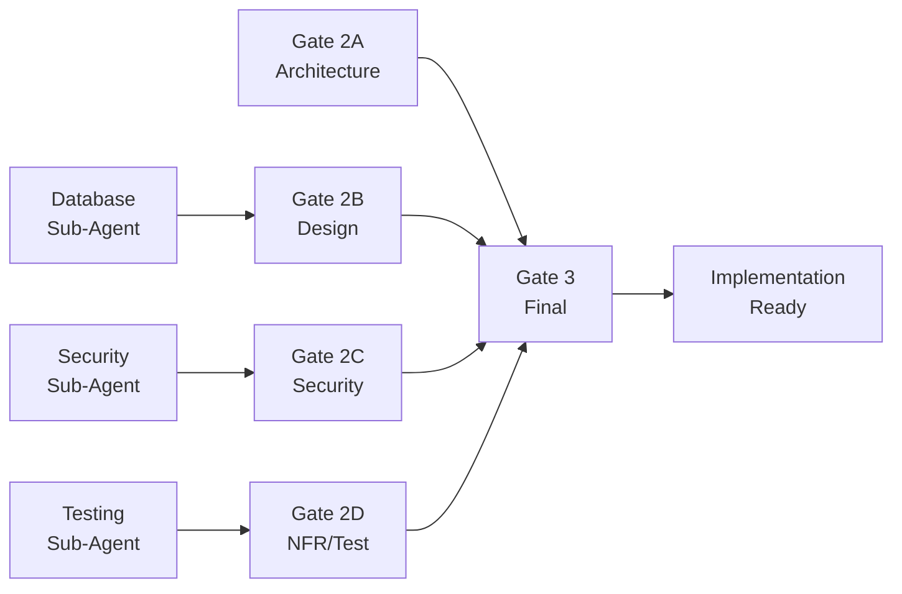

# LEO Protocol Gate System Documentation


## Metadata
- **Category**: Guide
- **Status**: Approved
- **Version**: 1.1.0
- **Author**: DOCMON
- **Last Updated**: 2026-02-02
- **Tags**: database, api, testing, e2e, integration-section, validation

## Overview

The LEO Protocol Gate System enforces quality standards through deterministic validation gates. Each gate must score at or above the SD type threshold to pass (60-90%, typically 85% for features), ensuring PRDs meet all requirements before implementation. See "SD Type Awareness" section in Gate 3 for the complete threshold table.

## Gate Structure

### Gate 2A: Architecture / Interfaces / Tech Design
**Purpose**: Validate architectural decisions and technical specifications

| Rule | Weight | Description | Evidence Required |
|------|--------|-------------|-------------------|
| `hasADR` | 35% | Architecture Decision Records | ≥1 ADR in `leo_adrs` table |
| `hasInterfaces` | 35% | API Specifications | OpenAPI/TypeScript specs that lint clean |
| `hasTechDesign` | 30% | Technical Design | Tech design artifact in `leo_artifacts` |

**Total Weight**: 1.000 (100%)

### Gate 2B: Design & DB Interfaces
**Purpose**: Ensure design completeness and database readiness

| Rule | Weight | Description | Evidence Required |
|------|--------|-------------|-------------------|
| `designArtifacts` | 50% | Design & Accessibility | Wireframes + WCAG2.1-AA compliance |
| `dbSchemaReady` | 50% | Database Schema | Migrations + schema snapshots |

**Total Weight**: 1.000 (100%)

### Gate 2C: Security & Risk
**Purpose**: Validate security posture and risk mitigation

| Rule | Weight | Description | Evidence Required |
|------|--------|-------------|-------------------|
| `securityScanClean` | 60% | Security Validation | OWASP clean + CSP configured |
| `riskSpikesClosed` | 40% | Risk Investigation | ≥1 completed risk spike |

**Total Weight**: 1.000 (100%)

### Gate 2D: NFR & Test Plan
**Purpose**: Confirm non-functional requirements and test coverage

| Rule | Weight | Description | Evidence Required |
|------|--------|-------------|-------------------|
| `nfrBudgetsPresent` | 30% | Performance Budgets | p95 ≤3000ms, bundle ≤500KB |
| `coverageTargetSet` | 30% | Coverage Target | ≥80% test coverage |
| `testPlanMatrices` | 40% | Test Types | All 5 matrices (unit, integration, e2e, a11y, perf) |

**Total Weight**: 1.000 (100%)

### Gate 3: Supervisor Final Verification
**Purpose**: Final validation that all prerequisites are met

| Rule | Weight | Description | Evidence Required |
|------|--------|-------------|-------------------|
| `supervisorChecklistPass` | 100% | Complete Verification | Gates 2A-2D pass + all sub-agents pass |

**Total Weight**: 1.000 (100%)

#### Gate 3 Detailed Breakdown

Gate 3 performs comprehensive traceability validation across multiple validation areas:

##### Prerequisite Gates Check

Gate 3 first verifies that all prerequisite gates (2A, 2B, 2C, 2D) have passed with ≥85% score:

```sql
-- Gate 3 checks latest scores for each prerequisite
SELECT gate, score FROM leo_gate_reviews
WHERE prd_id = 'PRD-XXX' AND gate IN ('2A', '2B', '2C', '2D')
ORDER BY created_at DESC;
```

##### Sub-Agent Verification

Gate 3 validates all required sub-agent executions have completed successfully:

| Sub-Agent | Triggered When | Required Status |
|-----------|----------------|-----------------|
| SECURITY | Auth/permission changes | PASS or CONDITIONAL_PASS |
| DATABASE | Schema/migration changes | PASS or CONDITIONAL_PASS |
| TESTING | All SDs | PASS or CONDITIONAL_PASS |
| DESIGN | UI component changes | PASS or CONDITIONAL_PASS |
| PERFORMANCE | High priority SDs | PASS or CONDITIONAL_PASS |

##### SD Type Awareness

Gate 3 applies different validation paths based on SD type:

| SD Type | Threshold | Special Handling |
|---------|-----------|------------------|
| `feature` | 85% | Full validation (default) |
| `database` | 75% | Skips design traceability, focuses on schema validation |
| `infrastructure` | 80% | Simplified validation (no code tests) |
| `security` | 90% | Stricter security sub-agent requirements |
| `documentation`/`docs` | 60% | No code/test validation required |
| `orchestrator` | 70% | Validates via children completion status |
| `refactor` | 80% | Validates via REGRESSION sub-agent results |
| `bugfix` | 80% | Standard validation |
| `performance` | 85% | Requires PERFORMANCE sub-agent pass |

##### Supervisor Verification Artifact

Gate 3 optionally checks for a supervisor verification artifact:

```json
{
  "dor_pass": true,
  "verified_at": "2026-01-02T10:00:00Z",
  "supervisor_notes": "All criteria met"
}
```

If `dor_pass` is `false`, Gate 3 will fail regardless of other checks.

##### Common Gate 3 Failure Patterns

1. **"Not all prerequisite gates have passed"**
   - **Cause**: One or more of Gates 2A-2D has score <85%
   - **Fix**: Re-run and fix failing gates before Gate 3

2. **"Security sub-agent not executed"**
   - **Cause**: SECURITY sub-agent was not triggered or skipped
   - **Fix**: Run `npm run subagent:execute SECURITY <SD-ID>`

3. **"Gate X: Not executed"**
   - **Cause**: A required prerequisite gate was never run
   - **Fix**: Run all gates in sequence: 2A → 2B → 2C → 2D → 3

4. **"Definition of Ready (DoR) not met"**
   - **Cause**: Supervisor artifact has `dor_pass: false`
   - **Fix**: Update supervisor verification artifact in `leo_artifacts`

##### Orchestrator SD Handling

For parent orchestrator SDs (those with child SDs), Gate 3 validates differently:
- Checks that child SDs exist and are progressing
- User stories are expected in child SDs, not the parent
- Bypasses USER_STORY_EXISTENCE_GATE for parent orchestrators

## Running Gates Locally

### Prerequisites

1. Set environment variables:
```bash
export NEXT_PUBLIC_SUPABASE_URL="https://your-project.supabase.co"
export SUPABASE_SERVICE_ROLE_KEY="your-service-key"
export PRD_ID="PRD-SD-001"
```

2. Install dependencies:
```bash
npm install
npm install -D typescript tsx @types/node @supabase/supabase-js
```

3. Seed validation rules:
```bash
psql $DATABASE_URL -f database/seed/leo_validation_rules.sql
```

### Running Individual Gates

```bash
# Run Gate 2A - Architecture
PRD_ID="PRD-SD-001" npx tsx tools/gates/gate2a.ts

# Run Gate 2B - Design
PRD_ID="PRD-SD-001" npx tsx tools/gates/gate2b.ts

# Run Gate 2C - Security
PRD_ID="PRD-SD-001" npx tsx tools/gates/gate2c.ts

# Run Gate 2D - NFR/Testing
PRD_ID="PRD-SD-001" npx tsx tools/gates/gate2d.ts

# Run Gate 3 - Final Verification
PRD_ID="PRD-SD-001" npx tsx tools/gates/gate3.ts
```

### Running All Gates

```bash
# Create a script to run all gates
cat > run-all-gates.sh << 'EOF'
#!/bin/bash
PRD_ID="$1"
if [ -z "$PRD_ID" ]; then
  echo "Usage: ./run-all-gates.sh PRD_ID"
  exit 1
fi

for gate in 2A 2B 2C 2D 3; do
  echo "Running Gate $gate..."
  PRD_ID="$PRD_ID" npx tsx tools/gates/gate${gate,,}.ts
  if [ $? -ne 0 ]; then
    echo "Gate $gate failed"
    exit 1
  fi
done

echo "All gates passed!"
EOF

chmod +x run-all-gates.sh
./run-all-gates.sh PRD-SD-001
```

## CI Integration

Gates run automatically in CI on:
- Pull requests affecting relevant paths
- Manual workflow dispatch with PRD_ID
- Push to main/develop branches

### Triggering Manual Validation

1. Go to Actions tab in GitHub
2. Select "LEO Gate Validation" workflow
3. Click "Run workflow"
4. Enter PRD ID
5. Click "Run workflow" button

## Evidence Collection

Each gate stores evidence in `leo_gate_reviews` table:

```sql
-- View recent gate reviews
SELECT 
  prd_id,
  gate,
  score,
  evidence,
  created_at
FROM leo_gate_reviews
ORDER BY created_at DESC
LIMIT 10;

-- Check specific PRD status
SELECT DISTINCT ON (gate)
  gate,
  score,
  CASE WHEN score >= 85 THEN 'PASS' ELSE 'FAIL' END as status,
  created_at
FROM leo_gate_reviews
WHERE prd_id = 'PRD-SD-001'
ORDER BY gate, created_at DESC;
```

## Scoring Algorithm

### Monotonic Scoring
- Each rule contributes **full weight** (pass) or **0** (fail)
- No partial credit
- Score = SUM(weight × 100) for passing rules
- Must achieve ≥85% to pass gate

### Example Calculation (Gate 2A)
```
hasADR: PASS (0.35 × 100 = 35%)
hasInterfaces: FAIL (0.35 × 100 = 0%)
hasTechDesign: PASS (0.30 × 100 = 30%)

Total Score: 35% + 0% + 30% = 65% (FAIL - below 85% threshold)
```

## Troubleshooting

### Common Issues

1. **"No active rules found for gate"**
   - Run seed data: `psql $DATABASE_URL -f database/seed/leo_validation_rules.sql`

2. **"Database connection failed"**
   - Check environment variables
   - Verify Supabase credentials

3. **"OpenAPI linter not available"**
   - Install: `npm install -D @apidevtools/swagger-cli`

4. **Gate scores <85%**
   - Check evidence requirements
   - Ensure all artifacts exist in database
   - Verify sub-agent executions completed

### Debugging

```bash
# Enable verbose logging
DEBUG=* PRD_ID="PRD-SD-001" npx tsx tools/gates/gate2a.ts

# Check database state
psql $DATABASE_URL -c "SELECT * FROM v_gate_rule_integrity;"

# View sub-agent status
psql $DATABASE_URL -c "
  SELECT 
    prd_id,
    sa.name as sub_agent,
    se.status,
    se.completed_at
  FROM sub_agent_executions se
  JOIN leo_sub_agents sa ON se.sub_agent_id = sa.id
  WHERE prd_id = 'PRD-SD-001';
"
```

## Best Practices

1. **Run gates sequentially**: 2A → 2B → 2C → 2D → 3
2. **Fix failures before proceeding**: Don't skip to Gate 3 if 2A-2D haven't passed
3. **Store all artifacts in database**: No filesystem PRDs or documentation
4. **Ensure sub-agents complete**: Gate 2C and Gate 3 depend on sub-agent results
5. **Monitor weight integrity**: Weights must sum to 1.000 per gate

## Gate Dependencies



## Compliance

The gate system enforces LEO Protocol v4.3.3 requirements:
- ✅ Database-first architecture (no filesystem artifacts)
- ✅ Deterministic scoring (reproducible results)
- ✅ Audit trail (all reviews stored with evidence)
- ✅ CI enforcement (blocks merge on failure)
- ✅ Weight integrity (validated to sum to 1.000)
- ✅ PRD Integration & Operationalization validation (NEW - v4.3.3)

## Gate 1 (PLAN→EXEC) - Additional Validators

**Added in LEO Protocol v4.3.3** (2026-02-02):

### Integration Section Validation

**Purpose**: Ensure PRDs explicitly document how new work integrates with the existing codebase.

**Validator**: `GATE_INTEGRATION_SECTION_VALIDATION`

**Module**: `scripts/modules/handoff/executors/plan-to-exec/gates/integration-section-validation.js`

**Validates**:
1. PRD has `integration_operationalization` JSONB field populated
2. All 5 required subsections present:
   - Consumers & User Journeys
   - Upstream/Downstream Dependencies
   - Data Contracts & Schema
   - Runtime Configuration & Environments
   - Observability, Rollout & Rollback
3. For infrastructure SDs with no consumers: `no_consumers_justification` ≥30 characters

**SD Type Enforcement**:
| SD Type | Enforcement Level |
|---------|-------------------|
| feature, bugfix | BLOCKING (handoff rejected if missing) |
| infrastructure | WARNING (handoff proceeds, logged) |
| documentation | SKIP (validation bypassed) |

**Error Codes**:
- `ERR_INTEGRATION_SECTION_MISSING` - Section not found in PRD
- `ERR_INTEGRATION_CONSUMERS_MISSING` - Consumers subsection missing
- `ERR_INTEGRATION_DEPENDENCIES_MISSING` - Dependencies subsection missing
- `ERR_INTEGRATION_CONTRACTS_MISSING` - Data contracts subsection missing
- `ERR_INTEGRATION_CONFIG_MISSING` - Runtime config subsection missing
- `ERR_INTEGRATION_OBSERVABILITY_MISSING` - Observability subsection missing
- `ERR_INFRASTRUCTURE_NO_CONSUMER_JUSTIFICATION` - Infrastructure SD with no consumers lacks justification

**See**:
- [PRD Integration Section Guide](../../guides/prd-integration-section-guide.md) - How to complete the section
- [Validation Enforcement](../../reference/validation-enforcement.md) - Complete gate documentation
- [PRD Creation Process](../../guides/prd-creation-process.md) - Standard PRD workflow

---

*Last Updated: 2026-02-02*
*LEO Protocol Version: v4.3.3*