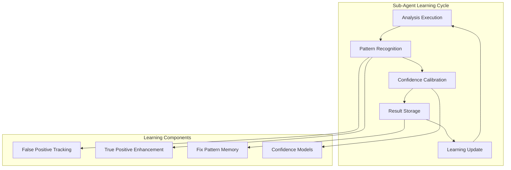
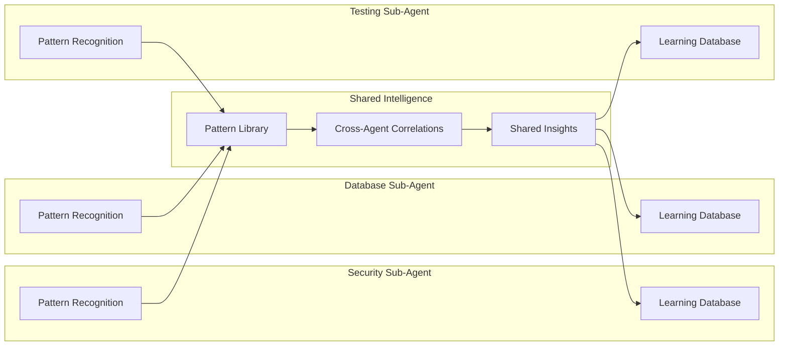

# Sub-Agent Learning System

## 🤖 Intelligent Collaborative Sub-Agents

The LEO Protocol's sub-agents feature sophisticated learning capabilities that enable them to improve their analysis quality, reduce false positives, and share insights with each other. This creates a collaborative intelligence network that gets smarter with every project.

## 🧠 Learning Architecture

### Individual Agent Learning
Each sub-agent maintains its own learning database:



### Cross-Agent Knowledge Sharing
Sub-agents share insights through the collaborative intelligence layer:



## 📊 Learning Components

### 1. **Pattern Recognition Engine**

Located in `lib/agents/learning-database.js`, each sub-agent learns:

#### False Positive Tracking
```javascript
// Example: Security sub-agent learns from false alarms
this.patterns.falsePositives.set('auth-endpoint-warning', {
    pattern: /auth.*endpoint.*missing.*validation/i,
    falsePositiveRate: 0.23,
    contexts: ['already-validated-upstream', 'test-endpoints'],
    confidence: 0.77
});
```

#### True Positive Enhancement
```javascript
// Example: Database sub-agent recognizes real issues
this.patterns.truePositives.set('index-performance-issue', {
    pattern: /query.*slow.*missing.*index/i,
    successRate: 0.89,
    fixPatterns: ['add-btree-index', 'query-optimization'],
    confidence: 0.91
});
```

#### Confidence Calibration
```javascript
// Adaptive confidence scoring based on historical accuracy
class ConfidenceModel {
    updateConfidence(pattern, actualResult) {
        const historical = this.getHistoricalAccuracy(pattern);
        const adjustment = this.calculateAdjustment(actualResult, historical);
        return this.applyBayesianUpdate(pattern, adjustment);
    }
}
```

### 2. **Fix Pattern Memory**

Sub-agents remember successful resolution strategies:

```javascript
// Example: Performance sub-agent remembers successful optimizations
this.patterns.fixPatterns.set('slow-query-fix', {
    problem: 'query-performance-degradation',
    solutions: [
        { action: 'add-index', success_rate: 0.85, avg_improvement: '340%' },
        { action: 'query-rewrite', success_rate: 0.72, avg_improvement: '180%' },
        { action: 'caching-layer', success_rate: 0.91, avg_improvement: '520%' }
    ],
    contextFactors: ['table-size', 'query-frequency', 'data-distribution']
});
```

### 3. **Cross-Agent Correlations**

Sub-agents learn from each other's findings:

```javascript
// Example: Security issues often correlate with database design
this.correlations.set('security-database-link', {
    trigger: 'security-vulnerability-found',
    correlatedAgent: 'DATABASE',
    correlationStrength: 0.73,
    commonPatterns: [
        'insufficient-input-validation',
        'missing-data-sanitization',
        'weak-access-controls'
    ],
    actionable: true
});
```

## 🔄 Learning Processes

### 1. **Execution Learning**

Each time a sub-agent runs, it captures learning data:

```javascript
async function executeWithLearning(context) {
    const startTime = Date.now();

    // Get historical context for this type of analysis
    const historicalInsights = await this.learningDatabase.getRelevantInsights(context);

    // Execute analysis with enhanced context
    const results = await this.performAnalysis(context, historicalInsights);

    // Learn from the results
    await this.learningDatabase.learnFromAnalysis({
        context,
        results,
        executionTime: Date.now() - startTime,
        confidence: results.confidence
    });

    return results;
}
```

### 2. **Feedback Integration**

Sub-agents learn from human feedback:

```javascript
async function processFeedback(analysisId, feedback) {
    const analysis = await this.getAnalysis(analysisId);

    if (feedback.type === 'false_positive') {
        // Learn that this pattern tends to be a false alarm
        this.learningDatabase.recordFalsePositive(analysis.pattern, analysis.context);
    } else if (feedback.type === 'confirmed_issue') {
        // Reinforce that this pattern is reliable
        this.learningDatabase.reinforceTruePositive(analysis.pattern, analysis.context);
    }

    // Update confidence models
    this.models.confidence.updateFromFeedback(analysis, feedback);
}
```

### 3. **Retrospective Learning**

Sub-agents automatically learn from project retrospectives:

```javascript
// Integration with retrospective system
async function integrateRetrospectiveInsights(retrospectiveData) {
    for (const insight of retrospectiveData.insights) {
        if (insight.relevantAgent === this.agentType) {
            // Update pattern recognition based on retrospective findings
            await this.updatePatternsFromRetrospective(insight);

            // Adjust confidence models
            this.models.confidence.incorporateRetrospectiveData(insight);

            // Share insights with other agents
            await this.shareInsightWithPeers(insight);
        }
    }
}
```

## 🤝 Collaborative Intelligence

### 1. **Cross-Agent Insight Sharing**

Sub-agents share relevant insights:

```javascript
// Example: Security agent shares authentication insights with Database agent
await this.shareInsight({
    fromAgent: 'SECURITY',
    toAgent: 'DATABASE',
    insightType: 'authentication-pattern',
    data: {
        pattern: 'weak-password-policies',
        databaseImplications: ['password-storage-requirements', 'audit-table-needs'],
        recommendations: ['implement-bcrypt', 'add-password-history-table']
    }
});
```

### 2. **Conflict Detection & Resolution**

When sub-agents have conflicting recommendations:

```javascript
class ConflictResolver {
    async resolveConflict(recommendations) {
        // Analyze conflicting recommendations
        const conflicts = this.detectConflicts(recommendations);

        // Use agent priority and confidence scores
        const resolution = this.prioritizeRecommendations(conflicts);

        // Learn from conflict patterns
        await this.learnFromConflict(conflicts, resolution);

        return {
            resolvedRecommendations: resolution,
            conflictAnalysis: conflicts,
            learningUpdates: this.getConflictLearnings()
        };
    }
}
```

### 3. **Consensus Building**

Sub-agents build consensus on complex issues:

```javascript
async function buildConsensus(issue) {
    // Get analysis from all relevant agents
    const analyses = await this.getMultiAgentAnalysis(issue);

    // Find areas of agreement
    const consensus = this.findConsensusPoints(analyses);

    // Identify and resolve disagreements
    const disagreements = this.findDisagreements(analyses);
    const resolutions = await this.resolveDisagreements(disagreements);

    // Update collective intelligence
    await this.updateCollectiveKnowledge(consensus, resolutions);

    return {
        consensus,
        resolutions,
        confidence: this.calculateConsensusConfidence(analyses)
    };
}
```

## 🎯 Sub-Agent Specializations

### Security Sub-Agent Learning
- **Vulnerability Pattern Recognition**: Learns common security anti-patterns
- **False Positive Reduction**: Distinguishes between real vulnerabilities and false alarms
- **Attack Pattern Updates**: Stays current with emerging security threats
- **Compliance Learning**: Adapts to organizational security requirements

```javascript
// Example: Security agent learns OWASP patterns
this.securityPatterns = {
    'sql-injection': {
        confidence: 0.94,
        falsePositiveRate: 0.06,
        commonContexts: ['user-input-processing', 'dynamic-queries'],
        mitigations: ['prepared-statements', 'input-validation', 'orm-usage']
    },
    'xss-vulnerability': {
        confidence: 0.87,
        falsePositiveRate: 0.13,
        commonContexts: ['user-content-display', 'dynamic-html-generation'],
        mitigations: ['output-encoding', 'content-security-policy', 'sanitization']
    }
};
```

### Database Sub-Agent Learning
- **Performance Pattern Recognition**: Learns query performance anti-patterns
- **Schema Evolution Tracking**: Understands migration impact patterns
- **Index Optimization Learning**: Identifies optimal indexing strategies
- **Data Integrity Insights**: Recognizes data consistency issues

```javascript
// Example: Database agent learns performance patterns
this.performancePatterns = {
    'n-plus-one-query': {
        confidence: 0.91,
        detectionAccuracy: 0.88,
        commonCauses: ['orm-lazy-loading', 'missing-joins', 'inefficient-iteration'],
        solutions: ['eager-loading', 'batch-queries', 'join-optimization']
    },
    'missing-index': {
        confidence: 0.85,
        detectionAccuracy: 0.92,
        indicators: ['slow-query-log', 'high-cpu-usage', 'table-scans'],
        solutions: ['btree-index', 'composite-index', 'partial-index']
    }
};
```

### Testing Sub-Agent Learning
- **Coverage Gap Analysis**: Learns which types of code are often under-tested
- **Test Quality Assessment**: Identifies characteristics of effective tests
- **Flaky Test Detection**: Recognizes patterns that lead to unreliable tests
- **Testing Strategy Optimization**: Suggests optimal testing approaches

```javascript
// Example: Testing agent learns coverage patterns
this.coveragePatterns = {
    'critical-path-gaps': {
        confidence: 0.89,
        impactScore: 0.95,
        commonAreas: ['error-handling', 'edge-cases', 'integration-points'],
        testStrategies: ['boundary-testing', 'error-injection', 'integration-tests']
    },
    'flaky-test-indicators': {
        confidence: 0.82,
        predictionAccuracy: 0.77,
        commonCauses: ['timing-dependencies', 'external-dependencies', 'shared-state'],
        solutions: ['test-isolation', 'mocking', 'deterministic-data']
    }
};
```

## 📈 Learning Metrics

### Individual Agent Metrics
- **Prediction Accuracy**: How often agent predictions are correct
- **False Positive Rate**: Reduction in incorrect alerts over time
- **Confidence Calibration**: Alignment between confidence scores and actual accuracy
- **Resolution Success Rate**: Success rate of recommended solutions

### Cross-Agent Collaboration Metrics
- **Insight Sharing Frequency**: How often agents share useful insights
- **Conflict Resolution Efficiency**: Speed and accuracy of conflict resolution
- **Consensus Quality**: Quality of collaborative decisions
- **Collective Intelligence Growth**: Overall system improvement over time

### Learning System Metrics
- **Pattern Recognition Accuracy**: How well the system identifies useful patterns
- **Adaptation Speed**: How quickly agents adapt to new patterns
- **Knowledge Retention**: Persistence of learned insights over time
- **Transfer Learning**: Application of insights across different contexts

## 🚀 Advanced Learning Features

### 1. **Adaptive Triggering**
Sub-agents learn when they should be activated:

```javascript
// Dynamic trigger learning based on effectiveness
this.triggerLearning = {
    'authentication-keyword': {
        effectiveness: 0.73,
        falseActivationRate: 0.27,
        contextFactors: ['project-type', 'team-experience', 'security-requirements'],
        adaptiveThreshold: 0.65
    }
};
```

### 2. **Context-Aware Analysis**
Sub-agents adapt their analysis based on project context:

```javascript
// Context-sensitive analysis adaptation
async function performContextAwareAnalysis(context) {
    const projectContext = await this.analyzeProjectContext(context);
    const historicalSimilarProjects = await this.findSimilarProjects(projectContext);

    // Adapt analysis strategy based on similar projects
    const adaptedStrategy = this.adaptStrategyFromHistory(historicalSimilarProjects);

    return await this.executeWithStrategy(context, adaptedStrategy);
}
```

### 3. **Continuous Model Updates**
Machine learning models continuously improve:

```javascript
// Continuous learning with model updates
class ContinuousLearningEngine {
    async updateModels() {
        // Retrain models with new data
        await this.retrainConfidenceModel();
        await this.updatePatternRecognition();
        await this.refreshCorrelationMatrix();

        // Validate model improvements
        const performance = await this.validateModelPerformance();

        if (performance.improved) {
            await this.deployUpdatedModels();
            this.logLearningProgress(performance);
        }
    }
}
```

## 🔧 Implementation Details

### Learning Database Integration
```javascript
// Each sub-agent has access to shared learning infrastructure
import { LearningDatabase } from '../lib/agents/learning-database.js';
import { IntelligenceEngine } from '../scripts/intelligence-analysis-engine.js';

class IntelligentSubAgent {
    constructor(agentType) {
        this.learningDB = LearningDatabase.getInstance();
        this.intelligenceEngine = new IntelligenceEngine();
        this.agentType = agentType;
    }

    async executeWithIntelligence(context) {
        // Get relevant learning context
        const learningContext = await this.learningDB.getRelevantContext(
            this.agentType,
            context
        );

        // Execute with enhanced intelligence
        return await this.performEnhancedAnalysis(context, learningContext);
    }
}
```

### Cross-Agent Communication
```javascript
// Sub-agents communicate through the intelligence layer
class SubAgentCommunicationLayer {
    async shareInsight(fromAgent, toAgent, insight) {
        // Store insight in shared intelligence database
        await this.intelligenceDB.storeSharedInsight({
            from: fromAgent,
            to: toAgent,
            insight: insight,
            timestamp: new Date(),
            relevanceScore: this.calculateRelevance(insight, toAgent)
        });

        // Notify receiving agent of new insight
        await this.notifyAgent(toAgent, insight);
    }

    async getRelevantInsights(agentType, context) {
        return await this.intelligenceDB.getInsightsForAgent(agentType, context);
    }
}
```

---

*The Sub-Agent Learning System creates a network of intelligent, collaborative agents that continuously improve their analysis quality and share insights to benefit the entire development process.*

## 📚 Related Documentation
- [Agent Learning Architecture](agent-learning-architecture.md)
- [Cross-Agent Intelligence](cross-agent-intelligence.md)
- [Learning Database Deep Dive](learning-database-guide.md)
- [Intelligence Dashboard](intelligence-dashboard.md)