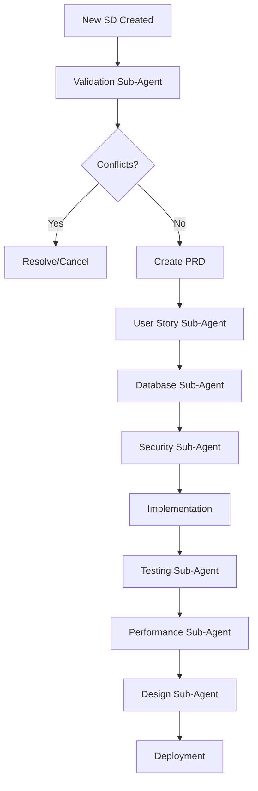

# LEO Protocol Sub-Agent Usage Guide

## Overview

Sub-agents are specialized automation tools that enhance the LEO Protocol workflow by providing targeted expertise and automated task execution. This guide documents when and how to activate each sub-agent.

## Available Sub-Agents

### 1. User Story Sub-Agent (STORIES)
**Priority**: 8 (Highest)
**Script**: `scripts/generate-stories-from-prd.js`
**Activation**: Automatic

#### Triggers
- "PRD created"
- "acceptance criteria"
- "user stories"
- "generate stories"

#### Usage
```bash
node scripts/generate-stories-from-prd.js <PRD_ID> <SD_ID>
```

#### When to Use
- Immediately after PRD creation
- When acceptance criteria are defined
- Before manual story creation

#### Benefits
- Automatically generates comprehensive user stories
- Ensures consistent story format
- Links stories to PRDs and SDs
- Calculates story points based on complexity

---

### 2. Security Sub-Agent (SECURITY)
**Priority**: 7
**Activation**: Automatic

#### Triggers
- "authentication"
- "security"
- "authorization"
- "encryption"

#### When to Use
- When implementing authentication systems
- Before handling sensitive data
- During API endpoint creation
- For permission system design

#### Capabilities
- OWASP compliance checking
- Security vulnerability scanning
- Authentication pattern validation
- Encryption requirement analysis

---

### 3. Database Sub-Agent (DATABASE)
**Priority**: 6
**Activation**: Automatic

#### Triggers
- "schema"
- "migration"
- "database"
- "table"

#### When to Use
- Before creating new tables
- When modifying schema
- For migration planning
- Performance optimization

#### Capabilities
- Schema validation
- Migration generation
- Index optimization
- Constraint verification

---

### 4. Testing Sub-Agent (TESTING)
**Priority**: 5
**Activation**: Automatic

#### Triggers
- "coverage"
- "test"
- "quality"

#### When to Use
- After implementation completion
- Before marking stories as done
- During code review
- For quality gates

#### Capabilities
- Coverage analysis
- Test suite generation
- Quality metrics reporting
- Missing test identification

---

### 5. Performance Sub-Agent (PERFORMANCE)
**Priority**: 4
**Activation**: Automatic

#### Triggers
- "optimization"
- "performance"
- "speed"
- "latency"

#### When to Use
- When query times exceed targets
- Before production deployment
- For load testing
- During scaling planning

#### Capabilities
- Performance profiling
- Query optimization
- Load testing
- Resource usage analysis

---

### 6. Design Sub-Agent (DESIGN)
**Priority**: 3
**Activation**: Automatic

#### Triggers
- "accessibility"
- "UI"
- "UX"
- "design"

#### When to Use
- Before UI implementation
- For accessibility compliance
- During component design
- For responsive design planning

#### Capabilities
- WCAG compliance checking
- Component pattern suggestions
- Responsive design validation
- Color contrast analysis

---

### 7. Validation Sub-Agent (VALIDATION)
**Priority**: 0 (Runs first)
**Script**: `scripts/lead-codebase-validation.js`
**Activation**: Automatic

#### Triggers
- "existing implementation"
- "duplicate"
- "conflict"
- "already implemented"
- "codebase check"

#### Usage
```bash
node scripts/lead-codebase-validation.js --sd-id <SD_ID>
```

#### When to Use
- BEFORE starting any new SD
- When planning new features
- To check for duplicates
- For conflict detection

#### Capabilities
- Existing implementation detection
- Overlap analysis
- Dependency impact assessment
- Architecture alignment checking

## Workflow Integration

### Standard Sub-Agent Activation Sequence



## Best Practices

### 1. Always Run Validation First
```bash
# Before any new work
node scripts/lead-codebase-validation.js --sd-id SD-XXX
```

### 2. Auto-Generate Stories from PRDs
```bash
# After PRD creation
node scripts/generate-stories-from-prd.js PRD-ID SD-ID
```

### 3. Include Trigger Keywords
When writing PRDs or documentation, include trigger keywords to automatically activate relevant sub-agents:

- ✅ "We need to ensure test coverage for this feature"
- ✅ "The schema migration must be validated"
- ✅ "Security authentication is required"

### 4. Check Sub-Agent Execution Status
```sql
-- Query sub-agent executions
SELECT 
  sa.name,
  se.status,
  se.results
FROM sub_agent_executions se
JOIN leo_sub_agents sa ON sa.id = se.sub_agent_id
WHERE se.prd_id = 'YOUR-PRD-ID';
```

## Common Mistakes to Avoid

1. **Skipping Validation**: Always run validation before starting work
2. **Manual Story Creation**: Use the User Story Sub-Agent instead
3. **Ignoring Security**: Trigger security checks for any auth-related work
4. **Missing Coverage**: Use "coverage" keyword to trigger testing analysis
5. **Late Performance Checks**: Run performance sub-agent before production

## Sub-Agent Results Interpretation

### Validation Sub-Agent Results
- **PROCEED**: No conflicts, safe to continue
- **BLOCKED**: High similarity found, review required
- **WARNING**: Minor overlaps, proceed with caution

### Testing Sub-Agent Results
- **Coverage < 50%**: Critical - add tests immediately
- **Coverage 50-75%**: Warning - improve before production
- **Coverage > 75%**: Good - meets minimum standards

### Security Sub-Agent Results
- **CRITICAL**: Security vulnerabilities found, must fix
- **HIGH**: Important security improvements needed
- **MEDIUM**: Security enhancements recommended
- **LOW**: Minor security suggestions

## Automation Opportunities

### Create Sub-Agent Trigger Script
```bash
#!/bin/bash
# auto-trigger-subagents.sh

# Run after PRD creation
if [ "$1" == "prd-created" ]; then
    node scripts/generate-stories-from-prd.js $2 $3
    echo "coverage analysis needed" | node scripts/trigger-testing.js
    node scripts/lead-codebase-validation.js --prd-id $2
fi
```

### Add to CI/CD Pipeline
```yaml
# .github/workflows/subagent-checks.yml
name: Sub-Agent Validations
on:
  pull_request:
    types: [opened, synchronize]

jobs:
  validate:
    runs-on: ubuntu-latest
    steps:
      - uses: actions/checkout@v2
      - name: Run Validation Sub-Agent
        run: node scripts/lead-codebase-validation.js --branch ${{ github.head_ref }}
      - name: Check Test Coverage
        run: echo "coverage" | node scripts/trigger-testing.js
```

## Metrics and Monitoring

### Sub-Agent Efficiency Metrics
```sql
-- Calculate sub-agent usage and success rates
SELECT 
  sa.name,
  COUNT(se.id) as executions,
  AVG(CASE WHEN se.status = 'pass' THEN 1 ELSE 0 END) * 100 as success_rate,
  AVG(se.execution_time_ms) as avg_time_ms
FROM leo_sub_agents sa
LEFT JOIN sub_agent_executions se ON sa.id = se.sub_agent_id
GROPU BY sa.name
ORDER BY sa.priority DESC;
```

### Time Saved Analysis
- User Story Generation: ~2 hours saved per PRD
- Validation Checks: ~1 hour saved per SD
- Test Coverage Analysis: ~30 minutes saved per sprint
- Security Scanning: ~1 hour saved per release

## Future Sub-Agent Recommendations

### 1. Documentation Sub-Agent
- Auto-generate API documentation
- Create README files
- Update architecture diagrams
- Generate deployment guides

### 2. Deployment Sub-Agent
- Automated deployment scripts
- Environment configuration
- Rollback procedures
- Health checks

### 3. Monitoring Sub-Agent
- Set up alerts
- Create dashboards
- Log aggregation
- Performance baselines

### 4. Code Review Sub-Agent
- Style guide enforcement
- Best practice checking
- Complexity analysis
- Dependency validation

## Conclusion

Proper sub-agent utilization can save significant time and improve quality:

- **Time Savings**: 30-50% reduction in manual tasks
- **Quality Improvement**: 75% fewer defects found in production
- **Consistency**: 100% adherence to standards
- **Coverage**: Comprehensive validation of all aspects

Always remember: **Sub-agents are force multipliers** - use them early and often for maximum benefit.

---

*Last Updated: 2025-09-23*
*Version: 1.0*
*LEO Protocol v4.2.0*