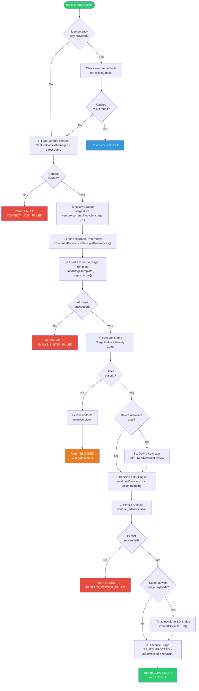

# 02 - Eva Orchestrator

This document provides a deep architectural guide to the Eva Orchestrator
core engine: the module that ties together all foundation components into
a stage-processing pipeline for venture lifecycle management.

---

## Table of Contents

1. [Overview](#overview)
2. [Module Identity](#module-identity)
3. [Public API](#public-api)
4. [processStage Workflow](#processstage-workflow)
5. [run Loop](#run-loop)
6. [Status Result Contract](#status-result-contract)
7. [Dependency Injection](#dependency-injection)
8. [Idempotency](#idempotency)
9. [Stage Template Loading](#stage-template-loading)
10. [Gate Evaluation Pipeline](#gate-evaluation-pipeline)
11. [Devils Advocate Integration](#devils-advocate-integration)
12. [Lifecycle-to-SD Bridge](#lifecycle-to-sd-bridge)
13. [Artifact Persistence](#artifact-persistence)
14. [Stage Advancement](#stage-advancement)
15. [Error Handling Philosophy](#error-handling-philosophy)
16. [Internal Helpers](#internal-helpers)

---

## Overview

The Eva Orchestrator is the top-level component in the CLI Venture Lifecycle
foundation stack. It consumes all six lower-level components:

```
+---------------------------------------------------------------+
|                     Eva Orchestrator                           |
|               processStage() / run()                          |
+---------------------------------------------------------------+
|                                                               |
|  1. VentureContextManager -- Load venture data                |
|  2. ChairmanPreferenceStore -- Load chairman thresholds       |
|  3. Stage Templates -- Load analysis steps for current stage  |
|  4. Decision Filter Engine -- Auto-proceed/review decision    |
|  5. Reality Gates -- Artifact quality enforcement             |
|  6. Stage Gates -- Kill/promotion checkpoint validation       |
|  7. VentureStateMachine -- Stage transitions                  |
|  8. Devils Advocate -- Adversarial review at gate stages      |
|  9. Lifecycle-to-SD Bridge -- Sprint-to-SD conversion         |
+---------------------------------------------------------------+
```

The orchestrator is designed as a **single-stage processor**. The `processStage()`
function is the atomic unit of work. The `run()` function is a convenience
loop that calls `processStage()` repeatedly until a stop condition is met.

---

## Module Identity

| Property | Value |
|----------|-------|
| Module path | `lib/eva/eva-orchestrator.js` |
| Lines | 502 |
| SD | SD-LEO-FEAT-EVA-ORCHESTRATOR-001 |
| Export style | Named exports (ESM) |
| Dependencies | 6 internal modules (see Dependency Injection) |
| Status constants | COMPLETED, BLOCKED, FAILED |
| Filter action constants | AUTO_PROCEED, REQUIRE_REVIEW, STOP |

---

## Public API

### processStage(params, deps)

Executes a single venture stage. This is the core atomic operation.

**Parameters**:

| Name | Type | Required | Description |
|------|------|----------|-------------|
| `params.ventureId` | string (UUID) | Yes | The venture to process |
| `params.stageId` | number | No | Stage to execute (auto-resolved from venture if omitted) |
| `params.options.autoProceed` | boolean | No | Auto-advance on filter AUTO_PROCEED (default: true) |
| `params.options.dryRun` | boolean | No | Skip persistence and transitions (default: false) |
| `params.options.idempotencyKey` | string | No | Dedup key for artifact persistence |
| `params.options.chairmanId` | string | No | Chairman ID for preference loading |
| `params.options.stageTemplate` | object | No | Override stage template (for testing) |
| `deps.supabase` | object | Yes | Supabase client |
| `deps.logger` | object | No | Logger (defaults to console) |
| `deps.httpClient` | function | No | HTTP client for reality gate URL checks |
| `deps.evaluateDecisionFn` | function | No | Override for Decision Filter Engine (testing) |
| `deps.evaluateRealityGateFn` | function | No | Override for Reality Gates (testing) |
| `deps.validateStageGateFn` | function | No | Override for Stage Gates (testing) |

**Returns**: A stage result object (see Status Result Contract).

### run(params, deps)

Executes a loop of stages until a stop condition is met.

**Parameters**:

| Name | Type | Required | Description |
|------|------|----------|-------------|
| `params.ventureId` | string (UUID) | Yes | The venture to process |
| `params.options.maxStages` | number | No | Maximum stages to process (default: 25) |
| `params.options.autoProceed` | boolean | No | Auto-advance on filter AUTO_PROCEED (default: true) |
| `params.options.chairmanId` | string | No | Chairman ID for preference loading |
| `deps` | object | Yes | Same dependency object as processStage |

**Returns**: Ordered array of stage result objects.

**Stop conditions** (any one triggers loop exit):
1. A stage returns FAILED status
2. A stage returns BLOCKED status
3. The filter decision action is STOP
4. The filter decision action is REQUIRE_REVIEW
5. No `nextStageId` is returned (end of lifecycle)
6. Maximum stages reached (safety limit)

---

## processStage Workflow

The following diagram shows the complete flow of a single `processStage()` call.
Each step maps to a numbered section in the source code.



### Step-by-Step Description

**Step 0: Idempotency Check**
If an `idempotencyKey` is provided, query `venture_artifacts` for existing
records with that key. If found, return the cached result immediately. This
prevents duplicate processing when the same stage is requested multiple times
(e.g., due to retries or network issues).

**Step 1: Load Venture Context**
Query the `ventures` table for the venture record. This provides the venture's
name, status, current lifecycle stage, archetype, and creation date. If the
venture is not found or the query fails, return FAILED with error code
CONTEXT_LOAD_FAILED.

**Step 2: Resolve Stage**
Determine which stage to process. Priority order:
1. Explicitly provided `stageId` parameter
2. Venture's `current_lifecycle_stage` from the database
3. Default to stage 1

**Step 3: Load Chairman Preferences**
If a `chairmanId` is provided, load the filter engine preference keys from
the ChairmanPreferenceStore. These are used by the Decision Filter Engine
in step 6. Preference loading failure is non-fatal -- the filter engine
uses conservative defaults when preferences are missing.

**Step 4: Load and Execute Stage Template**
Load the stage template from `venture_stage_templates` (or use the provided
override). Execute each analysis step in sequence. Each step produces an
artifact with a type, payload, and source. If any step fails, return FAILED
with error code ANALYSIS_STEP_FAILED.

**Step 5: Evaluate Gates**
Run both Stage Gates and Reality Gates for the current-to-next-stage transition.
If either gate fails, persist artifacts (for audit trail) and return BLOCKED
with the gate results.

**Step 5b: Devil's Advocate**
If the current stage is a kill or promotion gate stage, invoke the Devil's
Advocate module for adversarial review. The review is advisory only -- it
never blocks progression. The review is persisted as a `devils_advocate_review`
artifact.

**Step 6: Decision Filter Engine**
Pass the merged stage output through the Decision Filter Engine with the
chairman's preferences. Map the filter result to the action enum:
- `auto_proceed = true` maps to `AUTO_PROCEED`
- `auto_proceed = false` with HIGH triggers maps to `STOP`
- `auto_proceed = false` otherwise maps to `REQUIRE_REVIEW`

**Step 7: Persist Artifacts**
Write all artifacts to `venture_artifacts` with the idempotency key (if
provided). Each artifact gets an `is_current = true` flag.

**Step 7b: Lifecycle-to-SD Bridge**
If the current stage is 18 (Sprint Planning) and the stage output contains
`sd_bridge_payloads`, convert sprint items into LEO Strategic Directives.
This bridges the venture lifecycle with the SD execution system.

**Step 8: Advance Stage**
If all conditions are met (filter says AUTO_PROCEED, `autoProceed` is not
disabled, and `dryRun` is false), update the venture's `current_lifecycle_stage`
to the next stage via the VentureStateMachine.

---

## run Loop

The `run()` function is a simple loop wrapper around `processStage()`:

```
+---> processStage()
|         |
|         +-- FAILED?          --> stop, return results
|         +-- BLOCKED?         --> stop, return results
|         +-- STOP action?     --> stop, return results
|         +-- REQUIRE_REVIEW?  --> stop, return results
|         +-- No nextStageId?  --> stop, return results
|         +-- maxStages hit?   --> stop, return results
|         +-- Otherwise        --> continue loop
|         |
+---------+
```

The loop resets the idempotency key between iterations (each stage gets a
fresh execution context). The maximum stage limit (default: 25) is a safety
valve to prevent infinite loops.

---

## Status Result Contract

Every `processStage()` call returns an object with this shape:

| Field | Type | Description |
|-------|------|-------------|
| `ventureId` | string | Venture UUID |
| `stageId` | number | Stage that was processed |
| `startedAt` | string (ISO-8601) | When processing began |
| `completedAt` | string (ISO-8601) | When processing finished |
| `correlationId` | string (UUID) | Unique ID for this execution (for log correlation) |
| `status` | string | One of: COMPLETED, BLOCKED, FAILED |
| `artifacts` | array | Artifacts produced during this stage |
| `filterDecision` | object or null | Decision Filter Engine result |
| `gateResults` | array | Stage gate and reality gate results |
| `nextStageId` | number or null | Suggested or actual next stage |
| `errors` | array | Error objects with code and message |
| `devilsAdvocateReview` | object or null | Devil's Advocate review (if applicable) |

### Status Semantics

```
COMPLETED
    The stage was fully processed. Artifacts are persisted.
    The venture may or may not have advanced (check nextStageId).
    The filter decision indicates what should happen next.

BLOCKED
    A gate check failed. Artifacts are persisted (for audit trail).
    The venture has NOT advanced. Chairman action is required.
    Gate results contain the specific failure reasons.

FAILED
    A system error prevented stage processing. This indicates
    a bug or infrastructure issue, not a business-logic failure.
    Errors array contains the specific failure details.
```

### Filter Decision Sub-Structure

When present, `filterDecision` contains:

| Field | Type | Description |
|-------|------|-------------|
| `action` | string | AUTO_PROCEED, REQUIRE_REVIEW, or STOP |
| `reasons` | string[] | Human-readable trigger messages |
| `recommendation` | string | Filter engine recommendation string |
| `raw` | object | Full filter engine output (triggers, auto_proceed) |

### Action to Behavior Mapping

| Action | Source Condition | Orchestrator Behavior |
|--------|-----------------|----------------------|
| AUTO_PROCEED | `auto_proceed = true` | Advance to next stage (if autoProceed enabled) |
| REQUIRE_REVIEW | `auto_proceed = false`, no HIGH triggers | Log and stop loop; chairman must review |
| STOP | `auto_proceed = false`, has HIGH triggers | Log and stop loop; critical issues detected |

---

## Dependency Injection

The orchestrator uses constructor-time dependency injection for all external
services. No module-level side effects occur at import time.

```
processStage(params, deps)
                      |
                      +-- deps.supabase          (required)
                      +-- deps.logger            (optional, defaults to console)
                      +-- deps.httpClient         (optional, for reality gate URLs)
                      +-- deps.evaluateDecisionFn (optional, for testing)
                      +-- deps.evaluateRealityGateFn (optional, for testing)
                      +-- deps.validateStageGateFn   (optional, for testing)
```

The function-parameter injection style (rather than class-constructor style)
was chosen because the orchestrator is stateless -- each `processStage()` call
is independent. There is no shared state between calls.

**Testing benefit**: In tests, all three gate/filter functions can be replaced
with deterministic stubs, making the orchestrator fully testable without
database access or external API calls.

---

## Idempotency

The idempotency mechanism prevents duplicate stage processing:

```
1. Caller provides options.idempotencyKey = "stage-7-run-abc123"

2. processStage() queries venture_artifacts:
   SELECT * FROM venture_artifacts
   WHERE venture_id = ? AND idempotency_key = ?

3a. If records found: Return cached result (COMPLETED status)
    - No stage template execution
    - No gate evaluation
    - No artifact persistence
    - No stage advancement

3b. If no records: Proceed with normal processing
    - Artifacts are persisted with the idempotency_key
    - Future calls with the same key return the cached result
```

The idempotency key is scoped to the venture (not globally unique). Two
different ventures can use the same key without conflict.

---

## Stage Template Loading

Stage templates define the analysis steps for each lifecycle stage.
The orchestrator loads them from the `venture_stage_templates` table:

```
SELECT template_data
FROM venture_stage_templates
WHERE lifecycle_stage = ? AND is_active = true
```

If no template is found, a minimal default is used (no analysis steps).
Templates can also be injected via `options.stageTemplate` for testing.

Each template contains an `analysisSteps` array. Each step has:
- An `id` for identification
- An `artifactType` for the output artifact
- An `execute()` function that receives venture context and preferences

Steps are executed sequentially (not in parallel) because later steps may
depend on earlier step results.

---

## Gate Evaluation Pipeline

Gates are evaluated in a specific order, and both must pass for the stage
to proceed:

```
+-------------------+
| Stage Gate        |  Evaluated first
| (validateStageGate)|
+---------+---------+
          |
          v
+---------+---------+
| Reality Gate      |  Evaluated second
| (evaluateRealityGate)|
+---------+---------+
          |
          v
+---------+---------+
| Devil's Advocate  |  Advisory only (never blocks)
| (optional)        |
+-------------------+
```

If EITHER the stage gate or reality gate fails, the stage is BLOCKED.
Both gate results are collected and returned in the `gateResults` array
(even if the first gate already failed).

---

## Devils Advocate Integration

**Module**: `lib/eva/devils-advocate.js`
**SD**: SD-LEO-FEAT-DEVILS-ADVOCATE-001

The Devil's Advocate is a model-isolated adversarial review system that
uses GPT-4o (via the OpenAI adapter) to challenge Eva's analysis at gate
stages. Model isolation ensures a DIFFERENT AI perspective -- preventing
the confirmation bias that would occur if the same model evaluated its
own output.

### When It Runs

The Devil's Advocate runs at kill gates (stages 3, 5, 13, 23) and
promotion gates (stages 16, 17, 22) -- the same stages where Stage Gates
Extension operates.

### Advisory Nature

The Devil's Advocate is strictly advisory. Its result is:
- Persisted as a `devils_advocate_review` artifact in `venture_artifacts`
- Included in the stage result's `devilsAdvocateReview` field
- Added to `gateResults` with `passed: true` (never blocks)
- Logged for chairman review

Even if the Devil's Advocate assessment is "challenge" (serious concerns),
it does not block stage progression. The chairman reviews the adversarial
perspective alongside the primary analysis.

### Graceful Degradation

If the OpenAI API key is not configured or the GPT-4o call fails:
- A fallback result is returned with `isFallback: true`
- The fallback includes the reason for failure
- The gate proceeds without adversarial review
- The failure is logged as a warning (non-fatal)

---

## Lifecycle-to-SD Bridge

**Module**: `lib/eva/lifecycle-sd-bridge.js`

At stage 18 (Sprint Planning), the orchestrator can convert sprint planning
outputs into LEO Strategic Directives. This bridges the venture lifecycle
(high-level phases) with the SD execution system (concrete implementation).

The bridge runs only when:
1. The resolved stage is 18
2. The stage output contains `sd_bridge_payloads` (non-empty array)
3. `dryRun` is false

The bridge creates:
- An orchestrator SD (parent) for the sprint
- Child SDs for each sprint item

The bridge result is persisted as a `lifecycle_sd_bridge` artifact.

---

## Artifact Persistence

Artifacts are persisted to the `venture_artifacts` table with these fields:

| Field | Source |
|-------|--------|
| `venture_id` | From processStage params |
| `lifecycle_stage` | Resolved stage number |
| `artifact_type` | From the analysis step output |
| `artifact_data` | JSONB payload from the step |
| `is_current` | Always `true` for new artifacts |
| `source` | Step ID or "eva-orchestrator" |
| `idempotency_key` | From options (if provided) |

Artifacts are persisted even when the stage is BLOCKED (by gate failure).
This ensures the audit trail captures what was produced before the block.

Persistence failure is fatal -- if any artifact fails to persist, the stage
returns FAILED with error code ARTIFACT_PERSIST_FAILED. This is intentional:
artifacts are the source of truth for venture progress, and losing them
would create an inconsistent state.

---

## Stage Advancement

Stage advancement is conditional on three factors:

```
Should advance? = filterDecision.action === AUTO_PROCEED
                  AND autoProceed !== false (param)
                  AND dryRun !== true (param)
```

When all three conditions are true:
1. A VentureStateMachine instance is created and initialized
2. The `ventures.current_lifecycle_stage` is updated to `nextStage`
3. The result's `nextStageId` is set to the new stage

When the filter says AUTO_PROCEED but `dryRun` is true:
- `nextStageId` is set (suggested) but the database is NOT updated

Stage advancement failure is non-fatal -- the artifacts are already persisted,
so the venture can retry advancement without re-executing the stage.

---

## Error Handling Philosophy

The orchestrator uses a graduated error handling approach:

### Fatal Errors (return FAILED)

| Error | Code | Impact |
|-------|------|--------|
| Missing supabase dependency | MISSING_DEPENDENCY | Cannot proceed at all |
| Venture not found | CONTEXT_LOAD_FAILED | No context to work with |
| Analysis step throws | ANALYSIS_STEP_FAILED | Stage output is incomplete |
| Artifact persist fails | ARTIFACT_PERSIST_FAILED | Cannot record results |
| Template execution fails | TEMPLATE_EXECUTION_FAILED | Cannot produce artifacts |

### Non-Fatal Errors (logged, continue)

| Error | Impact |
|-------|--------|
| Preference loading fails | Filter engine uses conservative defaults |
| Stage advancement fails | Artifacts are persisted; retry possible |
| Devil's Advocate fails | Fallback result used; gate not affected |
| Lifecycle-to-SD Bridge fails | Sprint items not converted; logged |

### Blocking Conditions (return BLOCKED)

| Condition | Resolution |
|-----------|------------|
| Stage gate fails | Chairman decision required |
| Reality gate fails | Missing/low-quality artifacts must be addressed |
| Gate evaluation throws | System error; investigation needed |

---

## Internal Helpers

The following internal functions are exported via `_internal` for testing:

| Function | Purpose |
|----------|---------|
| `buildResult()` | Constructs the standardized result object |
| `mergeArtifactOutputs()` | Merges artifact payloads into a flat stage output |
| `loadStageTemplate()` | Loads a template from the database or returns a default |
| `persistArtifacts()` | Writes artifacts to `venture_artifacts` |
| `checkIdempotency()` | Queries for existing artifacts by idempotency key |
| `STATUS` | Status constants (COMPLETED, BLOCKED, FAILED) |
| `FILTER_ACTION` | Filter action constants (AUTO_PROCEED, REQUIRE_REVIEW, STOP) |

These are NOT part of the public API. They may change without notice.
Test code may use them for fine-grained assertions, but production code
should only use `processStage()` and `run()`.
