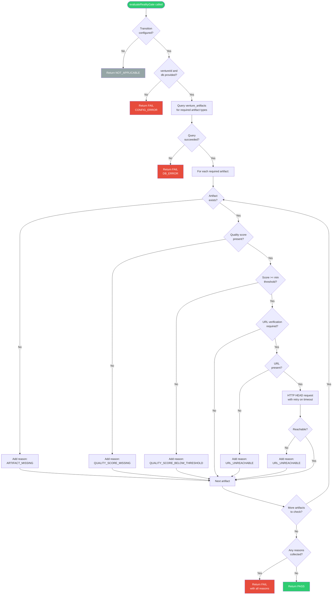

# 04 - Reality Gates

This document provides a complete architectural description of the Reality
Gates system: always-on quality enforcement gates that validate artifact
requirements at venture phase transition boundaries.

---

## Table of Contents

1. [Overview](#overview)
2. [Module Identity](#module-identity)
3. [Design Philosophy](#design-philosophy)
4. [The 5 Enforced Boundaries](#the-5-enforced-boundaries)
5. [Boundary Map Across Lifecycle Phases](#boundary-map-across-lifecycle-phases)
6. [Public API](#public-api)
7. [Gate Evaluation Flow](#gate-evaluation-flow)
8. [Three Quality Checks](#three-quality-checks)
9. [Reason Codes](#reason-codes)
10. [Result Structure](#result-structure)
11. [Fail-Closed Behavior](#fail-closed-behavior)
12. [URL Verification](#url-verification)
13. [Boundary Configuration Details](#boundary-configuration-details)
14. [Relationship to Stage Gates](#relationship-to-stage-gates)
15. [Integration with Eva Orchestrator](#integration-with-eva-orchestrator)
16. [Testing Strategy](#testing-strategy)

---

## Overview

Reality Gates are non-negotiable quality checkpoints that enforce a
fundamental contract: **a venture cannot advance to the next phase unless
its artifacts meet minimum quality standards**.

Unlike the Decision Filter Engine (which evaluates risk thresholds and can
be configured by chairman preferences), Reality Gates are always-on and
cannot be relaxed. They verify objective facts:

- Does the required artifact exist?
- Does it have a quality score, and is that score above the minimum?
- If a URL is required, is it reachable?

```
  Phase N                      Phase N+1
  --------+                   +--------
          |                   |
          |  +-------------+  |
          +->| Reality     |->+  (only if PASS)
             | Gate        |
             +-------------+
             |  Artifact   |
             |  exists?    |
             |  Quality    |
             |  score OK?  |
             |  URL alive? |
             +-------------+
```

---

## Module Identity

| Property | Value |
|----------|-------|
| Module path | `lib/eva/reality-gates.js` |
| Lines | 320 |
| SD | SD-LEO-INFRA-REALITY-GATES-001 |
| Export style | Named exports (ESM) |
| Module version | 1.0.0 (exported as `MODULE_VERSION`) |
| Pure function | Yes (with injected dependencies) |
| Configurable | No -- boundaries and thresholds are fixed |

### Exports

| Name | Type | Description |
|------|------|-------------|
| `evaluateRealityGate` | async function | Main gate evaluation function |
| `getBoundaryConfig` | function | Returns configuration for a given transition |
| `isGatedBoundary` | function | Boolean check for whether a transition has a gate |
| `BOUNDARY_CONFIG` | object | Frozen boundary configuration map |
| `REASON_CODES` | object | Frozen enum of reason code constants |
| `MODULE_VERSION` | string | Module version string |
| `_internal` | object | Internal exports for testing only |

---

## Design Philosophy

### Always-On

Reality Gates cannot be disabled by configuration, preferences, or flags.
There is no `skip_reality_gates` option. If a venture is transitioning
between gated stages, the gate WILL be evaluated.

### Fail-Closed

When the gate encounters an error (database query fails, configuration
is missing, etc.), it defaults to FAIL. This prevents a venture from
advancing due to a system error that prevents proper validation.

### Non-Configurable Thresholds

The quality score thresholds and required artifacts are hardcoded in the
`BOUNDARY_CONFIG` constant. The chairman cannot lower these thresholds.
This is intentional -- Reality Gates represent the minimum bar that any
venture must clear, regardless of chairman risk appetite.

### Dependency Injection

Despite being non-configurable, the gate function accepts injected
dependencies (database client, HTTP client, clock) for testability.
This makes it a pure function in the sense that it has no hidden
dependencies, even though it performs I/O through the injected clients.

---

## The 5 Enforced Boundaries

The venture lifecycle has 25 stages organized into 6 major phases. Reality
Gates are enforced at the 5 transitions between these phases.

```mermaid
graph LR
    subgraph "Phase 1: Truth (1-5)"
        S1[Stage 1] --> S2[Stage 2] --> S3[Stage 3] --> S4[Stage 4] --> S5[Stage 5]
    end

    subgraph "Phase 2: Engine (6-9)"
        S6[Stage 6] --> S7[Stage 7] --> S8[Stage 8] --> S9[Stage 9]
    end

    subgraph "Phase 3: Identity (10-12)"
        S10[Stage 10] --> S11[Stage 11] --> S12[Stage 12]
    end

    subgraph "Phase 4: Blueprint (13-16)"
        S13[Stage 13] --> S14[Stage 14] --> S15[Stage 15] --> S16[Stage 16]
    end

    subgraph "Phase 5: Build (17-20)"
        S17[Stage 17] --> S18[Stage 18] --> S19[Stage 19] --> S20[Stage 20]
    end

    subgraph "Phase 6: Launch (21-25)"
        S21[Stage 21] --> S22[Stage 22] --> S23[Stage 23] --> S24[Stage 24] --> S25[Stage 25]
    end

    S5 ==>|"GATE 1<br/>5 -> 6"| S6
    S9 ==>|"GATE 2<br/>9 -> 10"| S10
    S12 ==>|"GATE 3<br/>12 -> 13"| S13
    S16 ==>|"GATE 4<br/>16 -> 17"| S17
    S20 ==>|"GATE 5<br/>20 -> 21"| S21

    style S5 fill:#e74c3c,color:#fff
    style S6 fill:#e74c3c,color:#fff
    style S9 fill:#e74c3c,color:#fff
    style S10 fill:#e74c3c,color:#fff
    style S12 fill:#e74c3c,color:#fff
    style S13 fill:#e74c3c,color:#fff
    style S16 fill:#e74c3c,color:#fff
    style S17 fill:#e74c3c,color:#fff
    style S20 fill:#e74c3c,color:#fff
    style S21 fill:#e74c3c,color:#fff
```



### Boundary Summary

| Gate | Transition | Phase Change | Required Artifacts |
|------|-----------|-------------|-------------------|
| 1 | 5 -> 6 | Truth -> Engine | problem_statement, target_market_analysis, value_proposition |
| 2 | 9 -> 10 | Engine -> Identity | customer_interviews, competitive_analysis, pricing_model |
| 3 | 12 -> 13 | Identity -> Blueprint | business_model_canvas, technical_architecture, project_plan |
| 4 | 16 -> 17 | Blueprint -> Build | mvp_build, test_coverage_report, deployment_runbook |
| 5 | 20 -> 21 | Build -> Launch | launch_metrics, user_feedback_summary, production_app |

---

## Boundary Map Across Lifecycle Phases

```
Phase 1: TRUTH              Phase 2: ENGINE           Phase 3: IDENTITY
(Stages 1-5)                (Stages 6-9)              (Stages 10-12)
  Idea Validation             Business Model            Brand & GTM
  Market Research             Revenue Strategy          Sales Strategy
  Competitive Analysis        Financial Modeling        Market Positioning

         |                          |                         |
         | GATE 1 (5->6)           | GATE 2 (9->10)         | GATE 3 (12->13)
         | Requires:               | Requires:               | Requires:
         |  - problem_statement    |  - customer_interviews  |  - business_model_canvas
         |  - target_market_       |  - competitive_analysis |  - technical_architecture
         |    analysis             |  - pricing_model        |  - project_plan
         |  - value_proposition    |                         |
         v                         v                         v

Phase 4: BLUEPRINT          Phase 5: BUILD            Phase 6: LAUNCH
(Stages 13-16)              (Stages 17-20)            (Stages 21-25)
  Technical Design            Development               Deployment
  Data Modeling               Sprint Execution          Go-Live
  User Stories                Testing                   Scale

         |                          |
         | GATE 4 (16->17)         | GATE 5 (20->21)
         | Requires:               | Requires:
         |  - mvp_build [URL]      |  - launch_metrics
         |  - test_coverage_report |  - user_feedback_summary
         |  - deployment_runbook   |  - production_app [URL]
         v                         v
```

Note: Gates 4 and 5 include artifacts that require URL verification (marked
with [URL]). The mvp_build and production_app artifacts must have reachable
URLs to pass the gate.

---

## Public API

### evaluateRealityGate(params)

The main gate evaluation function. Checks all required artifacts for a given
stage transition.

**Parameters**:

| Name | Type | Required | Description |
|------|------|----------|-------------|
| `params.ventureId` | string (UUID) | Yes | The venture being evaluated |
| `params.fromStage` | number | Yes | Current stage number |
| `params.toStage` | number | Yes | Target stage number |
| `params.db` | object | Yes | Database client with Supabase-compatible query API |
| `params.httpClient` | async function | No | HTTP client for URL verification |
| `params.now` | function | No | Clock function returning Date (defaults to `() => new Date()`) |
| `params.logger` | object | No | Logger (defaults to console) |

**Returns**: Gate result object (see Result Structure).

### getBoundaryConfig(fromStage, toStage)

Returns the boundary configuration for a given transition, or null if no
Reality Gate applies.

**Parameters**: `fromStage` (number), `toStage` (number)
**Returns**: Configuration object or null

### isGatedBoundary(fromStage, toStage)

Boolean check for whether a transition has a Reality Gate.

**Parameters**: `fromStage` (number), `toStage` (number)
**Returns**: boolean

---

## Gate Evaluation Flow



### No Short-Circuiting

The gate evaluates ALL required artifacts even if the first one fails.
This design collects all issues in a single pass, so the chairman (or the
system) can see the full picture of what needs to be fixed, rather than
fixing issues one at a time.

---

## Three Quality Checks

Each required artifact undergoes up to three checks, applied in order:

### Check 1: Artifact Existence

The most fundamental check. The artifact must exist in the `venture_artifacts`
table with:
- `venture_id` matching the evaluated venture
- `is_current = true` (not a superseded version)
- `artifact_type` matching the required type

If the artifact does not exist, the reason code is `ARTIFACT_MISSING`.

### Check 2: Quality Score Threshold

Each boundary configuration specifies a `min_quality_score` for each artifact.
The artifact's `quality_score` field must:
- Be present (not null) -- otherwise `QUALITY_SCORE_MISSING`
- Be >= the minimum threshold -- otherwise `QUALITY_SCORE_BELOW_THRESHOLD`

Quality scores are decimal values (0.0 to 1.0), not percentages.

### Check 3: URL Reachability

Some artifacts (specifically `mvp_build` and `production_app`) require URL
verification. When `url_verification_required: true` is set in the boundary
configuration:
- The artifact must have a `file_url` field
- An HTTP HEAD request is sent to that URL
- The response status must be in the allowed list (2xx or redirect codes)

URL verification only runs when an `httpClient` is injected. If no HTTP
client is provided, URL checks are silently skipped. This allows offline
evaluation when URL checking is not possible.

---

## Reason Codes

The gate uses a fixed set of reason codes for structured error reporting:

| Code | Meaning | Check | Severity |
|------|---------|-------|----------|
| `ARTIFACT_MISSING` | Required artifact does not exist | Existence | Blocking |
| `QUALITY_SCORE_MISSING` | Artifact has no quality score | Quality | Blocking |
| `QUALITY_SCORE_BELOW_THRESHOLD` | Quality score is too low | Quality | Blocking |
| `URL_UNREACHABLE` | Required URL is missing or unreachable | URL | Blocking |
| `DB_ERROR` | Database query failed | System | Blocking |
| `CONFIG_ERROR` | Missing required parameters | System | Blocking |

All reason codes are blocking -- any single reason causes the gate to FAIL.

### Reason Object Shape

Each reason in the `reasons` array has:

| Field | Type | Always Present | Description |
|-------|------|---------------|-------------|
| `code` | string | Yes | One of the 6 reason codes |
| `message` | string | Yes | Human-readable description |
| `artifact_type` | string | For artifact reasons | Which artifact triggered this reason |
| `actual` | number | For score below threshold | The actual quality score |
| `required` | number | For score below threshold | The required minimum score |
| `url` | string | For URL unreachable | The URL that was checked |

---

## Result Structure

The gate returns an object with this shape:

| Field | Type | Description |
|-------|------|-------------|
| `venture_id` | string | Venture UUID |
| `from_stage` | number | Source stage |
| `to_stage` | number | Target stage |
| `status` | string | PASS, FAIL, or NOT_APPLICABLE |
| `evaluated_at` | string (ISO-8601) | Evaluation timestamp |
| `reasons` | array | Array of reason objects (empty for PASS/NOT_APPLICABLE) |
| `module_version` | string | Module version for traceability |

### Status Values

```
PASS
    All required artifacts exist, meet quality thresholds,
    and have reachable URLs (where required).
    The venture may advance to the next phase.

FAIL
    One or more checks failed. The reasons array contains
    the specific issues. The venture is BLOCKED.

NOT_APPLICABLE
    The requested transition does not have a Reality Gate.
    This transition is not controlled by this module.
```

---

## Fail-Closed Behavior

The gate uses fail-closed semantics at every decision point:

| Scenario | Behavior | Rationale |
|----------|----------|-----------|
| Database query fails | Return FAIL with DB_ERROR | Cannot verify artifacts without DB |
| Missing ventureId | Return FAIL with CONFIG_ERROR | Cannot query without venture ID |
| Missing db client | Return FAIL with CONFIG_ERROR | Cannot query without database |
| URL check network error | Return FAIL with URL_UNREACHABLE | Cannot confirm URL is live |
| Quality score is null | Return FAIL with QUALITY_SCORE_MISSING | Absence of evidence is not evidence of absence |

This is a fundamental design choice: **ambiguity is treated as failure**.
If the system cannot confirm that an artifact meets requirements, it
assumes the artifact does NOT meet requirements.

---

## URL Verification

URL verification is the most complex of the three checks. It uses a
retry-on-timeout strategy with conservative defaults.

### Parameters

| Parameter | Value | Description |
|-----------|-------|-------------|
| HTTP method | HEAD | Minimal bandwidth; only checks reachability |
| Timeout | 1000ms | Fast failure for unreachable URLs |
| Max retries | 1 | Single retry on network timeout only |
| Allowed statuses | 200, 201, 202, 204, 301, 302, 303, 307, 308 | Success and redirect codes |
| Redirect handling | Follow | Redirects are followed to final destination |

### Retry Logic

```
Attempt 1: HEAD request with 1000ms timeout
    |
    +-- HTTP 200-308? -> REACHABLE
    +-- HTTP 4xx/5xx? -> UNREACHABLE (no retry)
    +-- Timeout?      -> retry
    +-- Other error?  -> UNREACHABLE (no retry)
    |
Attempt 2 (timeout retry only):
    |
    +-- HTTP 200-308? -> REACHABLE
    +-- Any error?    -> UNREACHABLE (final)
```

Only timeout errors trigger a retry. HTTP error responses (4xx, 5xx) and
non-timeout network errors (DNS failure, connection refused) are treated
as final failures.

### Dependency Injection

The HTTP client is injected via `params.httpClient`. The expected interface:

```
async httpClient(url, { method, timeout, redirect }) -> { status }
```

If no `httpClient` is provided, URL verification is silently skipped.
This allows the gate to run in environments where HTTP access is not
available (e.g., unit tests, offline environments).

---

## Boundary Configuration Details

### Gate 1: Truth -> Engine (5 -> 6)

**Description**: Ideation to Validation
**Purpose**: Ensure the venture has a clearly defined problem, market
analysis, and value proposition before investing in business model work.

| Artifact Type | Min Quality Score | URL Required |
|--------------|------------------|-------------|
| `problem_statement` | 0.6 | No |
| `target_market_analysis` | 0.5 | No |
| `value_proposition` | 0.6 | No |

### Gate 2: Engine -> Identity (9 -> 10)

**Description**: Validation to Planning
**Purpose**: Ensure the venture has validated its market through customer
interviews, understands the competition, and has a viable pricing model.

| Artifact Type | Min Quality Score | URL Required |
|--------------|------------------|-------------|
| `customer_interviews` | 0.5 | No |
| `competitive_analysis` | 0.5 | No |
| `pricing_model` | 0.6 | No |

### Gate 3: Identity -> Blueprint (12 -> 13)

**Description**: Planning to Build
**Purpose**: Ensure the venture has a complete business model, technical
architecture, and project plan before starting development.

| Artifact Type | Min Quality Score | URL Required |
|--------------|------------------|-------------|
| `business_model_canvas` | 0.7 | No |
| `technical_architecture` | 0.6 | No |
| `project_plan` | 0.5 | No |

### Gate 4: Blueprint -> Build (16 -> 17)

**Description**: Build to Launch
**Purpose**: Ensure the MVP is built and accessible, tests are passing,
and a deployment runbook exists.

| Artifact Type | Min Quality Score | URL Required |
|--------------|------------------|-------------|
| `mvp_build` | 0.7 | **Yes** |
| `test_coverage_report` | 0.6 | No |
| `deployment_runbook` | 0.5 | No |

This is one of two gates with URL verification. The `mvp_build` artifact
must have a reachable `file_url` (the deployed MVP).

### Gate 5: Build -> Launch (20 -> 21)

**Description**: Launch to Scale
**Purpose**: Ensure launch metrics are captured, user feedback is collected,
and the production application is live and accessible.

| Artifact Type | Min Quality Score | URL Required |
|--------------|------------------|-------------|
| `launch_metrics` | 0.6 | No |
| `user_feedback_summary` | 0.5 | No |
| `production_app` | 0.7 | **Yes** |

This is the second gate with URL verification. The `production_app`
artifact must have a reachable `file_url` (the live production application).

---

## Relationship to Stage Gates

Reality Gates and Stage Gates are two separate gate systems that operate
independently:

```
+------------------+     +------------------+
| Stage Gates      |     | Reality Gates    |
| (Stage Gates     |     | (Reality Gates   |
|  Extension)      |     |  module)         |
+------------------+     +------------------+
| Kill gates       |     | Artifact checks  |
| Promotion gates  |     | Quality scores   |
| Existing gates   |     | URL verification |
| Chairman prefs   |     | Fixed thresholds |
| Configurable     |     | Non-configurable |
+------------------+     +------------------+
         |                        |
         |    Both evaluated      |
         |    by Eva Orchestrator |
         |    at step 5           |
         +-----------+------------+
                     |
                     v
              If EITHER fails,
              stage is BLOCKED
```

### Key Differences

| Aspect | Stage Gates | Reality Gates |
|--------|------------|---------------|
| Configurable | Yes (via chairman preferences) | No (fixed thresholds) |
| Stages | Kill: 3, 5, 13, 23. Promotion: 16, 17, 22 | Phase boundaries: 5-6, 9-10, 12-13, 16-17, 20-21 |
| Uses Decision Filter Engine | Yes | No |
| Chairman involvement | Required for kill/promotion decisions | None -- pass or fail |
| Focus | Risk thresholds and approval | Artifact quality verification |

### Overlapping Stages

Some stages have BOTH a Stage Gate and a Reality Gate:
- Stage 5: Kill gate (Stage Gates) + Gate 1 boundary (Reality Gates)
- Stage 16-17: Promotion gate (Stage Gates) + Gate 4 boundary (Reality Gates)
- Stage 22: Promotion gate (Stage Gates) + overlaps with Launch phase checks

At these stages, BOTH gates must pass for the venture to advance.

---

## Integration with Eva Orchestrator

The Eva Orchestrator calls Reality Gates in step 5 of `processStage()`:

```
// Step 5: Evaluate gates
const realityGateResult = await evaluateRealityGateFn(
  { from: resolvedStage, to: nextStage, ventureId },
  { db: supabase, httpClient, now: () => new Date() }
);
gateResults.push({ type: 'reality_gate', ...realityGateResult });
if (!realityGateResult.passed) gateBlocked = true;
```

The orchestrator:
1. Passes the Supabase client as the `db` dependency
2. Passes the HTTP client (if available) for URL verification
3. Collects the result in the `gateResults` array
4. Treats any non-pass status as a blocking condition

The `evaluateRealityGateFn` parameter allows the orchestrator to inject
a test stub for unit testing.

---

## Testing Strategy

### Database Interaction Testing

The gate's primary I/O is the database query for artifacts. Tests inject
a mock database client that returns controlled artifact data:

- **Missing artifacts**: Mock returns empty data array
- **Low quality scores**: Mock returns artifacts with scores below thresholds
- **Missing quality scores**: Mock returns artifacts with null scores
- **Happy path**: Mock returns all artifacts with passing scores

### URL Verification Testing

Tests inject a mock HTTP client:

- **Reachable URL**: Mock returns `{ status: 200 }`
- **Unreachable URL**: Mock returns `{ status: 404 }`
- **Timeout**: Mock throws a timeout error (verify retry)
- **Network error**: Mock throws a connection error (verify no retry)
- **No HTTP client**: Omit the httpClient parameter (verify skip)

### Boundary Coverage

Tests should verify each of the 5 boundaries with:
- All artifacts present and passing
- Each artifact missing individually
- Each artifact with low quality score
- Non-gated transitions (verify NOT_APPLICABLE)

### Fail-Closed Coverage

Tests should verify that system errors produce FAIL, not PASS:
- Database query throws an error
- Missing ventureId
- Missing database client
