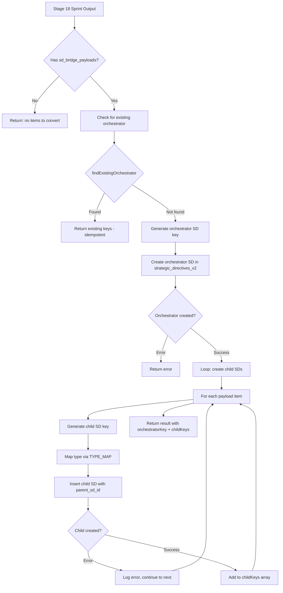

# 06 - Lifecycle-to-SD Bridge

## Purpose

The Lifecycle-to-SD Bridge is the critical integration point where the Eva
Orchestrator's venture lifecycle **feeds into** the LEO Protocol workflow
system. When a venture reaches Stage 18 (MVP Development Loop) and produces a
sprint plan, this bridge converts each sprint item into a LEO Strategic
Directive (SD) that can be tracked, planned, and executed through the standard
LEAD-PLAN-EXEC workflow.

Without this bridge, venture stage outputs would remain as artifacts with no
mechanism to drive actual implementation work through LEO.

**Module**: `lib/eva/lifecycle-sd-bridge.js` (284 lines)
**Related SD**: SD-LEO-FEAT-LIFECYCLE-SD-BRIDGE-001

---

## Architectural Position

```
Eva Orchestrator Lifecycle                    LEO Protocol Workflow
========================                    ======================

Stage 17 (Product Planning)
        |
        v
Stage 18 (MVP Development Loop)
        |
        | sprint plan with
        | sd_bridge_payloads[]
        |
        v
+---------------------------+
| Lifecycle-to-SD Bridge    |---+
| convertSprintToSDs()      |   |
+---------------------------+   |
        |                       |
        |  Creates              | Records
        |                       |
        v                       v
+------------------+    +------------------+
| strategic_       |    | venture_         |
| directives_v2    |    | artifacts        |
| (orchestrator    |    | (bridge result)  |
|  + N children)   |    |                  |
+--------+---------+    +------------------+
         |
         v
  LEO LEAD Phase
  (SD approval, PRD creation)
         |
         v
  LEO PLAN Phase
  (validation, design)
         |
         v
  LEO EXEC Phase
  (implementation, testing)
```

The bridge occupies the boundary between two systems:
- **Upstream**: Eva Orchestrator stage execution (venture lifecycle)
- **Downstream**: LEO Protocol SD workflow (engineering execution)

---

## Stage 18 Sprint Plan Structure

Stage 18 produces a sprint plan that includes an `sd_bridge_payloads` array.
Each payload represents one sprint item that needs to become an SD.

### Expected Input Shape

The bridge expects `stageOutput` with these fields:

| Field | Type | Purpose |
|-------|------|---------|
| `sprint_name` | string | Human-readable sprint identifier |
| `sprint_goal` | string | Sprint objective statement |
| `sprint_duration_days` | number | Duration of the sprint |
| `sd_bridge_payloads` | array | Sprint items to convert to SDs |

Each item in `sd_bridge_payloads` contains:

| Field | Type | Purpose |
|-------|------|---------|
| `title` | string | Sprint item title (becomes SD title) |
| `description` | string | Detailed description (becomes SD description) |
| `scope` | string | Scope statement (becomes SD scope) |
| `type` | string | Item type: feature, bugfix, enhancement, refactor, infra |
| `priority` | string | Priority level (defaults to "medium") |
| `success_criteria` | string | Acceptance criteria for the item |
| `target_application` | string | Target app (defaults to "EHG_Engineer") |
| `risks` | array | Risk items (string or {risk, mitigation} objects) |
| `dependencies` | array | Dependencies on other sprint items |

---

## Conversion Flow



### Step-by-Step Process

1. **Input validation** -- Check that `sd_bridge_payloads` array is non-empty
2. **Venture prefix** -- Normalize venture name into SD key prefix via
   `normalizeVenturePrefix()` from `scripts/modules/sd-key-generator.js`
3. **Idempotency check** -- Query `strategic_directives_v2` for an existing
   orchestrator matching the venture ID and sprint name
4. **Orchestrator creation** -- Generate SD key via `generateSDKey()`, insert
   orchestrator row into `strategic_directives_v2`
5. **Child creation loop** -- For each sprint item, generate a child key via
   `generateChildKey()`, map the type, and insert the child SD row
6. **Result assembly** -- Return the orchestrator key, all child keys, and
   any errors encountered during child creation

---

## SD Key Generation

The bridge delegates key generation to `scripts/modules/sd-key-generator.js`,
which produces LEO-standard SD keys:

```
Orchestrator Key Pattern:
   SD-{VENTURE_PREFIX}-ORCH-SPRINT-{NAME}-001

Child Key Pattern:
   SD-{VENTURE_PREFIX}-ORCH-SPRINT-{NAME}-001-A
   SD-{VENTURE_PREFIX}-ORCH-SPRINT-{NAME}-001-B
   SD-{VENTURE_PREFIX}-ORCH-SPRINT-{NAME}-001-C
   ...
```

Child keys use alphabetic suffixes (A, B, C, ...) derived from the sprint
item's array index via `String.fromCharCode(65 + index)`.

The `skipLeadValidation: true` flag is set on key generation because the
bridge creates SDs programmatically, bypassing the normal LEAD approval
flow at creation time. The SDs will still go through LEAD approval when
they enter the LEO workflow.

---

## Type Mapping

The bridge maps Stage 18 output types to database `sd_type` values:

| Stage 18 Type | Database sd_type |
|---------------|-----------------|
| `feature` | `feature` |
| `bugfix` | `bugfix` |
| `enhancement` | `feature` |
| `refactor` | `refactor` |
| `infra` | `infrastructure` |

If a payload type is not in the map, it defaults to `feature`. This ensures
every sprint item maps to a valid `sd_type` that is registered in the LEO
Protocol's 13 reference points (see MEMORY.md for the full list).

---

## Idempotency: Preventing Duplicate Orchestrators

The `findExistingOrchestrator()` function provides idempotency by checking
whether an orchestrator SD already exists for a given venture + sprint
combination.

### Lookup Strategy

```
Query strategic_directives_v2 WHERE:
  - sd_type = 'orchestrator'
  - metadata->>'venture_id' = ventureId
  - metadata->>'sprint_name' = sprintName
  LIMIT 1
```

If found, the function also loads the orchestrator's children by querying
for rows where `parent_sd_id` matches the orchestrator's UUID.

### Why JSONB Metadata Lookup?

The venture_id and sprint_name are stored in the SD's `metadata` JSONB
column rather than in dedicated columns. This is because the
`strategic_directives_v2` table serves all SD types, and venture-specific
fields would be NULL for non-venture SDs. The JSONB approach keeps the
table schema clean while allowing structured queries via PostgreSQL's
`->>` operator.

---

## Orchestrator SD Structure

The bridge creates the orchestrator with these field mappings:

| SD Field | Source |
|----------|--------|
| `title` | `Sprint: {sprint_name}` |
| `description` | Composed from sprint name, goal, duration, item count |
| `scope` | Sprint orchestrator description |
| `rationale` | Stage 18 produced N items requiring LEO workflow |
| `sd_type` | `orchestrator` |
| `status` | `draft` |
| `priority` | `medium` |
| `current_phase` | `LEAD` |
| `created_by` | `lifecycle-sd-bridge` |
| `success_criteria` | Array of sprint item titles |
| `metadata.venture_id` | Venture UUID |
| `metadata.sprint_name` | Sprint identifier |
| `metadata.created_via` | `lifecycle-sd-bridge` |

---

## Child SD Structure

Each child SD maps a single sprint item to an SD row:

| SD Field | Source |
|----------|--------|
| `title` | payload.title |
| `description` | payload.description |
| `scope` | payload.scope |
| `rationale` | Composed from sprint name and description |
| `sd_type` | Mapped via TYPE_MAP |
| `parent_sd_id` | UUID of the orchestrator SD |
| `priority` | payload.priority or "medium" |
| `current_phase` | `LEAD` |
| `created_by` | `lifecycle-sd-bridge` |
| `metadata.sprint_item_index` | Array index of the item |
| `metadata.dependencies` | payload.dependencies array |

---

## Bridge Artifact Record

After conversion, the bridge can produce an artifact record for storage in
`venture_artifacts` via `buildBridgeArtifactRecord()`. This creates a
permanent link between the venture stage execution and the SDs that were
created.

```
Bridge Artifact Record
======================

venture_id:        Venture UUID
lifecycle_stage:   18 (Stage 18)
artifact_type:     'lifecycle_sd_bridge'
title:             'Lifecycle-to-SD Bridge - Stage 18'
content:           JSON with orchestratorKey, childKeys, errors
quality_score:     100 if no errors, decremented by 25 per error
validation_status: 'validated' or 'pending'
source:            'lifecycle-sd-bridge'
```

The quality score formula: `max(0, 100 - (error_count * 25))`. A clean
conversion with zero errors scores 100; each failed child creation drops
the score by 25 points.

---

## Integration Points

### Upstream: Eva Orchestrator

The Eva Orchestrator calls `convertSprintToSDs()` when Stage 18 completes.
The orchestrator passes:

- `stageOutput` -- The full output from Stage 18 execution
- `ventureContext` -- Venture metadata including `{ id, name }`

### Downstream: LEO Protocol

Once the bridge creates SDs, they enter the standard LEO workflow:

```
Bridge creates SDs (status: 'draft', phase: 'LEAD')
         |
         v
LEAD Phase: Chairman/Lead reviews and approves SDs
         |
         v
PLAN Phase: PRD creation, design, validation
         |
         v
EXEC Phase: Implementation, testing, deployment
         |
         v
Completion: SD marked complete, child-to-child continues
```

The orchestrator SD coordinates its children using LEO's standard
orchestrator-child workflow, including AUTO-PROCEED child-to-child
continuation.

### SD Key Generator

The bridge depends on `scripts/modules/sd-key-generator.js` for:

- `generateSDKey()` -- Creates the orchestrator SD key
- `generateChildKey()` -- Creates child SD keys from parent key
- `normalizeVenturePrefix()` -- Converts venture name to a valid key prefix

---

## Error Handling

The bridge uses a **continue-on-error** strategy for child creation:

```
Create Orchestrator
    |
    +--> FAIL: Return immediately (no children without parent)
    |
    +--> SUCCESS: Begin child loop
              |
              +--> Child 1: SUCCESS --> add to childKeys
              +--> Child 2: FAIL    --> log error, add to errors[], continue
              +--> Child 3: SUCCESS --> add to childKeys
              +--> Child 4: SUCCESS --> add to childKeys
              |
              v
         Return { created: true, childKeys: [1,3,4], errors: ["Child 2: ..."] }
```

If the orchestrator fails to create, the entire operation fails. If
individual children fail, the successful ones are still created and returned.
The caller can inspect the `errors` array to determine if any children were
lost.

---

## Dependency Injection

The `convertSprintToSDs()` function accepts a `deps` parameter for testing:

| Dependency | Default | Override Purpose |
|-----------|---------|------------------|
| `supabase` | Created from env vars | Mock DB client for tests |
| `logger` | `console` | Capture log output in tests |

The internal `getSupabaseClient()` helper creates a client from
`SUPABASE_URL` and `SUPABASE_SERVICE_ROLE_KEY` environment variables.

---

## Key Design Decisions

### Why Orchestrator + Children (Not Flat SDs)?

Sprint items are logically grouped -- they share a sprint goal, timeline, and
context. The orchestrator pattern enables:

1. **Grouped tracking** -- View all sprint items as a cohesive unit
2. **AUTO-PROCEED** -- LEO's child-to-child continuation processes items
   sequentially
3. **Progress visibility** -- Orchestrator completion reflects sprint
   completion

### Why Idempotency via Metadata Query?

Re-running Stage 18 (e.g., after a crash) must not create duplicate SDs.
The metadata-based lookup ensures that calling `convertSprintToSDs()` with
the same venture + sprint combination returns existing SDs rather than
creating new ones.

### Why All Children Start in LEAD Phase?

Even though the SDs were generated programmatically, they still need human
approval before planning and implementation begin. Starting in LEAD phase
ensures the Chairman reviews and approves each item before engineering
resources are committed.

---

## Related Components

| Component | Relationship |
|-----------|-------------|
| Eva Orchestrator | Calls bridge at Stage 18 completion |
| SD Key Generator | Generates LEO-standard SD keys |
| `strategic_directives_v2` | Target table for created SDs |
| `venture_artifacts` | Stores bridge artifact record |
| LEO Protocol Workflow | Executes the created SDs through LEAD-PLAN-EXEC |
| AUTO-PROCEED | Drives child-to-child continuation after SD creation |
