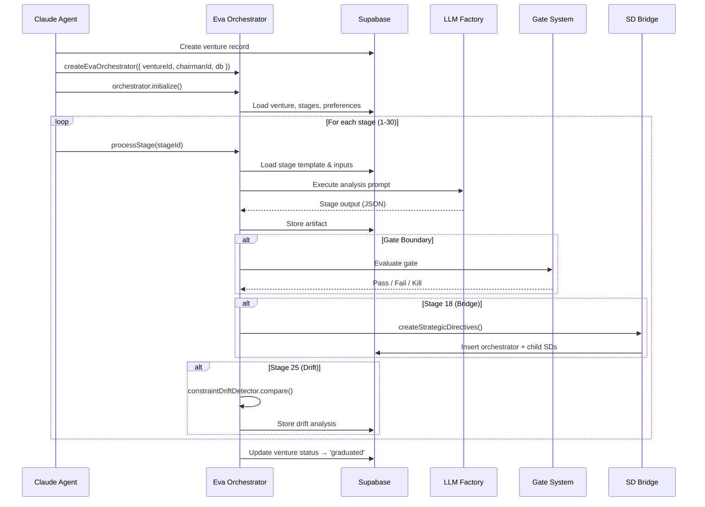

# Running a Venture: End-to-End Guide

This guide walks through the complete lifecycle of orchestrating a venture
through the Eva Orchestrator, from initialization to graduation.

## Venture Lifecycle Overview



## Step-by-Step Walkthrough

### Step 1: Create the Venture Record

Before the orchestrator can run, a venture must exist in the `ventures` table.

The venture record captures:

| Field | Purpose |
|-------|---------|
| `name` | Venture display name |
| `description` | One-paragraph venture thesis |
| `venture_type` | Category (saas, marketplace, service, product) |
| `current_lifecycle_stage` | Starting stage (typically 0 or 1) |
| `status` | Must be `active` to process stages |
| `metadata` | Optional JSON with initial context |

The venture ID (UUID) returned from this insert is used for all subsequent
operations.

### Step 2: Set Active Venture Context

The `VentureContextManager` at `lib/eva/venture-context-manager.js` maintains
the currently active venture for the session.

Call `VentureContextManager.setActiveVenture(ventureId)` to:

- Load the venture record from database
- Cache venture metadata for stage template access
- Set the venture scope for artifact storage
- Initialize the event stream for this venture

This must be called before orchestrator initialization. The context manager
validates that the venture exists and has `status = 'active'`.

### Step 3: Configure Chairman Preferences

The Chairman persona controls decision thresholds throughout the lifecycle.
Preferences are stored per-venture via `ChairmanPreferenceStore` at
`lib/eva/chairman-preference-store.js`.

Key preferences to configure:

| Preference Key | Default | Purpose |
|----------------|---------|---------|
| `kill_gate_threshold` | 0.6 | Minimum score to survive kill gates |
| `reality_gate_strictness` | `standard` | How strictly artifact presence is enforced |
| `promotion_gate_checklist` | (varies) | Items required for stage promotion |
| `risk_tolerance` | `moderate` | Affects Devil's Advocate challenge intensity |
| `pivot_threshold` | 0.4 | Score below which pivot is recommended |
| `auto_approve_above` | 0.85 | Score above which Chairman auto-approves |

Call `ChairmanPreferenceStore.setPreference(ventureId, key, value)` for each
preference that should differ from defaults.

### Step 4: Create the Orchestrator

The factory function `createEvaOrchestrator()` in `lib/eva/index.js` constructs
a fully configured orchestrator instance.

Required parameters:

| Parameter | Type | Purpose |
|-----------|------|---------|
| `ventureId` | UUID | The venture to orchestrate |
| `chairmanId` | UUID | Chairman persona identifier |
| `db` | Supabase client | Database connection |

Optional parameters:

| Parameter | Type | Default | Purpose |
|-----------|------|---------|---------|
| `llmClient` | Object | Auto-resolved | Override LLM client (useful for testing) |
| `dryRun` | boolean | false | Simulate without database writes |
| `resumeFrom` | number | null | Resume from a specific stage |

The factory wires together all dependencies: context manager, preference store,
decision filter engine, gates, bridge, and drift detector.

### Step 5: Initialize the Orchestrator

Call `orchestrator.initialize()` to:

1. Validate the venture exists and is active
2. Load all 30 stage configurations from `lifecycle_stage_config`
3. Load existing artifacts (for resume scenarios)
4. Load existing stage transitions (for idempotency)
5. Initialize the Chairman preference cache
6. Verify LLM client connectivity

Initialization fails fast if any prerequisite is missing: venture not found,
database unreachable, or required configuration absent.

### Step 6: Process Stages

#### Single Stage Execution

`orchestrator.processStage(stageNumber)` executes one stage:

```
processStage(stageNumber)
    |
    +-- 1. Load stage template (stage-templates/stage-{NN}.js)
    +-- 2. Validate dependencies (depends_on stages completed)
    +-- 3. Gather required inputs (from previous artifacts)
    +-- 4. Execute analysis prompt via LLM
    +-- 5. Validate output schema
    +-- 6. Store artifact in venture_artifacts
    +-- 7. Record transition in venture_stage_transitions
    +-- 8. Emit eva_event
    +-- 9. Apply decision filters
    +-- 10. Evaluate gate (if boundary)
    |
    +-- Returns: { artifact, gateResult, events }
```

#### Multi-Stage Execution

`orchestrator.runMultipleStages(fromStage, toStage)` processes a range
of stages sequentially, respecting dependencies and gates:

```
runMultipleStages(1, 30)
    |
    +-- Stage 1 → Stage 2 → ... → Stage N
    |
    +-- Stops on:
    |     - Kill gate failure (Chairman must decide)
    |     - Unresolved dependency
    |     - Unrecoverable LLM error (after 3 retries)
    |
    +-- Skips:
    |     - Already-completed stages (idempotency)
    |     - Inactive stages (is_active = false)
    |
    +-- Returns: { completedStages, skippedStages, failedStage, artifacts }
```

#### Stage Execution Flow (ASCII)

```
                    +-----------------+
                    |  Load Template  |
                    +--------+--------+
                             |
                    +--------v--------+
                    | Check Depends   |
                    +--------+--------+
                             |
                   +---------+---------+
                   |                   |
              Met  |              Not Met
                   |                   |
          +--------v--------+    +-----v-----+
          | Gather Inputs   |    |   SKIP    |
          +--------+--------+    |  (defer)  |
                   |             +-----------+
          +--------v--------+
          | Execute LLM     |
          +--------+--------+
                   |
          +--------v--------+
          | Validate Output |
          +--------+--------+
                   |
          +--------v--------+
          | Store Artifact  |
          +--------+--------+
                   |
          +--------v--------+
          | Decision Filter |
          +--------+--------+
                   |
              +----v----+
              | Gate?   |
              +----+----+
                   |
         +---------+---------+---------+
         |                   |         |
     No Gate            Kill Gate   Reality Gate
         |                   |         |
    +----v----+     +--------v---+ +---v--------+
    | Continue |     | Score >= T | | Artifacts  |
    +---------+     |   ?        | |  present?  |
                    +-----+------+ +-----+------+
                     Y    |    N     Y   |    N
                    +--+  +--+     +--+  +--+
                    |OK|  |KILL|   |OK|  |BLOCK|
                    +--+  +----+   +--+  +-----+
```

### Step 7: Handle Gates

Gates are enforcement boundaries that control stage progression.

#### Kill Gates

Kill gates evaluate the quality score of a stage output against the Chairman's
`kill_gate_threshold`. Located in `lib/eva/gates/stage-gates.js`.

When a kill gate fires:

1. Stage output score is compared to threshold
2. If below threshold, the venture receives a "kill recommendation"
3. The Chairman persona must decide: pivot, persevere, or terminate
4. Decision is recorded in `eva_events` with `event_type = 'kill_gate_decision'`
5. If terminated, venture status changes to `killed`

Kill gate boundaries are typically at stages 6, 12, 18, 24, and 30.

#### Reality Gates

Reality gates validate that required artifacts exist before crossing a
phase boundary. Located in `lib/eva/gates/reality-gates.js`.

The `BOUNDARY_CONFIG` in reality-gates.js defines:

- Which stage transitions constitute boundaries
- Which artifact types must be present
- Minimum quality scores for each artifact

When a reality gate fails:

1. Missing artifacts are listed in the gate result
2. Stage processing pauses at the boundary
3. Missing artifacts must be generated (by re-running earlier stages or manual input)
4. Gate is re-evaluated after artifacts are present

#### Promotion Gates

Promotion gates verify a checklist of conditions before a venture advances
to the next lifecycle phase. These are configured in the Chairman preferences
and verified at phase transitions (identity → blueprint → build → launch → growth).

### Step 8: Handle the SD Bridge (Stage 18)

At stage 18, the `lifecycle-sd-bridge` at `lib/eva/bridge/lifecycle-sd-bridge.js`
translates venture analysis into actionable LEO Strategic Directives.

The bridge performs:

1. **Extract Actionable Items**: Parses stage 1-18 artifacts for implementation tasks
2. **Map to SD Types**: Converts venture tasks to SD types (feature, infrastructure, etc.)
3. **Check Existing**: `findExistingOrchestrator()` prevents duplicate SD creation
4. **Create Orchestrator SD**: Parent SD for the venture's implementation work
5. **Create Child SDs**: Individual work items under the orchestrator
6. **Link Back**: Records SD IDs in venture metadata for traceability

The bridge uses idempotency checks to ensure that re-running stage 18 does not
create duplicate SDs. It checks `strategic_directives_v2` for existing records
matching the venture ID.

### Step 9: Handle Constraint Drift (Stage 25)

At stage 25, the `constraint-drift-detector` at
`lib/eva/drift/constraint-drift-detector.js` compares the venture's current
state against its original assumptions.

Drift detection evaluates:

| Dimension | What It Checks |
|-----------|----------------|
| Market assumptions | Have market conditions changed since Stage 1-5? |
| Technical feasibility | Are original technical assumptions still valid? |
| Financial projections | Do unit economics still hold? |
| Competitive landscape | Have new competitors emerged? |
| Regulatory environment | Have regulations changed? |

Drift results are stored as artifacts and surfaced to the Chairman for review.
Significant drift may trigger a recommendation to re-run earlier stages with
updated assumptions.

### Step 10: Venture Completion

When all 30 stages complete successfully and all gates pass:

1. Venture `status` is updated to `graduated`
2. Final `eva_event` is emitted with `event_type = 'venture_graduated'`
3. All artifacts are versioned and finalized
4. If SD bridge was triggered, orchestrator SD status is updated
5. Retrospective data is available for the `/learn` command

## Venture Lifecycle Phases

The 30 stages are organized into 5 phases:

```
Phase 1: IDENTITY (Stages 1-6)
+-----+-----+-----+-----+-----+-----+
|  1  |  2  |  3  |  4  |  5  |  6  |
| Why | Who | What| How | Fit | Vld |
+-----+-----+-----+-----+-----+-----+
                                  |
                            Kill Gate 1
                                  |
Phase 2: BLUEPRINT (Stages 7-12)
+-----+-----+-----+-----+-----+-----+
|  7  |  8  |  9  | 10  | 11  | 12  |
| Rev | Prc | Chn | Ops | Tm  | Fin |
+-----+-----+-----+-----+-----+-----+
                                  |
                            Kill Gate 2
                                  |
Phase 3: BUILD (Stages 13-18)
+-----+-----+-----+-----+-----+-----+
| 13  | 14  | 15  | 16  | 17  | 18  |
| MVP | Arc | Ux  | Tst | Lnc | Bdg |
+-----+-----+-----+-----+-----+-----+
                                  |
                         Kill Gate 3 + SD Bridge
                                  |
Phase 4: LAUNCH (Stages 19-24)
+-----+-----+-----+-----+-----+-----+
| 19  | 20  | 21  | 22  | 23  | 24  |
| Go  | Mkt | Sal | Sup | Mtr | Scl |
+-----+-----+-----+-----+-----+-----+
                                  |
                            Kill Gate 4
                                  |
Phase 5: GROWTH (Stages 25-30)
+-----+-----+-----+-----+-----+-----+
| 25  | 26  | 27  | 28  | 29  | 30  |
| Dft | Exp | Prt | Ext | Gov | Grd |
+-----+-----+-----+-----+-----+-----+
                                  |
                     Kill Gate 5 + Graduation
```

## Resume and Recovery

### Resuming an Interrupted Venture

If processing is interrupted (session timeout, error, manual stop), the
orchestrator supports resumption:

1. Create a new orchestrator with the same `ventureId`
2. Call `initialize()` - it loads existing artifacts and transitions
3. Call `runMultipleStages(resumeStage, 30)`
4. Already-completed stages are skipped via idempotency checks

The `venture_stage_transitions` table tracks which stages have been completed.
Each transition has an `idempotency_key` derived from the venture ID and stage
number, preventing duplicate processing.

### Handling Failed Gates on Resume

If a venture was stopped due to a kill gate failure:

1. Check `eva_events` for the most recent `kill_gate_decision` event
2. If the Chairman decided to "persevere", re-run the failed stage
3. If "pivot", update venture metadata with pivot direction, then re-run
4. If "terminate", do not resume - venture status should be `killed`

### Idempotency Guarantees

| Operation | Idempotency Key | Behavior on Duplicate |
|-----------|-----------------|----------------------|
| Stage transition | `{ventureId}:{stageNumber}` | Skip (already processed) |
| Artifact creation | `{ventureId}:{stageNumber}:{artifactType}` | Update version |
| SD bridge creation | `{ventureId}:orchestrator` | Return existing SD |
| Event emission | `{ventureId}:{stageNumber}:{eventType}` | Allow (audit trail) |

## Integration with LEO Protocol

The Eva Orchestrator integrates with LEO Protocol at these points:

| Integration | Mechanism | Trigger |
|-------------|-----------|---------|
| SD Creation | lifecycle-sd-bridge | Stage 18 completion |
| Drift Detection | constraint-drift-detector | Stage 25 completion |
| Cross-Venture Learning | cross-venture-pattern module | Venture graduation |
| Documentation | DOCMON sub-agent | Venture completion |
| Retrospective | RETRO sub-agent | Post-graduation |

## Related Documentation

- Developer Setup: `docs/workflow/cli-venture-lifecycle/guides/developer-setup.md`
- Testing Guide: `docs/workflow/cli-venture-lifecycle/guides/testing-guide.md`
- Troubleshooting: `docs/workflow/cli-venture-lifecycle/guides/troubleshooting.md`
- Architecture Overview: `docs/workflow/cli-venture-lifecycle/architecture/`
