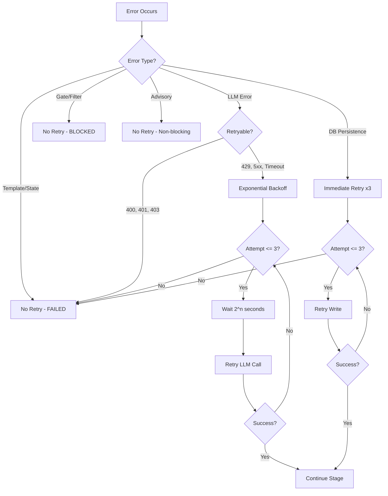

# Error Handling Reference

This document describes the error handling taxonomy, retry strategies, recovery patterns, and fail-safe behaviors of the Eva Orchestrator CLI Venture Lifecycle system.

## Error Handling Philosophy

The Eva Orchestrator follows three principles for error handling:

1. **Fail-closed on safety boundaries** - Gates and filters default to rejection when errors occur
2. **Retry on transient failures** - Network and database timeouts get automatic retry with backoff
3. **Non-blocking on advisory operations** - Devil's Advocate and cross-venture learning failures do not halt stage progression

## Error Category Taxonomy

```
+------------------------------------------------------------------+
|                    Error Categories                                |
+------------------------------------------------------------------+
|                                                                    |
|  RECOVERABLE (auto-retry)          NON-RECOVERABLE (immediate)    |
|  +---------------------------+     +---------------------------+  |
|  | LLM Execution Error       |     | Template Load Error       |  |
|  | - API timeout              |     | - TEMPLATE_NOT_FOUND      |  |
|  | - Rate limiting            |     | - INVALID_TEMPLATE        |  |
|  | - Network failure          |     |                           |  |
|  +---------------------------+     +---------------------------+  |
|  | Artifact Persistence Error |     | State Transition Error    |  |
|  | - Connection timeout       |     | - STATE_MACHINE_REJECTED  |  |
|  | - Deadlock                 |     | - Invalid stage number    |  |
|  | - Transient DB error       |     |                           |  |
|  +---------------------------+     +---------------------------+  |
|                                                                    |
|  BLOCKING (fixable)                NON-BLOCKING (advisory)        |
|  +---------------------------+     +---------------------------+  |
|  | Context Load Error         |     | Devil's Advocate Error    |  |
|  | - Venture not found        |     | - LLM failure in review   |  |
|  | - Chairman data missing    |     | - Non-critical             |  |
|  +---------------------------+     +---------------------------+  |
|  | Decision Filter Error      |     | Cross-Venture Learning    |  |
|  | - Uses defaults on error   |     | - Pattern analysis error  |  |
|  +---------------------------+     | - Non-critical             |  |
|  | Reality Gate Error          |     +---------------------------+  |
|  | - Quality check failed     |                                    |
|  | - Kill condition met       |                                    |
|  +---------------------------+                                    |
|  | Stage Gate Error            |                                   |
|  | - Promotion check failed   |                                   |
|  +---------------------------+                                    |
+------------------------------------------------------------------+
```

## Detailed Error Categories

### Template Load Error

**Source:** `lib/eva/stage-templates/index.js`

| Aspect | Value |
|--------|-------|
| Handling | Log error, return FAILED status |
| Retry | No - deterministic failure |
| Result Status | FAILED |
| Recovery | Fix or create the missing template, then re-run |

**Error Codes:**

| Code | Cause | Resolution |
|------|-------|------------|
| TEMPLATE_NOT_FOUND | No template file exists for the requested stage number | Create template in `lib/eva/stage-templates/` |
| INVALID_TEMPLATE | Template exists but fails schema validation | Fix template to match expected StageTemplate schema |

**Behavior:** Template errors are non-retryable because they indicate a code/configuration problem, not a transient condition. The orchestrator immediately returns FAILED without attempting the stage.

### Context Load Error

**Source:** `lib/eva/eva-orchestrator.js` (initialize method)

| Aspect | Value |
|--------|-------|
| Handling | Log error, return BLOCKED status |
| Retry | No - data is missing, not transiently unavailable |
| Result Status | BLOCKED |
| Recovery | Ensure venture exists in database, verify chairman data |

**Error Scenarios:**

| Scenario | Cause | Resolution |
|----------|-------|------------|
| Venture not found | Invalid ventureId or venture deleted | Verify venture exists in `ventures` table |
| Chairman data missing | Invalid chairmanId or no preferences | Create chairman user and initialize preferences |
| Stage config incomplete | Missing lifecycle_stage_config rows | Run migration to seed all 25 stage configs |

**Behavior:** Context load errors occur during `initialize()` before any stage processing begins. The orchestrator cannot function without venture context.

### LLM Execution Error

**Source:** `lib/eva/eva-orchestrator.js` (processStage method, LLM call)

| Aspect | Value |
|--------|-------|
| Handling | Log error, retry with exponential backoff |
| Retry | Yes - 3 attempts with exponential backoff |
| Result Status | FAILED (after retries exhausted) |
| Recovery | Automatic retry; manual re-run if all retries fail |

**Retry Schedule:**

```
Attempt 1: Immediate
Attempt 2: Wait 1 second
Attempt 3: Wait 2 seconds
Attempt 4: Wait 4 seconds (capped at 10s)
   |
   +-> All retries exhausted -> FAILED
```

**Retryable Conditions:**
- HTTP 429 (rate limited)
- HTTP 500/502/503 (server errors)
- Network timeout
- Connection reset

**Non-retryable Conditions:**
- HTTP 400 (bad request - indicates prompt/template error)
- HTTP 401/403 (authentication - indicates config error)
- Malformed response (indicates template issue)

### Decision Filter Error

**Source:** `lib/eva/decision-filter-engine.js`

| Aspect | Value |
|--------|-------|
| Handling | Log error, use conservative defaults |
| Retry | No - falls back to safe defaults |
| Result Status | BLOCKED (conservative) |
| Recovery | Fix preference data, re-run stage |

**Default Behavior on Error:**

When the Decision Filter Engine cannot evaluate properly, it applies conservative defaults:

| Default | Value | Rationale |
|---------|-------|-----------|
| auto_proceed | false | Require human review when uncertain |
| decision_class | 'C' | Escalate to chairman when filter is unreliable |
| recommendation | 'pause' | Do not advance when decision quality is unknown |

This fail-safe ensures that no venture advances without proper evaluation, even if the filter itself is broken.

### Reality Gate Error

**Source:** `lib/eva/reality-gates.js`

| Aspect | Value |
|--------|-------|
| Handling | Log error, gate fails (fail-closed) |
| Retry | No - gate evaluation is deterministic |
| Result Status | BLOCKED |
| Recovery | Fix artifact quality, resolve kill conditions, re-run |

**Gate Types and Failure Modes:**

| Gate Type | Failure Cause | Resolution |
|-----------|---------------|------------|
| Kill Gate | Kill condition triggered (e.g., runway < 1 month) | Address the kill condition or get chairman override |
| Promotion Gate | Promotion criteria not met | Complete checklist items, improve metrics |
| Quality Gate | Artifact quality score below threshold | Improve artifact quality, re-generate |
| Boundary Gate | Custom boundary constraint violated | Review boundary config, adjust or comply |

**Fail-Closed Behavior:** If a database error occurs during gate evaluation, the gate returns `{ passed: false }`. This prevents ventures from advancing through gates that could not be properly evaluated.

```
evaluateRealityGate()
    |
    +-> DB query succeeds -> Evaluate gate logic -> pass/fail
    |
    +-> DB query fails -> Log error -> { passed: false }
                                        (fail-closed)
```

### Stage Gate Error

**Source:** `lib/eva/reality-gates.js` (stage-specific gates)

| Aspect | Value |
|--------|-------|
| Handling | Log error, return BLOCKED |
| Retry | No - requires manual intervention |
| Result Status | BLOCKED |
| Recovery | Depends on gate type |

Stage gates are a subset of reality gates that apply at specific lifecycle boundaries (e.g., the boundary between exploration and build phases).

### Artifact Persistence Error

**Source:** `lib/eva/eva-orchestrator.js` (artifact write operations)

| Aspect | Value |
|--------|-------|
| Handling | Log error, retry immediately |
| Retry | Yes - 3 attempts with immediate retry |
| Result Status | FAILED (after retries exhausted) |
| Recovery | Automatic retry; check database connectivity if persistent |

**Retry Schedule:**

```
Attempt 1: Immediate write
Attempt 2: Immediate retry (no delay)
Attempt 3: Immediate retry (no delay)
Attempt 4: Immediate retry (no delay)
   |
   +-> All retries exhausted -> FAILED
```

**Why Immediate Retry:** Artifact persistence errors are typically caused by transient database conditions (connection pool exhaustion, brief network hiccup). Unlike LLM errors, backoff is unnecessary because the database recovers quickly.

**Idempotency:** Artifact writes use composite key deduplication `(venture_id, lifecycle_stage, artifact_type, version)`, making retries safe against duplicate records.

### State Transition Error

**Source:** `lib/eva/eva-orchestrator.js` (state machine)

| Aspect | Value |
|--------|-------|
| Handling | Log error, return FAILED |
| Retry | No - state machine rejection is deterministic |
| Result Status | FAILED |
| Recovery | Investigate why the transition was rejected |

**Non-retryable Error Codes:**

| Code | Cause | Resolution |
|------|-------|------------|
| STATE_MACHINE_REJECTED | Transition violates state machine rules | Check `lifecycle_stage_config.depends_on` for unmet dependencies |
| INVALID_STAGE | Stage number outside 1-25 range | Correct the stage number |
| TRANSITION_EXISTS | Idempotency key already used | This is actually success (operation already completed) |

## Status Result Contract

Every stage processing operation returns a `StatusResult` with one of three statuses:

```
+---------------------------------------------------------------------+
|                       StatusResult States                            |
+---------------------------------------------------------------------+
|                                                                      |
|  COMPLETED                                                           |
|  +--------------------------------------------------------------+   |
|  | All checks passed                                              |  |
|  | Artifacts persisted to venture_artifacts                       |  |
|  | Transition recorded in venture_stage_transitions               |  |
|  | Events emitted to eva_events                                   |  |
|  | Stage advanced in ventures.current_lifecycle_stage              |  |
|  +--------------------------------------------------------------+   |
|                                                                      |
|  BLOCKED                                                             |
|  +--------------------------------------------------------------+   |
|  | A gate or filter prevented advancement                         |  |
|  | Condition is fixable (improve quality, resolve dependency)      |  |
|  | No state change occurred                                        |  |
|  | Artifacts may have been partially generated but not committed   |  |
|  +--------------------------------------------------------------+   |
|                                                                      |
|  FAILED                                                              |
|  +--------------------------------------------------------------+   |
|  | Unrecoverable error (template missing, state machine reject)   |  |
|  | Retries exhausted (LLM or DB failures)                         |  |
|  | No state change occurred                                        |  |
|  | Requires investigation before re-attempt                        |  |
|  +--------------------------------------------------------------+   |
|                                                                      |
+---------------------------------------------------------------------+
```

### Status Transition Rules

```
                    processStage()
                         |
              +----------+----------+
              |          |          |
              v          v          v
          COMPLETED   BLOCKED    FAILED
              |          |          |
              |          |          +-> Log + stop
              |          |              (needs investigation)
              |          |
              |          +-> Return to caller
              |              (fixable condition)
              |
              +-> Advance state
                  (continue to next stage)
```

**Key Rule:** Only COMPLETED results cause state changes. BLOCKED and FAILED are side-effect-free (no database mutations to ventures or transitions tables).

## Retry Strategy Summary



### Backoff Parameters

| Parameter | LLM Retry | DB Retry |
|-----------|-----------|----------|
| Max attempts | 3 | 3 |
| Initial delay | 1 second | 0 (immediate) |
| Backoff multiplier | 2x | N/A |
| Max delay | 10 seconds | N/A |
| Jitter | None | None |

## Non-Retryable Error Codes

These error codes indicate deterministic failures that will not resolve through retry:

| Code | Source | Category |
|------|--------|----------|
| TEMPLATE_NOT_FOUND | stage-templates/index.js | Template Load |
| INVALID_TEMPLATE | stage-templates/index.js | Template Load |
| STATE_MACHINE_REJECTED | eva-orchestrator.js | State Transition |
| INVALID_STAGE | eva-orchestrator.js | State Transition |
| VENTURE_NOT_FOUND | eva-orchestrator.js | Context Load |
| CHAIRMAN_NOT_FOUND | eva-orchestrator.js | Context Load |
| KILL_CONDITION_MET | reality-gates.js | Reality Gate |

## Fail-Closed Behaviors

Several components default to the conservative (blocking) outcome when they cannot determine the correct result:

### Reality Gates

```
evaluateRealityGate()
    |
    +-> Normal path: evaluate gate logic -> pass or fail
    |
    +-> Error path: DB error, missing data, exception
        |
        +-> Return { passed: false, reason_code: 'EVALUATION_ERROR' }
```

**Rationale:** A venture should never advance past a gate that could not be properly evaluated. False negatives (blocking a valid transition) are preferable to false positives (allowing an invalid transition).

### Decision Filter Engine

```
evaluateDecision()
    |
    +-> Normal path: evaluate triggers -> recommendation
    |
    +-> Error path: preference lookup fails, trigger error
        |
        +-> Return {
              auto_proceed: false,
              decision_class: 'C',
              recommendation: 'pause'
            }
```

**Rationale:** When the decision filter cannot evaluate properly, the safest action is to escalate to the chairman (Class C) and pause advancement.

### Devil's Advocate (Exception: Fail-Open)

```
getDevilsAdvocateReview()
    |
    +-> Normal path: generate review -> persist artifact
    |
    +-> Error path: LLM error, timeout
        |
        +-> Log warning
        +-> Return empty review (non-blocking)
        +-> Stage continues without advisory
```

**Rationale:** Devil's Advocate is advisory-only. Blocking stage progression because a review could not be generated would add friction without safety benefit. The review can be generated retroactively.

## Recovery Patterns

### Kill Gate Rejection Recovery

```
Kill Gate Rejects Transition
    |
    v
Chairman Reviews Kill Condition
    |
    +-> Revise: Address the kill condition (e.g., extend runway)
    |   +-> Re-run stage -> gate re-evaluates
    |
    +-> Override: Chairman issues proceed decision
    |   +-> processStage(stageId, { force: true })
    |
    +-> Kill: Chairman confirms kill
        +-> Venture status set to 'killed'
        +-> All pending decisions cancelled
```

### Reality Gate Failure Recovery

```
Reality Gate Fails (quality too low)
    |
    v
Identify Failing Artifacts
    |
    v
Improve Artifact Quality
    |
    +-> Re-generate via LLM with additional context
    +-> Manual refinement of artifact content
    +-> Additional research/data gathering
    |
    v
Re-run Stage
    |
    v
Gate Re-evaluates (idempotent)
```

### Promotion Gate Rejection Recovery

```
Promotion Gate Rejects (checklist incomplete)
    |
    v
Review Checklist Items
    |
    +-> Complete missing items
    +-> Provide evidence for completed items
    +-> Request waiver for non-applicable items
    |
    v
Re-submit for Promotion
```

### LLM Timeout Recovery

```
LLM Call Times Out
    |
    v
Automatic Retry (attempt 1/3)
    |
    +-> Success -> Continue stage processing
    |
    +-> Failure -> Wait 1s -> Retry (attempt 2/3)
        |
        +-> Success -> Continue
        |
        +-> Failure -> Wait 2s -> Retry (attempt 3/3)
            |
            +-> Success -> Continue
            |
            +-> Failure -> FAILED status returned
                |
                v
            Manual re-run after verifying:
            1. LLM API status (provider health page)
            2. API key validity
            3. Network connectivity
            4. Token budget not exhausted
```

## Error Propagation

Errors propagate through the orchestrator in a structured way:

```
Stage Template
    |
    +-> Error -> StatusResult { status: 'FAILED', error: 'TEMPLATE_*' }
    |
    v (success)
LLM Execution
    |
    +-> Error (retries exhausted) -> StatusResult { status: 'FAILED' }
    |
    v (success)
Decision Filter
    |
    +-> Error -> Uses defaults -> StatusResult { status: 'BLOCKED' }
    |
    v (success, auto_proceed: true)
Reality Gates
    |
    +-> Error -> Fail-closed -> StatusResult { status: 'BLOCKED' }
    |
    v (success, passed: true)
Artifact Persistence
    |
    +-> Error (retries exhausted) -> StatusResult { status: 'FAILED' }
    |
    v (success)
State Transition
    |
    +-> Error -> StatusResult { status: 'FAILED', error: 'STATE_*' }
    |
    v (success)
StatusResult { status: 'COMPLETED' }
```

**Key Observation:** Errors at any point in the pipeline short-circuit the remaining steps. No partial state changes occur: either all steps succeed (COMPLETED) or none do (BLOCKED/FAILED).

## Logging Standards

All errors follow a consistent logging pattern:

| Field | Source | Example |
|-------|--------|---------|
| level | Error category severity | 'error', 'warn', 'info' |
| component | Module that generated the error | 'eva-orchestrator', 'reality-gates' |
| ventureId | Current venture context | UUID |
| stageId | Current stage number | 5 |
| errorCode | Machine-readable error code | 'TEMPLATE_NOT_FOUND' |
| message | Human-readable description | 'No template found for stage 5' |
| retryAttempt | Current retry count (if applicable) | 2 |
| retryMax | Max retries configured | 3 |

All error events are also persisted to `eva_audit_log` with `actor_type: 'system'` for post-mortem analysis.
