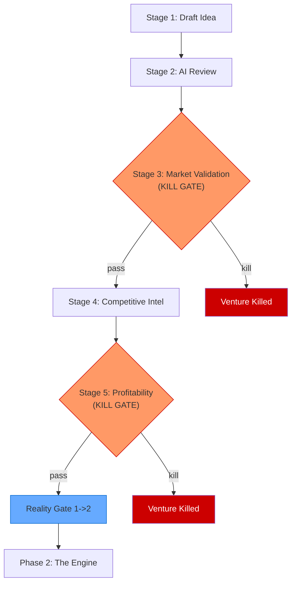

# Phase 1: The Truth -- Stages 1-5

## Phase Purpose

Validate the idea before investing significant resources. This phase answers the question: **"Is this idea worth pursuing? Does the market want it? Can we make money?"**

Every venture begins here. If a venture cannot survive The Truth, it should not consume resources in later phases. Two kill gates (Stages 3 and 5) provide deterministic termination points. A Reality Gate at the 5-to-6 boundary validates that all five Truth-phase artifacts exist before the venture advances.

## Phase Flow

```
                          PHASE 1: THE TRUTH
 ================================================================

 +-------------------+     +-------------------+
 |   STAGE 1         |     |   STAGE 2         |
 |   Draft Idea      |---->|   AI Review       |
 |   (artifact_only) |     |   (automated_chk) |
 +-------------------+     +-------------------+
                                    |
                                    v
                          +-------------------+
                          |   STAGE 3         |
                          |   Market Valid.   |
                          |   (decision_gate) |
                          +--------+----------+
                            KILL   |   PASS
                            GATE   |
                                   v
 +-------------------+     +-------------------+
 |   STAGE 5         |<----|   STAGE 4         |
 |   Profitability   |     |   Competitive     |
 |   (decision_gate) |     |   Intel           |
 +--------+----------+     |   (artifact_only) |
   KILL   |   PASS         +-------------------+
   GATE   |
          v
  REALITY GATE (Phase 1 -> 2)
  ============================
  Validates: Stages 1-5 artifacts
```

## Mermaid Diagram



---

## Stage 1: Draft Idea

| Property | Value |
|----------|-------|
| Template | `lib/eva/stage-templates/stage-01.js` (56 lines) |
| Slug | `draft-idea` |
| Stage Type | artifact_only |
| Gate Type | None |
| Version | 1.0.0 |

### Purpose

Captures a minimally viable venture idea with required fields. This is the venture's origin document -- the seed from which all subsequent analysis grows.

### Required Inputs

| Field | Type | Constraint |
|-------|------|------------|
| `description` | string | minLength: 50 |
| `valueProp` | string | minLength: 20 |
| `targetMarket` | string | minLength: 10 |

### Generated Artifacts

- **idea_brief** -- The validated idea record stored as stage data

### Derived Fields

None. Stage 1 is a pure input stage with no computed values.

### Validation Rules

- `description` must be a string with at least 50 characters
- `valueProp` must be a string with at least 20 characters
- `targetMarket` must be a string with at least 10 characters

All validation uses the shared `validateString()` helper from `lib/eva/stage-templates/validation.js`.

### Chairman Interaction

The Chairman reviews the draft idea before Stage 2 begins. This is an advisory review -- there is no automated gate.

### Integration Points

- Stage 1 data flows forward to Stage 25 (Venture Review) for drift detection
- The `description` and `targetMarket` fields provide context for the AI Review in Stage 2
- Stage 1 data is the baseline for the constraint drift check at the end of the lifecycle

### For AI Agents

**When to invoke**: At venture creation. Every venture starts at Stage 1.

**What to check**: Ensure all three fields meet minimum length constraints. A bare-bones idea with a 10-word description will fail validation.

**What to produce**: A JSON object with `description`, `valueProp`, and `targetMarket` fields.

**How to validate**: Call `TEMPLATE.validate(data)`. If `valid === false`, the `errors` array describes what is missing.

---

## Stage 2: AI Review

| Property | Value |
|----------|-------|
| Template | `lib/eva/stage-templates/stage-02.js` (85 lines) |
| Slug | `ai-review` |
| Stage Type | automated_check |
| Gate Type | None |
| Version | 1.0.0 |

### Purpose

Stores critiques from multiple AI models or agents and computes a deterministic composite score as the rounded average of all critique scores.

### Required Inputs

| Field | Type | Constraint |
|-------|------|------------|
| `critiques` | array | minItems: 1 |
| `critiques[].model` | string | required |
| `critiques[].summary` | string | minLength: 20 |
| `critiques[].strengths` | array of strings | minItems: 1 |
| `critiques[].risks` | array of strings | minItems: 1 |
| `critiques[].score` | integer | 0-100 |

### Generated Artifacts

- **critique_report** -- Multi-perspective analysis with composite scoring

### Derived Fields

| Field | Formula |
|-------|---------|
| `compositeScore` | `Math.round(sum_of_scores / critique_count)` |

### Validation Rules

- At least one critique entry required
- Each critique must have a model name, summary (20+ chars), at least one strength, at least one risk, and a score between 0 and 100
- Ties round 0.5 up per standard `Math.round` behavior

### Chairman Interaction

The composite score informs the Chairman's decision but does not gate progression. A low composite score is a signal, not a blocker.

### Integration Points

- Multiple AI models contribute independent critiques
- The composite score provides input context for Stage 3 (Market Validation)
- Critique risks feed into Stage 6 (Risk Matrix)

### For AI Agents

**When to invoke**: After Stage 1 data is validated. Multiple AI agents should produce independent critiques.

**What to check**: Each critique must have all required fields. The `score` must be an integer from 0 to 100.

**What to produce**: An array of critique objects, each from a different model perspective.

**How to validate**: Call `TEMPLATE.validate(data)`, then `TEMPLATE.computeDerived(data)` to get the composite score.

---

## Stage 3: Market Validation

| Property | Value |
|----------|-------|
| Template | `lib/eva/stage-templates/stage-03.js` (133 lines) |
| Slug | `validation` |
| Stage Type | decision_gate |
| Gate Type | **KILL GATE** |
| Version | 1.0.0 |

### Purpose

Six-metric validation rubric with deterministic kill gate enforcement. This is the first point where a venture can be terminated.

### Required Inputs

| Field | Type | Constraint |
|-------|------|------------|
| `marketFit` | integer | 0-100 |
| `customerNeed` | integer | 0-100 |
| `momentum` | integer | 0-100 |
| `revenuePotential` | integer | 0-100 |
| `competitiveBarrier` | integer | 0-100 |
| `executionFeasibility` | integer | 0-100 |

### Kill Gate Rules

The kill gate is evaluated by the exported `evaluateKillGate()` function. Kill triggers:

| Condition | Threshold | Effect |
|-----------|-----------|--------|
| `overallScore < 70` | OVERALL_THRESHOLD = 70 | Kill: overall score too low |
| Any single metric < 40 | METRIC_THRESHOLD = 40 | Kill: critical weakness detected |

The `overallScore` is the rounded average of all six metrics.

### Generated Artifacts

- **validation_report** -- Six-metric scores with kill gate decision

### Derived Fields

| Field | Formula |
|-------|---------|
| `overallScore` | `Math.round(sum_of_6_metrics / 6)` |
| `decision` | `'pass'` or `'kill'` |
| `blockProgression` | `true` if decision is kill |
| `reasons` | Array of objects describing each failed threshold |

### Validation Rules

All six metrics must be integers between 0 and 100. No exceptions.

### Chairman Interaction

**Advisory Checkpoint.** When the kill gate fires, the Chairman must decide:
1. **Kill** -- Terminate the venture
2. **Revise** -- Send back for rework (modify metrics after additional research)
3. **Proceed** -- Override the kill gate with justification

The Devil's Advocate review runs at this gate.

### Integration Points

- Receives context from Stages 1 and 2
- Kill gate decision flows to the Eva Orchestrator for venture state management
- The six metrics provide baseline data for Stage 25 (Venture Review) drift analysis

### For AI Agents

**When to invoke**: After Stage 2 AI Review produces sufficient analysis.

**What to check**: All six metrics must be provided as integers 0-100. Missing or out-of-range values fail validation.

**What to produce**: Six metric scores. The template computes everything else via `computeDerived()`.

**How to validate**: Call `validate(data)` first, then `computeDerived(data)`. Check `decision` field for `'pass'` or `'kill'`.

---

## Stage 4: Competitive Intel

| Property | Value |
|----------|-------|
| Template | `lib/eva/stage-templates/stage-04.js` (115 lines) |
| Slug | `competitive-intel` |
| Stage Type | artifact_only |
| Gate Type | None |
| Version | 1.0.0 |

### Purpose

Captures competitor cards with positioning, threat level, strengths/weaknesses, and SWOT analysis per competitor. This stage uses the `CompetitiveIntelligenceService` from `lib/eva/services/competitive-intelligence.js`.

### Required Inputs

| Field | Type | Constraint |
|-------|------|------------|
| `competitors` | array | minItems: 1 |
| `competitors[].name` | string | required, unique (case-insensitive) |
| `competitors[].position` | string | required |
| `competitors[].threat` | enum | `'H'`, `'M'`, `'L'` |
| `competitors[].strengths` | array of strings | minItems: 1 |
| `competitors[].weaknesses` | array of strings | minItems: 1 |
| `competitors[].swot.strengths` | array of strings | minItems: 1 |
| `competitors[].swot.weaknesses` | array of strings | minItems: 1 |
| `competitors[].swot.opportunities` | array of strings | minItems: 1 |
| `competitors[].swot.threats` | array of strings | minItems: 1 |

### Generated Artifacts

- **competitive_analysis** -- Structured competitor landscape with SWOT per competitor

### Derived Fields

None. Stage 4 is a pure input stage.

### Validation Rules

- At least one competitor required
- Duplicate competitor names (case-insensitive) are rejected with an error indicating both indices
- Each competitor must have a full SWOT breakdown (4 sections, each with at least one item)
- Threat levels must be exactly `'H'`, `'M'`, or `'L'`

### Chairman Interaction

No automated checkpoint. The competitive analysis informs Chairman decisions in subsequent stages.

### Integration Points

- `CompetitiveIntelligenceService` at `lib/eva/services/competitive-intelligence.js` provides automated data gathering
- Competitive barriers feed into Stage 3 metrics and Stage 6 risk identification
- SWOT data supports Stage 9 (Exit Strategy) acquirer identification

### For AI Agents

**When to invoke**: After Stage 3 passes (or Chairman overrides kill gate). Can run in parallel with other post-validation work.

**What to check**: No duplicate competitor names. Every competitor needs a full SWOT object.

**What to produce**: Array of competitor cards with all required fields including nested SWOT.

**How to validate**: Call `validate(data)`. Pay attention to duplicate name errors -- the validator catches case-insensitive duplicates.

---

## Stage 5: Profitability

| Property | Value |
|----------|-------|
| Template | `lib/eva/stage-templates/stage-05.js` (193 lines) |
| Slug | `profitability` |
| Stage Type | decision_gate |
| Gate Type | **KILL GATE** + **REALITY GATE** (Phase 1 to 2 boundary) |
| Version | 1.0.0 |

### Purpose

Three-year financial model with break-even calculation, ROI threshold, and deterministic kill gate enforcement. This is the final checkpoint before the venture advances out of The Truth phase.

### Required Inputs

| Field | Type | Constraint |
|-------|------|------------|
| `initialInvestment` | number | min: 0.01 |
| `year1.revenue` | number | min: 0 |
| `year1.cogs` | number | min: 0 |
| `year1.opex` | number | min: 0 |
| `year2.revenue` | number | min: 0 |
| `year2.cogs` | number | min: 0 |
| `year2.opex` | number | min: 0 |
| `year3.revenue` | number | min: 0 |
| `year3.cogs` | number | min: 0 |
| `year3.opex` | number | min: 0 |

### Kill Gate Rules

The kill gate is evaluated by the exported `evaluateKillGate()` function. Kill triggers:

| Condition | Threshold | Effect |
|-----------|-----------|--------|
| `roi3y < 0.5` | ROI_THRESHOLD = 0.5 (50%) | Kill: insufficient 3-year ROI |
| `breakEvenMonth === null` | -- | Kill: Year 1 net profit is non-positive |
| `breakEvenMonth > 24` | MAX_BREAKEVEN_MONTHS = 24 | Kill: break-even too late |

### Generated Artifacts

- **financial_model** -- Three-year P&L with break-even and ROI

### Derived Fields

| Field | Formula |
|-------|---------|
| `grossProfitY{1,2,3}` | `revenue - cogs` |
| `netProfitY{1,2,3}` | `grossProfit - opex` |
| `breakEvenMonth` | `ceil(initialInvestment / (netProfitY1 / 12))` or null |
| `roi3y` | `(totalNetProfit - initialInvestment) / initialInvestment` |
| `decision` | `'pass'` or `'kill'` |
| `blockProgression` | `true` if decision is kill |
| `reasons` | Array of objects describing each failed threshold |

### Formulas

```
grossProfit = revenue - cogs
netProfit = grossProfit - opex
monthlyNetProfit = netProfitY1 / 12
breakEvenMonth = ceil(initialInvestment / monthlyNetProfit)  [null if monthlyNetProfit <= 0]
roi3y = (netProfitY1 + netProfitY2 + netProfitY3 - initialInvestment) / initialInvestment
```

### Token Budget Profile Selection

At the Stage 5 boundary, the system selects a Token Budget Profile for subsequent phases:

| Profile | Budget | Condition |
|---------|--------|-----------|
| Exploratory | 75K tokens | Early-stage, high uncertainty |
| Standard | 375K tokens | Normal ventures |
| Deep | 1.5M tokens | Complex, high-value ventures |

### Reality Gate (Phase 1 to 2 Boundary)

At the Stage 5 to Stage 6 boundary, the Reality Gate validates that all five Truth-phase artifacts exist. This is a phase-level check separate from the Stage 5 kill gate.

### Chairman Interaction

**Advisory Checkpoint.** The Chairman reviews financial projections and kill gate results. Devil's Advocate review runs here.

### Integration Points

- Three-year financials feed into Stage 7 (Pricing) and Stage 9 (Exit Strategy)
- ROI and break-even data inform Stage 16 (Financial Projections) in the Blueprint phase
- Kill gate exported as named function for direct invocation by the Eva Orchestrator

### For AI Agents

**When to invoke**: After Stage 4 is complete.

**What to check**: `initialInvestment` must be > 0.01. All year revenue/cogs/opex must be >= 0. Each year must be an object, not null.

**What to produce**: Initial investment amount plus three year objects with revenue, cogs, and opex.

**How to validate**: Call `validate(data)`, then `computeDerived(data)`. Check `decision` for `'pass'` or `'kill'`. If kill, inspect `reasons` for the specific threshold violations.

---

## Phase Exit Criteria

Before advancing to Phase 2 (The Engine), the following must be true:

1. Stage 1 data validated (idea captured with description, value prop, target market)
2. Stage 2 composite score computed (at least one AI critique)
3. Stage 3 kill gate passed or Chairman override with justification
4. Stage 4 competitive analysis completed (at least one competitor with SWOT)
5. Stage 5 kill gate passed or Chairman override with justification
6. Reality Gate validates all five stage artifacts exist

## Key Thresholds Summary

| Stage | Threshold | Value |
|-------|-----------|-------|
| 3 | Overall validation score | >= 70 |
| 3 | Per-metric minimum | >= 40 |
| 5 | 3-year ROI | >= 50% |
| 5 | Break-even month | <= 24 |
| 5 | Year 1 net profit | > 0 (required for break-even) |

## File References

| Component | Path |
|-----------|------|
| Stage 01 Template | `lib/eva/stage-templates/stage-01.js` |
| Stage 02 Template | `lib/eva/stage-templates/stage-02.js` |
| Stage 03 Template | `lib/eva/stage-templates/stage-03.js` |
| Stage 04 Template | `lib/eva/stage-templates/stage-04.js` |
| Stage 05 Template | `lib/eva/stage-templates/stage-05.js` |
| Validation Utilities | `lib/eva/stage-templates/validation.js` |
| Competitive Intelligence Service | `lib/eva/services/competitive-intelligence.js` |
| Template Index | `lib/eva/stage-templates/index.js` |
