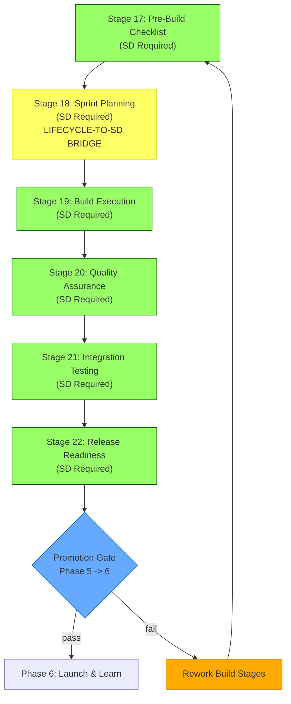

# Phase 5: The Build Loop -- Stages 17-22

## Phase Purpose

Implementation and development. This phase answers the question: **"Build the product according to the blueprint."**

Phase 5 is the largest phase (6 stages) and where actual code is written. All stages in this phase require Strategic Directives, meaning each stage creates work items that flow through the LEO Protocol (LEAD -> PLAN -> EXEC). Stage 18 (Sprint Planning) is the critical **Lifecycle-to-SD Bridge** that converts venture lifecycle sprint items into LEO Strategic Directives. A Promotion Gate at Stage 22 validates the entire build before launch.

## Phase Flow

```
                     PHASE 5: THE BUILD LOOP
 ================================================================

 +-------------------+     +-------------------+
 |   STAGE 17        |     |   STAGE 18        |
 |   Pre-Build       |---->|   Sprint          |
 |   Checklist       |     |   Planning        |
 |   (sd_required)   |     |   (sd_required)   |
 +-------------------+     | LIFECYCLE-TO-SD   |
                            |   BRIDGE          |
                            +--------+----------+
                                     |
                                     v
 +-------------------+     +-------------------+
 |   STAGE 20        |<----|   STAGE 19        |
 |   Quality         |     |   Build           |
 |   Assurance       |     |   Execution       |
 |   (sd_required)   |     |   (sd_required)   |
 +--------+----------+     +-------------------+
          |
          v
 +-------------------+     +-------------------+
 |   STAGE 21        |     |   STAGE 22        |
 |   Integration     |---->|   Release         |
 |   Testing         |     |   Readiness       |
 |   (sd_required)   |     |   (sd_required)   |
 +-------------------+     +--------+----------+
                                     |
                                     v
                            PROMOTION GATE (Phase 5 -> 6)
                            =============================
                            Validates:
                              Stage 17: all categories, >= 80% readiness
                              Stage 18: >= 1 sprint item
                              Stage 19: >= 80% completion, no blocked tasks
                              Stage 20: 100% pass rate, >= 60% coverage
                              Stage 21: all integrations passing
                              Stage 22: all release items approved
```

## Mermaid Diagram



---

## Stage 17: Pre-Build Checklist

| Property | Value |
|----------|-------|
| Template | `lib/eva/stage-templates/stage-17.js` (142 lines) |
| Slug | `pre-build-checklist` |
| Stage Type | sd_required |
| Gate Type | None (but contributes to Promotion Gate at Stage 22) |
| Version | 1.0.0 |

### Purpose

Pre-build readiness checklist covering architecture, team, tooling, and environment prerequisites. Ensures the team and infrastructure are ready before development begins.

### Required Inputs

The checklist is organized into 5 required categories:

| Category | Description |
|----------|-------------|
| `architecture` | Architecture decisions validated |
| `team_readiness` | Team members onboarded and ready |
| `tooling` | Development tools configured |
| `environment` | Dev/staging environments provisioned |
| `dependencies` | Third-party dependencies resolved |

Each category contains items:

| Field | Type | Constraint |
|-------|------|------------|
| `checklist.{category}` | array | minItems: 1 per category |
| `checklist.{category}[].name` | string | required |
| `checklist.{category}[].status` | enum | `not_started`, `in_progress`, `complete`, `blocked` |
| `checklist.{category}[].owner` | string | optional |
| `checklist.{category}[].notes` | string | optional |

Optional blockers:

| Field | Type | Constraint |
|-------|------|------------|
| `blockers` | array | optional |
| `blockers[].description` | string | required |
| `blockers[].severity` | string | required |
| `blockers[].mitigation` | string | required |

### Generated Artifacts

- **system_prompt** -- Pre-build readiness assessment
- **cicd_config** -- CI/CD configuration requirements

### Derived Fields

| Field | Formula |
|-------|---------|
| `total_items` | Count of all items across all categories |
| `completed_items` | Count of items with `status === 'complete'` |
| `readiness_pct` | `round((completed / total) * 10000) / 100` |
| `all_categories_present` | `true` if all 5 categories have items |
| `blocker_count` | Count of blocker entries |

### Promotion Gate Contribution

The Promotion Gate at Stage 22 checks:
- All 5 checklist categories present (all_categories_present)
- Readiness percentage >= 80% (MIN_READINESS_PCT = 80)

### Chairman Interaction

No automated checkpoint. Readiness status reviewed in the Promotion Gate.

### Integration Points

- Categories map to Stage 14 (Technical Architecture) layer decisions
- Blockers feed into risk tracking and Chairman escalation
- Team readiness connects to Stage 15 (Resource Planning) skill gaps

### For AI Agents

**When to invoke**: First stage in Phase 5. Requires Phase 4 Promotion Gate to have passed.

**What to check**: All 5 categories must have at least 1 item. Target 80%+ readiness (items marked `complete`).

**What to produce**: Checklist with items in all 5 categories. Each item needs a name and status.

**How to validate**: Call `validate(data)`, then `computeDerived(data)`. Check `readiness_pct >= 80` and `all_categories_present === true`.

---

## Stage 18: Sprint Planning -- The Lifecycle-to-SD Bridge

| Property | Value |
|----------|-------|
| Template | `lib/eva/stage-templates/stage-18.js` (134 lines) |
| Slug | `sprint-planning` |
| Stage Type | sd_required |
| Gate Type | None |
| Version | 1.0.0 |

### Purpose

Sprint planning with backlog items and the **Lifecycle-to-SD Bridge** that generates SD draft payloads for each sprint item. This is the critical junction where the venture lifecycle connects to the LEO Protocol.

### The Lifecycle-to-SD Bridge

```
  Venture Lifecycle                LEO Protocol
 +------------------+           +------------------+
 | Stage 18:        |           | Strategic        |
 | Sprint Planning  |  BRIDGE   | Directives       |
 |                  |---------->|                  |
 | sprint items[]   |  creates  | orchestrator SD  |
 | with SD payload  |           | + child SDs      |
 +------------------+           +------------------+
                                        |
                                        v
                                 LEAD -> PLAN -> EXEC
```

Each sprint item produces an `sd_bridge_payload` containing the fields needed to create a Strategic Directive via `lifecycle-sd-bridge.js`.

### Required Inputs

| Field | Type | Constraint |
|-------|------|------------|
| `sprint_name` | string | required |
| `sprint_duration_days` | number | 1-30 |
| `sprint_goal` | string | minLength: 10 |
| `items` | array | minItems: 1 |
| `items[].title` | string | required |
| `items[].description` | string | required |
| `items[].priority` | enum | `critical`, `high`, `medium`, `low` |
| `items[].type` | enum | `feature`, `bugfix`, `enhancement`, `refactor`, `infra` |
| `items[].scope` | string | required |
| `items[].success_criteria` | string | required |
| `items[].dependencies` | array | optional |
| `items[].risks` | array | optional |
| `items[].target_application` | string | required |
| `items[].story_points` | number | optional, min: 1 |

### SD Bridge Required Fields

The bridge payload for each item includes:

```
title, description, priority, type, scope,
success_criteria, dependencies, risks, target_application
```

These map directly to `leo-create-sd.js` input parameters.

### Generated Artifacts

- Sprint plan with SD-ready payloads

### Derived Fields

| Field | Formula |
|-------|---------|
| `total_items` | `items.length` |
| `total_story_points` | Sum of all `story_points` values |
| `sd_bridge_payloads` | Array of SD creation payloads (one per item) |

### Validation Rules

- Sprint name required
- Sprint duration must be 1-30 days (MIN_SPRINT_DURATION_DAYS, MAX_SPRINT_DURATION_DAYS)
- Sprint goal must be at least 10 characters
- At least 1 sprint item
- Each item needs title, description, priority (enum), type (enum), scope, success_criteria, and target_application

### Chairman Interaction

The Chairman approves the sprint plan before SD creation begins. Sprint items may be reordered or reprioritized.

### Integration Points

- `lifecycle-sd-bridge.js` creates LEO Strategic Directives from bridge payloads
- Created SDs flow through LEAD -> PLAN -> EXEC in the LEO Protocol
- Sprint items reference Stage 13 (Product Roadmap) milestone deliverables
- Story points inform velocity tracking for future sprint planning

### For AI Agents

**When to invoke**: After Stage 17 (Pre-Build Checklist) confirms readiness.

**What to check**: Duration in valid range (1-30 days). Each item has a valid priority and type enum. target_application is set.

**What to produce**: Sprint definition with items that map to SD creation payloads.

**How to validate**: Call `validate(data)`, then `computeDerived(data)`. The `sd_bridge_payloads` array is ready for direct use with `lifecycle-sd-bridge.js`.

---

## Stage 19: Build Execution

| Property | Value |
|----------|-------|
| Template | `lib/eva/stage-templates/stage-19.js` (118 lines) |
| Slug | `build-execution` |
| Stage Type | sd_required |
| Gate Type | None |
| Version | 1.0.0 |

### Purpose

Build execution tracking with task statuses, progress, and issue tracking. Monitors the actual implementation work defined in Stage 18.

### Required Inputs

| Field | Type | Constraint |
|-------|------|------------|
| `tasks` | array | minItems: 1 |
| `tasks[].name` | string | required |
| `tasks[].status` | enum | `todo`, `in_progress`, `done`, `blocked` |
| `tasks[].assignee` | string | optional |
| `tasks[].sprint_item_ref` | string | optional (references Stage 18 items) |
| `issues` | array | optional |
| `issues[].description` | string | required |
| `issues[].severity` | string | required |
| `issues[].status` | string | required |

### Generated Artifacts

- Build progress report with task breakdown

### Derived Fields

| Field | Formula |
|-------|---------|
| `total_tasks` | `tasks.length` |
| `completed_tasks` | Count of tasks with `status === 'done'` |
| `blocked_tasks` | Count of tasks with `status === 'blocked'` |
| `completion_pct` | `round((completed / total) * 10000) / 100` |
| `tasks_by_status` | Object with count per status (todo, in_progress, done, blocked) |

### Promotion Gate Contribution

The Promotion Gate at Stage 22 checks:
- Completion percentage >= 80% (MIN_BUILD_COMPLETION_PCT = 80)
- No blocked tasks (blocked_tasks === 0)

### Chairman Interaction

No automated checkpoint. Build progress is tracked through the LEO Protocol SD workflow.

### Integration Points

- Tasks reference Stage 18 sprint items via `sprint_item_ref`
- Issues feed into RCA sub-agent analysis if persistent
- Progress data informs Stage 22 release readiness assessment

### For AI Agents

**When to invoke**: During active development. Updated as tasks change status.

**What to check**: Target 80%+ completion and zero blocked tasks for Promotion Gate. Track issues separately.

**What to produce**: Array of tasks with status tracking. Add issues as they are discovered.

**How to validate**: Call `validate(data)`, then `computeDerived(data)`. Monitor `completion_pct` and `blocked_tasks`.

---

## Stage 20: Quality Assurance

| Property | Value |
|----------|-------|
| Template | `lib/eva/stage-templates/stage-20.js` (130 lines) |
| Slug | `quality-assurance` |
| Stage Type | sd_required |
| Gate Type | None (but enforces quality gate for Promotion Gate) |
| Version | 1.0.0 |

### Purpose

Quality assurance with test suites, coverage metrics, and overall quality scoring. The quality gate requires 100% test pass rate and minimum 60% coverage.

### Required Inputs

| Field | Type | Constraint |
|-------|------|------------|
| `test_suites` | array | minItems: 1 |
| `test_suites[].name` | string | required |
| `test_suites[].total_tests` | number | min: 0 |
| `test_suites[].passing_tests` | number | min: 0, <= total_tests |
| `test_suites[].coverage_pct` | number | 0-100 (optional) |
| `known_defects` | array | optional |
| `known_defects[].description` | string | required |
| `known_defects[].severity` | string | required |
| `known_defects[].status` | string | required |

### Quality Gate

```
quality_gate_passed = (overall_pass_rate === 100) AND (coverage_pct >= 60)
```

| Metric | Threshold |
|--------|-----------|
| Test pass rate | 100% (all tests must pass) |
| Code coverage | >= 60% (MIN_COVERAGE_PCT) |

### Generated Artifacts

- Quality assurance report with test results and coverage

### Derived Fields

| Field | Formula |
|-------|---------|
| `overall_pass_rate` | `round((total_passing / total_tests) * 10000) / 100` |
| `coverage_pct` | Average coverage across suites that report coverage |
| `critical_failures` | `total_tests - total_passing` |
| `total_tests` | Sum across all suites |
| `total_passing` | Sum across all suites |
| `quality_gate_passed` | Boolean: 100% pass rate AND >= 60% coverage |

### Promotion Gate Contribution

The Promotion Gate at Stage 22 checks `quality_gate_passed === true`.

### Chairman Interaction

No automated checkpoint. Quality metrics are reviewed in the Promotion Gate.

### Integration Points

- Test suites map to SDs created from Stage 18 sprint items
- Known defects may trigger new SDs or Quick-Fix workflows
- Coverage data feeds into Stage 22 release readiness assessment

### For AI Agents

**When to invoke**: After Stage 19 build tasks are largely complete.

**What to check**: `passing_tests` cannot exceed `total_tests` (validated). Target 100% pass rate and 60%+ coverage.

**What to produce**: Test suite results with totals, pass counts, and optional coverage percentages.

**How to validate**: Call `validate(data)`, then `computeDerived(data)`. Check `quality_gate_passed === true`.

---

## Stage 21: Integration Testing

| Property | Value |
|----------|-------|
| Template | `lib/eva/stage-templates/stage-21.js` (105 lines) |
| Slug | `integration-testing` |
| Stage Type | sd_required |
| Gate Type | None |
| Version | 1.0.0 |

### Purpose

Integration testing results across system boundaries, with pass/fail tracking per integration point.

### Required Inputs

| Field | Type | Constraint |
|-------|------|------------|
| `environment` | string | required |
| `integrations` | array | minItems: 1 |
| `integrations[].name` | string | required |
| `integrations[].source` | string | required |
| `integrations[].target` | string | required |
| `integrations[].status` | enum | `pass`, `fail`, `skip`, `pending` |
| `integrations[].error_message` | string | optional |

### Generated Artifacts

- Integration test report with pass/fail per connection point

### Derived Fields

| Field | Formula |
|-------|---------|
| `total_integrations` | `integrations.length` |
| `passing_integrations` | Count with `status === 'pass'` |
| `failing_integrations` | Array of failed integration details |
| `pass_rate` | `round((passing / total) * 10000) / 100` |
| `all_passing` | `true` if no failures and at least 1 integration |

### Promotion Gate Contribution

The Promotion Gate at Stage 22 checks `all_passing === true`.

### Chairman Interaction

No automated checkpoint. Integration results are reviewed in the Promotion Gate.

### Integration Points

- Integration points map to Stage 14 (Technical Architecture) integration_points
- Failed integrations may block Stage 22 release readiness
- Source/target fields correspond to architecture layer names

### For AI Agents

**When to invoke**: After Stage 20 (Quality Assurance). Tests cross-system boundaries.

**What to check**: All integrations must pass for the Promotion Gate. Environment must be specified.

**What to produce**: Environment name and array of integration test results with source/target/status.

**How to validate**: Call `validate(data)`, then `computeDerived(data)`. Check `all_passing === true`.

---

## Stage 22: Release Readiness

| Property | Value |
|----------|-------|
| Template | `lib/eva/stage-templates/stage-22.js` (193 lines) |
| Slug | `release-readiness` |
| Stage Type | sd_required |
| Gate Type | **PROMOTION GATE** (Phase 5 to 6 boundary) |
| Version | 1.0.0 |

### Purpose

Release readiness checklist with approval tracking and Phase 5 to 6 Promotion Gate evaluation. This is the most comprehensive gate in the lifecycle, checking six preceding stages.

### Required Inputs

| Field | Type | Constraint |
|-------|------|------------|
| `release_items` | array | minItems: 1 |
| `release_items[].name` | string | required |
| `release_items[].category` | string | required |
| `release_items[].status` | enum | `pending`, `approved`, `rejected` |
| `release_items[].approver` | string | optional |
| `release_notes` | string | minLength: 10 |
| `target_date` | string | required |

### Promotion Gate Rules

The Promotion Gate is evaluated by the exported `evaluatePromotionGate()` function. It checks Stages 17-22:

| Prerequisite | Requirement | Source |
|--------------|-------------|--------|
| Stage 17 categories | All 5 checklist categories present | `CHECKLIST_CATEGORIES` array |
| Stage 17 readiness | >= 80% | `MIN_READINESS_PCT = 80` |
| Stage 18 items | >= 1 sprint item | Sprint item count |
| Stage 19 completion | >= 80% | `MIN_BUILD_COMPLETION_PCT = 80` |
| Stage 19 blocked | 0 blocked tasks | `blocked_tasks === 0` |
| Stage 20 quality gate | Passed (100% tests, 60%+ coverage) | `quality_gate_passed` |
| Stage 21 integrations | All passing | `all_passing` |
| Stage 22 releases | All items approved | No unapproved items |

### Promotion Gate Checklist

```
 Stage 17: Pre-Build
   [x] All 5 categories present
   [x] Readiness >= 80%

 Stage 18: Sprint Planning
   [x] >= 1 sprint item defined

 Stage 19: Build Execution
   [x] Completion >= 80%
   [x] 0 blocked tasks

 Stage 20: Quality Assurance
   [x] 100% test pass rate
   [x] >= 60% code coverage

 Stage 21: Integration Testing
   [x] All integrations passing

 Stage 22: Release Readiness
   [x] All release items approved
```

### Generated Artifacts

- Release readiness assessment with promotion gate results

### Derived Fields

| Field | Formula |
|-------|---------|
| `total_items` | `release_items.length` |
| `approved_items` | Count with `status === 'approved'` |
| `all_approved` | `true` if all items approved |
| `promotion_gate` | Gate evaluation object with pass/blockers/actions |

### Validation Rules

- At least 1 release item
- Release notes must be at least 10 characters
- Target date required
- Each release item needs name, category, and status

### Chairman Interaction

**Advisory Checkpoint.** The Chairman reviews release readiness and Promotion Gate results. Devil's Advocate review runs at this gate. If the Promotion Gate fails, the Chairman determines which stages need rework.

### Integration Points

- `computeDerived()` accepts a `prerequisites` parameter with `{ stage17, stage18, stage19, stage20, stage21 }` data
- All release items must be approved before launch
- Promotion gate results determine whether the venture can enter Phase 6

### For AI Agents

**When to invoke**: After Stage 21 (Integration Testing). This is the final Build Loop stage.

**What to check**: All release items must have `status === 'approved'`. Release notes and target date required.

**What to produce**: Release items with approval status, release notes, and target date.

**How to validate**: Call `validate(data)`, then `computeDerived(data, { stage17, stage18, stage19, stage20, stage21 })`. The returned `promotion_gate.pass` boolean determines whether Phase 6 is unlocked. If `pass === false`, inspect `blockers` -- the gate evaluates all 6 preceding stages.

---

## Phase Exit Criteria

Before advancing to Phase 6 (Launch & Learn), the Promotion Gate at Stage 22 requires all of the following:

1. **Stage 17**: All 5 checklist categories present, readiness >= 80%
2. **Stage 18**: At least 1 sprint item with valid SD bridge payload
3. **Stage 19**: Build completion >= 80%, no blocked tasks
4. **Stage 20**: Quality gate passed (100% pass rate, >= 60% coverage)
5. **Stage 21**: All integration tests passing
6. **Stage 22**: All release items approved

## Key Thresholds Summary

| Stage | Threshold | Value |
|-------|-----------|-------|
| 17 | Checklist categories | all 5 required |
| 17 | Readiness percentage | >= 80% |
| 18 | Sprint duration | 1-30 days |
| 18 | Sprint items | >= 1 |
| 19 | Build completion | >= 80% |
| 19 | Blocked tasks | 0 |
| 20 | Test pass rate | 100% |
| 20 | Code coverage | >= 60% |
| 21 | Integration pass rate | 100% (all_passing) |
| 22 | Release approvals | all items approved |

## SD Requirements

All 6 stages in Phase 5 require Strategic Directives. The Eva Orchestrator creates SDs via `leo-create-sd.js` for each stage. Stage 18 additionally creates child SDs for each sprint item via the Lifecycle-to-SD Bridge.

## File References

| Component | Path |
|-----------|------|
| Stage 17 Template | `lib/eva/stage-templates/stage-17.js` |
| Stage 18 Template | `lib/eva/stage-templates/stage-18.js` |
| Stage 19 Template | `lib/eva/stage-templates/stage-19.js` |
| Stage 20 Template | `lib/eva/stage-templates/stage-20.js` |
| Stage 21 Template | `lib/eva/stage-templates/stage-21.js` |
| Stage 22 Template | `lib/eva/stage-templates/stage-22.js` |
| Lifecycle-to-SD Bridge | `lib/eva/lifecycle-sd-bridge.js` |
| Validation Utilities | `lib/eva/stage-templates/validation.js` |
| Template Index | `lib/eva/stage-templates/index.js` |
