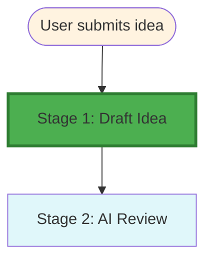

# Stage 1: Dependency & Recursion Map

## Metadata
- **Category**: Guide
- **Status**: Draft
- **Version**: 1.0.0
- **Author**: DOCMON
- **Last Updated**: 2026-01-21
- **Tags**: validation, workflow, ci, agent

## Workflow Position

## Dependencies

- **Prior Stages**: None (entry point)
- **Next Stage**: Stage 2 (AI Review)
- **Parallel Stages**: None
- **Recursive Triggers**: None (per consistency scan)

**Evidence**: EHG_Engineer@6ef8cf4:docs/workflow/stages.yaml:5 `"depends_on: []"`

## Data Flow

**Inputs**:
1. Voice recording
2. Text input
3. Chairman feedback

**Outputs**:
1. Structured idea document
2. Initial validation
3. Risk assessment

**Evidence**: EHG_Engineer@6ef8cf4:docs/workflow/stages.yaml:6-13

## Downstream Impact

**Blocks**: Stage 2 (AI Review) cannot proceed without Stage 1 completion

**Critical Path**: Yes - entry point to entire workflow

---

## Sources Table

| Source | Repo | Commit | Path | Lines |
|--------|------|--------|------|-------|
| depends_on | EHG_Engineer | 6ef8cf4 | docs/workflow/stages.yaml | 5 |
| inputs/outputs | EHG_Engineer | 6ef8cf4 | docs/workflow/stages.yaml | 6-13 |
| recursion scan | EHG_Engineer | 6ef8cf4 | (agent analysis) | N/A |
