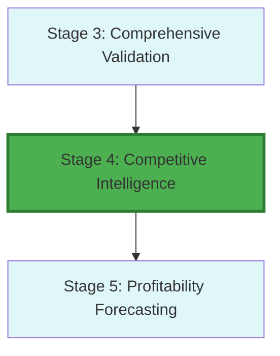

# Stage 4: Dependency & Recursion Map

## Metadata
- **Category**: Guide
- **Status**: Draft
- **Version**: 1.0.0
- **Author**: DOCMON
- **Last Updated**: 2026-01-21
- **Tags**: validation, workflow, ci, agent

## Workflow Position

## Dependencies

- **Prior Stages**: Stage 3 (Comprehensive Validation)
- **Next Stage**: Stage 5 (Profitability Forecasting)
- **Parallel Stages**: None
- **Recursive Triggers**: ⚠️ Minimal (recursion section header exists in critique but no details)

**Evidence**: EHG_Engineer@6ef8cf4:docs/workflow/stages.yaml:138-139 `"depends_on: [3]"`

---

## Data Flow

**Inputs**:
1. Market research
2. Competitor data
3. Industry reports

**Outputs**:
1. Competitive analysis
2. Market positioning
3. Defense strategy

**Evidence**: EHG_Engineer@6ef8cf4:docs/workflow/stages.yaml:140-147

---

## Recursion Analysis

**Consistency Scan Result**: Y/N/N (Recursion section header present but no detailed triggers)

**Evidence**: EHG_Engineer@6ef8cf4:docs/workflow/critique/stage-04.md:28 (header "Recursive Workflow Behavior" exists but no trigger table)

**Interpretation**: Stage 4 critique acknowledges recursion capability but does not define specific triggers like Stage 3 does. May indicate:
1. Recursion support is planned but not yet detailed
2. Stage 4 is less critical for recursion than Stage 3
3. Future implementation to add recursion triggers from downstream stages

---

## Downstream Impact

**Blocks**: Stage 5 (Profitability Forecasting) cannot proceed without competitive analysis and market positioning

**Critical Path**: Yes - USP and differentiation inform pricing strategy and financial projections

---

## Sources Table

| Source | Repo | Commit | Path | Lines |
|--------|------|--------|------|-------|
| depends_on | EHG_Engineer | 6ef8cf4 | docs/workflow/stages.yaml | 138-139 |
| inputs/outputs | EHG_Engineer | 6ef8cf4 | docs/workflow/stages.yaml | 140-147 |
| recursion scan | EHG_Engineer | 6ef8cf4 | (agent analysis) | N/A |
| recursion header | EHG_Engineer | 6ef8cf4 | docs/workflow/critique/stage-04.md | 28 |

<!-- Generated by Claude Code Phase 3 | EHG_Engineer@6ef8cf4 | 2025-11-05 -->
