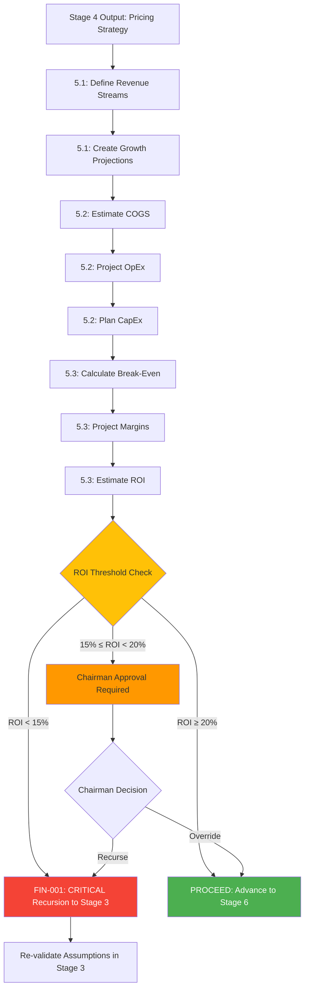

# Stage 5: Agent Orchestration


## Metadata
- **Category**: Guide
- **Status**: Draft
- **Version**: 1.0.0
- **Author**: DOCMON
- **Last Updated**: 2026-01-21
- **Tags**: database, handoff, validation, reference

**Status**: ⚠️ **Not Implemented** (PLAN agent referenced, financial modeling agents not mapped)

**Evidence**: EHG_Engineer@6ef8cf4:docs/workflow/critique/stage-05.md:19 "Clear ownership (PLAN)"

---

## Agent Assignments (Inferred from stages.yaml)

| Substage | Agent(s) | Role | Source |
|----------|----------|------|--------|
| 5.1 Revenue Modeling | PLAN + Finance Analyst (TBD) | Define revenue streams, create growth projections | stages.yaml:210-213 |
| 5.2 Cost Structure | PLAN + Finance Analyst (TBD) | Estimate COGS, project OpEx, plan CapEx | stages.yaml:214-219 |
| 5.3 Profitability Analysis | PLAN + Finance Analyst (TBD) | Calculate break-even, margins, ROI | stages.yaml:220-225 |
| Recursion Decision | Recursion Engine (TBD) | Evaluate thresholds, trigger FIN-001 if needed | critique:44-77 |

**Evidence**: EHG_Engineer@6ef8cf4:docs/workflow/stages.yaml:208-225 "substages: 5.1, 5.2, 5.3"

---

## Workflow Orchestration



**Evidence**: EHG_Engineer@6ef8cf4:docs/workflow/critique/stage-05.md:44-77 "Recursion Logic (SC-003)"

---

## Agent Communication Patterns

**Sequential Execution**: All substages execute sequentially (5.1 → 5.2 → 5.3 → Recursion Decision)

**Handoff Points**:
1. **Stage 4 → Substage 5.1**: Market size data, pricing strategy, cost estimates
2. **Substage 5.1 → Substage 5.2**: Revenue streams defined, growth projections
3. **Substage 5.2 → Substage 5.3**: COGS, OpEx, CapEx estimates
4. **Substage 5.3 → Recursion Engine**: ROI, margins, break-even timeline
5. **Recursion Engine → Stage 3/4/2 or Stage 6**: Decision + financial model

**Evidence**: EHG_Engineer@6ef8cf4:docs/workflow/stages.yaml:208-225 "substages sequential"

---

## Recursion Engine Integration

**Trigger Evaluation** (performed automatically after Substage 5.3):

```javascript
// From critique lines 44-77
async function onStage5Complete(ventureId, financialModel) {
  const calculatedROI = financialModel.calculateROI();

  // CRITICAL: ROI < 15%
  if (calculatedROI < 15) {
    await recursionEngine.triggerRecursion({
      ventureId,
      fromStage: 5,
      toStage: 3,
      triggerType: 'FIN-001',
      triggerData: {
        calculated_roi: calculatedROI,
        threshold: 15,
        revenue_projections: financialModel.revenueProjections,
        cost_structure: financialModel.costs,
        break_even_analysis: financialModel.breakEven
      },
      severity: 'CRITICAL',
      autoExecuted: true,
      resolution_notes: `ROI of ${calculatedROI}% falls below 15% threshold. Re-validation required for:
        1. Willingness to pay assumptions
        2. Problem-solution fit with corrected financial constraints
        3. MVP scope reduction to improve ROI
        4. Kill/Revise/Proceed decision with accurate financial data`
    });
  }

  // HIGH: ROI 15-20%
  else if (calculatedROI >= 15 && calculatedROI < 20) {
    await recursionEngine.requestChairmanApproval({
      ventureId,
      fromStage: 5,
      toStage: 3,
      triggerType: 'FIN-001',
      severity: 'HIGH',
      reason: `ROI of ${calculatedROI}% is below optimal threshold of 20%`
    });
  }

  // GREEN: ROI ≥ 20%
  else {
    await stageManager.advanceToStage(ventureId, 6);
  }
}
```

**Evidence**: EHG_Engineer@6ef8cf4:docs/workflow/critique/stage-05.md:44-77 "async function onStage5Complete"

---

## Chairman Approval Requirements

**CRITICAL Severity** (ROI < 15%):
- **Auto-executed**: Recursion triggers immediately to Stage 3
- **Post-notification**: Chairman notified after execution
- **Override capability**: Chairman can skip recursion if strategic reasons exist

**HIGH Severity** (ROI 15-20% or Margin < 20%):
- **Pre-approval required**: Chairman must approve before recursion
- **Options**: Proceed despite warning, recurse to Stage 3/4, or kill venture
- **Override capability**: Chairman can adjust ROI threshold for specific venture types (e.g., strategic bets)

**Evidence**: EHG_Engineer@6ef8cf4:docs/workflow/critique/stage-05.md:103-114 "Chairman Controls"

---

## Performance Requirements

**Recursion Engine SLAs**:
- **ROI calculation**: Must complete in <500ms
- **Recursion detection**: <100ms after ROI calculated
- **Total stage latency**: <1 second from data entry to recursion decision
- **Database logging**: Async, non-blocking

**Evidence**: EHG_Engineer@6ef8cf4:docs/workflow/critique/stage-05.md:116-120 "Performance Requirements"

---

## Integration Points

**External Systems** (referenced in critique):

1. **validationFramework.ts**: Reuse threshold validation logic for recursion decisions
2. **evaValidation.ts**: Integrate quality scoring with recursion decision
3. **recursionEngine.ts**: Central recursion orchestration service (to be built)
4. **recursion_events table**: Database logging for all FIN-001 triggers

**Evidence**: EHG_Engineer@6ef8cf4:docs/workflow/critique/stage-05.md:133-138 "Integration Points"

---

## Known Gaps (from critique)

⚠️ **No Agents Mapped**:
- No specific agents identified for financial modeling (stages.yaml does not reference CrewAI agents)
- Critique notes "Clear ownership (PLAN)" but no detailed agent mapping

⚠️ **Recursion Engine Not Implemented**:
- JavaScript code provided in critique (lines 44-77) but not implemented
- No `recursionEngine.ts` service exists yet
- No `recursion_events` table created yet

⚠️ **No Tool Integrations**:
- Critique notes "Missing specific tool integrations" (stage-05.md:26)
- No integration with accounting/forecasting tools (QuickBooks, Xero, Excel)

**Evidence**: EHG_Engineer@6ef8cf4:docs/workflow/critique/stage-05.md:24-27 "Weaknesses: Missing tool integrations"

---

## Proposed Artifacts (to close gaps)

**Priority 0 (Blockers)**:
1. **Build recursionEngine.ts**: Implement FIN-001 trigger logic from critique lines 44-77
2. **Create recursion_events table**: Store recursion history for analytics
3. **Integrate with Stage 3**: Ensure Stage 3 can receive FIN-001 triggers and preserve context

**Priority 1 (High)**:
4. **Define Finance Analyst agent**: CrewAI agent or human role for financial modeling
5. **Integrate forecasting tools**: Connect to Excel/Google Sheets for financial model storage
6. **Build UI components**: ROI indicator (green/yellow/red) and recursion explanation modal

**Priority 2 (Medium)**:
7. **Implement Chairman approval workflow**: UI for approving HIGH severity recursions
8. **Add loop prevention logic**: Track recursion count, escalate after 3rd trigger
9. **Build financial model history**: Store snapshots of financial models for comparison

---

## Sources Table

| Source | Repo | Commit | Path | Lines |
|--------|------|--------|------|-------|
| PLAN reference | EHG_Engineer | 6ef8cf4 | docs/workflow/critique/stage-05.md | 19 |
| Substages | EHG_Engineer | 6ef8cf4 | docs/workflow/stages.yaml | 208-225 |
| Recursion logic | EHG_Engineer | 6ef8cf4 | docs/workflow/critique/stage-05.md | 44-77 |
| Chairman controls | EHG_Engineer | 6ef8cf4 | docs/workflow/critique/stage-05.md | 103-114 |
| Performance | EHG_Engineer | 6ef8cf4 | docs/workflow/critique/stage-05.md | 116-120 |
| Integration points | EHG_Engineer | 6ef8cf4 | docs/workflow/critique/stage-05.md | 133-138 |
| Tool gap | EHG_Engineer | 6ef8cf4 | docs/workflow/critique/stage-05.md | 26 |

<!-- Generated by Claude Code Phase 3 | EHG_Engineer@6ef8cf4 | 2025-11-05 -->
