# Stage 6: Recursion Blueprint


## Metadata
- **Category**: Guide
- **Status**: Draft
- **Version**: 1.0.0
- **Author**: DOCMON
- **Last Updated**: 2026-01-21
- **Tags**: database, testing, e2e, unit

**Status**: ⚠️ **PROPOSED RECURSION SUPPORT** (Referenced in Stage 5, not detailed in Stage 6 critique)

**Consistency Scan Result**: N/N/Y (No recursion section in Stage 6 critique; recursion inferred from Stage 5 critique)

**Evidence**: EHG_Engineer@6ef8cf4:docs/workflow/critique/stage-06.md:28-71 "Recursive Workflow Behavior" (only standard improvements, no detailed recursion)

---

## Important Note: Recursion Inferred from Stage 5

**Stage 6 Critique Status**: Stage 6 critique does NOT have detailed recursion section like Stage 5. Only standard improvement recommendations provided.

**Source of Recursion Detail**: Stage 5 critique documents inbound trigger FROM Stage 6 TO Stage 5 (FIN-001: hidden costs).

**Evidence**: EHG_Engineer@6ef8cf4:docs/workflow/critique/stage-05.md:91 "Risk assessment uncovers hidden costs"

**This file documents the PROPOSED recursion behavior** based on Stage 5's reference. Implementation does NOT exist yet.

---

## Outbound Recursion Triggers

**Recursion Triggers FROM This Stage (Proposed)**:

| Target Stage | Trigger Type | Condition | Severity | Auto-Execute? | Reason |
|--------------|--------------|-----------|----------|---------------|--------|
| **Stage 5** | **FIN-001** | **Hidden costs > 10% of OpEx** | **HIGH** | **No (Chairman approval)** | **PRIMARY TRIGGER**: Risk assessment uncovers hidden costs (e.g., GDPR compliance $50k/yr, cyber insurance $20k/yr, legal fees $30k/yr) not in original Stage 5 financial model. Requires update to OpEx and ROI recalculation. |

**Evidence**: EHG_Engineer@6ef8cf4:docs/workflow/critique/stage-05.md:91 "Risk assessment uncovers hidden costs"

**Note**: This is the ONLY recursion trigger documented for Stage 6 (inferred from Stage 5). No other recursion triggers identified in critiques.

---

## PRIMARY TRIGGER: FIN-001 to Stage 5 (Proposed)

### Recursion Scenario

**Trigger Condition**: Risk mitigation planning (Substage 6.3) reveals hidden costs that exceed 10% of original OpEx from Stage 5 financial model.

**Example**:
- Stage 5 financial model: OpEx = $500k/year
- Stage 6 risk mitigation planning identifies:
  - GDPR compliance consultant: $50k/year
  - Cyber liability insurance: $20k/year
  - Legal retainer (regulatory): $30k/year
  - **Total hidden costs**: $100k/year
- **Hidden cost %**: $100k / $500k = 20% of OpEx
- **Threshold**: 10% → **EXCEEDED** → Trigger FIN-001 to Stage 5

**Evidence**: EHG_Engineer@6ef8cf4:docs/workflow/critique/stage-05.md:91 "Risk assessment uncovers hidden costs"

---

### Why Stage 5?

**Re-Calculation Requirements**:

1. **OpEx Update**: Add hidden costs ($100k) to operating expenses ($500k → $600k)
2. **ROI Recalculation**: With higher OpEx, ROI decreases (e.g., 18% → 14%)
3. **Threshold Check**: If new ROI < 15%, Stage 5 triggers FIN-001 to Stage 3 (cascade recursion)
4. **Break-even Update**: Higher OpEx extends break-even timeline (e.g., 24 months → 30 months)

**Cascade Risk**: Stage 6 recursion to Stage 5 may trigger Stage 5 recursion to Stage 3 if ROI drops below 15% threshold.

**Evidence**: EHG_Engineer@6ef8cf4:docs/workflow/critique/stage-05.md:44-77 "async function onStage5Complete" (ROI < 15% → recurse to Stage 3)

---

### Proposed Implementation Code

**Note**: This code is PROPOSED (not implemented). Based on Stage 5 recursion pattern.

```typescript
// Substage 6.3: Mitigation Planning completes
async function onSubstage63Complete(ventureId, mitigationPlans) {
  // Calculate total mitigation costs (hidden costs)
  const totalMitigationCost = mitigationPlans.reduce((sum, plan) => sum + plan.cost_per_year, 0);

  // Fetch original OpEx from Stage 5
  const { financial_model } = await db.ventures.findOne({ id: ventureId });
  const originalOpEx = financial_model.costs.opex;

  // Calculate hidden cost percentage
  const hiddenCostPct = (totalMitigationCost / originalOpEx) * 100;

  if (hiddenCostPct > 10) {
    // HIGH severity: Requires Chairman approval before recursion
    await recursionEngine.triggerRecursion({
      ventureId,
      fromStage: 6,
      toStage: 5,
      triggerType: 'FIN-001',
      triggerData: {
        mitigation_costs_total: totalMitigationCost,
        original_opex: originalOpEx,
        hidden_cost_pct: hiddenCostPct,
        threshold_pct: 10,
        hidden_cost_breakdown: mitigationPlans.map(p => ({
          risk_id: p.risk_id,
          risk_description: p.risk_description,
          mitigation_strategy: p.mitigation_strategy,
          cost_per_year: p.cost_per_year
        }))
      },
      severity: 'HIGH',
      autoExecuted: false,  // Requires Chairman approval
      resolution_notes: `Risk mitigation planning uncovers hidden costs of $${totalMitigationCost}/year (${hiddenCostPct.toFixed(1)}% of OpEx). Financial model needs update to reflect:
        - GDPR compliance costs
        - Cyber insurance premiums
        - Legal/regulatory retainers
        - Other operational risk mitigation expenses`
    });

    // Pause workflow; await Chairman decision (Approve Recursion / Override / Kill)
  }
}
```

**Evidence**: EHG_Engineer@6ef8cf4:docs/workflow/critique/stage-05.md:44-77 "async function onStage5Complete" (pattern reference)

---

### Trigger Data Payload (Proposed)

**What Gets Passed to Stage 5**:

```json
{
  "mitigation_costs_total": 100000,
  "original_opex": 500000,
  "hidden_cost_pct": 20.0,
  "threshold_pct": 10,
  "hidden_cost_breakdown": [
    {
      "risk_id": "OR-001",
      "risk_description": "GDPR compliance required for EU market",
      "mitigation_strategy": "Hire GDPR consultant + DPO",
      "cost_per_year": 50000
    },
    {
      "risk_id": "OR-002",
      "risk_description": "Cyber liability exposure",
      "mitigation_strategy": "Purchase cyber insurance policy",
      "cost_per_year": 20000
    },
    {
      "risk_id": "OR-003",
      "risk_description": "Regulatory compliance (industry-specific)",
      "mitigation_strategy": "Legal retainer for compliance review",
      "cost_per_year": 30000
    }
  ]
}
```

**Purpose**: Stage 5 uses this data to update OpEx in financial model and recalculate ROI, margins, break-even.

---

## Recursion Threshold (Proposed)

**Complete Threshold Table**:

| Metric | Threshold | Severity | Action |
|--------|-----------|----------|--------|
| Hidden costs | > 10% of OpEx | HIGH | Chairman approval to recurse to Stage 5 |
| Hidden costs | > 25% of OpEx | CRITICAL | Auto-recurse to Stage 5 (proposed) |
| Hidden costs | ≤ 10% of OpEx | NONE | Proceed to Stage 7 (no recursion) |

**Evidence**: EHG_Engineer@6ef8cf4:docs/workflow/critique/stage-05.md:91 "Risk assessment uncovers hidden costs" (threshold inferred, not explicitly stated)

**Note**: 10% threshold is PROPOSED (not documented in critiques). Based on materiality principle (10% OpEx variance is significant).

---

### Threshold Rationale (Proposed)

**Why 10%?**
- Standard accounting materiality threshold (5-10% considered material)
- Hidden costs > 10% OpEx can shift ROI by 1-2 percentage points
- May trigger Stage 5 cascade recursion if ROI crosses 15% threshold

**Chairman Override Scenarios**:
- Accept hidden costs without recursion (e.g., "GDPR compliance is strategic requirement, proceed despite cost increase")
- Adjust threshold to 15% or 20% for specific ventures
- Kill venture if hidden costs make financial model unviable

---

## Inbound Recursion Triggers

**Recursion Triggers That May RETURN TO This Stage**: NONE IDENTIFIED

**Evidence**: No inbound recursion triggers documented in Stage 6 critique or referenced in other stage critiques.

**Interpretation**: Stage 6 is typically not revisited after completion. Once risks assessed and mitigation plans approved, stage does not need to be re-executed unless venture scope changes significantly.

---

## Loop Prevention (Proposed)

**Max Recursions**: 2 returns from Stage 6 to Stage 5 per venture (proposed)

**Tracking Mechanism**:

```sql
SELECT COUNT(*) AS recursion_count
FROM recursion_events
WHERE venture_id = $1
  AND from_stage = 6
  AND trigger_type = 'FIN-001';
```

**Escalation After 2nd Recursion**:

Chairman must approve one of the following:
1. **Proceed despite costs**: Accept higher OpEx, continue to Stage 7
2. **Reduce scope**: Eliminate high-cost risks (e.g., delay EU launch to avoid GDPR costs)
3. **Kill venture**: Hidden costs make venture financially unviable

**Rationale**: If Stage 6 discovers new hidden costs twice, indicates poor initial financial modeling or evolving requirements; requires Chairman strategic decision.

---

## Recursion Flow Diagram (Proposed)

**Complete Flow** (from Stage 6 Substage 6.3 to recursion resolution):

```mermaid
graph TD
    A[Stage 6: Substage 6.3 Complete] --> B[Calculate Total Mitigation Costs]
    B --> C{Hidden Cost Threshold Check}

    C -->|Costs > 25% OpEx| D[CRITICAL: Auto-Recurse to Stage 5]
    C -->|10% < Costs ≤ 25%| E[HIGH: Request Chairman Approval]
    C -->|Costs ≤ 10%| F[GREEN: Proceed to Stage 7]

    D --> G[Update Stage 5 Financial Model]
    E --> H{Chairman Decision}

    H -->|Approve Recursion| D
    H -->|Override: Proceed| F
    H -->|Kill Venture| I[Terminate]

    G --> J[Recalculate ROI, Margins, Break-even]
    J --> K{ROI < 15%?}
    K -->|Yes| L[Stage 5 triggers FIN-001 to Stage 3]
    K -->|No| M[Return to Stage 6]
    M --> A

    L --> N[Stage 3 Re-validation]
    N --> O[Return to Stage 5]
    O --> M

    style D fill:#F44336,color:#FFF
    style E fill:#FF9800
    style F fill:#4CAF50,color:#FFF
    style I fill:#000,color:#FFF
```



**Legend**:
- **Red (CRITICAL)**: Auto-execute recursion (hidden costs > 25% OpEx)
- **Orange (HIGH)**: Chairman approval required (hidden costs 10-25% OpEx)
- **Green**: No recursion (hidden costs ≤ 10% OpEx)
- **Black**: Venture terminated

---

## Chairman Controls (Proposed)

### HIGH Severity (Hidden Costs 10-25% OpEx)

**Behavior**:
- **Requires Chairman approval before recursion**: Workflow pauses until decision made
- **Chairman approval options**:
  1. **Approve Recursion**: Trigger FIN-001 to Stage 5 to update financial model
  2. **Override: Proceed**: Accept hidden costs, proceed to Stage 7 without updating Stage 5
  3. **Reduce Scope**: Eliminate high-cost risks (e.g., delay market launch to avoid compliance costs)
  4. **Kill**: Terminate venture (hidden costs make venture unviable)

**Override Scenarios**:
- Strategic requirement (e.g., "GDPR compliance non-negotiable for EU market entry")
- Accept lower ROI for strategic reasons (e.g., "Platform play with long-term value")
- Spread costs over longer timeline (e.g., "Phase GDPR compliance over 2 years")

**Evidence**: Pattern from Stage 5 HIGH severity recursion (EHG_Engineer@6ef8cf4:docs/workflow/critique/stage-05.md:108-110)

---

### CRITICAL Severity (Hidden Costs > 25% OpEx) - Proposed

**Behavior**:
- **Auto-executed immediately**: No pre-approval required
- **Chairman notified post-execution**: Email/dashboard notification after recursion triggered
- **Override capability**: Chairman can retroactively skip recursion if strategic reasons exist

**Override Scenarios**:
- Strategic acquisition target (accept high costs for market entry)
- Compliance costs unavoidable (e.g., healthcare ventures must meet HIPAA)

**Evidence**: Pattern from Stage 5 CRITICAL severity recursion (EHG_Engineer@6ef8cf4:docs/workflow/critique/stage-05.md:103-107)

**Note**: 25% threshold is PROPOSED (not documented); based on Stage 5 pattern where CRITICAL triggers are 2-3x more severe than HIGH triggers.

---

## Performance Requirements (Proposed)

**SLAs for Recursion Engine**:

| Operation | Target Latency | Purpose |
|-----------|----------------|---------|
| Mitigation cost calculation | <500ms | Sum all mitigation costs from Substage 6.3 |
| Hidden cost % calculation | <100ms | Calculate (total mitigation cost / OpEx) × 100 |
| Recursion detection | <200ms | Evaluate threshold (10%, 25%) |
| Total stage latency | <1 second | From Substage 6.3 completion to recursion decision |
| Database logging | Async, non-blocking | Store recursion event without blocking user |

**Optimization Strategies**:
- Cache OpEx from Stage 5 (avoid re-fetching financial_model)
- Progressive calculation as mitigation costs entered (real-time indicator)
- Async logging to `recursion_events` table
- Optimistic UI updates (show recursion decision before DB write completes)

---

## UI/UX Implications (Proposed)

### Pre-emptive Warning System

**Real-time Hidden Cost Indicator** (as user enters mitigation costs):

```
Mitigation Costs Total: $100,000/year
OpEx from Stage 5: $500,000/year
Hidden Cost %: 20.0%  [🟡 YELLOW: Requires Chairman approval]

⚠️ Warning: Hidden costs exceed 10% threshold
This will require Chairman approval to recurse to Stage 5 for financial model update.
```

**Color Coding**:
- 🟢 **Green**: Hidden costs ≤ 10% (No recursion)
- 🟡 **Yellow**: Hidden costs 10-25% (Chairman approval required)
- 🔴 **Red**: Hidden costs > 25% (Will trigger automatic recursion)

**Evidence**: Pattern from Stage 5 pre-emptive warning (EHG_Engineer@6ef8cf4:docs/workflow/critique/stage-05.md:122-127)

---

### Recursion Explanation Modal (Proposed)

**When recursion triggers, show modal**:

```
┌─────────────────────────────────────────────────┐
│ ⚠️ Recursion Triggered: Hidden Costs Discovered │
├─────────────────────────────────────────────────┤
│                                                 │
│ Risk mitigation planning identified $100k/year  │
│ in hidden costs (20% of OpEx):                  │
│  • GDPR compliance: $50k/year                   │
│  • Cyber insurance: $20k/year                   │
│  • Legal retainer: $30k/year                    │
│                                                 │
│ System will return to Stage 5 to update:        │
│  • Operating expenses (+$100k/year)             │
│  • ROI calculation (18% → 14%)                  │
│  • Break-even timeline (24 → 30 months)         │
│                                                 │
│ [View Risk Matrix] [Continue to Stage 5]        │
└─────────────────────────────────────────────────┘
```

**Evidence**: Pattern from Stage 5 recursion modal (EHG_Engineer@6ef8cf4:docs/workflow/critique/stage-05.md:128-131)

---

## Integration Points (Proposed)

### 1. recursionEngine.ts (Proposed)

**Purpose**: Central recursion orchestration service

**Responsibilities**:
- Evaluate FIN-001 trigger (hidden costs > threshold)
- Enforce loop prevention (max 2 recursions from Stage 6)
- Log recursion events to database
- Notify Chairman for approval (HIGH severity)
- Update venture stage status (return to Stage 5)

**Evidence**: EHG_Engineer@6ef8cf4:docs/workflow/critique/stage-05.md:136 "recursionEngine.ts: Central recursion"

---

### 2. recursion_events Table (Proposed)

**Purpose**: Database logging for all FIN-001 triggers from Stage 6

**Schema**:
```sql
CREATE TABLE recursion_events (
  id UUID PRIMARY KEY DEFAULT gen_random_uuid(),
  venture_id UUID REFERENCES ventures(id) NOT NULL,
  from_stage INT NOT NULL,                -- 6
  to_stage INT NOT NULL,                  -- 5
  trigger_type VARCHAR(50) NOT NULL,      -- 'FIN-001'
  trigger_data JSONB,                     -- Hidden cost breakdown
  severity VARCHAR(20) NOT NULL,          -- 'HIGH' or 'CRITICAL'
  auto_executed BOOLEAN DEFAULT false,
  resolution_notes TEXT,
  recursion_count_for_stage INT,          -- 1, 2 (max 2)
  created_at TIMESTAMP DEFAULT NOW(),
  resolved_at TIMESTAMP,
  chairman_override BOOLEAN DEFAULT false,
  chairman_override_reason TEXT
);

CREATE INDEX idx_recursion_venture ON recursion_events(venture_id);
CREATE INDEX idx_recursion_stage ON recursion_events(from_stage, to_stage);
```

**Evidence**: Pattern from Stage 5 recursion_events table (EHG_Engineer@6ef8cf4:docs/workflow/critique/stage-05.md:137)

---

## Testing Strategy (Proposed)

**Unit Tests**:
1. Test hidden cost calculation accuracy (sum mitigation costs correctly)
2. Test threshold detection (10%, 25% thresholds)
3. Test recursion trigger creation (correct payload, severity, auto-execute flag)
4. Test loop prevention (block after 2nd recursion)

**Integration Tests**:
1. Test full recursion flow: Stage 6 → Stage 5 → (possibly Stage 3) → Stage 6
2. Test Chairman approval workflow (HIGH severity)
3. Test Chairman override (proceed despite hidden costs > threshold)
4. Test recursion history tracking (database logging)

**E2E Tests**:
1. Test UI indicator (green/yellow/red) updates as user enters mitigation costs
2. Test recursion modal displays correct hidden cost breakdown
3. Test Stage 5 update (OpEx increased, ROI recalculated, break-even extended)
4. Test Chairman notification (email/dashboard)

---

## Implementation Status

**Overall Status**: ⚠️ **NOT IMPLEMENTED** (all recursion logic proposed, not built)

**Gap Summary**:
- **GAP-S6-001**: Recursion Engine (FIN-001 trigger) not implemented
- **GAP-S6-002**: Recursion Events Table not created
- **GAP-S6-003**: Hidden cost threshold detection not implemented
- **GAP-S6-004**: Chairman approval workflow not implemented
- **GAP-S6-005**: Recursion UI (indicator, modal) not implemented

**Estimated Build Effort**: 10-15 days (recursion engine + database + UI)

---

## Sources Table

| Source | Repo | Commit | Path | Lines |
|--------|------|--------|------|-------|
| Stage 6 critique (no detailed recursion) | EHG_Engineer | 6ef8cf4 | docs/workflow/critique/stage-06.md | 28-71 |
| Stage 5 inbound trigger reference | EHG_Engineer | 6ef8cf4 | docs/workflow/critique/stage-05.md | 91 |
| Stage 5 recursion pattern | EHG_Engineer | 6ef8cf4 | docs/workflow/critique/stage-05.md | 44-77, 103-114, 122-132 |
| Recursion engine reference | EHG_Engineer | 6ef8cf4 | docs/workflow/critique/stage-05.md | 136-137 |

<!-- Generated by Claude Code Phase 3 | EHG_Engineer@6ef8cf4 | 2025-11-05 -->
