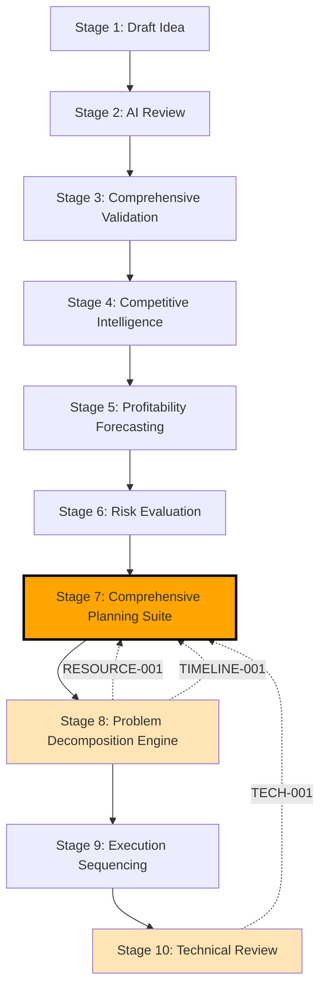

# Stage 7: Stage Map & Dependencies

## Metadata
- **Category**: Guide
- **Status**: Draft
- **Version**: 1.0.0
- **Author**: DOCMON
- **Last Updated**: 2026-01-21
- **Tags**: validation, architecture, workflow, ci

**Position**: Stage 7 of 40 (18% through venture creation workflow)
**Phase**: Ideation (Stages 1-10)

**Evidence**: EHG_Engineer@6ef8cf4:docs/workflow/stages.yaml:274-319 "id: 7"

---

## Dependency Graph

**Evidence**: EHG_Engineer@6ef8cf4:docs/workflow/stages.yaml:277-278 "depends_on: [6]"
**Evidence**: EHG_Engineer@6ef8cf4:docs/workflow/critique/stage-08.md:62-63 "Stage 7 | RESOURCE-001, TIMELINE-001"
**Evidence**: EHG_Engineer@6ef8cf4:docs/workflow/critique/stage-10.md:39 "Stage 7 | TECH-001"

---

## Direct Dependencies

**Upstream (Depends On)**:
- **Stage 6 (Risk Evaluation)**: Provides risk assessment, mitigation strategies, compliance requirements

**Downstream (Blocks)**:
- **Stage 8 (Problem Decomposition Engine)**: Requires technical roadmap and timeline constraints for task breakdown
- **Stage 9 (Execution Sequencing)**: Uses resource plan for milestone scheduling
- **Stage 10 (Technical Review)**: Reviews technical roadmap for feasibility

**Evidence**: EHG_Engineer@6ef8cf4:docs/workflow/stages.yaml:277-278 "depends_on: [6]"
**Evidence**: EHG_Engineer@6ef8cf4:docs/workflow/critique/stage-07.md:57-59 "Upstream: 6, Downstream: Stages 8"

---

## Recursion Relationships (Inbound)

**Receives Recursion From**:

| From Stage | Trigger Type | Condition | Reason |
|------------|--------------|-----------|--------|
| **Stage 8** | **RESOURCE-001** | Decomposition reveals resource shortage | Planning assumptions about team size/skills incorrect |
| **Stage 8** | **TIMELINE-001** | Task breakdown exceeds timeline constraints | Planning needs timeline adjustment |
| **Stage 10** | **TECH-001** | Timeline infeasible due to technical complexity | Planning needs timeline adjustment based on technical reality |

**Evidence**: EHG_Engineer@6ef8cf4:docs/workflow/critique/stage-08.md:62-63 "Stage 7 | RESOURCE-001, TIMELINE-001"
**Evidence**: EHG_Engineer@6ef8cf4:docs/workflow/critique/stage-10.md:39 "Stage 7 | TECH-001"

---

## Input/Output Flow

**Inputs from Stage 6**:
1. **Risk assessment**: Identified risks with severity levels
2. **Resource requirements**: Initial resource estimates based on risk mitigation needs
3. **Timeline constraints**: Risk-adjusted timeline (e.g., compliance milestones)

**Outputs to Stage 8**:
1. **Business plan**: Business model, go-to-market strategy, operations design
2. **Technical roadmap**: Architecture, tech stack, development milestones
3. **Resource plan**: Team requirements, budget allocation, timeline

**Evidence**: EHG_Engineer@6ef8cf4:docs/workflow/stages.yaml:279-286 "inputs: Risk assessment, outputs: Business plan"

---

## Critical Path Position

**Critical Path**: YES

**Reasoning**:
- Stage 7 is on the critical path because ALL downstream stages (8-40) depend on planning outputs
- Delays in planning directly delay entire venture execution
- Resource allocation decisions here impact all EXEC phase work

**Risk Impact**:
- Blocking Stage 7 prevents Problem Decomposition (Stage 8), which blocks Development (Stages 14-22)
- Incorrect planning triggers costly recursion from Stages 8 or 10 (timeline/resource re-planning)

**Evidence**: EHG_Engineer@6ef8cf4:docs/workflow/critique/stage-07.md:59 "Critical Path: Yes"

---

## Workflow Position Context

**What Came Before** (Stages 1-6):
- Idea validated (Stage 3)
- Market position confirmed (Stage 4)
- Financial viability verified (Stage 5)
- Risks identified and mitigated (Stage 6)

**What Comes After** (Stages 8-10):
- Problems decomposed into tasks (Stage 8)
- Execution sequence planned (Stage 9)
- Technical feasibility confirmed (Stage 10)

**Stage 7's Role**: **Bridge between validation and execution** - transforms high-level strategy into actionable plans

**Evidence**: EHG_Engineer@6ef8cf4:docs/workflow/stages.yaml:274-276 "Develop comprehensive business and technical plans"

---

## Sources Table

| Source | Repo | Commit | Path | Lines |
|--------|------|--------|------|-------|
| Stage definition | EHG_Engineer | 6ef8cf4 | docs/workflow/stages.yaml | 274-319 |
| Dependencies analysis | EHG_Engineer | 6ef8cf4 | docs/workflow/critique/stage-07.md | 56-60 |
| Stage 8 recursion | EHG_Engineer | 6ef8cf4 | docs/workflow/critique/stage-08.md | 62-63, 150 |
| Stage 10 recursion | EHG_Engineer | 6ef8cf4 | docs/workflow/critique/stage-10.md | 39, 87, 121, 187 |

---

<!-- Generated by Claude Code Phase 3 | EHG_Engineer@6ef8cf4 | 2025-11-05 -->
