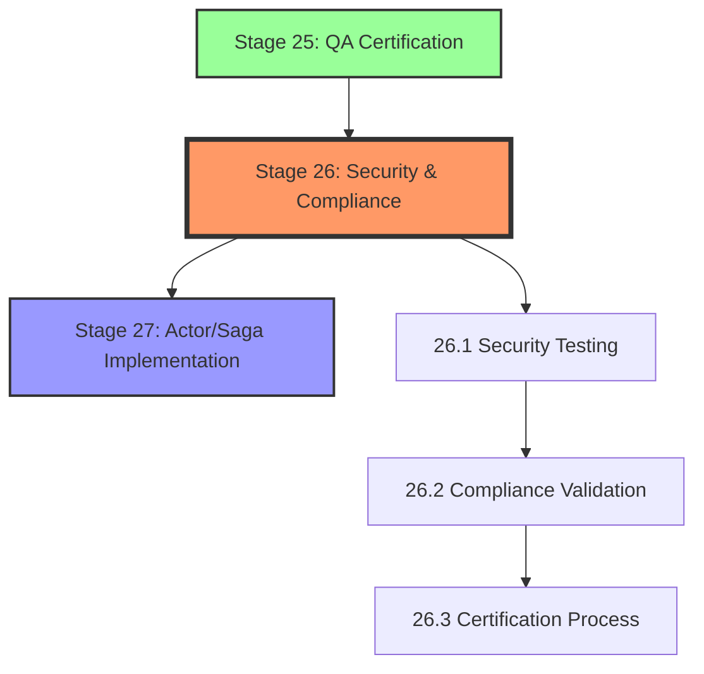

# Stage 26: Dependency Graph & Position

## Workflow Position

**Stage 26** sits in the **EXEC phase** (Stages 11-40) as the security certification gate before production implementation.

**Position**: 26 of 40 (65% through workflow)

---

## Dependency Chain

---

## Upstream Dependencies

### Direct Dependency: Stage 25 (QA Certification)

**Blocks Stage 26 if**:
- QA certification incomplete
- Testing not passed
- Quality standards not met

**Provides to Stage 26**:
- Validated codebase
- Test results
- Quality metrics
- QA certificates

**Evidence**: EHG_Engineer@6ef8cf4:docs/workflow/stages.yaml:1152-1153 "depends_on: - 25"

---

## Downstream Impact

### Direct Impact: Stage 27 (Actor/Saga Implementation)

**Stage 26 blocks Stage 27 if**:
- Security vulnerabilities detected
- Compliance requirements not met
- Certificates not obtained

**Provides to Stage 27**:
- Security report
- Compliance certificates
- Audit trail
- Security clearance for production

**Evidence**: EHG_Engineer@6ef8cf4:docs/workflow/stages.yaml:1194 (Stage 27 implicitly depends on security validation)

---

## Substage Flow

### 26.1 Security Testing
**Done When**:
- Penetration testing complete
- Vulnerabilities patched
- OWASP compliance verified

**Evidence**: EHG_Engineer@6ef8cf4:docs/workflow/stages.yaml:1175-1180

### 26.2 Compliance Validation
**Done When**:
- Standards reviewed
- Evidence collected
- Audits passed

**Evidence**: EHG_Engineer@6ef8cf4:docs/workflow/stages.yaml:1181-1186

### 26.3 Certification Process
**Done When**:
- Documentation prepared
- Certificates obtained
- Records archived

**Evidence**: EHG_Engineer@6ef8cf4:docs/workflow/stages.yaml:1187-1192

---

## Critical Path Analysis

**Is Stage 26 on Critical Path?**: ✅ Yes

**Reasoning**:
- Security certification required before production deployment
- Blocks Stage 27+ (all production implementation stages)
- No parallel alternatives available

**Impact of Delay**: Blocks all downstream production stages (27-40)

---

## Parallel Opportunities

**None identified** - Security certification is sequential and must complete before production work.

**Evidence**: EHG_Engineer@6ef8cf4:docs/workflow/stages.yaml:1149-1194 (single dependency chain)

---

## Sources Table

| Source | Repo | Commit | Path | Lines | Excerpt |
|--------|------|--------|------|-------|---------|
| Stage 26 definition | EHG_Engineer | 6ef8cf4 | docs/workflow/stages.yaml | 1149-1194 | "Security & Compliance Certification" |
| Stage 26 dependencies | EHG_Engineer | 6ef8cf4 | docs/workflow/stages.yaml | 1152-1153 | "depends_on: - 25" |
| Substage 26.1 | EHG_Engineer | 6ef8cf4 | docs/workflow/stages.yaml | 1175-1180 | "Security Testing" |
| Substage 26.2 | EHG_Engineer | 6ef8cf4 | docs/workflow/stages.yaml | 1181-1186 | "Compliance Validation" |
| Substage 26.3 | EHG_Engineer | 6ef8cf4 | docs/workflow/stages.yaml | 1187-1192 | "Certification Process" |

<!-- Generated by Claude Code Phase 10 | EHG_Engineer@6ef8cf4 | 2025-11-06 -->
