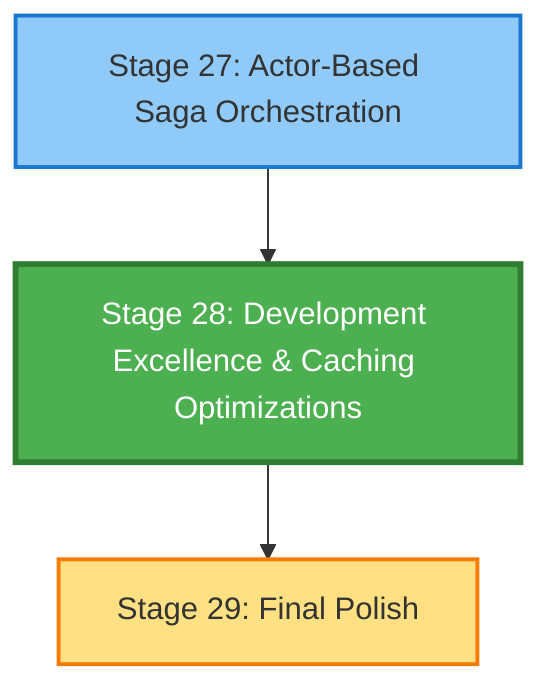

# Stage 28: Stage Map & Dependencies

## Dependency Graph

## Upstream Dependencies

| Stage | Title | Why Required |
|-------|-------|--------------|
| 27 | Actor-Based Saga Orchestration | Performance characteristics of actor/saga architecture must be established before optimization can target bottlenecks |

**Evidence**: EHG_Engineer@6ef8cf4:docs/workflow/stages.yaml:1244-1245 "depends_on: - 27"

## Downstream Impact

| Stage | Title | Impact If Stage 28 Fails |
|-------|-------|---------------------------|
| 29 | Final Polish | Final polish phase cannot proceed without optimized performance baseline; UI/UX refinements depend on stable response times |

**Evidence**: EHG_Engineer@6ef8cf4:docs/workflow/stages.yaml:1287-1289 "id: 29, title: Final Polish, description: Final UI/UX refinements"

## Workflow Position

**Phase**: EXEC (Execution)
**Position**: 28 of 40 stages (70% through workflow)
**Parallel Capability**: None (sequential dependency on Stage 27)

## Critical Path Analysis

**On Critical Path?**: No
**Blocking Stages**: 29 only
**Slack Time**: Medium (optimization can be iterative)

**Evidence**:
- EHG_Engineer@6ef8cf4:docs/workflow/critique/stage-28.md:60 "Critical Path: No"
- EHG_Engineer@6ef8cf4:docs/workflow/stages.yaml:1286 "progression_mode: Manual → Assisted → Auto"

## Sources Table

| Source | Repo | Commit | Path | Lines |
|--------|------|--------|------|-------|
| Stage 28 definition | EHG_Engineer | 6ef8cf4 | docs/workflow/stages.yaml | 1241-1286 |
| Stage 27 definition | EHG_Engineer | 6ef8cf4 | docs/workflow/stages.yaml | 1197-1240 |
| Stage 29 definition | EHG_Engineer | 6ef8cf4 | docs/workflow/stages.yaml | 1287-1331 |
| Critique dependency analysis | EHG_Engineer | 6ef8cf4 | docs/workflow/critique/stage-28.md | 57-60 |

<!-- Generated by Claude Code Phase 10 | EHG_Engineer@6ef8cf4 | 2025-11-06 -->
