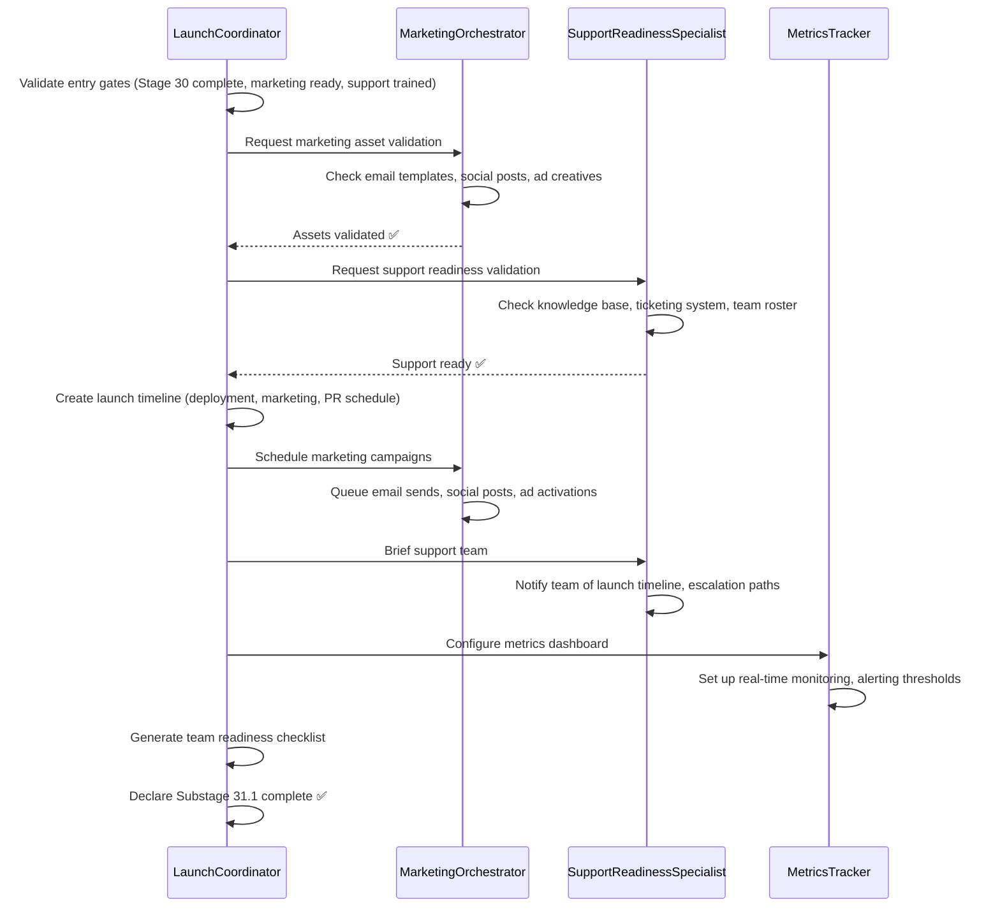
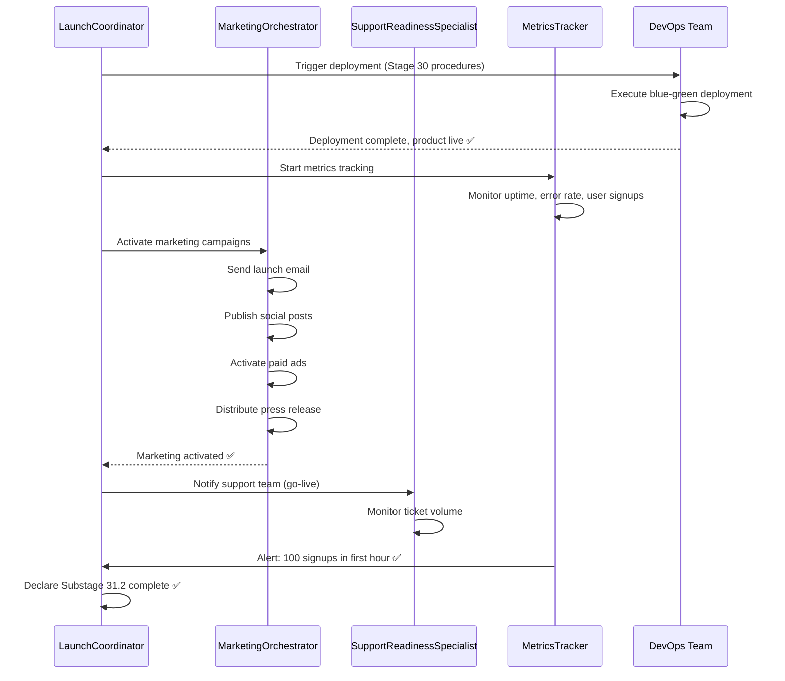
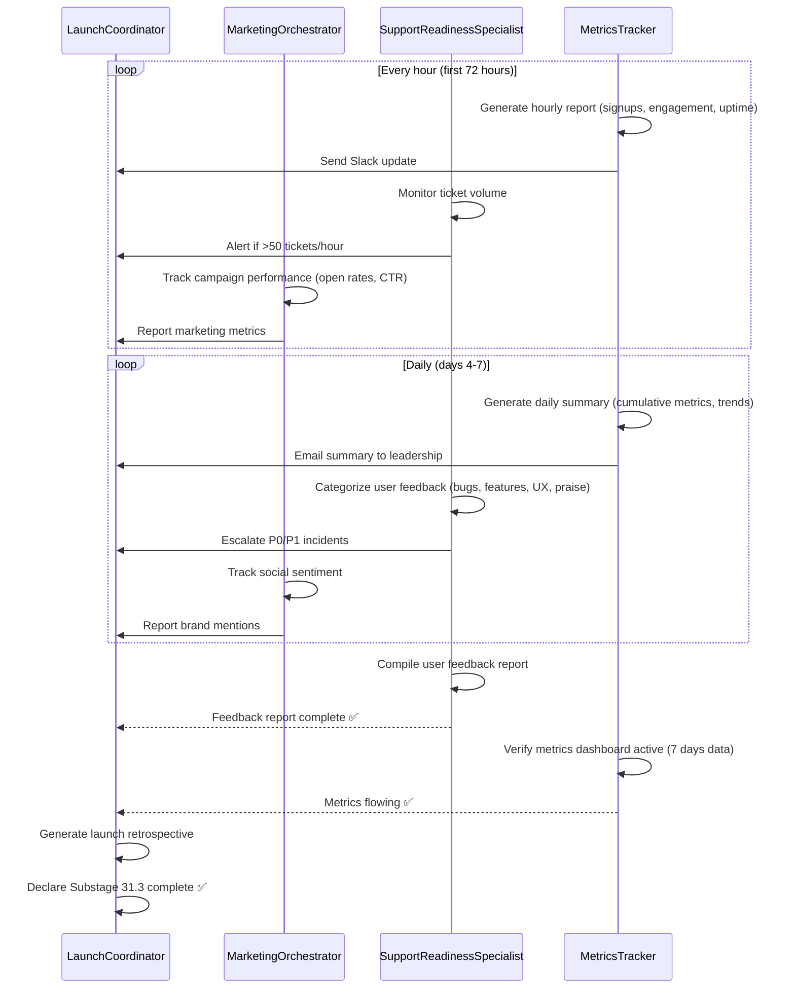

# Stage 31: MVP Launch — Agent Orchestration

**Purpose**: Propose AI agent crew architecture to automate Stage 31 launch coordination, marketing activation, support readiness, and metrics tracking.

**Target Automation**: 80% (per critique recommendation line 33)
**Current Automation**: <20% (manual orchestration)
**Gap**: 60%+ automation opportunity

---

## Proposed Crew: LaunchCrew

**Crew ID**: `launch-crew-001`
**Crew Purpose**: Orchestrate end-to-end MVP launch with coordinated deployment, marketing, PR, and support activation
**Substages Covered**: 31.1 (Preparation), 31.2 (Execution), 31.3 (Initial Monitoring)
**Status**: Proposed (not implemented)

**Invocation Trigger**: Manual (LEAD approval to proceed with launch) or scheduled (launch date/time configured)

---

## Agent Architecture (4 Agents)

### Agent 1: LaunchCoordinator
**Role**: Master orchestrator for cross-functional launch coordination
**Substages**: 31.1, 31.2, 31.3 (all)
**Primary Responsibilities**:
1. Validate entry gates (production stable, marketing ready, support trained)
2. Coordinate launch timeline (synchronize deployment, marketing, PR events)
3. Monitor launch execution (track substage progress, escalate blockers)
4. Manage incident response (invoke rollback procedures, coordinate communication)
5. Generate launch retrospective (lessons learned, recommendations)

**Inputs**:
- Stage 30 exit checklist (production deployment status)
- Stage 17 GTM plan (launch timeline, marketing assets)
- Support readiness report (knowledge base, ticketing system status)

**Outputs**:
- Launch timeline document (minute-by-minute schedule)
- Team readiness checklist (all teams signed off)
- Launch retrospective (for Stage 32 handoff)

**Automation Capabilities**:
- Automated entry gate validation (API checks for Stage 30 completion)
- Slack/email notifications (team briefings, go-live announcements)
- Real-time launch dashboard (orchestration status, team progress)
- Incident escalation (auto-detect anomalies, notify on-call)

**Proposed Tool Integrations**:
- Supabase (read Stage 30 status, write Stage 31 status)
- Slack API (send notifications, create incident channels)
- PagerDuty (incident escalation, on-call rotation)
- Calendar APIs (schedule launch events, team briefings)

---

### Agent 2: MarketingOrchestrator
**Role**: Automate marketing activation across email, social, ads, and PR channels
**Substages**: 31.1 (preparation), 31.2 (execution), 31.3 (monitoring)
**Primary Responsibilities**:
1. Validate marketing assets (email templates, social posts, ad creatives)
2. Schedule marketing campaigns (coordinated timing across channels)
3. Execute marketing activation (send emails, publish posts, activate ads)
4. Monitor campaign performance (open rates, CTR, social engagement)
5. Report marketing metrics (hourly/daily summaries)

**Inputs**:
- Stage 17 marketing materials (email copy, social posts, ad creatives)
- Launch timeline (coordinated activation time)
- UTM tracking codes (analytics attribution)

**Outputs**:
- Marketing activation report (channels activated, timestamps)
- Campaign performance dashboard (open rates, CTR, conversions)
- Social listening report (brand mentions, sentiment)

**Automation Capabilities**:
- Email campaign scheduling (ESP integration: Mailchimp, SendGrid)
- Social media posting (Twitter API, LinkedIn API, Buffer/Hootsuite)
- Paid ad activation (Google Ads API, Facebook Ads API)
- Press release distribution (PR newswire API integration)
- Real-time metrics dashboard (email, social, ads performance)

**Proposed Tool Integrations**:
- Mailchimp/SendGrid API (email campaigns)
- Twitter API, LinkedIn API, Facebook Graph API (social posts)
- Google Ads API, Facebook Ads API (paid campaigns)
- Buffer/Hootsuite API (social scheduling)
- Google Analytics API (campaign tracking)

---

### Agent 3: SupportReadinessSpecialist
**Role**: Ensure customer support infrastructure ready for launch day traffic surge
**Substages**: 31.1 (preparation), 31.3 (monitoring)
**Primary Responsibilities**:
1. Validate support resources (knowledge base populated, ticketing configured)
2. Train support team (brief on new features, escalation paths)
3. Monitor support ticket volume (detect surge patterns)
4. Categorize user feedback (bugs, feature requests, usability, praise)
5. Escalate critical issues (route P0/P1 incidents to engineering)

**Inputs**:
- Knowledge base articles (FAQs, troubleshooting guides)
- Support team roster (on-call schedule, extended coverage)
- Ticketing system configuration (Zendesk, Intercom, Freshdesk)

**Outputs**:
- Support readiness report (knowledge base complete, team trained)
- Ticket volume dashboard (hourly/daily ticket trends)
- User feedback report (categorized, prioritized for Stage 32)

**Automation Capabilities**:
- Knowledge base validation (check article completeness, test search)
- Automated ticket categorization (NLP sentiment analysis, auto-tagging)
- Support surge alerts (detect >50 tickets/hour, notify on-call support)
- Feedback aggregation (compile support tickets, in-app surveys, social mentions)
- Escalation routing (auto-assign P0/P1 tickets to engineering)

**Proposed Tool Integrations**:
- Zendesk/Intercom/Freshdesk API (ticket management)
- Slack API (support team notifications, incident channels)
- NLP service (sentiment analysis for ticket categorization)
- Survey tools (Typeform, SurveyMonkey for NPS)

---

### Agent 4: MetricsTracker
**Role**: Real-time monitoring of launch success metrics, system health, and user engagement
**Substages**: 31.2 (execution), 31.3 (monitoring)
**Primary Responsibilities**:
1. Track launch success rate (uptime, error rate, response time)
2. Monitor user acquisition (signups, activations, conversion funnel)
3. Measure engagement metrics (session duration, feature usage, return rate)
4. Detect anomalies (traffic spikes, error spikes, drop-offs)
5. Generate alerts (threshold violations, anomaly detection)

**Inputs**:
- Production monitoring (Datadog, New Relic, Prometheus)
- Analytics data (Google Analytics, Mixpanel, Amplitude)
- Marketing metrics (email, social, ads performance from Agent 2)

**Outputs**:
- Launch metrics dashboard (real-time)
- Hourly reports (first 72 hours post-launch)
- Daily summaries (days 4-7 post-launch)
- Anomaly alerts (Slack, email, PagerDuty)

**Automation Capabilities**:
- Real-time dashboard (auto-refresh every 15-60 minutes)
- Threshold alerting (email/Slack when metrics exceed thresholds)
- Anomaly detection (ML-based spike/drop detection)
- Automated reporting (hourly/daily summaries sent via email/Slack)
- Trend analysis (compare current vs. baseline, identify patterns)

**Proposed Tool Integrations**:
- Datadog/New Relic API (system health metrics)
- Google Analytics API (user behavior, conversions)
- Mixpanel/Amplitude API (event tracking, cohort analysis)
- Supabase (write metrics to database for historical analysis)
- Slack API (real-time alerts, report distribution)

---

## Crew Orchestration Flow

### Substage 31.1: Launch Preparation

---

### Substage 31.2: Launch Execution

---

### Substage 31.3: Initial Monitoring

---

## Human-in-the-Loop Decision Points

**Critical Decisions Requiring LEAD Approval**:
1. **Launch Go/No-Go** (Substage 31.1 → 31.2): LEAD reviews readiness checklist, approves proceed
2. **Rollback Decision** (Substage 31.2/31.3): If P0/P1 incident occurs, LEAD approves rollback
3. **Marketing Pause** (Substage 31.2/31.3): If product down, LEAD approves pause campaigns
4. **Launch Postponement** (Substage 31.1): If entry gates fail, LEAD decides new launch date

**Automated Decisions** (no human approval needed):
- Marketing campaign execution (pre-scheduled, auto-activated on go-live)
- Metrics reporting (hourly/daily summaries, auto-generated)
- Ticket categorization (NLP auto-tagging, human review for escalations)
- Threshold alerts (auto-sent to Slack/email when metrics exceed thresholds)

---

## Recursion Triggers (Proposed)

**Connection to 07_recursion-blueprint.md**: These triggers invoke LaunchCrew for corrective actions

| Trigger ID | Trigger Condition | Agent Invoked | Corrective Action |
|------------|-------------------|---------------|-------------------|
| LAUNCH-001 | Launch issues detected (uptime <90%, error rate >5%) | LaunchCoordinator | Escalate to DevOps, evaluate rollback |
| LAUNCH-002 | User acquisition below target (<50% of GTM goal) | MarketingOrchestrator | Analyze campaign performance, adjust messaging/channels |
| LAUNCH-003 | Support overwhelmed (>100 tickets/hour, response time >2 hours) | SupportReadinessSpecialist | Activate surge support, escalate common issues to engineering |
| LAUNCH-004 | Launch success confirmed (uptime ≥95%, users ≥target, feedback positive) | LaunchCoordinator | Generate success report, proceed to Stage 32 handoff |

**Detail**: See `07_recursion-blueprint.md` for full recursion logic

---

## Agent Crew Benefits

**Estimated Automation Gain**: 60-80% reduction in manual coordination effort

| Task | Current (Manual) | With LaunchCrew | Time Saved |
|------|------------------|-----------------|------------|
| Entry gate validation | 2 hours (manual checklist) | 5 minutes (API checks) | 1h 55m (98%) |
| Marketing activation | 3 hours (manual scheduling/posting) | 15 minutes (auto-scheduled) | 2h 45m (92%) |
| Metrics tracking | 8 hours/day (manual dashboard refresh) | Auto-refresh (no human effort) | 8h/day (100%) |
| Feedback aggregation | 4 hours (manual categorization) | 30 minutes (NLP auto-tagging) | 3h 30m (88%) |
| Incident response | 1 hour (manual escalation) | 10 minutes (auto-alerts) | 50m (83%) |
| **Total** | **40 hours** (1 week FTE) | **8 hours** | **32 hours (80%)** |

**ROI**: Reduces launch coordination from 1 FTE (full-time) to 0.2 FTE (periodic oversight)

---

## Implementation Roadmap (Proposed SD-LAUNCH-AUTOMATION-001)

**Phase 1: Core Automation (Weeks 1-4)**
- Implement LaunchCoordinator (entry gate validation, timeline management)
- Integrate with Stage 30 API (production deployment status)
- Build launch dashboard (real-time orchestration status)

**Phase 2: Marketing Automation (Weeks 5-8)**
- Implement MarketingOrchestrator (email, social, ads scheduling)
- Integrate with ESPs (Mailchiip/SendGrid), social APIs (Twitter, LinkedIn)
- Build marketing metrics dashboard

**Phase 3: Support & Metrics (Weeks 9-12)**
- Implement SupportReadinessSpecialist (ticket categorization, feedback aggregation)
- Implement MetricsTracker (real-time monitoring, anomaly detection)
- Integrate with ticketing (Zendesk), analytics (Google Analytics, Mixpanel)

**Phase 4: Recursion & Optimization (Weeks 13-16)**
- Implement LAUNCH-001 through LAUNCH-004 triggers
- Tune thresholds (based on first production launch)
- Build launch retrospective automation

**Total Effort**: 3-4 sprints (16 weeks), 1-2 engineers
**Priority**: P1 (high value, non-blocking - can launch manually while building automation)

---

## Sources Table

| Source | Repo | Commit | Path | Lines | Excerpt |
|--------|------|--------|------|-------|---------|
| Automation target | EHG_Engineer | 6ef8cf4 | docs/workflow/critique/stage-31.md | 33 | "Target State: 80% automation" |
| Manual process | EHG_Engineer | 6ef8cf4 | docs/workflow/stages.yaml | 1425 | "progression_mode: Manual → Assisted → Auto" |
| Substages | EHG_Engineer | 6ef8cf4 | docs/workflow/stages.yaml | 1405-1423 | "31.1 Preparation, 31.2 Execution, 31.3 Mo..." |
| Metrics | EHG_Engineer | 6ef8cf4 | docs/workflow/stages.yaml | 1392-1395 | "Launch success rate, User acquisition, E..." |
| Inputs | EHG_Engineer | 6ef8cf4 | docs/workflow/stages.yaml | 1384-1387 | "Launch plan, Marketing materials, Suppor..." |
| Outputs | EHG_Engineer | 6ef8cf4 | docs/workflow/stages.yaml | 1388-1391 | "Live product, Launch metrics, User feedb..." |

---

<!-- Generated by Claude Code Phase 11 | EHG_Engineer@6ef8cf4 | 2025-11-06 -->
