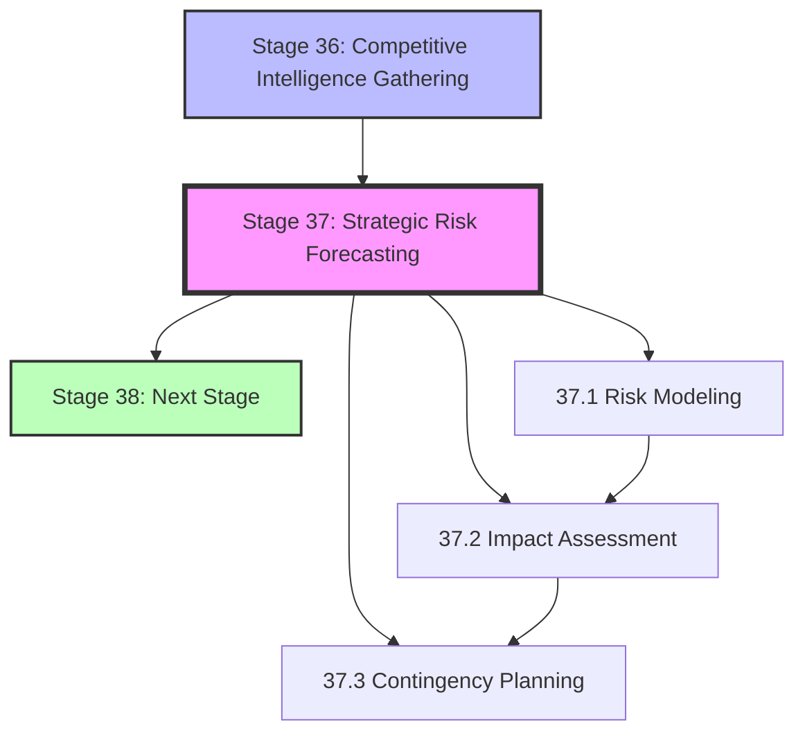

# Stage 37: Strategic Risk Forecasting - Stage Map

## Dependency Graph

## Upstream Dependencies

### Stage 36: Competitive Intelligence Gathering
**Relationship**: Direct dependency (required input)

**Data Flow**:
- **Market Intelligence**: Aggregated market trend reports
- **Risk Indicators**: Early warning signals from competitive movements
- **Scenario Models**: Preliminary scenario templates from market analysis

**Criticality**: **BLOCKING** - Stage 37 cannot proceed without Stage 36 outputs

**Evidence**: EHG_Engineer@6ef8cf4:docs/workflow/stages.yaml:1659-1660 "depends_on: - 36"

## Downstream Impacts

### Stage 38+: Subsequent Strategic Stages
**Relationship**: Blocked by Stage 37

**Data Flow**:
- **Risk Forecasts**: Predictive risk assessments with confidence intervals
- **Mitigation Strategies**: Actionable risk reduction plans
- **Contingency Plans**: Pre-approved fallback options with resource allocations

**Impact**: Stages proceeding without Stage 37 outputs lack strategic risk context

## Substage Dependencies

### 37.1 Risk Modeling → 37.2 Impact Assessment
**Sequential Relationship**: Must complete risk modeling before quantifying impacts

**Rationale**: Cannot assess impact without defined risk scenarios and probabilities

### 37.2 Impact Assessment → 37.3 Contingency Planning
**Sequential Relationship**: Must quantify impacts before planning contingencies

**Rationale**: Contingency plans require threshold-based triggers from impact analysis

## Cross-Stage Integration Points

### Stage 16: Execution
**Type**: Bidirectional reference

**Flow**:
- Stage 37 → Stage 16: Risk forecasts inform implementation approach
- Stage 16 → Stage 37: Execution outcomes validate forecast accuracy

### Stage 24: Scale Operations
**Type**: Risk context sharing

**Flow**:
- Stage 37 → Stage 24: Scalability risks identified during forecasting
- Stage 24 → Stage 37: Operational constraints feed back into risk models

### Stage 28: Strategic Pivot
**Type**: Trigger relationship

**Flow**:
- Stage 37 → Stage 28: High-probability critical risks may trigger pivot evaluation
- Stage 28 → Stage 37: Pivot scenarios become inputs to risk modeling

## Parallel Execution Opportunities

**None** - Stage 37 substages must execute sequentially due to data dependencies:
1. Risk Modeling (37.1) must complete before Impact Assessment (37.2)
2. Impact Assessment (37.2) must complete before Contingency Planning (37.3)

**Rationale**: Each substage builds upon outputs of the previous substage.

## Critical Path Analysis

**On Critical Path**: No

**Reasoning**: Strategic Risk Forecasting is a Chairman-level strategic planning activity that can proceed in parallel with execution stages (16-23) as long as Stage 36 is complete.

**Bottleneck Risk**: Low - Stage 37 does not block primary execution flow

**Optimization Opportunity**: Can be accelerated through automation (see RISK-FORECAST-001 proposal in 07_recursion-blueprint.md)

## Dependency Matrix

| Stage | Relationship | Data Flow | Criticality | Notes |
|-------|--------------|-----------|-------------|-------|
| 36 | Upstream (required) | Market intelligence → Risk indicators | BLOCKING | Cannot proceed without Stage 36 |
| 38+ | Downstream (informing) | Risk forecasts → Strategic context | INFORMING | Stages can proceed but with reduced strategic awareness |
| 16 | Cross-stage (bidirectional) | Risk forecasts ↔ Execution outcomes | VALIDATING | Feedback loop for forecast accuracy |
| 24 | Cross-stage (contextual) | Scalability risks → Operations | INFORMING | Risk context for scaling decisions |
| 28 | Cross-stage (trigger) | Critical risks → Pivot evaluation | CONDITIONAL | High-risk scenarios may trigger pivots |

## Evidence Trail

- **Upstream Dependency**: EHG_Engineer@6ef8cf4:docs/workflow/stages.yaml:1659-1660 "depends_on: - 36"
- **Input Definition**: EHG_Engineer@6ef8cf4:docs/workflow/stages.yaml:1661-1664 "Market intelligence, Risk indicators"
- **Output Definition**: EHG_Engineer@6ef8cf4:docs/workflow/stages.yaml:1665-1668 "Risk forecasts, Mitigation strategies"
- **Substage Sequence**: EHG_Engineer@6ef8cf4:docs/workflow/stages.yaml:1681-1699 "37.1 → 37.2 → 37.3"

---

<!-- Generated by Claude Code Phase 13 | EHG_Engineer@6ef8cf4 | 2025-11-06 -->
