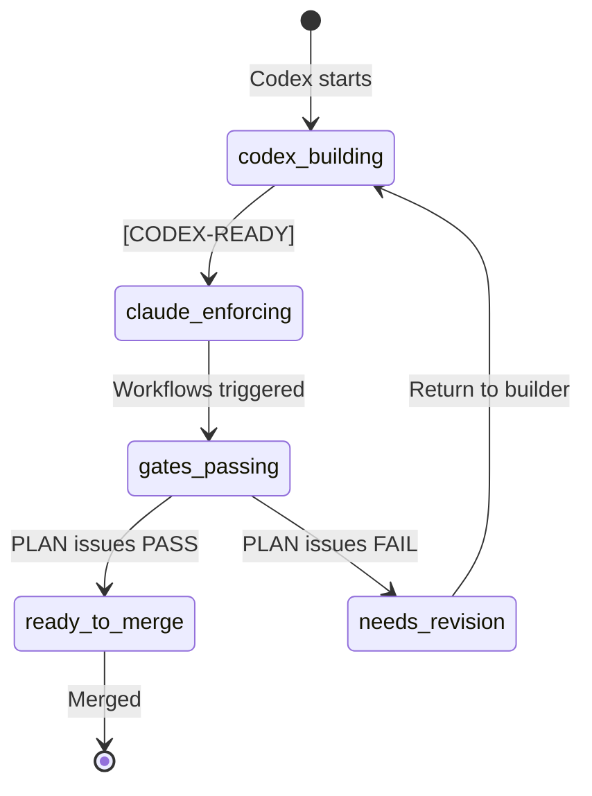

# Dual-Lane SOP — Roles & Responsibilities

## Overview
This Standard Operating Procedure defines the chain of responsibility for PR monitoring and gate enforcement under the dual-lane workflow, consistent with CLAUDE.md (LEO Protocol v4.2.0).

**Effective Date**: 2025-01-19
**Protocol Version**: LEO v4.2.0_story_gates
**Classification**: Operational Governance

---

## 1. Lane Definitions & Boundaries

### 1.1 Codex (Builder Lane)
**Role**: Read-only builder generating implementation artifacts

**Responsibilities**:
- Generates patch bundles (`artifact.tar.gz`) containing:
  - Unified diffs (`changes.patch`)
  - SBOM (CycloneDX 1.5 JSON format)
  - Attestation (in-toto v1.0, SLSA Provenance v0.2)
  - Rollback notes and merge-base SHA
- Commits to `staging/codex-*` branches only
- Outputs handoff marker: `[CODEX-READY:<hash>]`

**Restrictions**:
- ❌ No database writes (read-only via `SUPABASE_ANON_KEY`)
- ❌ No PR creation authority
- ❌ No gate monitoring responsibilities
- ❌ No deployment permissions
- ❌ No network access for signing (Sigstore blocked in sandbox)

---

### 1.2 Claude/EXEC (Enforcer Lane)
**Role**: Write-enabled enforcer applying patches and triggering gates

**Responsibilities**:
- Verifies builder artifacts (SHA256, attestation validity, SBOM compliance)
- Re-signs artifacts with Sigstore keyless signing if needed
- Applies patches to `feature/*` branch via cherry-pick or apply
- Opens PR with commit marker: `[CLAUDE-APPLIED:<hash>]`
- Triggers required workflows:
  - SLSA verification workflow
  - Policy verification workflow
  - LEO Gate Validation (Gate 3)
  - Story Release Gate Check

**Authority**:
- ✅ Database writes via `SUPABASE_SERVICE_ROLE_KEY`
- ✅ PR creation and label management
- ✅ Workflow triggering

**Responsibility Boundary**:
- **Ends**: Once PR is created and workflows are triggered
- **Does NOT**: Monitor gate results or issue verdicts

---

## 2. Verification & Approval Roles

### 2.1 PLAN (Supervisor)
**Role**: Technical verification and "done done" confirmation

**Active Monitoring Responsibilities**:
- Monitors PR workflows after EXEC creates PR
- Runs supervisor verification:
  - Command: `/leo-verify [PR-number]`
  - Script: `node scripts/plan-supervisor-verification.js --pr [PR-number]`
- Aggregates sub-agent results (Security, Database, Testing, Performance, Design)
- Issues definitive verdict:
  - **PASS**: ≥85% confidence, all requirements met
  - **FAIL**: Critical issues or <85% confidence
  - **CONDITIONAL_PASS**: Minor issues, escalate to LEAD
  - **ESCALATE**: Cannot reach consensus, needs LEAD intervention

**Verification Percentage**: 15% of total work (per LEO Protocol)

**Branch Protection Enforcement**:
- Gate name: `LEO Gate Validation / Run Gate 3 for PRD-*`
- Blocks merge until PASS verdict is recorded
- Must be marked as "Required" in GitHub branch protection

---

### 2.2 LEAD (Strategic Authority)
**Role**: Strategic escalation and final approval

**Responsibilities**:
- Reviews PRs only when PLAN issues:
  - `CONDITIONAL_PASS` verdict
  - `ESCALATE` verdict
- Provides final strategic approval after PLAN's PASS
- Authority to override with documented justification
- Sets priority levels for competing PRs

**Approval Percentage**: 15% of total work (per LEO Protocol)

---

## 3. Branch Protection Configuration

### Required Checks (Must ALL Pass)
```yaml
required_status_checks:
  contexts:
    - "LEO Gate Validation / Run Gate 3 for PRD-*"  # PLAN Supervisor ≥85%
    - "Story Release Gate Check / Check Story Release Gate"
    - "SLSA Verification / Verify SLSA Provenance"
    - "Policy Verification / Validate Policy Bundle"
```

### Label State Machine


---

## 4. Handoff Workflow

### 4.1 Complete Flow
```
1. Codex → Creates patch on staging/codex-* branch
2. Codex → Commits with [CODEX-READY:<hash>]
3. Claude → Verifies artifacts and signatures
4. Claude → Applies to feature/* branch
5. Claude → Opens PR with [CLAUDE-APPLIED:<hash>]
6. Claude → Triggers all required workflows
7. PLAN → Monitors PR and workflows
8. PLAN → Runs supervisor verification
9. PLAN → Issues PASS/FAIL verdict
10. LEAD → Reviews if escalation needed
11. System → Allows merge only after PASS recorded
```

### 4.2 Handoff Markers
| Stage | Marker | Responsible Role |
|-------|--------|-----------------|
| Builder complete | `[CODEX-READY:<hash>]` | Codex |
| Enforcer applied | `[CLAUDE-APPLIED:<hash>]` | Claude/EXEC |
| Verification pass | `PLAN-SUPERVISOR: PASS` | PLAN |
| Strategic approval | `LEAD-APPROVED: <reason>` | LEAD |

---

## 5. Accountability Matrix

| Action | Codex | Claude/EXEC | PLAN | LEAD |
|--------|-------|-------------|------|------|
| Generate patches | ✅ | ❌ | ❌ | ❌ |
| Sign artifacts | ❌ | ✅ | ❌ | ❌ |
| Create PR | ❌ | ✅ | ❌ | ❌ |
| Trigger workflows | ❌ | ✅ | ❌ | ❌ |
| Monitor gates | ❌ | ❌ | ✅ | ❌ |
| Issue PASS verdict | ❌ | ❌ | ✅ | ❌ |
| Escalation review | ❌ | ❌ | ❌ | ✅ |
| Database writes | ❌ | ✅ | ✅ | ✅ |

---

## 6. Failure Modes & Recovery

### 6.1 Gate Failure
- **PLAN issues FAIL**: PR blocked, return to Codex for fixes
- **Recovery**: Codex generates new patch, process restarts

### 6.2 Timeout
- **Gates don't complete in 4 hours**: PLAN escalates to LEAD
- **Recovery**: LEAD can force re-run or approve with override

### 6.3 Conflict
- **Sub-agents disagree**: PLAN attempts resolution (max 3 iterations)
- **Recovery**: ESCALATE to LEAD for decision

---

## 7. Compliance & Audit

### 7.1 Required Evidence
- All handoff markers must be in git history
- PASS verdicts must be recorded in database
- PR must link to source handoff bundle
- Audit trail must show role separation

### 7.2 Database Records
```sql
-- Required tables for audit trail
leo_handoff_tracking     -- Handoff events
leo_verification_results -- PLAN verdicts
leo_gate_executions      -- Workflow results
pr_approval_audit        -- LEAD decisions
```

---

## 8. Quick Reference

### Commands
```bash
# Codex (Builder)
git checkout -b staging/codex-<feature>
git commit -m "[CODEX-READY:<hash>] <message>"

# Claude (Enforcer)
git checkout -b feature/<name>
git cherry-pick <codex-commit>
git commit -m "[CLAUDE-APPLIED:<hash>] <message>"
gh pr create --label claude-enforcing

# PLAN (Supervisor)
node scripts/plan-supervisor-verification.js --pr <number>
/leo-verify PR-<number>

# LEAD (if needed)
node scripts/lead-approval-assessment.js --pr <number>
```

### Environment Variables
```bash
# Codex
source .env.codex  # Read-only

# Claude
source .env.claude  # Write-enabled
```

---

## 9. References
- CLAUDE.md (LEO Protocol v4.2.0)
- docs/dual-lane-branch-protection.md
- .github/workflows/slsa-verification.yml
- .github/workflows/policy-verification.yml
- .github/workflows/leo-gates.yml

---

## 10. Sigstore Signing Requirements

### 10.1 Network Requirements
**CRITICAL**: Sigstore keyless signing requires network access to:
- Fulcio CA: https://fulcio.sigstore.dev
- Rekor: https://rekor.sigstore.dev
- OIDC Provider: GitHub Actions or configured identity provider

**Sandbox Limitations**:
- Codex lane (sandboxed) CANNOT perform Sigstore signing
- Only Claude/EXEC lane has required network egress
- GPG fallback available for air-gapped environments

### 10.2 Signing Workflow
```bash
# Claude/EXEC lane only
COSIGN_EXPERIMENTAL=1 cosign sign-blob \
  --yes \
  --bundle artifact.bundle \
  --output-signature artifact.sig \
  --output-certificate artifact.crt \
  artifact.tar.gz
```

### 10.3 GPG Fallback (Sandbox/Air-gapped)
When Sigstore is unavailable:
1. Use GPG with dedicated signing key
2. Rotate keys every 30 days
3. Store public keys in database
4. Include key fingerprint in attestation

```bash
# Generate signing key
gpg --gen-key --batch <<EOF
Key-Type: RSA
Key-Length: 4096
Name-Real: EHG Artifact Signer
Name-Email: artifacts@ehg.example
Expire-Date: 30d
EOF

# Sign artifact
gpg --detach-sign --armor artifact.tar.gz
```

### 10.4 Verification Requirements
All artifacts MUST be verified before use:
- **Container Images**: cosign verify with digest
- **Policy Bundles**: Signed and attested
- **Artifact Bundles**: SLSA L3 provenance
- **Attestations**: in-toto v1.0 format

### 10.5 SLSA Level 3 Compliance
To achieve SLSA L3:
- ✅ Non-falsifiable provenance (signed attestations)
- ✅ Isolated builds (GitHub Actions runners)
- ✅ Parameterless builds (all inputs in provenance)
- ✅ Hermetic builds (reproducible with same inputs)

---

*This SOP is maintained under database-first architecture. Do not create file-based PRDs or handoff documents. All state must be tracked in the database.*

## 11. Policy Supply Chain (WS2)

### 11.1 Overview
The Policy Supply Chain ensures all Kyverno admission control policies are signed, versioned, and verifiable before deployment to clusters.

### 11.2 Policy Files
Located in `policies/kyverno/`:
- `require-signed-images.yaml` - Enforces container image signatures
- `require-slsa-provenance.yaml` - Requires SLSA L3 attestations
- `require-image-digests.yaml` - Enforces SHA256 digest references

### 11.3 Policy Signing Workflow

#### Automatic Signing (CI/CD)
Triggered on push to main or PR with policy changes:
```yaml
# .github/workflows/sign-policies.yml
on:
  push:
    paths: ['policies/**']
    branches: [main, 'feature/**']
```

**Process**:
1. Validates all Kyverno policies with `kyverno validate`
2. Creates timestamped bundle: `policies-YYYYMMDD-HHMMSS.tar.gz`
3. Generates SLSA attestation with policy metadata
4. Signs bundle with Sigstore keyless (OIDC)
5. Self-verifies signature before upload

#### Manual Signing (Local)
```bash
# Bundle policies
tar czf policies.tar.gz policies/

# Sign with Sigstore
COSIGN_EXPERIMENTAL=1 cosign sign-blob \
  --yes \
  --bundle policies.bundle \
  --output-signature policies.sig \
  policies.tar.gz

# Verify signature
cosign verify-blob \
  --bundle policies.bundle \
  --certificate-identity-regexp ".*" \
  --certificate-oidc-issuer-regexp ".*" \
  policies.tar.gz
```

### 11.4 Policy Verification

#### Pre-deployment Verification
The `policy-verification.yml` workflow enforces:
1. All policies pass `kyverno validate`
2. OPA policies pass `opa fmt` and `opa test`
3. Bundle signature is valid
4. SLSA attestation matches bundle digest
5. Policy tests pass (unsigned images blocked, etc.)

#### Runtime Verification
```bash
# Test policy enforcement
kyverno apply policies/kyverno/require-signed-images.yaml \
  --resource test-pod.yaml

# Expected: "fail" or "block" for unsigned images
```

### 11.5 Policy Bundle Attestation

Each policy bundle includes in-toto v1.0 attestation:
```json
{
  "_type": "https://in-toto.io/Statement/v1",
  "subject": [{
    "name": "policies-20250119-143000.tar.gz",
    "digest": {"sha256": "..."}
  }],
  "predicateType": "https://slsa.dev/provenance/v0.2",
  "predicate": {
    "builder": {"id": "https://github.com/org/repo/actions/runs/..."},
    "materials": [
      {"uri": "policies/kyverno/require-signed-images.yaml"},
      {"uri": "policies/kyverno/require-slsa-provenance.yaml"},
      {"uri": "policies/kyverno/require-image-digests.yaml"}
    ]
  }
}
```

### 11.6 Policy Distribution

Signed bundles are:
1. Uploaded as GitHub Actions artifacts
2. Attached to releases (if tagged)
3. Stored with verification instructions in `VERIFY_POLICIES.md`

### 11.7 Policy Exceptions

Development namespaces exempt from enforcement:
- `development`
- `dev`
- `sandbox`

System namespaces always exempt:
- `kube-system`
- `kube-public`
- `kube-node-lease`

### 11.8 Policy Compliance Matrix

| Policy | SLSA Requirement | Enforcement Level | Exceptions |
|--------|------------------|-------------------|------------|
| require-signed-images | L3: Provenance | enforce | System namespaces |
| require-slsa-provenance | L3: Non-falsifiable | enforce | Dev namespaces |
| require-image-digests | L2: Immutable ref | enforce | Dev namespaces |

### 11.9 Troubleshooting

**Policy validation fails**:
```bash
# Check policy syntax
kyverno validate policies/kyverno/*.yaml

# Test against sample resource
kyverno apply <policy> --resource <test.yaml>
```

**Signature verification fails**:
```bash
# Check certificate details
cosign verify-blob --certificate policies.crt \
  --certificate-identity-regexp ".*" \
  --output text policies.tar.gz
```

**Attestation mismatch**:
```bash
# Verify digest in attestation
jq '.subject[0].digest.sha256' policy-attestation.json
sha256sum policies.tar.gz
```

---

## 12. Observability & Monitoring (WS6)

### 12.1 Label Taxonomy
All resources MUST be labeled according to `.github/labels.yml`:

**Primary Categories**:
- **Lanes**: `lane:codex`, `lane:claude`
- **Security**: `security:signed`, `security:slsa-l3`, `security:unsigned`
- **Gates**: `gate:pass`, `gate:fail`, `gate:pending`
- **Workstreams**: `ws1:signing` through `ws6:observability`

**Auto-labeling**: GitHub Actions workflow `label-sync.yml` automatically applies labels based on:
- PR title markers (CODEX-READY, CLAUDE-APPLIED)
- Changed files (policies/, .github/workflows/)
- Branch names (ws1, ws2, etc.)

### 12.2 Metrics Collection

#### Key Metrics (Prometheus)
```yaml
# Policy violations
ehg_policy_violations_total{policy_type="require-signed-images"}

# SLSA coverage
ehg_slsa_coverage_ratio{slsa_level="L3", environment="production"}

# Lane handoffs
ehg_lane_handoffs_total{from_lane="codex", to_lane="claude"}

# Gate execution
ehg_gate_execution_duration_seconds{gate_name="leo_gate_3"}
```

#### Collection Points
1. **GitHub Actions**: Metrics pushed via webhook
2. **Admission Controller**: Runtime policy metrics
3. **CI/CD Pipeline**: Build and signing metrics
4. **Kubernetes**: Resource and performance metrics

### 12.3 Dashboards

#### Grafana Dashboard: Supply Chain Security
Location: `observability/grafana/dashboards/supply-chain-security.json`

**Key Panels**:
- SLSA L3 Coverage gauge (target: >90%)
- Unsigned Artifacts counter (target: 0)
- Policy Violations timeline
- Gate Pass Rate by type
- Lane Handoff Duration heatmap

**Access**: https://grafana.example.com/d/ehg-supply-chain

### 12.4 Alerting Rules

#### Critical Alerts
| Alert | Condition | Action |
|-------|-----------|---------|
| UnsignedArtifactDetected | Unsigned artifact not blocked | Page on-call |
| GateBypassAttempt | Unauthorized bypass attempt | Security review |
| LowSecurityScore | Score <70 for 10min | Investigate |

#### Warning Alerts
| Alert | Condition | Action |
|-------|-----------|---------|
| SLSAVerificationFailureRate | >10% failures | Check certificates |
| PolicyViolationSpike | >10/min violations | Review policy |
| LaneHandoffTimeout | P95 >10min | Performance review |

### 12.5 Tracing with OpenTelemetry

#### Trace Context Propagation
```javascript
// Example: Lane handoff tracing
const span = tracer.startSpan('handoff', {
  attributes: {
    'lane.from': 'codex',
    'lane.to': 'claude',
    'artifact.signed': true,
    'artifact.slsa_level': 3
  }
});
```

#### Key Trace Points
1. **Workflow Start**: GitHub Action triggered
2. **Artifact Build**: Codex creates bundle
3. **Signing**: Sigstore signature applied
4. **Handoff**: Codex→Claude transition
5. **PR Creation**: Claude opens PR
6. **Gate Execution**: Each gate validation
7. **Verification**: PLAN supervisor check
8. **Merge**: Final approval and merge

### 12.6 Security Posture Scoring

**Formula**:
```
Security Score = (
  (SLSA_Coverage * 0.3) +
  (Signed_Ratio * 0.3) +
  (Policy_Compliance * 0.2) +
  (Gate_Pass_Rate * 0.2)
) * 100
```

**Thresholds**:
- **Green**: ≥85 (Secure)
- **Yellow**: 70-84 (Attention needed)
- **Red**: <70 (Critical issues)

### 12.7 Monitoring Commands

```bash
# Check current metrics
curl http://prometheus:9090/api/v1/query?query=ehg_security_score

# View recent gate failures
kubectl logs -n monitoring -l app=otel-collector --tail=100 | grep "gate:fail"

# Export dashboard
curl http://grafana:3000/api/dashboards/uid/ehg-supply-chain > dashboard-backup.json

# Test alert
amtool alert add UnsignedArtifactDetected --annotation="test=true"
```

### 12.8 Compliance Reporting

**Monthly Report Includes**:
- SLSA L3 coverage percentage
- Unsigned artifact count and remediation
- Policy violation trends
- Gate bypass attempts (should be 0)
- Mean time to handoff (MTTH)
- Security score history

**Export**: `grafana-reporter --dashboard ehg-supply-chain --month $(date +%Y-%m)`

---

## 13. GitOps Enforcement (WS3)

### 13.1 ArgoCD Architecture

**Application Structure**:
- `policy-sync`: Manages Kyverno policies
- `observability-stack`: Manages monitoring stack
- `drift-remediation`: Handles drift detection

**Sync Strategy**:
```yaml
syncPolicy:
  automated:
    prune: false      # Don't auto-delete in production
    selfHeal: true    # Auto-correct drift
    allowEmpty: false # Prevent empty manifests
```

### 13.2 Kustomization Hierarchy

```
gitops/kustomize/
├── base/                    # Common configurations
│   ├── kustomization.yaml
│   ├── namespaces.yaml
│   ├── rbac.yaml
│   └── network-policies.yaml
└── overlays/
    ├── development/         # Dev environment (audit mode)
    └── production/          # Prod environment (enforce mode)
```

**Environment Differences**:
| Setting | Development | Production |
|---------|-------------|------------|
| Policy Mode | audit | enforce |
| Replicas | 1 | 3 |
| Resources | 256Mi/250m | 2Gi/2CPU |
| Auto-Sync | Yes | Yes (no prune) |

### 13.3 Drift Detection & Remediation

**Detection Interval**: Every 5 minutes
**Auto-Remediation**: Enabled for policies, disabled for secrets

**Drift Alerts**:
```prometheus
# Critical: Security policy drift
argocd_app_sync_total{
  sync_status="OutOfSync",
  namespace="kyverno"
} > 0
```

**Manual Drift Check**:
```bash
argocd app get policy-sync --refresh
argocd app diff policy-sync
```

### 13.4 Rollback Procedures

#### Automatic Rollback
Triggered when:
- Health degrades within 5 minutes of sync
- Security policies missing
- Ready replicas < 50% of desired

#### Manual Rollback
```bash
# Quick rollback to previous
argocd app rollback <app-name>

# Rollback to specific revision
argocd app rollback <app-name> <revision>

# View history
argocd app history <app-name>
```

#### Emergency Override
**Required**: 2 approvers from security/platform teams
```bash
# Disable all auto-sync (emergency only)
for app in $(argocd app list -o name); do
  argocd app patch $app --type json \
    -p '[{"op": "remove", "path": "/spec/syncPolicy/automated"}]'
done
```

### 13.5 Progressive Rollout

**Deployment Sequence**:
1. **Development** (sync-wave: 1)
   - Audit mode policies
   - Immediate sync
   - Auto-prune enabled

2. **Staging** (sync-wave: 2)
   - Enforce mode
   - 5-minute canary
   - Manual promotion

3. **Production** (sync-wave: 3)
   - Full enforcement
   - No auto-prune
   - Rollback ready

### 13.6 Secret Management

**Sealed Secrets Configuration**:
```yaml
# Encrypt secret
kubeseal --cert=sealed-secrets.crt \
  --format=yaml < secret.yaml > sealed-secret.yaml

# Commit sealed secret to Git
git add sealed-secret.yaml
git commit -m "Add encrypted secret"
```

**Never commit**:
- Plain text secrets
- Service account keys
- TLS private keys

### 13.7 Compliance Reporting

**Automated Reports** (every 6 hours):
```bash
kubectl get cm -n argocd drift-report-* \
  --sort-by=.metadata.creationTimestamp \
  -o jsonpath='{.items[-1].data.report}'
```

**Metrics Available**:
- Sync compliance rate
- Drift duration
- Rollback frequency
- Policy enforcement status

### 13.8 GitOps Commands Reference

```bash
# Application Management
argocd app create <app> --repo <url> --path <path>
argocd app sync <app>
argocd app delete <app>

# Monitoring
argocd app list
argocd app get <app>
argocd app diff <app>
argocd app history <app>

# Troubleshooting
argocd app logs <app>
argocd app events <app>
argocd app manifests <app>
argocd app resources <app>

# Rollback
argocd app rollback <app> [revision]
argocd app patch <app> --patch <json>
```

### 13.9 Branch Protection for GitOps

**Required Checks**:
- Kustomize build validation
- Policy syntax validation
- YAML linting
- Security scanning

**Merge Requirements**:
- PR approved by security team (for policies)
- All CI checks passing
- No drift in production

### 13.10 Troubleshooting GitOps

**Sync Failures**:
1. Check application events: `argocd app events <app>`
2. Verify repository access: `argocd repo list`
3. Validate manifests: `kustomize build overlays/production`
4. Check RBAC permissions: `argocd account can-i sync applications`

**Drift Issues**:
1. Identify drift: `argocd app diff <app>`
2. Check ignore rules: `.argocd-ignore`
3. Force sync if needed: `argocd app sync --force`
4. Review webhook configuration

**Performance Issues**:
1. Check resource limits
2. Review sync wave configuration
3. Optimize manifest size
4. Consider sharding large applications

---

## 14. Drift Detection & Alignment (WS5)

### 14.1 Drift Detection Framework

**Components**:
- Custom Operator: `drift-detector-operator`
- CRDs: `DriftPolicy`, `DriftReport`
- Check Interval: 2 minutes (configurable per policy)

**Severity Levels**:
| Level | Response Time | Auto-Remediation | Approval |
|-------|--------------|------------------|----------|
| Critical | Immediate | Yes (with approval) | Required |
| High | 5 minutes | Yes | Optional |
| Medium | 15 minutes | Yes | No |
| Low | 1 hour | Optional | No |

### 14.2 Monitored Resources

```yaml
# Critical severity (security-impacting)
- ClusterPolicy (Kyverno)
- Secret
- NetworkPolicy

# High severity (availability-impacting)
- Deployment
- StatefulSet
- Service

# Medium severity (configuration)
- ConfigMap
- PersistentVolumeClaim

# Low severity (metadata)
- Labels
- Annotations
```

### 14.3 Alignment Verification

**Cross-Lane Consistency**:
```bash
# Check lane separation
kubectl get all -l lane=codex --all-namespaces
kubectl get all -l lane=claude --all-namespaces

# Verify no crossover
diff <(kubectl get all -l lane=codex -o name | sort) \
     <(kubectl get all -l lane=claude -o name | sort)
```

**Git-to-Runtime Validation**:
```bash
# Check ArgoCD sync status
argocd app list --output json | jq '.[] |
  select(.status.sync.status != "Synced") |
  .metadata.name'

# Force drift detection
argocd app get <app> --refresh --hard
```

### 14.4 Remediation Strategies

| Strategy | Description | Use Case |
|----------|-------------|----------|
| sync | Apply Git state to cluster | ConfigMaps, Deployments |
| rollback | Revert to previous version | Failed deployments |
| alert-only | Notify without action | Secrets, critical resources |

**Manual Remediation**:
```bash
# View drift details
kubectl get driftpolicy -A
kubectl describe driftreport <report-name>

# Trigger remediation
kubectl patch driftpolicy <policy> \
  --type merge \
  -p '{"spec":{"remediationPolicy":{"autoRemediate":true}}}'
```

### 14.5 Compliance Scoring

**Formula**:
```
Score = 100 - (
  (Critical × 10) +
  (High × 5) +
  (Medium × 2) +
  (Low × 1)
) / TotalResources
```

**Thresholds**:
- Excellent: ≥95%
- Good: 85-94%
- Acceptable: 75-84%
- Poor: 60-74%
- Critical: <60%

### 14.6 Key Metrics

| Metric | Target | Alert Threshold |
|--------|--------|-----------------|
| MTTD (Mean Time to Detect) | <2 min | >5 min |
| MTTR (Mean Time to Remediate) | <15 min | >30 min |
| Compliance Score | >90% | <85% |
| Remediation Success Rate | >95% | <90% |
| False Positive Rate | <5% | >10% |

### 14.7 Drift Analytics Queries

**Prometheus Queries**:
```promql
# Current compliance score
ehg:compliance:score

# Drift events by severity (last hour)
sum by (severity) (
  increase(drift_events_total[1h])
)

# Remediation success rate
ehg:remediation:success_rate

# Top drifting resources
topk(5, drift_resources_total)
```

### 14.8 Reporting Schedule

| Report Type | Frequency | Recipients | Format |
|-------------|-----------|------------|--------|
| Executive Summary | Daily 8 AM | Leadership | HTML |
| Technical Detail | Every 6h | Platform Team | JSON |
| Compliance Report | Weekly Monday | Security Team | PDF |
| Trend Analysis | Monthly 1st | All Teams | Dashboard |

**Access Reports**:
```bash
# Latest report from ConfigMap
kubectl get cm drift-report-latest -n drift-detection \
  -o jsonpath='{.data.drift-report*.json}' | jq

# Historical reports from S3
aws s3 ls s3://ehg-drift-reports/reports/
aws s3 cp s3://ehg-drift-reports/reports/json/latest.json -
```

### 14.9 Webhook Validations

**Active Webhooks**:
1. `prevent-lane-crossover`: Blocks Codex/Claude resource mixing
2. `enforce-gitops-source`: Requires ArgoCD management
3. `policy-compliance`: Validates policy changes
4. `slsa-verification`: Enforces signed images

**Bypass (Emergency Only)**:
```bash
# Temporarily disable webhook
kubectl patch validatingwebhookconfiguration drift-prevention-webhook \
  --type json \
  -p '[{"op": "replace", "path": "/webhooks/0/failurePolicy", "value": "Ignore"}]'
```

### 14.10 Troubleshooting Drift

**High Drift Rate**:
1. Check ArgoCD sync status
2. Verify webhook configurations
3. Review recent deployments
4. Check operator logs:
   ```bash
   kubectl logs -n drift-detection \
     -l app=drift-detector --tail=100
   ```

**Failed Remediation**:
1. Check RBAC permissions
2. Verify resource locks
3. Review remediation strategy
4. Force manual sync:
   ```bash
   kubectl apply -f <(argocd app manifests <app>)
   ```

**False Positives**:
1. Update ignore fields in policy
2. Adjust comparison algorithm
3. Increase check interval
4. Review baseline snapshot

### 14.11 Emergency Procedures

**Disable All Drift Detection**:
```bash
kubectl scale deployment drift-detector-operator \
  -n drift-detection --replicas=0
```

**Clear Drift Reports**:
```bash
kubectl delete driftreports -A --all
```

**Reset Baselines**:
```bash
kubectl delete cm -n drift-detection \
  -l component=baseline-snapshot
```

---

**Last Updated**: 2025-01-19
**Next Review**: 2025-02-19
**Owner**: Platform Engineering Team